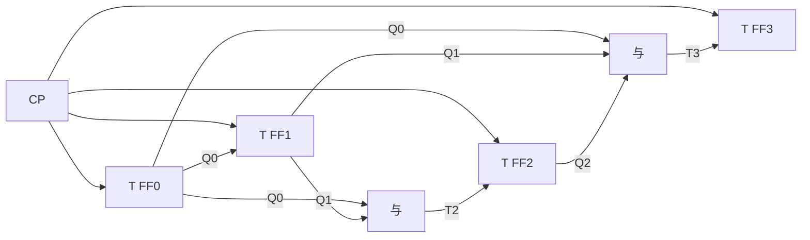
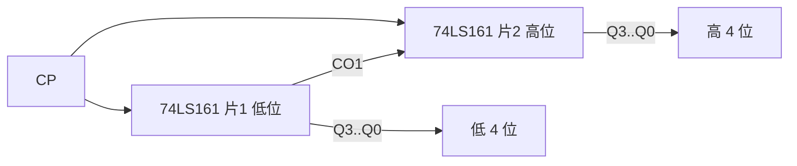

# 5.3 同步计数器、异步计数器

> [!abstract] 本节概述
> 计数器是数字系统中**应用最广泛**的时序器件，用于计数、分频、定时、产生节拍脉冲。本节解决三个问题：(1) 同步计数器如何用共用时钟驱动各级触发器并行更新；(2) 异步计数器如何用前级输出作为后级时钟实现逐级翻转；(3) 中规模芯片 **74LS161（同步十六进制）**、**74LS90（异步二-五-十进制）** 的功能表与应用。同步与异步的对比及 74LS161 的应用是 [[5.4 任意进制计数器设计|5.4]] 设计任意进制计数器的基础。

## 一、计数器的分类

> [!note] 计数器分类维度
> | 分类依据 | 类型 | 说明 |
> | -------- | ---- | ---- |
> | 按触发方式 | 同步计数器 | 所有触发器共用 CP |
> | | 异步计数器 | 各触发器时钟来源不同 |
> | 按计数容量 | 二进制计数器 | 模 $2^n$，$n$ 个触发器 |
> | | 十进制计数器 | 模 10，BCD 输出 |
> | | 任意进制（$N$ 进制） | 模 $N$，见 [[5.4 任意进制计数器设计\|5.4]] |
> | 按计数增减 | 加法计数器 | 每次状态值 $+1$ |
> | | 减法计数器 | 每次状态值 $-1$ |
> | | 可逆计数器 | 加/减控制端切换方向 |

## 二、同步二进制计数器

> [!definition] 同步二进制加法计数器
> $n$ 位同步二进制加法计数器由 $n$ 个 JK 触发器（或 T 触发器）构成，所有触发器共用 CP。计数规律：每来一个 CP，状态值加 1；计满 $2^n-1$ 后回到 0，并产生进位输出。

> [!theorem] 同步二进制加法计数器设计规律
> 观察二进制加法计数规律：最低位 $Q_0$ 每次都翻转；其余位 $Q_i$ 仅当比它低的所有位 $Q_{i-1}\cdots Q_0$ 全为 1 时才翻转。因此驱动方程为：
> $$T_0=1,\quad T_i=Q_{i-1}Q_{i-2}\cdots Q_0\ (i\ge1)$$
> 即 $T_1=Q_0$、$T_2=Q_1Q_0$、$T_3=Q_2Q_1Q_0$，依此类推。进位输出 $C=Q_{n-1}Q_{n-2}\cdots Q_0$。

> [!example] 4 位同步二进制加法计数器
> 4 个 JK 触发器接成 T 触发器（$J=K=T$），驱动方程：
> $$T_0=1,\quad T_1=Q_0,\quad T_2=Q_1Q_0,\quad T_3=Q_2Q_1Q_0$$
> 进位 $C=Q_3Q_2Q_1Q_0$。状态序列 $0000\to0001\to\cdots\to1111\to0000$，模 16。

> [!note] 同步二进制减法计数器
> 减法计数规律：最低位 $Q_0$ 每次都翻转；其余位 $Q_i$ 仅当比它低的所有位**全为 0** 时才翻转。驱动方程：
> $$T_0=1,\quad T_i=\bar Q_{i-1}\bar Q_{i-2}\cdots\bar Q_0\ (i\ge1)$$

## 三、同步十进制计数器

> [!definition] 同步十进制加法计数器
> 4 位同步十进制计数器（BCD 计数器）状态序列为 $0000\to0001\to\cdots\to1001\to0000$，模 10。4 个触发器中 $1010\sim1111$ 六个状态为无效状态，需通过反馈逻辑跳过。

> [!tip] 同步十进制计数器驱动方程推导
> 在 4 位二进制计数器基础上修改：当 $Q_3Q_0=11$（即状态 1001）时，下一个 CP 应使 $Q_3$ 翻转为 0 而 $Q_0$ 翻转为 0（不再进位到 1010）。利用卡诺图化简得：
> $$J_0=K_0=1$$
> $$J_1=\bar Q_3 Q_0,\quad K_1=Q_0$$
> $$J_2=K_2=Q_1Q_0$$
> $$J_3=Q_2Q_1Q_0,\quad K_3=Q_0$$
> 进位 $C=Q_3Q_0$。

> [!example] 74LS160 同步十进制计数器
> 74LS160 是同步十进制加法计数器，与 74LS161 引脚兼容但模为 10。状态 $0000\sim1001$ 循环，进位 $C$ 在 1001 时为 1。

## 四、异步计数器

> [!definition] 异步计数器
> 异步计数器中各触发器**不共用 CP**，通常由前级触发器的输出（$Q$ 或 $\bar Q$）作为后级触发器的时钟，状态逐级翻转，又称**行波计数器**（Ripple Counter）。

### 4.1 异步二进制计数器

> [!note] 异步二进制加法计数器构成
> 将 $n$ 个 T' 触发器（接成翻转触发器）级联：每级 CP 接前级 $Q$（下降沿触发）或 $\bar Q$（上升沿触发）。
> - **下降沿触发、CP 接前级 $Q$**：加法计数；
> - **下降沿触发、CP 接前级 $\bar Q$**：减法计数。

> [!example] 3 位异步二进制加法计数器
> 3 个下降沿 JK 触发器接成 T' 触发器（$J=K=1$），$CP_0=CP$、$CP_1=Q_0$、$CP_2=Q_1$。状态序列 $000\to001\to\cdots\to111\to000$，模 8。低位 $Q_0$ 下降沿驱动 $Q_1$ 翻转，$Q_1$ 下降沿驱动 $Q_2$ 翻转。

> [!warning] 异步计数器的延迟问题
> 由于各级触发器时钟由前级输出提供，状态更新逐级传播，最坏情况下从 CP 到达至最高位稳定需 $n$ 个触发器延迟时间之和。这限制了异步计数器的工作频率，且在过渡期间会出现短暂的"毛刺状态"（如 011→100 时瞬间经过 010、000）。**不能直接对异步计数器输出进行译码**，否则会译出错误脉冲。

### 4.2 74LS90 异步二-五-十进制计数器

> [!info] 74LS90 概述
> 74LS90 是经典的异步计数器芯片，内部包含两个独立计数单元：
> - **二进制计数器**：由 1 个触发器 $\text{FF}_A$ 构成，CP 由 $CP_A$ 输入，输出 $Q_A$，模 2；
> - **五进制计数器**：由 3 个触发器 $\text{FF}_B\text{FF}_C\text{FF}_D$ 构成，CP 由 $CP_B$ 输入，输出 $Q_BQ_CQ_D$，模 5（状态 $000\to100\to010\to110\to001\to000$）。

> [!note] 74LS90 两种工作模式
> | 连接方式 | 时钟接法 | 输出 | 模值 |
> | -------- | -------- | ---- | ---- |
> | **8421 BCD 码十进制** | $CP_A$ 接外部 CP，$Q_A$ 接 $CP_B$ | $Q_DQ_CQ_BQ_A$ | 10 |
> | **5421 码十进制** | $CP_B$ 接外部 CP，$Q_D$ 接 $CP_A$ | $Q_AQ_DQ_CQ_B$ | 10 |

> [!note] 74LS90 功能表
> | $R_{0(1)}$ | $R_{0(2)}$ | $S_{9(1)}$ | $S_{9(2)}$ | 工作方式 | 输出 |
> | :--------: | :--------: | :--------: | :--------: | -------- | ---- |
> | 1 | 1 | 0 | × | 异步清零 | $Q_DQ_CQ_BQ_A=0000$ |
> | 1 | 1 | × | 0 | 异步清零 | $Q_DQ_CQ_BQ_A=0000$ |
> | × | × | 1 | 1 | 异步置 9 | $Q_DQ_CQ_BQ_A=1001$ |
> | 0 | × | 0 | × | 计数 | 正常计数 |
> | × | 0 | × | 0 | 计数 | 正常计数 |

> [!warning] 74LS90 的置 9 端优先级高于清零端
> 当 $S_{9(1)}=S_{9(2)}=1$ 时无论 $R_0$ 如何，输出被异步置为 1001。这一特性常用于实现某些需要预置 9 的特殊计数器。

## 五、74LS161 同步十六进制计数器

> [!info] 74LS161 概述
> 74LS161 是中规模集成同步 4 位二进制（模 16）加法计数器，集计数、并行预置、进位输出、级联扩展于一体，是任意进制计数器设计的核心芯片（见 [[5.4 任意进制计数器设计|5.4]]）。

> [!note] 74LS161 引脚与功能
> - $D_3\sim D_0$：并行数据输入端；
> - $Q_3\sim Q_0$：状态输出端；
> - $CT_T, CT_P$：计数使能端（均为 1 时计数，否则保持）；
> - $\overline{LD}$：同步并行置数控制端（低电平有效，CP 上升沿置数）；
> - $\bar R_D$：异步清零端（低电平有效，优先级最高）；
> - $CO$：进位输出端，$CO=Q_3Q_2Q_1Q_0\cdot CT_T$（计满 1111 且使能时为 1）；
> - CP：上升沿触发。

> [!note] 74LS161 功能表
> | $\bar R_D$ | $\overline{LD}$ | $CT_P$ | $CT_T$ | 工作方式 | 说明 |
> | :--------: | :-------------: | :----: | :----: | -------- | ---- |
> | 0 | × | × | × | **异步清零** | $Q_3Q_2Q_1Q_0\leftarrow 0000$ |
> | 1 | 0 | × | × | **同步置数** | $Q_i\leftarrow D_i$（CP 上升沿） |
> | 1 | 1 | 1 | 1 | **计数** | 状态加 1（CP 上升沿） |
> | 1 | 1 | 0 | × | **保持** | $Q$ 不变（$CO=0$） |
> | 1 | 1 | × | 0 | **保持** | $Q$ 不变（$CO=0$） |

> [!tip] 74LS161 三个控制端的优先级
> $\bar R_D$（异步清零）> $\overline{LD}$（同步置数）> $CT_P\cdot CT_T$（计数使能）。设计电路时务必注意异步与同步的区别：异步清零立即生效，同步置数需等待 CP 上升沿。

### 5.1 74LS161 的级联扩展

> [!example] 用两片 74LS161 级联构成 8 位二进制计数器（模 256）
> **级联方法**：
> 1. 两片共用同一 CP；
> 2. 低位片（片 1）的 $CT_P=CT_T=1$ 始终计数使能；
> 3. 低位片的进位输出 $CO_1$ 接高位片（片 2）的 $CT_P$ 和 $CT_T$；
> 4. 当低位片计满 1111 时 $CO_1=1$，下一个 CP 高位片使能加 1，低位片回 0000——实现"逢 16 进 1"。

> [!note] 同步级联 vs 异步级联
> - **同步级联**：所有芯片共用 CP，用前级 $CO$ 控制后级 $CT_P/CT_T$，速度较快；
> - **异步级联**：前级 $CO$（或最高位 $Q$）接后级 CP 端，电路简单但有累积延迟。

## 六、同步与异步计数器对比

> [!summary] 同步与异步计数器对比
> | 比较项 | 同步计数器 | 异步计数器 |
> | ------ | ---------- | ---------- |
> | 时钟连接 | 所有触发器共用 CP | 各级时钟逐级提供 |
> | 工作速度 | 快（延迟 = 1 级触发器 + 组合逻辑） | 慢（延迟 = $n$ 级触发器之和） |
> | 电路结构 | 需驱动组合逻辑（与门级联） | 简单（仅级联 CP） |
> | 译码可靠性 | 可直接译码，无毛刺 | 译码易出毛刺 |
> | 设计难度 | 规范化（卡诺图/状态方程） | 灵活但需逐级分析 |
> | 典型芯片 | 74LS161、74LS160、74LS163 | 74LS90、74LS93、74LS290 |
> | 适用场合 | 高速、需译码输出 | 低速、简单分频 |

> [!warning] 选择同步还是异步
> - 需要直接译码输出（如数码管显示）→ 选**同步**，避免毛刺；
> - 仅做分频（如时钟分频链）→ 可选**异步**，省器件；
> - 高速场合 → 选**同步**，避免延迟累积；
> - 74LS161（同步）功能完备，是设计任意进制计数器的首选（见 [[5.4 任意进制计数器设计|5.4]]）。

## 七、典型例题

> [!example] 例题：分析 74LS161 构成的计数器
> 电路连接：$\bar R_D=1$、$\overline{LD}=1$、$CT_P=CT_T=1$，即正常计数方式，无反馈。求模值与状态序列。

**解**：

由功能表，电路工作于**计数方式**。74LS161 是模 16 计数器，状态序列为：

$$0000\to0001\to0010\to\cdots\to1111\to0000$$

共 16 个状态循环。$CO$ 在状态 1111 时为 1，可作为进位输出。**模值 = 16**。

> [!example] 例题：分析 74LS90 的 8421 BCD 计数模式
> 接法：$CP_A$ 接外部 CP，$Q_A$ 接 $CP_B$，输出 $Q_DQ_CQ_BQ_A$。分析状态序列。

**解**：

- $\text{FF}_A$ 由 $CP_A$ 驱动，每 2 个 CP 翻转一次，输出 $Q_A$（模 2）；
- $Q_A$ 的下降沿作为 $CP_B$ 驱动五进制计数器 $\text{FF}_B\text{FF}_C\text{FF}_D$；
- 每 2 个 CP 使 $Q_A$ 产生 1 个下降沿 → 五进制计数器加 1；
- 总模值 $=2\times5=10$，状态序列 $0000\to0001\to\cdots\to1001\to0000$（8421 BCD 码）。

| CP 序号 | $Q_D$ | $Q_C$ | $Q_B$ | $Q_A$ | 十进制 |
| :-: | :-: | :-: | :-: | :-: | :-: |
| 0 | 0 | 0 | 0 | 0 | 0 |
| 1 | 0 | 0 | 0 | 1 | 1 |
| 2 | 0 | 0 | 1 | 0 | 2 |
| ... | ... | ... | ... | ... | ... |
| 9 | 1 | 0 | 0 | 1 | 9 |
| 10 | 0 | 0 | 0 | 0 | 0（回零） |

## 八、易错点

> [!warning] 易错点
> 1. **同步与异步的区分**：看触发器时钟是否全部接同一 CP，而非看电路复杂度；
> 2. **74LS161 清零是异步、置数是同步**：异步清零立即生效，同步置数需等 CP 上升沿；
> 3. **74LS90 是异步、清零和置 9 都是异步**：状态转换需逐级检查时钟；
> 4. **74LS90 两种十进制模式输出顺序不同**：8421 模式输出 $Q_DQ_CQ_BQ_A$，5421 模式输出 $Q_AQ_DQ_CQ_B$（$Q_A$ 为最高位）；
> 5. **进位输出 $CO$ 的条件**：74LS161 的 $CO=Q_3Q_2Q_1Q_0\cdot CT_T$，需 $CT_T=1$ 才输出进位；
> 6. **异步计数器译码毛刺**：异步计数器过渡期间会出现短暂错误状态，不能直接译码；
> 7. **同步计数器设计需检查自启动**：无效状态应能自动回到有效循环。

## 九、与其他小节的联系

- 计数器分析遵循 [[5.1 时序电路分析步骤|5.1]] 的标准流程；
- 74LS161 是 [[5.4 任意进制计数器设计|5.4]] 设计任意进制计数器的核心芯片；
- 计数器是 [[5.5 序列信号发生器|5.5]] 计数型序列发生器的地址源；
- 计数器分频应用见 [[第6章 脉冲信号产生与整形]]（待补充）的 555 定时器与多谐振荡器。

## 章节导航

- 上一级：[[MOC - 第5章|第5章 时序逻辑电路]]
- 上一节：[[5.2 寄存器、移位寄存器|5.2 寄存器、移位寄存器]]
- 下一节：[[5.4 任意进制计数器设计|5.4 任意进制计数器设计]]
- 习题：[[MOC - 第5章习题|第5章 习题]]
