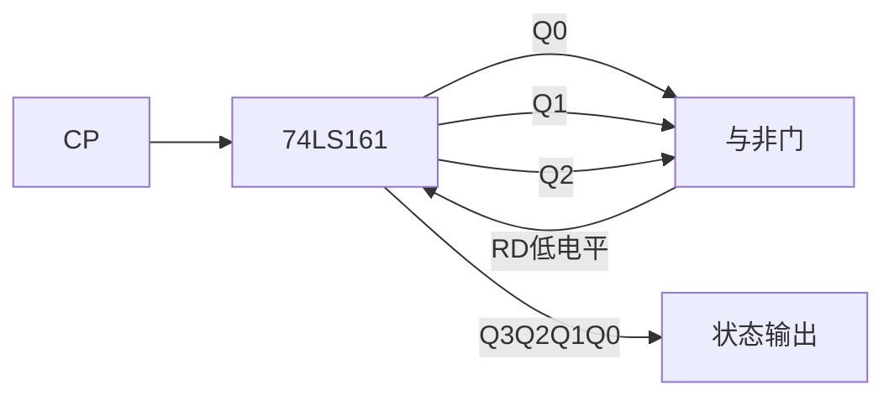
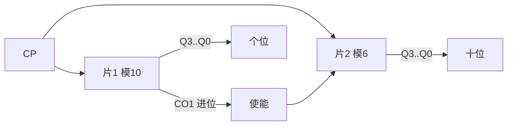

# 5.4 任意进制计数器设计

> [!abstract] 本节概述
> 实际工程中常需要模值非 $2^n$ 也非 10 的计数器，如模 7、模 12、模 60 等。本节解决的核心问题是：**如何用现成的中规模集成计数器（如 74LS161 模 16、74LS160 模 10）设计任意模值 $N$ 的计数器？** 主要方法有三类：**反馈清零法**、**反馈置数法**、**级联法**。掌握同步/异步清零与置数的区别是设计正确的关键。

## 一、设计思路总览

> [!note] 任意进制计数器设计思路
> 若已有计数器模值为 $M$，需设计模值为 $N$ 的计数器：
> - **$N<M$**：用一片计数器加反馈逻辑，跳过 $M-N$ 个多余状态；
> - **$N>M$**：用多片计数器级联，使总模值 $\ge N$，再用反馈逻辑截断到 $N$。

> [!tip] 两种反馈方法
> | 方法 | 原理 | 适用 |
> | ---- | ---- | ---- |
> | **反馈清零法** | 检测到达某个状态后立即/同步将计数器清零 | 起始状态固定为 0 |
> | **反馈置数法** | 检测到达某个状态后立即/同步置入预设数据 | 起始状态可任意设定 |

## 二、反馈清零法

### 2.1 异步清零法

> [!definition] 异步反馈清零法
> 利用计数器的**异步清零端**（如 74LS161 的 $\bar R_D$）：当计数到状态 $N$ 时，用译码逻辑产生清零信号，使计数器立即回到 0000。由于清零是异步的，状态 $N$ 只是一个**短暂的过渡状态**，不占用计数循环。

> [!theorem] 异步清零法设计步骤
> 1. 写出模 $N$ 的**过渡状态**二进制编码 $S_N$（即计数器从 0 计到 $N$ 的那个状态）；
> 2. 用 $S_N$ 中为 1 的位通过与非门产生清零信号：$\bar R_D=\overline{\prod Q_i^1}$（$Q_i^1$ 为 $S_N$ 中为 1 的位）；
> 3. 计数器在状态 $S_N$ 出现的瞬间被异步清零，有效循环为 $S_0\to S_1\to\cdots\to S_{N-1}\to S_0$，共 $N$ 个状态。

> [!warning] 异步清零的"毛刺"问题
> 状态 $S_N$ 会存在一个极短暂的持续时间（约一个门延迟 + 触发器清零时间），在高速电路中可能被下游电路捕获。因此异步清零法**不适合需要从 $S_N$ 译码输出的场合**，且对器件清零脉冲宽度有要求。

> [!example] 例题 1：用 74LS161 异步清零法设计模 7 计数器
> **要求**：用 74LS161（模 16，异步清零 $\bar R_D$）设计模 7 计数器。

**解**：

1. 模 7 的过渡状态 $S_7=0111$；
2. $S_7$ 中为 1 的位为 $Q_2Q_1Q_0$，产生清零信号：
$$\bar R_D=\overline{Q_2Q_1Q_0}$$
3. 当计数到 0111 时，与非门输出 0，异步清零使状态立即回到 0000；
4. 有效状态循环：$0000\to0001\to0010\to0011\to0100\to0101\to0110\to0000$，共 7 个状态。



```mermaid
stateDiagram-v2
    [*] --> S0
    S0: 0000
    S1: 0001
    S2: 0010
    S3: 0011
    S4: 0100
    S5: 0101
    S6: 0110
    S0 --> S1 --> S2 --> S3 --> S4 --> S5 --> S6 --> S0
```

### 2.2 同步清零法

> [!definition] 同步反馈清零法
> 利用计数器的**同步清零端**（如 74LS163 的 $\bar R_D$，或 74LS161 用同步置数端置 0）：当计数到状态 $S_{N-1}$ 时产生清零信号，下一个 CP 上升沿将状态同步置为 0000。状态 $S_{N-1}$ 是**有效状态**，被包含在计数循环中。

> [!theorem] 同步清零法设计步骤
> 1. 写出模 $N$ 的**末态**二进制编码 $S_{N-1}$（即计数器有效循环的最后一个状态）；
> 2. 用 $S_{N-1}$ 中为 1 的位通过与非门产生同步清零信号：$\bar R_D=\overline{\prod Q_i^1}$；
> 3. 计数器在 $S_{N-1}$ 状态下，下一个 CP 上升沿同步清零为 0000；
> 4. 有效循环为 $S_0\to S_1\to\cdots\to S_{N-1}\to S_0$，共 $N$ 个状态，无过渡毛刺。

> [!example] 例题 2：用 74LS163 同步清零法设计模 7 计数器
> 74LS163 与 74LS161 引脚兼容，但 $\bar R_D$ 为**同步清零**。模 7 的末态 $S_6=0110$，反馈逻辑：
$$\bar R_D=\overline{Q_2Q_1}$$
当计数到 0110 时，下一个 CP 同步清零。有效状态 $0000\sim0110$ 共 7 个，无过渡状态。

> [!warning] 异步清零 vs 同步清零的关键区别
> | 比较项 | 异步清零（74LS161） | 同步清零（74LS163） |
> | ------ | ------------------- | ------------------- |
> | 反馈状态 | $S_N$（过渡，不进入循环） | $S_{N-1}$（末态，进入循环） |
> | 清零时机 | 状态出现立即清零 | 下一个 CP 上升沿清零 |
> | 毛刺 | 有短暂过渡状态 | 无毛刺 |
> | 反馈逻辑 | 检测 $S_N$ | 检测 $S_{N-1}$ |
> | 译码可靠性 | 较差 | 好 |

## 三、反馈置数法

### 3.1 同步置数法

> [!definition] 同步反馈置数法
> 利用计数器的**同步置数端**（如 74LS161 的 $\overline{LD}$）：当计数到某个状态时产生置数信号，下一个 CP 上升沿将预设数据 $D_3D_2D_1D_0$ 同步置入计数器。置数起点可以任意设定，灵活性高于清零法。

> [!theorem] 同步置数法设计步骤（从 0 开始计数的常见形式）
> 1. 设模 $N$ 的末态为 $S_{N-1}$，预置数据为 $D_3D_2D_1D_0=0000$；
> 2. 反馈逻辑 $\overline{LD}=\overline{\prod Q_i^1}$（$Q_i^1$ 为 $S_{N-1}$ 中为 1 的位）；
> 3. 计数到 $S_{N-1}$ 时，下一 CP 同步置入 0000；
> 4. 有效循环 $0000\to0001\to\cdots\to S_{N-1}\to0000$，共 $N$ 个状态。

> [!example] 例题 3：用 74LS161 同步置数法设计模 7 计数器（置数端置 0）
> 模 7 末态 $S_6=0110$，并行输入 $D_3D_2D_1D_0=0000$，反馈逻辑：
$$\overline{LD}=\overline{Q_2Q_1}$$
当 $Q_3Q_2Q_1Q_0=0110$ 时，$\overline{LD}=0$，下一 CP 上升沿将 0000 同步置入。有效状态 $0000\sim0110$ 共 7 个。

### 3.2 利用进位输出 CO 置数法

> [!tip] 用 74LS161 的 $CO$ 端实现置数
> 74LS161 在状态 1111 时 $CO=1$。将 $CO$ 反相后接 $\overline{LD}$，可在计满 1111 后下一 CP 同步置入预设数据 $D$：
> - 若 $D=0000$，则模仍为 16；
> - 若 $D=M$（$M>0$），则下一循环从 $M$ 计到 15 再回到 $M$，模值 $=16-M$。

> [!theorem] 利用 CO 置数法设计模 N 计数器
> 设预置数据 $D=(16-N)$（即 $16-N$ 的 4 位二进制），则：
> - 计数序列为 $D\to D+1\to\cdots\to1111\to D\to\cdots$；
> - 状态数 $=16-D=N$，模值为 $N$。

> [!example] 例题 4：用 74LS161 的 CO 置数法设计模 7 计数器
> 预置数据 $D=16-7=9=1001$，将 $CO$ 经非门接 $\overline{LD}$，$D_3D_2D_1D_0=1001$。
> - 计数序列 $1001\to1010\to1011\to1100\to1101\to1110\to1111\to1001$；
> - 共 7 个状态，模 7 ✓。

```mermaid
stateDiagram-v2
    [*] --> S0
    S0: 1001
    S1: 1010
    S2: 1011
    S3: 1100
    S4: 1101
    S5: 1110
    S6: 1111
    S0 --> S1 --> S2 --> S3 --> S4 --> S5 --> S6 --> S0
```

### 3.3 异步置数法

> [!note] 异步置数法
> 若芯片的置数端为异步（如 74LS194 的并行加载是同步的，但某些芯片置数异步），原理类似异步清零：检测到 $S_N$ 立即置数。74LS161 的 $\overline{LD}$ 是同步的，故**用 74LS161 设计时一般不讨论异步置数**，异步反馈只用清零端 $\bar R_D$。

## 四、级联法

> [!definition] 级联法
> 当所需模值 $N$ 大于单片计数器模值 $M$ 时，用多片计数器级联扩展。常用方法：
> - **同步级联**：所有芯片共用 CP，前级进位输出控制后级使能；
> - **异步级联**：前级进位/最高位输出接后级 CP。

> [!theorem] 级联后总模值
> - 两片模 $M_1, M_2$ 的计数器级联，总模值 $=M_1\times M_2$；
> - 若需模 $N$，可分解 $N=N_1\times N_2$，分别用单片实现模 $N_1$、$N_2$ 再级联。

> [!example] 例题 5：用两片 74LS161 设计模 60 计数器
> $60=10\times6$ 或 $60=6\times10$。采用"模 10 + 模 6"分解：
> - 片 1（低位）：用同步置数法设计模 10，状态 $0000\sim1001$；
> - 片 2（高位）：用同步置数法设计模 6，状态 $0000\sim0101$；
> - 片 1 的进位 $CO_1$（计满 1001 时输出）接片 2 的 $CT_P$ 和 $CT_T$；
> - 当片 1 计满 9 时，下一 CP 片 1 回 0000、片 2 加 1；
> - 片 2 计满 5（0101）后下一 CP 回 0000。



> [!tip] 模 60 计数器的另一种设计：整体反馈法
> 也可先用两片 74LS161 级联成模 256（8 位二进制），再用整体反馈置数法截断到模 60：
> - 预置数据 $D=256-60=196=11000100_2$，低 4 位 0100 接片 1、高 4 位 1100 接片 2；
> - 当两片计满 11111111 时 $CO$ 置数，下一 CP 同步置入 11000100；
> - 共 60 个状态循环。

## 五、设计方法选择指南

> [!summary] 任意进制计数器设计方法选择
> | 条件 | 推荐方法 | 优点 |
> | ---- | -------- | ---- |
> | $N<M$，要求无毛刺 | 同步清零/同步置数（74LS163、74LS161 置数端） | 无过渡状态 |
> | $N<M$，电路最简 | 异步清零（74LS161） | 反馈逻辑简单 |
> | $N<M$，需指定起始状态 | 同步置数（74LS161 的 $\overline{LD}$） | 起点灵活 |
> | $N<M$，从末尾计起 | CO 置数法 | 直接利用进位输出 |
> | $N>M$ | 级联 + 反馈 | 灵活组合 |

## 六、典型设计例题

> [!example] 例题 6：用 74LS161 设计模 12 计数器（三种方法对比）
> **要求**：分别用异步清零法、同步置数法、CO 置数法设计模 12 计数器。

**解**：

**(1) 异步清零法**：
- 过渡状态 $S_{12}=1100$；
- 反馈 $\bar R_D=\overline{Q_3Q_2}$；
- 有效状态 $0000\sim1011$（12 个），$1100$ 为短暂过渡。

**(2) 同步置数法（置 0）**：
- 末态 $S_{11}=1011$；
- 反馈 $\overline{LD}=\overline{Q_3Q_1Q_0}$，$D_3D_2D_1D_0=0000$；
- 有效状态 $0000\sim1011$（12 个），无过渡。

**(3) CO 置数法**：
- 预置 $D=16-12=4=0100$；
- $CO$ 经非门接 $\overline{LD}$，$D_3D_2D_1D_0=0100$；
- 有效状态 $0100\sim1111$（12 个）。

> [!example] 例题 7：用 74LS161 设计模 100 计数器
> $100<256$，用两片级联成模 256，再整体反馈置数：
> - 预置 $D=256-100=156=10011100_2$；
> - 片 1（低 4 位）置 $D=1100$，片 2（高 4 位）置 $D=1001$；
> - 两片级联，$CO$ 经非门接两片 $\overline{LD}$；
> - 计满 11111111 后下一 CP 同步置入 10011100，共 100 个状态循环。

## 七、易错点

> [!warning] 易错点
> 1. **异步清零检测 $S_N$，同步清零/置数检测 $S_{N-1}$**：两者反馈状态差 1，是最常见的错误来源；
> 2. **74LS161 的 $\overline{LD}$ 是同步、$\bar R_D$ 是异步**：用 74LS161 设计时混用两种反馈要特别区分；
> 3. **CO 置数法的预置值**：$D=M-N$（$M$ 为芯片模值），不是 $N$ 也不是 $N-1$；
> 4. **级联后反馈逻辑要覆盖所有片**：整体反馈时反馈信号要同时作用于所有相关芯片的控制端；
> 5. **反馈逻辑要检查无关项**：当 $N$ 不是 2 的幂时，反馈译码可能存在无关项，可简化逻辑；
> 6. **自启动检查**：设计后必须验证无效状态能否回到有效循环；
> 7. **同步级联的使能连接**：必须用前级 $CO$ 控制后级 $CT_P$ 和 $CT_T$，不能简单将 CP 串联。

## 八、与其他小节的联系

- 设计方法基于 [[5.3 同步计数器、异步计数器|5.3]] 的 74LS161/74LS90 功能表；
- 反馈逻辑化简使用 [[1.5 逻辑函数化简（代数法、卡诺图法）|1.5]] 的卡诺图工具；
- 计数器是 [[5.5 序列信号发生器|5.5]] 计数型序列发生器的核心部件；
- 设计是 [[5.1 时序电路分析步骤|5.1]] 分析的逆过程。

## 章节导航

- 上一级：[[MOC - 第5章|第5章 时序逻辑电路]]
- 上一节：[[5.3 同步计数器、异步计数器|5.3 同步计数器、异步计数器]]
- 下一节：[[5.5 序列信号发生器|5.5 序列信号发生器]]
- 习题：[[MOC - 第5章习题|第5章 习题]]
