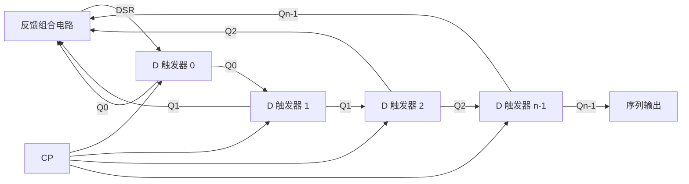
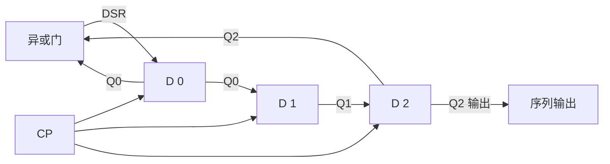

# 5.5 序列信号发生器

> [!abstract] 本节概述
> 序列信号发生器是用来**产生特定周期性二进制码序列**的时序电路，在通信同步、密码学、伪随机测试、雷达测距等领域有广泛应用。本节解决两个问题：(1) 如何用**移位寄存器加反馈组合电路**（移位型）产生序列；(2) 如何用**计数器加输出组合电路**（计数型）产生序列。最后介绍最长线性反馈序列（**m 序列**）及其特征多项式。

## 一、序列信号的基本概念

> [!definition] 序列信号
> 序列信号是按一定规律周期性重复的二进制码串。例如序列 `101101011011...`，周期 $L=4$，码字为 `1011`。序列信号发生器的任务就是在时钟驱动下逐位串行输出该序列。

> [!note] 序列发生器的两类实现
> | 类型 | 结构 | 设计核心 |
> | ---- | ---- | -------- |
> | **移位型** | 移位寄存器 + 反馈组合电路 | 设计反馈函数使状态按序列码循环 |
> | **计数型** | 计数器 + 输出组合电路 | 计数器遍历 $L$ 个状态，组合电路译码输出序列位 |

## 二、移位型序列信号发生器

> [!definition] 移位型序列信号发生器
> 由 $n$ 位移位寄存器和反馈组合电路构成：反馈电路根据当前寄存器状态 $Q_{n-1}\cdots Q_1Q_0$ 计算下一时刻送入串行输入端 $D_{SR}$（或 $D_{SL}$）的值，使寄存器状态按预定序列循环移位，从某一位输出即得到所需序列。

> [!theorem] 移位型发生器设计步骤
> 1. **确定移位寄存器位数 $n$**：序列周期为 $L$，需 $2^n\ge L$，即 $n\ge\lceil\log_2 L\rceil$。若序列中存在重复的 $n$ 位子串，则需增加位数；
> 2. **列状态序列**：从序列中依次截取 $n$ 位作为状态，得到 $L$ 个状态循环；
> 3. **列反馈函数真值表**：每个现态对应的次态最高位（即移入的 $D_{SR}$）即为反馈函数输出；
> 4. **化简反馈函数**：用卡诺图化简得到 $D_{SR}=F(Q_{n-1},\ldots,Q_1,Q_0)$；
> 5. **检查自启动**：验证无效状态能否回到有效循环，必要时修改反馈函数；
> 6. **画电路图**：用移位寄存器（如 74LS194）加反馈门电路实现。

> [!example] 例题 1：设计产生序列 `10110` 的移位型发生器
> **要求**：设计移位型序列信号发生器，产生周期序列 `1011010110...`（周期 $L=5$）。

**解**：

**(1) 确定位数**：$2^n\ge 5$，取 $n=3$。

**(2) 列状态序列**：从序列 `10110` 循环截取 3 位：
- 序列展开：`...1 0 1 1 0 1 0 1 1 0 1 0 1 1 0...`
- 状态序列（每 3 位一组，逐位移动）：

| 序号 | 状态 $Q_2Q_1Q_0$ | 次态 | 移入 $D_{SR}$ |
| :-: | :-: | :-: | :-: |
| 0 | 101 | 010 | 0 |
| 1 | 010 | 101 | 1 |
| 2 | 101 | 011 | 1 |
| 3 | 011 | 110 | 0 |
| 4 | 110 | 101 | 1 |

> [!warning] 状态重复问题
> 上表中状态 `101` 出现两次（序号 0 和 2），但它们对应的次态不同（010 和 011），说明 3 位移位寄存器无法区分这两个状态，需要**增加位数**到 $n=4$。

**(3) 重新用 $n=4$ 位设计**：

序列 `10110` 循环截取 4 位：

| 序号 | 状态 $Q_3Q_2Q_1Q_0$ | 移入 $D_{SR}$ |
| :-: | :-: | :-: |
| 0 | 1011 | 0 |
| 1 | 0110 | 1 |
| 2 | 1101 | 0 |
| 3 | 1010 | 1 |
| 4 | 0101 | 1 |

5 个状态互不相同 ✓。

**(4) 反馈函数真值表与卡诺图化简**：

$D_{SR}$ 关于 $Q_3Q_2Q_1Q_0$ 的卡诺图（无关项用 ×）：

| $Q_3Q_2\backslash Q_1Q_0$ | 00 | 01 | 11 | 10 |
| :-: | :-: | :-: | :-: | :-: |
| 00 | × | 1 | × | × |
| 01 | × | 1 | 0 | × |
| 11 | × | × | × | 0 |
| 10 | × | × | 1 | 1 |

化简得：
$$D_{SR}=\bar Q_3 Q_0 + Q_3\bar Q_1$$

**(5) 检查自启动**：验证剩余 11 个无效状态能否进入有效循环（略，工程上常需补充修正项）。

**(6) 电路实现**：用 4 位右移寄存器（74LS194 设为右移方式 $S_1S_0=01$），反馈电路实现 $D_{SR}=\bar Q_3 Q_0 + Q_3\bar Q_1$，从 $Q_0$ 输出序列。

## 三、计数型序列信号发生器

> [!definition] 计数型序列信号发生器
> 由模 $L$ 计数器和组合输出电路构成：计数器在 $L$ 个状态间循环，组合电路根据计数器当前状态译码输出序列的当前位。优点是设计简单、状态利用率高，适合任意长度序列。

> [!theorem] 计数型发生器设计步骤
> 1. **设计模 $L$ 计数器**：用 74LS161 或 74LS160 通过反馈清零/置数法实现模 $L$（见 [[5.4 任意进制计数器设计|5.4]]）；
> 2. **列输出真值表**：以计数器状态为输入，序列对应位为输出；
> 3. **化简输出函数**：用卡诺图化简 $Z=F(Q_{n-1},\ldots,Q_0)$；
> 4. **画电路图**：计数器加组合电路（译码器/数据选择器/门电路）。

> [!example] 例题 2：设计产生序列 `10110` 的计数型发生器
> **要求**：用 74LS161 和组合电路产生周期 $L=5$ 的序列 `10110`。

**解**：

**(1) 设计模 5 计数器**：用 74LS161 同步置数法，末态 $S_4=0100$，$\overline{LD}=\overline{Q_2}$，$D_3D_2D_1D_0=0000$。状态 $0000\sim0100$ 共 5 个。

**(2) 输出真值表**：

| 状态 | $Q_3Q_2Q_1Q_0$ | 序列位 $Z$ |
| :-: | :-: | :-: |
| 0 (0000) | 0000 | 1 |
| 1 (0001) | 0001 | 0 |
| 2 (0010) | 0010 | 1 |
| 3 (0011) | 0011 | 1 |
| 4 (0100) | 0100 | 0 |

序列 `10110` 对应状态 0~4。

**(3) 化简 $Z$**：用卡诺图（$Q_3=1$ 及 $Q_2Q_1Q_0\ge101$ 为无关项）：

| $Q_2\backslash Q_1Q_0$ | 00 | 01 | 11 | 10 |
| :-: | :-: | :-: | :-: | :-: |
| 0 | 1 | 0 | 1 | 1 |
| 1 | 0 | × | × | × |

化简得：
$$Z=\bar Q_1\bar Q_0 + Q_1 Q_0 \cdot \bar Q_2 = \bar Q_1\bar Q_0 + \bar Q_2 Q_1 Q_0$$

进一步简化：
$$Z=\bar Q_2\cdot \bar Q_1\bar Q_0 + \bar Q_2\cdot Q_1 Q_0 = \bar Q_2(\bar Q_1\bar Q_0 + Q_1 Q_0)=\bar Q_2\cdot\overline{Q_1\oplus Q_0}$$

即 $Z=\bar Q_2\cdot(Q_1\odot Q_0)$（同或）。

**(4) 电路**：74LS161（模 5）+ 同或门 + 与门，输出 $Z$。

## 四、最长线性反馈序列（m 序列）

> [!definition] m 序列
> **m 序列**（最长线性反馈移位寄存器序列）是由带线性反馈的 $n$ 位移位寄存器产生的、周期为 $L=2^n-1$ 的伪随机二进制序列。它是线性反馈移位寄存器（LFSR）所能产生的最长周期序列。

> [!note] m 序列的产生结构
> $n$ 级 D 触发器构成移位寄存器，反馈函数取若干级的**异或**：
$$D_{SR}=c_1 Q_0\oplus c_2 Q_1\oplus\cdots\oplus c_n Q_{n-1}$$
其中 $c_i\in\{0,1\}$ 表示第 $i$ 级是否参与反馈。不能全为 0，且需选择使周期达到 $2^n-1$ 的反馈组合（由特征多项式决定）。

### 4.1 特征多项式

> [!definition] 特征多项式
> LFSR 的反馈连接可用**特征多项式**（Characteristic Polynomial）描述：
$$f(x)=c_n x^n + c_{n-1}x^{n-1}+\cdots+c_1 x + c_0$$
其中 $c_i=1$ 表示第 $i$ 级参与反馈异或（$c_0=c_n=1$）。**当 $f(x)$ 为 GF(2) 上的本原多项式时，LFSR 产生 m 序列，周期 $L=2^n-1$**。

> [!theorem] 本原多项式判定条件
> $n$ 次多项式 $f(x)$ 为本原多项式需同时满足：
> 1. $f(x)$ 在 GF(2) 上**不可约**（不能再分解）；
> 2. $f(x)$ 整除 $x^{2^n-1}+1$，但不能整除任何 $x^k+1$（$k<2^n-1$）。

> [!note] 常用本原多项式表
> | 级数 $n$ | 本原多项式 $f(x)$ | 周期 $L=2^n-1$ |
> | :------: | ----------------- | :------------: |
> | 2 | $x^2+x+1$ | 3 |
> | 3 | $x^3+x+1$ | 7 |
> | 4 | $x^4+x+1$ | 15 |
> | 5 | $x^5+x^2+1$ | 31 |
> | 6 | $x^6+x+1$ | 63 |
> | 7 | $x^7+x+1$ | 127 |
> | 8 | $x^8+x^4+x^3+x^2+1$ | 255 |
> | 9 | $x^9+x^4+1$ | 511 |
> | 10 | $x^{10}+x^3+1$ | 1023 |

> [!example] 例题 3：设计 3 级 m 序列发生器
> 3 级本原多项式 $f(x)=x^3+x+1$，对应反馈 $D_{SR}=Q_0\oplus Q_2$（即第 1、3 级异或）。

**解**：

设初始状态 $Q_2Q_1Q_0=001$（不能全 0），反馈 $D_{SR}=Q_0\oplus Q_2$：

| CP | $Q_2Q_1Q_0$ | $D_{SR}=Q_0\oplus Q_2$ |
| :-: | :-: | :-: |
| 0 | 001 | 1 |
| 1 | 100 | 1 |
| 2 | 110 | 1 |
| 3 | 111 | 0 |
| 4 | 011 | 1 |
| 5 | 101 | 0 |
| 6 | 010 | 0 |
| 7 | 001 | 1（回到初态） |

周期 $L=7=2^3-1$ ✓。从 $Q_0$ 输出的序列为 `1 1 1 0 1 0 0 1 1 1 0...`，即 `1110100` 循环。

### 4.2 m 序列的性质

> [!theorem] m 序列的伪随机特性
> 1. **周期性**：周期 $L=2^n-1$；
> 2. **平衡性**：每个周期内 1 的个数比 0 多 1 个（$2^{n-1}$ 个 1，$2^{n-1}-1$ 个 0）；
> 3. **游程特性**：长为 $k$ 的游程（连续相同的位）数为 $2^{n-k-1}$（$1\le k\le n-2$），长为 $n$ 的游程 1 个（全 1），长为 $n-1$ 的 0 游程 1 个；
> 4. **移位相加性**：m 序列与其移位序列的异或仍是该 m 序列的另一个移位；
> 5. **自相关性**：m 序列的自相关函数在零偏移时为 $L$，其他偏移时为 $-1$，近似脉冲，适合同步与测距。

> [!warning] m 序列的"全 0 禁区"
> 若 LFSR 进入全 0 状态 $000\ldots0$，由于异或反馈仍为 0，状态将永远保持全 0——称为**死锁**。因此 m 序列发生器必须避免全 0 初态，工程上可加检测电路在全 0 时自动置入非 0 状态。

## 五、移位型与计数型对比

> [!summary] 两类序列发生器对比
> | 比较项 | 移位型 | 计数型 |
> | ------ | ------ | ------ |
> | 结构 | 移位寄存器 + 反馈组合电路 | 计数器 + 输出组合电路 |
> | 设计核心 | 反馈函数 $D_{SR}=F(Q)$ | 输出函数 $Z=F(Q)$ |
> | 状态利用 | 受序列码字约束，可能需增加位数 | 状态连续，利用率高 |
> | 适合序列 | 周期 $L=2^n-1$ 的 m 序列 | 任意周期序列 |
> | 输出方式 | 从某级 $Q$ 串行输出 | 由组合电路并行译码后串行输出 |
> | 典型应用 | 伪随机序列、通信扩频 | 节拍控制、特定码型产生 |

## 六、典型设计例题

> [!example] 例题 4：用 74LS194 设计 m 序列发生器（$n=4$，多项式 $x^4+x+1$）
> 4 级本原多项式 $f(x)=x^4+x+1$，反馈 $D_{SR}=Q_0\oplus Q_3$。

**解**：

- 74LS194 设为右移方式 $S_1S_0=01$；
- $D_{SR}$ 由 $Q_0$ 和 $Q_3$ 经异或门得到；
- 初始预置 $Q_3Q_2Q_1Q_0=0001$（用并行加载 $S_1S_0=11$ 预置后切换右移）；
- 周期 $L=2^4-1=15$，从 $Q_0$ 输出 15 位 m 序列。

> [!example] 例题 5：用计数器 + 数据选择器产生序列 `010110`
> **要求**：周期 $L=6$，用 74LS161（模 6）+ 8 选 1 数据选择器实现。

**解**：

1. **模 6 计数器**：74LS161 同步置数法，末态 $S_5=0101$，$\overline{LD}=\overline{Q_2Q_0}$，状态 $0000\sim0101$；
2. **数据选择器**：以 $Q_2Q_1Q_0$ 为地址（3 位足够，因为最大状态 0101 中 $Q_2=1$ 时只有 0100、0101 两个），8 选 1 输入端接序列对应位：

| 地址 $Q_2Q_1Q_0$ | 序列位 $D_i$ |
| :-: | :-: |
| 000 | 0 |
| 001 | 1 |
| 010 | 0 |
| 011 | 1 |
| 100 | 1 |
| 101 | 0 |
| 110 | ×（无关） |
| 111 | ×（无关） |

序列 `010110` 对应状态 0~5。输出 $Z$ 即数据选择器输出 $Y$。

## 七、易错点

> [!warning] 易错点
> 1. **移位型位数不足导致状态重复**：序列中若存在重复的 $n$ 位子串且次态不同，必须增加位数，否则无法实现；
> 2. **反馈方向与移位方向一致**：右移时反馈送入 $D_{SR}$（最低位），左移时送入 $D_{SL}$（最高位）；
> 3. **m 序列必须避免全 0 初态**：全 0 状态会死锁，需设置非 0 初始状态或加自启动电路；
> 4. **本原多项式选择**：不是任意反馈连接都能产生 m 序列，必须查本原多项式表；
> 5. **计数型输出的无关项**：计数器模 $L<2^n$ 时，未用状态对应的输出可作无关项化简；
> 6. **序列起点与状态对应**：设计时要明确序列第 0 位对应哪个计数器状态，避免错位；
> 7. **m 序列周期 $L=2^n-1$ 不是 $2^n$**：全 0 状态被排除，所以是 $2^n-1$。

## 八、与其他小节的联系

- 移位型发生器基于 [[5.2 寄存器、移位寄存器|5.2]] 的移位寄存器（74LS194）；
- 计数型发生器基于 [[5.4 任意进制计数器设计|5.4]] 的任意进制计数器；
- 输出/反馈函数化简使用 [[1.5 逻辑函数化简（代数法、卡诺图法）|1.5]] 的卡诺图；
- m 序列在通信原理、密码学中广泛应用，是后续课程的重要基础；
- 数据选择器实现组合输出见 [[第3章 组合逻辑电路]]（待补充）。

## 章节导航

- 上一级：[[MOC - 第5章|第5章 时序逻辑电路]]
- 上一节：[[5.4 任意进制计数器设计|5.4 任意进制计数器设计]]
- 习题：[[MOC - 第5章习题|第5章 习题]]
