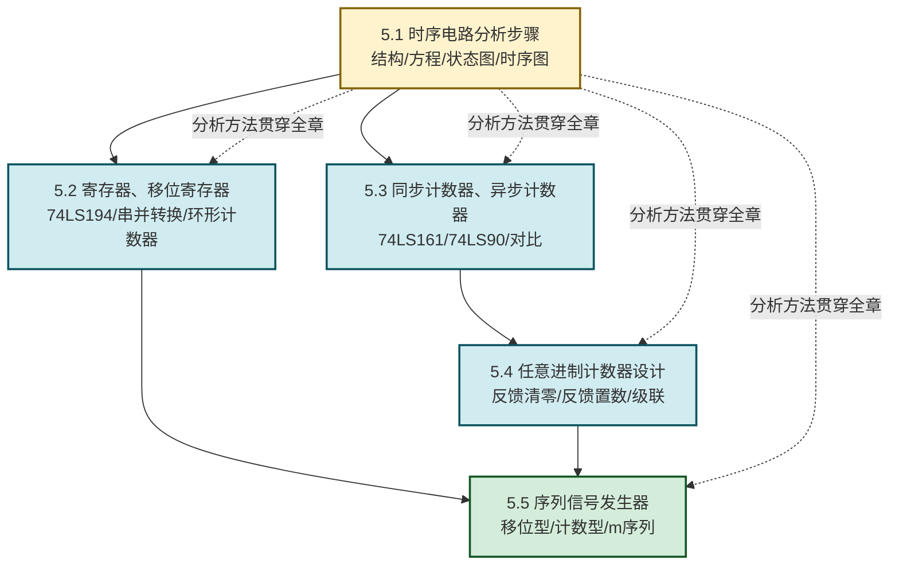
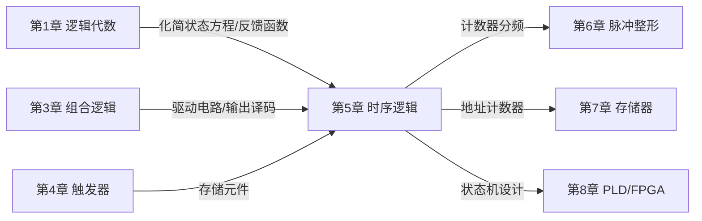

# MOC - 第5章 时序逻辑电路

> [!info] 本章定位
> 时序逻辑电路是数字电路课程的**核心与高潮章**。本章要回答的核心问题是：**如何用触发器存储状态、用组合电路驱动状态转换，从而构建有记忆功能的数字系统？** 时序电路与组合电路的根本区别在于引入了**反馈回路与存储元件**，使电路输出不仅取决于当前输入，还与历史状态有关。本章是 [[MOC - 第4章|第4章 触发器]]（存储单元）的直接应用，也是 [[MOC - 第6章|第6章 脉冲信号产生与整形]]（计数器分频）、[[MOC - 第7章|第7章 半导体存储器]]（地址计数器）和计算机组成原理（CPU 控制单元、寄存器堆）的工程基础。

## 学习路线图

## 知识点导航

| 小节 | 标题 | 核心内容 | 典型芯片 |
| ---- | ---- | -------- | -------- |
| [[5.1 时序电路分析步骤\|5.1]] | 时序电路分析步骤 | 时序电路结构、同步/异步、三组方程（输出/驱动/状态）、状态表与状态图、分析流程 | — |
| [[5.2 寄存器、移位寄存器\|5.2]] | 寄存器、移位寄存器 | 寄存器并行存取、移位寄存器左/右/双向移位、串并转换、环形与扭环形计数器 | 74LS194 |
| [[5.3 同步计数器、异步计数器\|5.3]] | 同步计数器、异步计数器 | 同步二进制/十进制计数器、异步行波计数器、同步 vs 异步对比、级联扩展 | 74LS161、74LS160、74LS90、74LS163 |
| [[5.4 任意进制计数器设计\|5.4]] | 任意进制计数器设计 | 反馈清零法（异步/同步）、反馈置数法（同步/CO 置数）、级联法、设计方法选择 | 74LS161、74LS163 |
| [[5.5 序列信号发生器\|5.5]] | 序列信号发生器 | 移位型（反馈函数）、计数型（输出译码）、m 序列与特征多项式、伪随机特性 | 74LS194、74LS161 |

## 核心考点

> [!summary] 本章核心考点（10 点）
> 1. **时序电路三组方程**：输出方程 $Z=F(X,Q^n)$、驱动方程 $W=G(X,Q^n)$、状态方程 $Q^{n+1}=H(W,Q^n)$，是分析所有时序电路的统一框架；
> 2. **同步与异步的区分**：所有触发器是否共用 CP 是判别依据；异步电路需写时钟方程并逐位检查有效边沿；
> 3. **状态表与状态图绘制**：Moore 型输出写在状态圈内，Mealy 型输出写在转换箭头上（格式"输入/输出"）；
> 4. **74LS194 功能表**：$S_1S_0=00$ 保持、$01$ 右移、$10$ 左移、$11$ 并行加载，$\bar R_D$ 异步清零优先级最高；
> 5. **74LS161 功能表**：$\bar R_D$ 异步清零、$\overline{LD}$ 同步置数、$CT_P\cdot CT_T$ 计数使能、$CO=Q_3Q_2Q_1Q_0\cdot CT_T$，三个控制端优先级 $\bar R_D>\overline{LD}>CT_P,CT_T$；
> 6. **74LS90 工作模式**：8421 BCD 模式（$CP_A$ 接外部 CP，$Q_A$ 接 $CP_B$）和 5421 模式，置 9 端优先级高于清零端；
> 7. **任意进制计数器设计**：异步清零检测 $S_N$（过渡态），同步清零/置数检测 $S_{N-1}$（末态），CO 置数法预置 $D=M-N$；
> 8. **级联扩展**：同步级联用前级 $CO$ 控制后级使能，总模值 $=M_1\times M_2$；可分解 $N=N_1\times N_2$ 设计；
> 9. **序列发生器设计**：移位型需确定位数（避免状态重复）并化简反馈函数；计数型用模 $L$ 计数器加组合译码；
> 10. **m 序列**：周期 $L=2^n-1$，反馈由本原多项式决定，避免全 0 状态死锁，具有伪随机特性。

## 章节核心思想

> [!abstract] 时序逻辑的核心思想
> 时序逻辑 = 组合逻辑 + 记忆元件（触发器）。电路的输出由**当前输入**与**当前状态**共同决定，状态在时钟驱动下按预定规律转换。这一抽象模型（有限状态机 FSM）是数字系统设计的统一框架：
> - **Moore 型**：输出仅取决于状态 $Z=F(Q^n)$，输出在状态转换后改变；
> - **Mealy 型**：输出取决于输入与状态 $Z=F(X,Q^n)$，输出可随输入立即变化。
>
> 工程上，**同步设计**是时序电路的黄金准则：所有触发器共用同一时钟边沿更新状态，避免竞争冒险，保证可综合性与时序收敛。

## 与其他章节的联系

- **先修**：[[MOC - 第4章|第4章 触发器]]提供存储元件与特性方程，[[1.5 逻辑函数化简（代数法、卡诺图法）|1.5]] 提供化简工具，[[MOC - 第3章|第3章]] 提供组合电路分析与设计方法；
- **后续**：[[MOC - 第6章|第6章]] 用计数器对脉冲分频，[[MOC - 第7章|第7章]] 用计数器作地址发生器，[[MOC - 第8章|第8章]] 用 PLD/FPGA 实现状态机；
- **跨课程**：计算机组成原理的 CPU 控制单元（FSM）、寄存器堆、程序计数器都基于本章内容。

## 典型芯片速查

> [!tip] 本章核心芯片速查
> | 芯片 | 功能 | 关键特性 |
> | ---- | ---- | -------- |
> | 74LS194 | 4 位双向移位寄存器 | $S_1S_0$ 选 4 种方式，异步清零，并行加载同步 |
> | 74LS161 | 同步 4 位二进制计数器 | 模 16，异步清零，同步置数，$CO$ 进位输出 |
> | 74LS163 | 同步 4 位二进制计数器 | 模 16，**同步清零**，同步置数 |
> | 74LS160 | 同步十进制计数器 | 模 10，与 74LS161 引脚兼容 |
> | 74LS90 | 异步二-五-十进制计数器 | 模 2/5/10，异步清零与置 9 |
> | 74LS93 | 异步 4 位二进制计数器 | 模 16，行波级联 |

## 章节导航

> [!nav] 导航
> 上级：[[MOC - 数字逻辑电路|课程总览]]
> 上一章：[[MOC - 第4章|第4章 触发器]]
> 下一章：[[MOC - 第6章|第6章 脉冲信号产生与整形]]
> 配套习题：[[MOC - 第5章习题|第5章 习题]]
