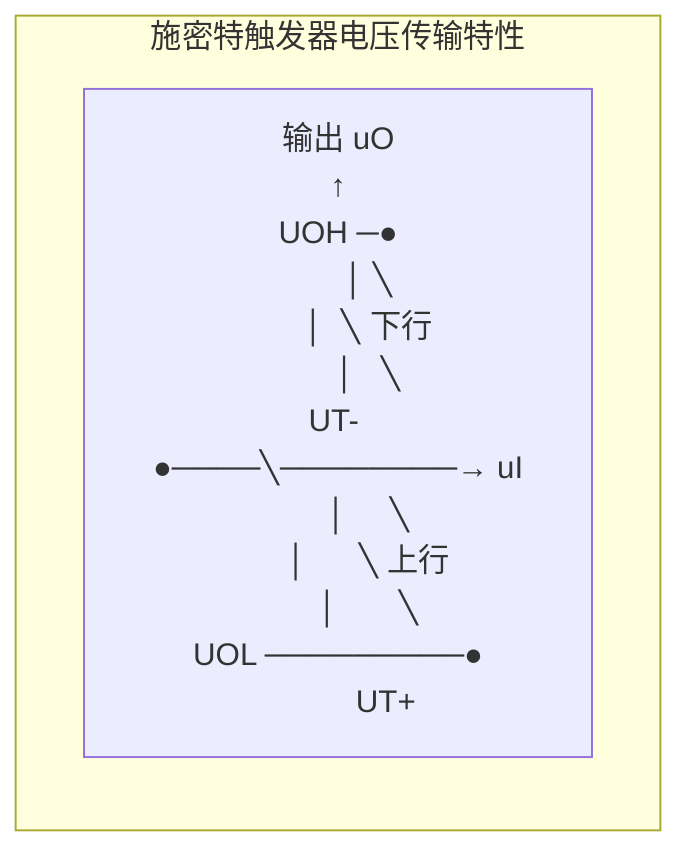
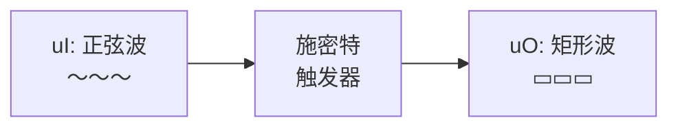
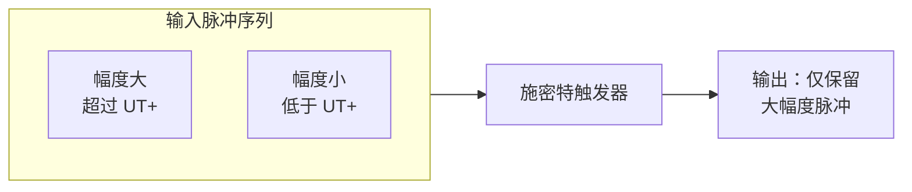

# 6.1 施密特触发器

> [!abstract] 本节概述
> 数字系统中的信号在传输过程中常因噪声、干扰或长线效应发生畸变，边沿变缓、叠加毛刺，导致后级门电路误判。施密特触发器（Schmitt Trigger）是一种**依靠输入电平触发翻转、且具有回差电压**的二值整形电路：它把缓慢变化或带噪的模拟信号还原为边沿陡峭、干净的标准矩形波。本节解决的核心问题是——**如何利用电路的正反馈构成两个不同的阈值电平，使输出由 0→1 与 1→0 发生在不同的输入电平上，从而获得抗干扰能力。**

## 一、电路特点

> [!definition] 施密特触发器的三个基本特征
> 1. **两个稳定状态**：输出只能是高电平 $U_{OH}$ 或低电平 $U_{OL}$，没有中间态；
> 2. **电平触发翻转**：状态转换由输入电压的**电平值**决定，而非边沿（这是与 [[5.1 同步触发器与边沿触发器|边沿触发器]]的本质区别）；
> 3. **具有回差电压**：输入信号上升时在 $U_{T+}$ 翻转、下降时在 $U_{T-}$ 翻转，且 $U_{T+} > U_{T-}$，两者之差称为回差电压。

> [!note] 与普通门电路的区别
> 普通门电路只有一个阈值电压 $U_{TH}$，输入跨越 $U_{TH}$ 即翻转。当输入叠加噪声在 $U_{TH}$ 附近反复抖动时，输出会随之多次翻转。施密特触发器引入**两个阈值**形成滞回，噪声幅度小于回差时不会引起误翻转，这是其抗干扰的根本原因。

## 二、电压传输特性

### 2.1 上行特性与下行特性

施密特触发器的传输特性是一条**滞回曲线**，分为两段：

> [!theorem] 电压传输特性
> - **上行特性（输入上升）**：初始 $u_I$ 较低时输出为高电平 $U_{OH}$；当 $u_I$ 由低升高到 **正向阈值电压 $U_{T+}$** 时，输出由 $U_{OH}$ 下跳为 $U_{OL}$；
> - **下行特性（输入下降）**：当 $u_I$ 由高降低到 **负向阈值电压 $U_{T-}$** 时，输出由 $U_{OL}$ 上跳为 $U_{OH}$；
> - 由于 $U_{T+} > U_{T-}$，特性曲线形成滞回环。

### 2.2 回差电压

> [!definition] 回差电压
> 正向阈值与负向阈值之差称为回差电压（又称滞回宽度）：
> $$\boxed{\Delta U_T = U_{T+} - U_{T-}}$$
> 回差越大，抗干扰能力越强，但灵敏度越低（信号幅度必须超过 $\Delta U_T$ 才能触发）。

### 2.3 传输特性曲线示意

> [!tip] 滞回曲线的读图要点
> - 输入**上升**时沿**上行支路**（右下→左上方向的反向，即先保持 $U_{OH}$，到 $U_{T+}$ 下跳）；
> - 输入**下降**时沿**下行支路**（先保持 $U_{OL}$，到 $U_{T-}$ 上跳）；
> - 滞回环的宽度即为 $\Delta U_T$，环越宽抗扰越强。

## 三、用门电路构成施密特触发器

### 3.1 CMOS 门构成的施密特触发器

> [!note] 典型结构
> 用两级 CMOS 反相器串接，并通过分压电阻 $R_1$、$R_2$ 把输出反馈到输入端，即可构成施密特触发器。电路结构：输入 $u_I$ 经 $R_1$ 接到中间节点，中间节点接第一级反相器输入；输出 $u_O$ 经 $R_2$ 反馈到同一节点。

> [!theorem] 阈值电压计算（CMOS 型）
> 设 CMOS 反相器阈值 $U_{TH} \approx \tfrac{1}{2}V_{DD}$，且 $R_2 \gg R_1$（输出内阻可忽略），则：
> $$U_{T+} = \left(1 + \frac{R_1}{R_2}\right) U_{TH}$$
> $$U_{T-} = \left(1 - \frac{R_1}{R_2}\right) U_{TH}$$
> $$\Delta U_T = U_{T+} - U_{T-} = \frac{2R_1}{R_2} U_{TH}$$
> 调节 $R_1/R_2$ 即可改变回差大小。

> [!example] 阈值计算
> 若 $V_{DD}=10\,\text{V}$，$U_{TH}=5\,\text{V}$，$R_1=10\,\text{k}\Omega$，$R_2=50\,\text{k}\Omega$，则：
> - $U_{T+}=(1+\tfrac{10}{50})\times5=6\,\text{V}$
> - $U_{T-}=(1-\tfrac{10}{50})\times5=4\,\text{V}$
> - $\Delta U_T=6-4=2\,\text{V}$

### 3.2 集成施密特触发器

> [!note] 常见型号
> - TTL 系列：**74LS14**（六反相施密特触发器）、74LS132（四 2 输入与非施密特）；
> - CMOS 系列：**CC40106**（六反相施密特）、CC4093（四 2 输入与非施密特）。
>
> 集成器件的回差电压由内部工艺固定，如 74LS14 在 $V_{CC}=5\,\text{V}$ 时典型值 $U_{T+}\approx1.6\,\text{V}$、$U_{T-}\approx0.8\,\text{V}$、$\Delta U_T\approx0.8\,\text{V}$。

## 四、典型应用

### 4.1 波形变换

> [!example] 正弦波→矩形波
> 将正弦波、三角波等缓慢变化的模拟信号加到施密特触发器输入端，输出即得到边沿陡峭的矩形波。变换后的矩形波频率与输入相同，但获得了数字系统所需的电平和边沿。

### 4.2 波形整形

> [!example] 修复畸变脉冲
> 数字信号经长线传输后边沿变坏、叠加振铃和噪声。施密特触发器利用回差电压把叠加噪声的信号"切干净"，恢复为标准矩形脉冲。只要噪声峰峰值小于 $\Delta U_T$，就不会在输出端产生多余跳变。

### 4.3 幅度鉴别

> [!example] 脉冲幅度鉴别
> 当输入是一串幅度不等的脉冲时，只有幅度超过 $U_{T+}$ 的脉冲才能使输出翻转，幅度小的脉冲被滤除。调节 $U_{T+}$ 即可改变鉴别门限，用于雷达回波、心电信号等弱信号检测。

## 五、易错点

> [!warning] 易错点
> 1. **回差方向不可记反**：上升沿在较高的 $U_{T+}$ 翻转（输出下跳），下降沿在较低的 $U_{T-}$ 翻转（输出上跳），始终 $U_{T+} > U_{T-}$；
> 2. **电平触发而非边沿触发**：施密特触发器看的是输入"达到某电平"，不是"发生跳变"，不能等同于 [[4.1 基本RS触发器|触发器]]的边沿触发；
> 3. **回差并非越大越好**：回差过大时小信号无法触发，灵敏度下降，应根据噪声幅度折中选择；
> 4. **CMOS 阈值公式的前提**：$U_{TH}\approx\tfrac{1}{2}V_{DD}$ 且反馈电阻满足 $R_2 \gg R_1$ 时公式才准确，否则需考虑输出内阻分压；
> 5. **波形变换不改变频率**：变换前后基频相同，只是把模拟波形"方波化"。

## 六、与其他小节的联系

- 施密特触发器是本章三种整形/产生电路之一，与 [[6.2 单稳态触发器|6.2 单稳态]]、[[6.3 多谐振荡器|6.3 多谐振荡器]]共同构成脉冲电路的核心；
- 用 [[6.4 555 定时器原理与应用|555 定时器]]可方便地构成施密特触发器，阈值由分压网络决定；
- 回差抗扰思想与 [[3.6 竞争冒险现象判断与消除|竞争冒险]]中"消除毛刺"的目标一致，但实现层次不同；
- 电平触发与 [[5.1 同步触发器与边沿触发器|边沿触发]]的对比是本章重要辨析点。

## 章节导航

- 上一级：[[MOC - 第6章]]
- 下一节：[[6.2 单稳态触发器]]
- 习题：[[MOC - 第6章习题]]
