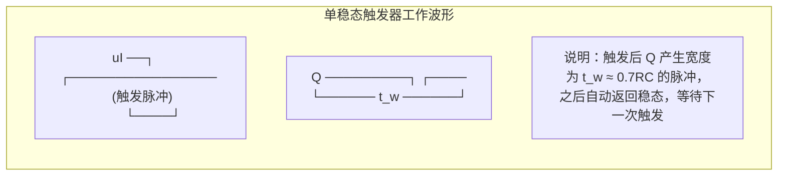

# 6.2 单稳态触发器

> [!abstract] 本节概述
> 数字系统经常需要**固定宽度的脉冲**——例如用做采样门控、延时启动或对窄脉冲展宽。单稳态触发器（Monostable Multivibrator）正是为此设计的：它只有一个稳定状态，在外来触发脉冲作用下进入一个**暂稳态**，经过一段由 RC 决定的时间后自动返回稳态。本节解决的核心问题是——**如何用门电路 + RC 定时网络构成"一触即发、定时返回"的电路，并准确计算暂稳态持续时间。**

## 一、电路特点

> [!definition] 单稳态触发器的基本特征
> 1. **一个稳态 + 一个暂稳态**：无触发时电路长期停留在稳态（输出固定为 0 或 1）；
> 2. **外触发进入暂稳态**：触发脉冲到来后，状态翻转进入暂稳态，输出产生一个固定宽度的脉冲；
> 3. **自动返回**：暂稳态持续 $t_w$ 后，无需外加信号，电路靠 RC 充放电自动回到稳态；
> 4. **脉宽由 RC 决定**：$t_w$ 几乎与触发脉冲宽度无关，只取决于定时元件 $R$、$C$。

> [!note] 与施密特、多谐的对比
> | 电路 | 稳态数 | 暂稳态数 | 是否需要触发 | 典型用途 |
> | ---- | ------ | -------- | ------------ | -------- |
> | [[6.1 施密特触发器\|施密特]] | 2 | 0 | 电平触发 | 整形、鉴幅 |
> | 单稳态 | 1 | 1 | 脉冲触发 | 定时、延时 |
> | [[6.3 多谐振荡器\|多谐振荡器]] | 0 | 2 | 自激（不需触发） | 产生矩形波 |

## 二、暂稳态时间公式

> [!theorem] 暂稳态持续时间
> 暂稳态时间 $t_w$ 由定时电容从初始值充（放）电到阈值电压所需时间决定。对一阶 RC 电路：
> $$u_C(t) = u_C(\infty) + \left[u_C(0) - u_C(\infty)\right] e^{-t/RC}$$
> 解得电容电压由 $u_C(0)$ 变化到阈值 $U_{TH}$ 的时间：
> $$t_w = RC \ln\frac{u_C(\infty) - u_C(0)}{u_C(\infty) - U_{TH}}$$
>
> 工程上对常见结构有简化估算：
> - **微分型单稳态**：$\boxed{t_w \approx 0.7\,RC}$
> - **积分型单稳态**：$\boxed{t_w \approx 1.1\,RC}$

> [!tip] 公式记忆
> 系数差异源于充放电的起止电平不同：微分型电容从 $0$ 充到 $U_{TH}\approx0.63V_{CC}$（$\ln\frac{1}{1-0.63}\approx0.7$ 左右量级），积分型起止条件不同故系数更大。考试中按教材给定的近似系数套用即可。

## 三、用门电路构成单稳态触发器

### 3.1 微分型单稳态触发器

> [!note] 电路结构
> 用一个 **与门（或与非门）** 和一个 **非门** 串接，中间经 $R$、$C$ 微分电路耦合。触发信号 $u_I$ 经微分得到窄脉冲作用于门电路，输出反馈形成暂稳态；定时电阻 $R$ 接地（或 $V_{CC}$），电容 $C$ 跨接在中间节点。

> [!example] 微分型工作过程
> 1. **稳态**：无触发时 $u_I$ 为低，输出 $u_O$ 保持稳态电平；
> 2. **触发翻转**：$u_I$ 上跳，微分电路产生正尖脉冲，门电路翻转进入暂稳态；
> 3. **电容充电**：$V_{CC}$ 经 $R$ 向 $C$ 充电，$u_C$ 按指数上升；
> 4. **自动返回**：$u_C$ 达到阈值 $U_{TH}$ 时门电路再次翻转，$u_O$ 回到稳态，$t_w\approx0.7RC$；
> 5. **恢复期**：电容放电至初始值，电路准备好下一次触发。

### 3.2 积分型单稳态触发器

> [!note] 电路结构
> 用两级门电路，级间经 $R$、$C$ **积分电路**耦合。触发脉冲宽度和积分时间共同决定暂稳态。积分型对触发脉冲宽度有要求（一般要求触发脉冲宽于 $t_w$），抗干扰较好但响应较慢。

> [!warning] 微分型与积分型的区别
> - **微分型**：用窄脉冲触发，输出脉宽 $t_w$ 与触发脉宽几乎无关，但抗干扰略差；
> - **积分型**：要求宽脉冲触发，输出脉宽 $t_w\approx1.1RC$，抗干扰能力强；
> - 两者 $t_w$ 公式系数不同，计算时务必区分电路类型。

## 四、集成单稳态触发器 74LS121

> [!definition] 74LS121 功能
> 74LS121 是 TTL 集成单稳态触发器，内部含微分型定时结构，通过外接 $R_{ext}$、$C_{ext}$ 决定脉宽：
> $$t_w \approx 0.7\,R_{ext}\,C_{ext}$$
> - 定时电阻：可用内部电阻 $R_{int}\approx2\,\text{k}\Omega$，或外接 $R_{ext}=1.4\sim40\,\text{k}\Omega$；
> - 定时电容：外接 $C_{ext}$，范围 $10\,\text{pF}\sim10\,\mu\text{F}$，可得到数十 ns 到数十秒的脉宽；
> - 触发输入：$B$ 为上升沿触发，$A_1$、$A_2$ 为下降沿触发。

> [!example] 74LS121 脉宽计算
> 若 $R_{ext}=10\,\text{k}\Omega$，$C_{ext}=1\,\mu\text{F}$，则：
> $$t_w \approx 0.7 \times 10\times10^3 \times 1\times10^{-6} = 7\times10^{-3}\,\text{s} = 7\,\text{ms}$$
> 单位检验：$\text{k}\Omega\times\mu\text{F}=10^3\Omega\times10^{-6}\text{F}=10^{-3}\text{s}=\text{ms}$ ✓

### 74LS121 触发功能表

| $A_1$ | $A_2$ | $B$ | $Q$ | $\bar Q$ | 功能 |
| :---: | :---: | :---: | :---: | :---: | :--- |
| 0 | × | 1 | 0 | 1 | 稳态 |
| × | 0 | 1 | 0 | 1 | 稳态 |
| × | × | 0 | 0 | 1 | 稳态 |
| 1 | 1 | × | 0 | 1 | 稳态 |
| ↓ | 1 | 1 | ↑脉冲 | ↓脉冲 | 触发 |
| 1 | ↓ | 1 | ↑脉冲 | ↓脉冲 | 触发 |
| 0 | × | ↑ | ↑脉冲 | ↓脉冲 | 触发 |
| × | 0 | ↑ | ↑脉冲 | ↓脉冲 | 触发 |

## 五、工作波形

> [!note] 波形要点
> - 触发脉冲到来后 $Q$ 立即跳变，维持 $t_w$ 后自动跳回；
> - 在暂稳态期间，新的触发脉冲**不能**改变脉宽（不可重触发型，如 74LS121）；可重触发型（如 74LS123）则可被再次触发延长脉宽；
> - 恢复期内若提前触发，会导致 $t_w$ 变小，需保证触发周期大于 $t_w + t_{re}$。

## 六、典型应用

> [!example] 定时
> 利用单稳态产生的固定宽度脉冲控制某个动作的持续时间。例如控制门电路在一个 $t_w$ 窗口内采样、或让继电器吸合固定时间。脉宽精度由 RC 决定，可达 1% 量级。

> [!example] 延时
> 把单稳态的输出**后沿**作为下一级的触发信号，则后沿相对于触发输入延迟了 $t_w$。多级单稳级联可实现多段延时。

> [!example] 整形（脉冲展宽/窄化）
> 把窄脉冲展宽为标准宽度的脉冲，或把不规则脉冲整形为幅度、宽度一致的脉冲，便于后级 [[5.5 任意进制计数器设计|计数器]]可靠计数。

## 七、易错点

> [!warning] 易错点
> 1. **系数 0.7 与 1.1 不要混淆**：微分型 $0.7RC$、积分型 $1.1RC$，由电路结构决定；
> 2. **$t_w$ 与触发脉宽无关**：只要触发脉冲满足最小宽度要求，输出脉宽只由 RC 决定；
> 3. **恢复期不可忽略**：连续触发时两次触发间隔须大于 $t_w + t_{re}$，否则脉宽不准；
> 4. **单位换算**：$R$ 用 $\Omega$、$C$ 用 $\text{F}$ 时 $t_w$ 为 $\text{s}$；常用 $\text{k}\Omega\cdot\mu\text{F}=\text{ms}$；
> 5. **可重触发 vs 不可重触发**：74LS121 不可重触发，74LS123 可重触发，特性不同。

## 八、与其他小节的联系

- 单稳态是"一稳一暂"结构，与 [[6.1 施密特触发器|6.1 施密特]]（双稳态）、[[6.3 多谐振荡器|6.3 多谐]]（无稳态）形成完整对比；
- 用 [[6.4 555 定时器原理与应用|555 定时器]]外加 RC 可方便构成单稳态，$t_w\approx1.1RC$；
- 单稳态输出可作为 [[5.5 任意进制计数器设计|计数器]]的使能/锁存信号，实现定时采样。

## 章节导航

- 上一级：[[MOC - 第6章]]
- 上一节：[[6.1 施密特触发器]]
- 下一节：[[6.3 多谐振荡器]]
- 习题：[[MOC - 第6章习题]]
