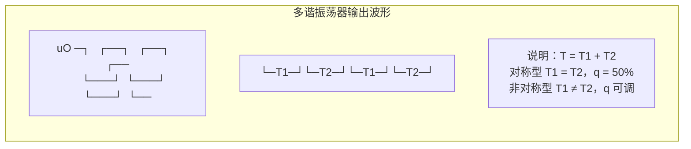

# 6.3 多谐振荡器

> [!abstract] 本节概述
> 数字系统要运转，必须有**时钟信号**——一个连续不断的矩形波。多谐振荡器（Astable Multivibrator）是一种**没有稳态**的自激振荡电路：它只有两个暂稳态，两者交替切换，从而自动产生周期性矩形波，无需外加触发。本节解决的核心问题是——**如何用门电路 + RC（或石英晶体）构成自激振荡器，并计算振荡周期与占空比。**

## 一、电路特点

> [!definition] 多谐振荡器的基本特征
> 1. **无稳态**：电路没有任何稳定状态，输出始终在高低电平间反复跳变；
> 2. **两个暂稳态**：第一暂稳态停留 $T_1$ 后自动转入第二暂稳态，停留 $T_2$ 后又回到第一暂稳态，周而复始；
> 3. **自激振荡**：不需要外加触发信号，电源接通后即起振；
> 4. **周期由 RC 决定**：振荡周期 $T = T_1 + T_2$ 取决于定时元件 $R$、$C$ 和阈值电压。

> [!note] 名称由来
> 矩形波含丰富的高次谐波（基频的奇数倍），故称"多谐"。它是数字系统中最基本的**时钟源**和**脉冲源**，驱动 [[5.5 任意进制计数器设计|计数器]]、[[5.4 移位寄存器|移位寄存器]]等时序电路同步工作。

## 二、振荡周期公式

> [!theorem] 周期估算公式
> 对一阶 RC 充放电结构，暂稳态时间仍由电容电压跨阈过程决定（同 [[6.2 单稳态触发器|6.2 单稳态]]的推导）。工程上常用近似：
> - **对称型多谐振荡器**（$T_1 = T_2$）：$\boxed{T \approx 1.4\,RC}$，占空比 $q=50\%$
> - **非对称型多谐振荡器**（$T_1 \neq T_2$）：$\boxed{T \approx 2.2\,RC}$

> [!tip] 公式推导思路
> 对称型两个暂稳态各占一半，单臂时间 $t\approx0.7RC$，故 $T\approx1.4RC$；非对称型两个暂稳态的充放电路径电阻不同，每臂约 $1.1RC$，合计约 $2.2RC$。占空比可通过改变两臂电阻比例调节。

## 三、用门电路 + RC 构成多谐振荡器

### 3.1 对称型多谐振荡器

> [!note] 电路结构
> 用两级反相器（或与非门）首尾相接形成正反馈环，每级输入端经电容耦合、并接反馈电阻 $R$，两侧 $R$、$C$ 取值相同，构成对称结构。两级间电容交替充放电，维持振荡。

> [!example] 对称型周期计算
> 若 $R=10\,\text{k}\Omega$，$C=0.01\,\mu\text{F}$，则：
> $$T \approx 1.4 \times 10\times10^3 \times 0.01\times10^{-6} = 1.4\times10^{-4}\,\text{s} = 140\,\mu\text{s}$$
> 振荡频率 $f = \dfrac{1}{T} \approx \dfrac{1}{140\,\mu\text{s}} \approx 7.14\,\text{kHz}$
> 单位检验：$\text{k}\Omega\cdot\mu\text{F}=\text{ms}$，$1.4\times0.1\,\text{ms}=0.14\,\text{ms}=140\,\mu\text{s}$ ✓

### 3.2 非对称型（环形）多谐振荡器

> [!note] 电路结构
> 常用奇数级反相器首尾环接形成环形振荡器，再在某一节点引入 RC 延时网络调节频率。由于两臂充放电电阻不同，输出占空比一般不等于 50%。

> [!example] 非对称型周期计算
> 若 $R=10\,\text{k}\Omega$，$C=0.1\,\mu\text{F}$，则：
> $$T \approx 2.2 \times 10\times10^3 \times 0.1\times10^{-6} = 2.2\times10^{-3}\,\text{s} = 2.2\,\text{ms}$$
> $$f \approx \frac{1}{2.2\,\text{ms}} \approx 455\,\text{Hz}$$

> [!warning] RC 振荡器的频率稳定性较差
> 由于阈值电压、电容、电阻都随温度和电源电压变化，RC 多谐振荡器的频率精度一般在 5%~20%，**不能**用做对频率稳定性要求高的场合（如时钟、通信）。需要高稳定度时应采用石英晶体振荡器。

## 四、石英晶体多谐振荡器

> [!definition] 石英晶体振荡器
> 在多谐振荡器的反馈环路中串入**石英晶体**，利用晶体极其尖锐的串联/并联谐振特性，把振荡频率"锁定"在晶体的标称频率上，频率稳定度可达 $10^{-6}\sim10^{-10}$ 量级。

> [!note] 典型结构
> 用两级反相器（或与非门）构成振荡环路，石英晶体串接在两级之间，并联一个小电容微调频率。振荡频率由晶体决定，几乎与 RC、电源、温度无关。

> [!example] 常见石英晶体频率
> - 单片机时钟：$12\,\text{MHz}$、$11.0592\,\text{MHz}$（便于串口分频得到标准波特率）、$16\,\text{MHz}$；
> - 实时时钟：$32.768\,\text{kHz}$（$=2^{15}$，分频 15 次得 $1\,\text{Hz}$）；
> - 通信系统：$10\,\text{MHz}$、$20\,\text{MHz}$ 等基准频率。

> [!tip] 选用原则
> - 频率稳定性要求高（时钟、通信、计时）→ 石英晶体振荡器；
> - 频率精度要求不高、成本敏感（指示灯闪烁、蜂鸣器驱动）→ RC 多谐振荡器；
> - 需要可调频率 → RC 振荡器（调电阻或电容），或压控晶振（VCXO）。

## 五、振荡波形

> [!note] 波形要点
> - 输出在两个暂稳态间自动切换，无需触发；
> - 上升沿/下降沿的陡度由门电路特性决定；
> - 对称型两段相等，非对称型不等，占空比 $q = \dfrac{T_1}{T_1+T_2}$。

## 六、典型应用

> [!example] 时钟源
> 为 [[5.3 同步计数器与异步计数器|计数器]]、[[5.4 移位寄存器|移位寄存器]]、CPU 等时序电路提供时钟信号。高精度场合用石英晶体振荡器。

> [!example] 脉冲信号源
> 产生测试用矩形波、扫描信号、报警音等。可通过调节 RC 改变频率。

> [!example] 频率/时间基准
> 配合 [[5.3 同步计数器与异步计数器|计数器]]分频，可由高稳定晶振得到 $1\,\text{Hz}$ 秒信号，用于数字钟、频率计。

## 七、易错点

> [!warning] 易错点
> 1. **系数 1.4 与 2.2 不要混淆**：对称型 $1.4RC$（占空比 50%），非对称型 $2.2RC$（占空比可调）；
> 2. **多谐振荡器无稳态**：不要误认为它有稳态，它只有两个暂稳态交替；
> 3. **频率稳定度差异**：RC 振荡器精度差（5%~20%），石英晶体精度高（$10^{-6}$ 以上），按场合选用；
> 4. **占空比公式**：$q = \dfrac{T_1}{T_1+T_2}$，对称型 $q=50\%$；
> 5. **奇数级反相器才能环振**：偶数级反相器首尾相接会锁死在某个电平，不能起振；
> 6. **频率与周期互为倒数**：$f = 1/T$，注意单位（$\text{Hz}$ 与 $\text{s}$）。

## 八、与其他小节的联系

- 多谐振荡器是"无稳态"结构，与 [[6.1 施密特触发器|6.1 施密特]]（双稳态）、[[6.2 单稳态触发器|6.2 单稳态]]（单稳态）形成完整对比；
- 用 [[6.4 555 定时器原理与应用|555 定时器]]外加 RC 可方便构成多谐振荡器，$T=0.693(R_1+2R_2)C$；
- 振荡器输出是 [[5.3 同步计数器与异步计数器|计数器]]的时钟输入，分频后可得更低频率信号；
- 石英晶体振荡器的频率稳定性是数字系统可靠同步的物理基础。

## 章节导航

- 上一级：[[MOC - 第6章]]
- 上一节：[[6.2 单稳态触发器]]
- 下一节：[[6.4 555 定时器原理与应用]]
- 习题：[[MOC - 第6章习题]]
