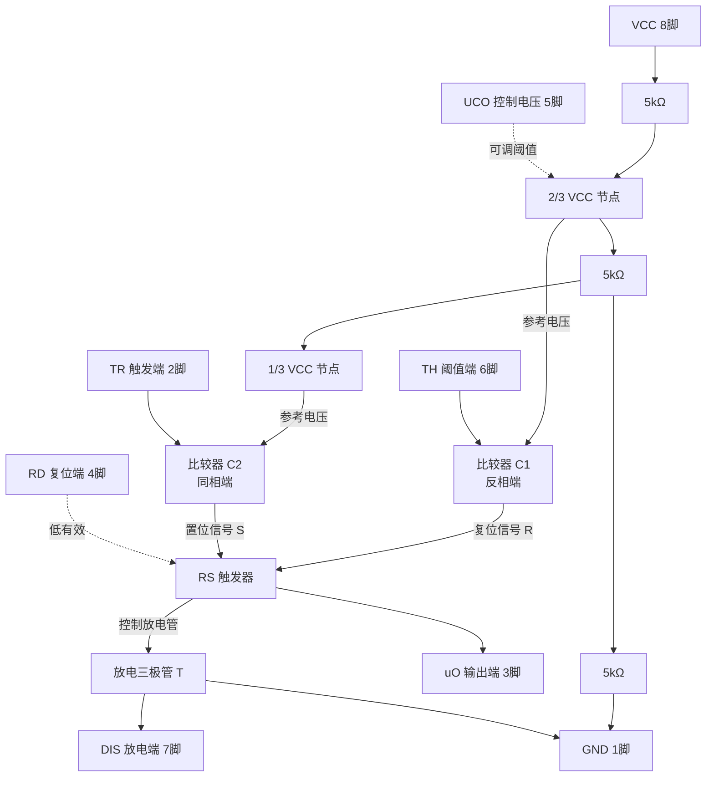
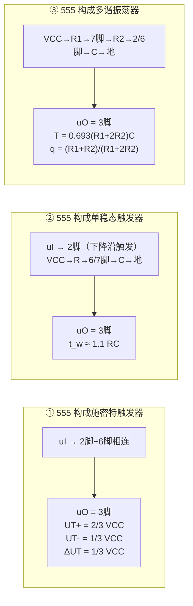

# 6.4 555 定时器原理与应用

> [!abstract] 本节概述
> 555 定时器是一种将**模拟比较器**与**数字逻辑**集成于一体的中规模集成电路（NE555 / 5G555）。它只需外接少量电阻电容，就能灵活地构成施密特触发器、单稳态触发器和多谐振荡器，几乎覆盖本章全部应用。本节解决的核心问题是——**理解 555 内部由两个比较器与 RS 触发器构成的"分压—比较—锁存"机制，并据此推导三种应用电路的阈值与时间公式。**

## 一、内部结构

> [!definition] 555 定时器的内部组成
> 555 定时器内部由四部分构成：
> 1. **三个 $5\,\text{k}\Omega$ 电阻分压链**：从 $V_{CC}$ 串联分出 $\tfrac{2}{3}V_{CC}$ 和 $\tfrac{1}{3}V_{CC}$ 两个参考电压；
> 2. **两个电压比较器** $C_1$、$C_2$：比较外部输入与参考电压，输出控制 RS 触发器；
> 3. **RS 触发器**：锁存比较结果，决定输出电平；
> 4. **放电三极管 $T$**：受 RS 触发器控制，为外接电容提供放电通路。

> [!note] 引脚定义
> | 引脚 | 符号 | 名称 | 功能 |
> | ---- | ---- | ---- | ---- |
> | 1 | GND | 地 | 电源地 |
> | 2 | $\overline{TR}$ | 触发端 | 低于 $\tfrac{1}{3}V_{CC}$ 时置位（输出高） |
> | 3 | $u_O$ | 输出端 | 输出矩形波/脉冲 |
> | 4 | $\bar R_D$ | 复位端 | 低电平强制复位（输出低） |
> | 5 | $U_{CO}$ | 控制电压 | 外加电压可调阈值，不用时经 $0.01\,\mu\text{F}$ 接地 |
> | 6 | $TH$ | 阈值端 | 高于 $\tfrac{2}{3}V_{CC}$ 时复位（输出低） |
> | 7 | $DIS$ | 放电端 | 接外接电容，放电管导通时放电 |
> | 8 | $V_{CC}$ | 电源 | $5\sim16\,\text{V}$（TTL），$3\sim18\,\text{V}$（CMOS） |

## 二、555 定时器功能表

> [!theorem] 555 定时器功能表
> | $\bar R_D$（4脚） | $TH$（6脚） | $\overline{TR}$（2脚） | $u_O$（3脚） | 放电管 $T$（7脚） | 功能 |
> | :---: | :---: | :---: | :---: | :---: | :--- |
> | 0 | × | × | 0 | 导通 | 复位 |
> | 1 | $<\tfrac{2}{3}V_{CC}$ | $<\tfrac{1}{3}V_{CC}$ | 1 | 截止 | 置位 |
> | 1 | $>\tfrac{2}{3}V_{CC}$ | $>\tfrac{1}{3}V_{CC}$ | 0 | 导通 | 复位 |
> | 1 | $<\tfrac{2}{3}V_{CC}$ | $>\tfrac{1}{3}V_{CC}$ | 保持 | 保持 | 保持 |

> [!tip] 功能记忆口诀
> - **2 脚低于 $\tfrac{1}{3}V_{CC}$ → 置位（输出高，放电管截止）**；
> - **6 脚高于 $\tfrac{2}{3}V_{CC}$ → 复位（输出低，放电管导通）**；
> - 两者都不满足 → 保持原状态；
> - 4 脚低电平 → 强制复位（优先级最高）。
>
> 注意：6 脚和 2 脚"同时有效"时（$TH>\tfrac{2}{3}V_{CC}$ 且 $\overline{TR}<\tfrac{1}{3}V_{CC}$）不会出现于正常应用，因为两者通常连在一起或经电容耦合。

## 三、555 构成施密特触发器

> [!note] 接法
> 将 **2 脚和 6 脚连在一起**作为输入 $u_I$，7 脚悬空（或经上拉电阻输出另一路信号）。输出取 3 脚。

> [!theorem] 阈值电压
> - 输入上升时，$u_I$ 超过 $\tfrac{2}{3}V_{CC}$ → 6 脚有效 → 复位，输出下跳：$U_{T+}=\tfrac{2}{3}V_{CC}$
> - 输入下降时，$u_I$ 低于 $\tfrac{1}{3}V_{CC}$ → 2 脚有效 → 置位，输出上跳：$U_{T-}=\tfrac{1}{3}V_{CC}$
> - 回差电压：
> $$\boxed{U_{T+}=\frac{2}{3}V_{CC},\quad U_{T-}=\frac{1}{3}V_{CC},\quad \Delta U_T=\frac{1}{3}V_{CC}}$$

> [!example] 555 施密特阈值计算
> 若 $V_{CC}=9\,\text{V}$，则：
> - $U_{T+}=\tfrac{2}{3}\times9=6\,\text{V}$
> - $U_{T-}=\tfrac{1}{3}\times9=3\,\text{V}$
> - $\Delta U_T=6-3=3\,\text{V}$
>
> 若在 5 脚外加控制电压 $U_{CO}$，则两个阈值分别变为 $U_{CO}$ 和 $\tfrac{1}{2}U_{CO}$，回差 $\tfrac{1}{2}U_{CO}$，可调。

## 四、555 构成单稳态触发器

> [!note] 接法
> - 2 脚接触发输入 $u_I$（下降沿触发）；
> - 6 脚与 7 脚相连，并经外接电容 $C$ 接地、经电阻 $R$ 接 $V_{CC}$；
> - 5 脚经 $0.01\,\mu\text{F}$ 滤波电容接地。

> [!theorem] 暂稳态时间
> 触发脉冲使 2 脚低于 $\tfrac{1}{3}V_{CC}$，触发器置位，放电管截止，$V_{CC}$ 经 $R$ 向 $C$ 充电。当 $u_C$ 升到 $\tfrac{2}{3}V_{CC}$ 时，6 脚有效使触发器复位，放电管导通，$C$ 经 7 脚迅速放电，暂稳态结束。充电时间：
> $$u_C: 0 \to \tfrac{2}{3}V_{CC},\quad u_C(t)=V_{CC}(1-e^{-t/RC})$$
> 解得：
> $$\boxed{t_w = RC\ln 3 \approx 1.1\,RC}$$

> [!example] 555 单稳态脉宽计算
> 若 $R=100\,\text{k}\Omega$，$C=10\,\mu\text{F}$，则：
> $$t_w \approx 1.1 \times 100\times10^3 \times 10\times10^{-6} = 1.1\,\text{s}$$
> 单位检验：$\text{k}\Omega\cdot\mu\text{F}=\text{ms}$，$1.1\times1000\,\text{ms}=1.1\,\text{s}$ ✓

> [!warning] 触发脉冲宽度要求
> 触发负脉冲的宽度必须**小于** $t_w$，否则在暂稳态结束前 2 脚仍为低，会导致输出不能按时返回。实际电路常在触发输入前加微分电路，把宽脉冲变为窄脉冲。

## 五、555 构成多谐振荡器

> [!note] 接法
> - $V_{CC}$ 经 $R_1$ 接 7 脚（放电端）；
> - 7 脚经 $R_2$ 接 6、2 脚（两者相连）；
> - 6、2 脚经电容 $C$ 接地；
> - 输出取 3 脚。

> [!theorem] 振荡周期与占空比
> 电容 $C$ 在 $\tfrac{1}{3}V_{CC}$ 与 $\tfrac{2}{3}V_{CC}$ 之间反复充放电：
> - **充电**（$u_C: \tfrac{1}{3}V_{CC}\to\tfrac{2}{3}V_{CC}$）：路径 $V_{CC}\to R_1\to R_2\to C$，时间常数 $(R_1+R_2)C$，时间：
>   $$T_1 = (R_1+R_2)C\ln 2 \approx 0.693(R_1+R_2)C$$
> - **放电**（$u_C: \tfrac{2}{3}V_{CC}\to\tfrac{1}{3}V_{CC}$）：路径 $C\to R_2\to$ 放电管 $\to$ 地，时间常数 $R_2C$，时间：
>   $$T_2 = R_2 C\ln 2 \approx 0.693\,R_2 C$$
> - 振荡周期：
>   $$\boxed{T = T_1 + T_2 = 0.693\,(R_1+2R_2)\,C}$$
> - 占空比（高电平时间占比）：
>   $$\boxed{q = \frac{T_1}{T_1+T_2} = \frac{R_1+R_2}{R_1+2R_2}}$$

> [!tip] 占空比分析
> 由于 $T_1 > T_2$（充电路径多一个 $R_1$），占空比 $q$ **恒大于 50%**。当 $R_2 \gg R_1$ 时 $q\to50\%$；$R_1\gg R_2$ 时 $q\to100\%$。若要 $q$ 可小于 50%，需加二极管引导充放电路径（占空比可调电路）。

> [!example] 555 多谐振荡器计算
> 若 $R_1=R_2=10\,\text{k}\Omega$，$C=0.1\,\mu\text{F}$，则：
> - $T = 0.693\times(10+2\times10)\times10^3\times0.1\times10^{-6} = 0.693\times3\times10^{-3} = 2.079\,\text{ms}$
> - $f = 1/T \approx 480\,\text{Hz}$
> - $q = \dfrac{10+10}{10+20}=\dfrac{20}{30}\approx66.7\%$
>
> 单位检验：$\text{k}\Omega\cdot\mu\text{F}=\text{ms}$，$0.693\times30\times0.1\,\text{ms}=2.079\,\text{ms}$ ✓

## 六、三种应用电路图

## 七、典型应用举例

> [!example] 555 多谐振荡器驱动 LED 闪烁
> 取 $R_1=470\,\text{k}\Omega$、$R_2=470\,\text{k}\Omega$、$C=10\,\mu\text{F}$：
> - $T=0.693\times(470+2\times470)\times10^3\times10\times10^{-6}\approx0.693\times14.1\approx9.77\,\text{s}$
> - 频率 $f\approx0.1\,\text{Hz}$，LED 约 10 秒闪烁一次（实际可调更小 RC 得到 1 Hz 闪烁）。

> [!example] 555 单稳态延时开关
> 取 $R=1\,\text{M}\Omega$、$C=100\,\mu\text{F}$：
> $$t_w\approx1.1\times10^6\times100\times10^{-6}=110\,\text{s}$$
> 可实现按压后继电器吸合约 110 秒自动断电的延时开关。

> [!example] 警笛音发生器
> 用两片 555：第一片作低频多谐振荡器（$1\sim5\,\text{Hz}$），其输出接到第二片的 5 脚（控制电压端），使第二片的振荡频率被低频调制，产生"呜—哇"警笛效果。

## 八、易错点

> [!warning] 易错点
> 1. **阈值要记牢**：置位阈值 $\tfrac{1}{3}V_{CC}$（2 脚）、复位阈值 $\tfrac{2}{3}V_{CC}$（6 脚），不要记反；
> 2. **三个公式系数不同**：施密特无时间公式（仅阈值）、单稳态 $1.1RC$、多谐 $0.693(R_1+2R_2)C$；
> 3. **占空比恒大于 50%**：基本型 555 多谐振荡器 $q>50\%$，要 $q<50\%$ 需加二极管；
> 4. **5 脚不用时必须接 $0.01\,\mu\text{F}$ 滤波电容**，否则参考电压易受干扰，频率不稳；
> 5. **单稳态触发脉宽必须小于 $t_w$**，否则不能正常返回；
> 6. **$\ln 2\approx0.693$、$\ln 3\approx1.1$** 是两个常用近似，记住可加速计算；
> 7. **放电管只接 $R_2$**：多谐振荡器放电时电流只经 $R_2$，$R_1$ 不参与放电，这是 $T_2$ 只含 $R_2$ 的原因。

## 九、与其他小节的联系

- 555 是本章的"集大成者"，可分别实现 [[6.1 施密特触发器|6.1 施密特]]、[[6.2 单稳态触发器|6.2 单稳态]]、[[6.3 多谐振荡器|6.3 多谐]]三种电路；
- 555 内部的 RS 触发器与 [[4.1 基本RS触发器|基本 RS 触发器]]原理一致，是 [[5.1 同步触发器与边沿触发器|触发器]]知识的应用；
- 555 多谐振荡器常作为 [[5.3 同步计数器与异步计数器|计数器]]的时钟源，555 单稳态用作定时使能；
- 比较器原理见模拟电子技术课程，是连接模拟与数字的桥梁。

## 章节导航

- 上一级：[[MOC - 第6章]]
- 上一节：[[6.3 多谐振荡器]]
- 习题：[[MOC - 第6章习题]]
