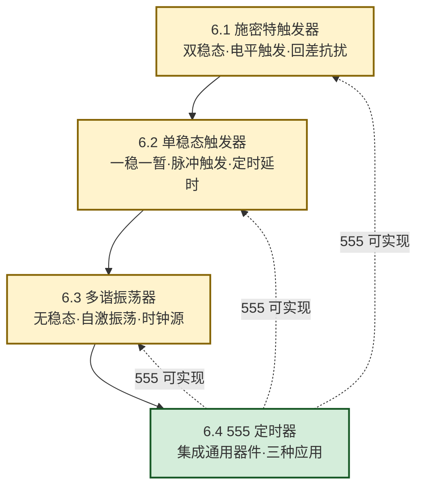

# MOC - 第6章 脉冲信号产生与整形电路

> [!info] 本章定位
> 脉冲信号产生与整形电路是数字系统的**时钟与信号源章**。本章要回答的核心问题是：**数字系统从哪里获得时钟和触发信号？如何把畸变、缓慢或带噪的信号还原为干净的标准矩形波？如何用统一器件产生定时、延时和振荡？** 这些能力是 [[MOC - 第5章|第5章 时序逻辑电路]]可靠同步的前提——没有稳定的时钟，[[5.3 同步计数器与异步计数器|计数器]]与 [[5.4 移位寄存器|移位寄存器]]就无法正确工作。
>
> 本章在 [[MOC - 第2章|第2章 逻辑门电路]]（门电路构成整形电路）和 [[MOC - 第5章|第5章 时序逻辑电路]]（计数器分频产生时钟）之后展开，引入 RC 定时与 555 集成电路，把"逻辑功能"扩展到"时间控制"。

## 学习路线图

> [!tip] 学习顺序建议
> 先掌握三种基本电路（施密特→单稳态→多谐），理解"稳态/暂稳态"概念和 RC 定时原理；最后学习 555 定时器，它把三种电路统一到同一器件上，是本章综合应用的核心。

## 知识点导航

| 小节 | 标题 | 核心内容 | 关键公式/方法 |
| ---- | ---- | -------- | ------------- |
| [[6.1 施密特触发器\|6.1]] | 施密特触发器 | 双稳态、电平触发、回差电压、电压传输特性、波形变换/整形/鉴幅 | $\Delta U_T = U_{T+}-U_{T-}$；CMOS 型 $U_{T+}=(1+\tfrac{R_1}{R_2})U_{TH}$ |
| [[6.2 单稳态触发器\|6.2]] | 单稳态触发器 | 一稳一暂、微分型/积分型、74LS121、定时/延时/整形 | 微分型 $t_w\approx0.7RC$；积分型 $t_w\approx1.1RC$ |
| [[6.3 多谐振荡器\|6.3]] | 多谐振荡器 | 无稳态、自激振荡、对称型/非对称型、石英晶体 | 对称型 $T\approx1.4RC$；非对称型 $T\approx2.2RC$ |
| [[6.4 555 定时器原理与应用\|6.4]] | 555 定时器 | 内部结构、功能表、三种应用电路 | 施密特 $\Delta U_T=\tfrac{1}{3}V_{CC}$；单稳态 $t_w\approx1.1RC$；多谐 $T=0.693(R_1+2R_2)C$，$q=\tfrac{R_1+R_2}{R_1+2R_2}$ |

## 三种电路对比

> [!summary] 稳态/暂稳态对比表
> | 电路 | 稳态数 | 暂稳态数 | 触发方式 | 输出特征 | 典型用途 |
> | ---- | :---: | :---: | -------- | -------- | -------- |
> | 施密特触发器 | 2 | 0 | 电平触发 | 双值滞回整形 | 波形变换、整形、鉴幅 |
> | 单稳态触发器 | 1 | 1 | 脉冲触发 | 固定宽度脉冲 | 定时、延时、整形 |
> | 多谐振荡器 | 0 | 2 | 自激（无需触发） | 周期矩形波 | 时钟源、脉冲源 |

## 核心考点

> [!summary] 本章核心考点（7 点）
> 1. **施密特触发器回差电压**：$\Delta U_T = U_{T+}-U_{T-}$，上升沿在 $U_{T+}$ 翻转、下降沿在 $U_{T-}$ 翻转，回差越大抗扰越强但灵敏度越低；
> 2. **单稳态暂稳态时间**：微分型 $t_w\approx0.7RC$、积分型 $t_w\approx1.1RC$，与触发脉宽无关，由 RC 决定；
> 3. **多谐振荡周期**：对称型 $T\approx1.4RC$（$q=50\%$）、非对称型 $T\approx2.2RC$（$q$ 可调）；
> 4. **555 内部结构与功能表**：两比较器 + RS 触发器 + 放电管；2 脚低于 $\tfrac{1}{3}V_{CC}$ 置位、6 脚高于 $\tfrac{2}{3}V_{CC}$ 复位；
> 5. **555 施密特阈值**：$U_{T+}=\tfrac{2}{3}V_{CC}$、$U_{T-}=\tfrac{1}{3}V_{CC}$、$\Delta U_T=\tfrac{1}{3}V_{CC}$，5 脚加控制电压可调；
> 6. **555 单稳态与多谐公式**：单稳态 $t_w\approx1.1RC$；多谐 $T=0.693(R_1+2R_2)C$、$q=\tfrac{R_1+R_2}{R_1+2R_2}$；
> 7. **占空比分析**：基本 555 多谐振荡器 $q>50\%$，要 $q<50\%$ 需加二极管引导充放电路径；石英晶体振荡器频率稳定度最高。

> [!warning] 高频易错点
> - 三个 RC 时间系数（0.7、1.1、1.4、2.2、0.693）易混淆，必须与电路类型一一对应；
> - 555 阈值 $\tfrac{1}{3}$ 与 $\tfrac{2}{3}$ 不可记反（2 脚低置位、6 脚高复位）；
> - 单稳态触发脉宽必须小于 $t_w$；多谐振荡器放电只经 $R_2$ 不经 $R_1$；
> - 5 脚不用时必须接 $0.01\,\mu\text{F}$ 滤波电容。

## 章节导航

> [!nav] 导航
> 上级：[[MOC - 数字逻辑电路|课程总览]]
> 上一章：[[MOC - 第5章|第5章 时序逻辑电路]]
> 下一章：[[MOC - 第7章|第7章 半导体存储器]]
> 配套习题：[[MOC - 第6章习题|第6章 习题]]
