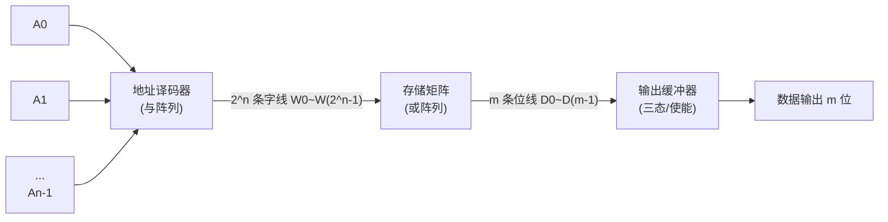
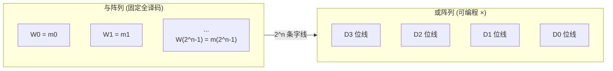

# 7.1 ROM 只读存储器原理

> [!abstract] 本节概述
> 数字系统在运行时需要持久保存程序代码、常数表、字形库等不经常更改的数据，断电后也不能丢失。**只读存储器（Read Only Memory, ROM）** 就是为这一需求设计的**非易失性存储器**：它在正常工作时只读不写，数据一旦写入即可长期保留。本节解决的核心问题是——**ROM 如何用"与阵列 + 或阵列"两级结构实现"地址 → 数据"的查表映射？不同工艺的 ROM 在可编程性上有何差别？容量如何计算？**

## 一、ROM 的基本结构

> [!definition] ROM 的组成
> ROM 由三部分构成：**地址译码器（与阵列）**、**存储矩阵（或阵列）**、**输出缓冲器**。地址译码器把 $n$ 位地址码译为 $2^n$ 条字线；存储矩阵把字线与位线的交叉点按存储内容连接，实现"或"运算；输出缓冲器提高驱动能力并控制输出三态。

### 1.1 三级结构对应两级阵列

ROM 的核心是**与阵列 + 或阵列**两级可编程结构，这使其天然适合实现查表型逻辑（见 [[7.4 ROM 实现组合逻辑函数|7.4]]）。

> [!note] 与阵列和或阵列的物理含义
> - **与阵列（地址译码器）**：固定连接，对 $n$ 位地址产生全部 $2^n$ 个最小项（字线），每条字线对应一个地址；
> - **或阵列（存储矩阵）**：可编程连接，决定每个地址下哪些位线输出 1，即存储内容；
> - 一条字线被选中时，与其相连的位线为 1，未连的位线为 0，从而读出该地址存放的一个字。

### 1.2 输出缓冲器

> [!info] 输出缓冲器的作用
> 1. 提高带载能力，驱动外部总线；
> 2. 加入**三态输出控制（$\overline{OE}$）**和**片选（$\overline{CS}$）**，便于总线挂接与容量扩展（见 [[7.3 存储器容量扩展|7.3]]）；
> 3. 必要时加入锁存器实现同步输出。

## 二、ROM 的读出原理

> [!theorem] ROM 读出过程
> 给定 $n$ 位地址码 $A_{n-1}\cdots A_1A_0$：
> 1. 地址译码器（与阵列）译出对应字线 $W_k=1$（$k=\sum A_i 2^i$），其余字线为 0；
> 2. 存储矩阵（或阵列）中与 $W_k$ 相连的位线被拉到有效电平，组成该地址存储的字；
> 3. 输出缓冲器在 $\overline{CS}=0$、$\overline{OE}=0$ 时把位线数据送到 $D_{m-1}\cdots D_0$ 输出。

> [!example] 4 字 × 4 位 ROM 读出
> 设 2 位地址 $A_1A_0$、4 位输出 $D_3D_2D_1D_0$，存储内容如下：
>
> | 地址 $A_1A_0$ | 字线 | $D_3$ | $D_2$ | $D_1$ | $D_0$ |
> | :-: | :-: | :-: | :-: | :-: | :-: |
> | 00 | $W_0$ | 1 | 0 | 1 | 1 |
> | 01 | $W_1$ | 0 | 1 | 1 | 0 |
> | 10 | $W_2$ | 1 | 1 | 0 | 1 |
> | 11 | $W_3$ | 0 | 0 | 1 | 1 |
>
> 当 $A_1A_0=10$ 时，仅 $W_2=1$，与 $W_2$ 相连的位线 $D_3,D_2,D_0$ 输出 1，读出字 `1101`。

## 三、ROM 的容量计算

> [!definition] ROM 容量
> 设地址位数为 $n$、数据位数为 $m$，则 ROM 容量为：
> $$\boxed{\text{容量} = 2^n \times m\;\text{bit}}$$
> 即"字数 × 字长"。字数 $=2^n$ 由地址位数决定，字长 $=m$ 由数据位数决定。

> [!example] 容量换算
> - 8 位地址、8 位数据：$2^8\times8=256\times8=2048\,\text{bit}=2\,\text{Kbit}$；按字节计 $256\,\text{B}$；
> - 10 位地址、8 位数据：$2^{10}\times8=1024\times8=8192\,\text{bit}=8\,\text{Kbit}=1\,\text{KB}$；
> - 12 位地址、8 位数据：$2^{12}\times8=32768\,\text{bit}=32\,\text{Kbit}=4\,\text{KB}$。

> [!tip] 容量单位的两个习惯
> - **位（bit）**：存储器芯片容量常用"$\text{Kbit}$"表示，如 $256\times4=1\,\text{Kbit}$；
> - **字节（Byte，$1\,\text{B}=8\,\text{bit}$）**：计算机主存容量常用字节，如 $1\,\text{KB}=1024\,\text{B}=8192\,\text{bit}$。
>
> 题目中应先看清单位再换算，避免 $\text{bit}$ 与 $\text{Byte}$ 混淆（差 8 倍）。

## 四、ROM 的分类

按写入/擦除方式，ROM 由低到高可编程性分为以下几类：

| 类型 | 写入方式 | 擦除方式 | 擦写次数 | 典型用途 |
| ---- | -------- | -------- | -------- | -------- |
| **固定 ROM（掩模 ROM）** | 厂家掩模工艺 | 不可擦除 | 0 | 大批量固化程序、字库 |
| **PROM** | 用户一次性熔丝烧写 | 不可擦除 | 1 次 | 小批量定型代码 |
| **EPROM** | 电写入（高压） | 紫外线照射约 20 min | 数十次 | 调试期代码 |
| **EEPROM** | 电写入电擦除 | 电信号、按字节擦 | $\sim10^5$ 次 | 参数、配置 |
| **Flash** | 电写入 | 电信号、按块擦 | $10^5\sim10^6$ 次 | U 盘、SSD、嵌入式 |

> [!info] 各类 ROM 要点
> - **掩模 ROM**：内容由掩模版决定，出厂已固化，适合大批量、低成本；
> - **PROM**（Programmable ROM）：熔丝/结破坏型，用户可一次性写入，写错即作废；
> - **EPROM**（Erasable PROM）：浮栅雪崩注入 MOS 管（FAMOS），写入靠高压，擦除靠紫外线透过石英窗口复位浮栅；
> - **EEPROM**（Electrically EPROM）：浮栅隧道氧化层（FLOTOX）结构，电可擦且**按字节**擦写，不需紫外光；
> - **Flash**：类似 EEPROM 但**按块擦除**，集成度高、速度快、成本低，是当前主流非易失存储。

> [!note] EPROM 与 EEPROM 的物理差别
> EPROM 擦除需取下芯片用紫外光照射，且为**整片擦除**；EEPROM 在线电擦除、可按字节操作，使用更方便但单元面积更大、成本更高。Flash 折中了 EPROM 的密度与 EEPROM 的电擦除能力。

## 五、ROM 的阵列图表示

> [!definition] ROM 阵列图
> ROM 阵列图用两组正交线分别表示与阵列和或阵列：与阵列的交叉点表示该输入参与该最小项；或阵列的交叉点表示该位线在该字线选中时输出 1。交叉点通常用"·"或"×"标记。

> [!tip] 阵列图阅读法
> - 与阵列固定全译码，产生 $2^n$ 条字线（全部最小项）；
> - 或阵列每个交叉点"×"代表该字线选中时该位线输出 1；
> - 一列上的所有"×"即该输出位的逻辑表达式（最小项之和）。

## 六、易错点

> [!warning] 易错点
> 1. **字线数 = $2^n$，不是 $n$**：$n$ 位地址译码出 $2^n$ 条字线；
> 2. **容量单位混淆**：$\text{bit}$ 与 $\text{Byte}$ 差 8 倍，"$256\times4$"是 $1\,\text{Kbit}$ 不是 $1\,\text{KB}$；
> 3. **ROM 不是只能读**：PROM/EPROM/EEPROM/Flash 都可写入，只是写入条件/次数受限；"只读"指**正常工作时只读**；
> 4. **EPROM 与 EEPROM 擦除方式混淆**：EPROM 紫外、整片；EEPROM 电信号、按字节；
> 5. **与阵列固定、或阵列可编程**：标准 ROM 与阵列全译码固定，只有或阵列可编程（这是与 PLA/PAL 的区别，见 [[MOC - 第8章|第8章]]）。

## 七、与其他小节的联系

- ROM 的地址译码器即 [[3.3 编码器、译码器原理|3.3]] 中的二进制译码器，产生全部最小项；
- ROM 是 [[7.4 ROM 实现组合逻辑函数|7.4]] 用阵列实现组合逻辑的硬件基础；
- ROM 的片选/三态输出为 [[7.3 存储器容量扩展|7.3]] 的多片扩展提供条件；
- ROM 属非易失存储，与 [[7.2 RAM 随机存储器|7.2]] 的易失性 RAM 形成对照；
- ROM 的与/或阵列可编程思想延伸到 [[MOC - 第8章|第8章]] PLA/PAL/GAL/FPGA。

## 章节导航

- 上一级：[[MOC - 第7章]]
- 下一节：[[7.2 RAM 随机存储器]]
- 习题：[[MOC - 第7章习题]]
