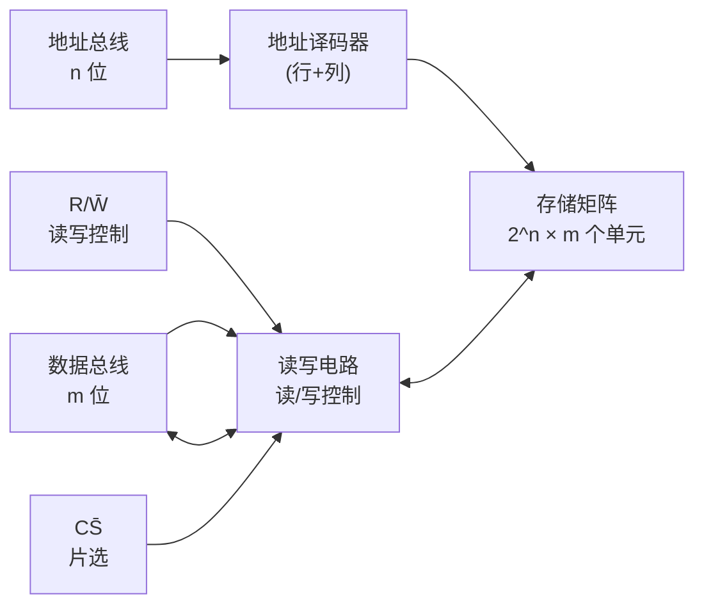
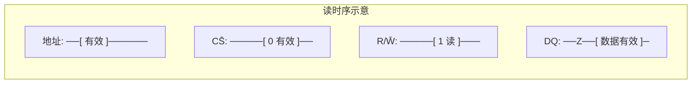

# 7.2 RAM 随机存储器

> [!abstract] 本节概述
> 计算机在运行过程中需要快速、反复地读写工作数据（变量、堆栈、缓存），且要求任一存储单元的访问时间相同。**随机存取存储器（Random Access Memory, RAM）** 即为这一需求设计：它可随时在任意地址读写，但断电后数据丢失（易失性）。本节解决的核心问题是——**RAM 如何实现随机读写？SRAM 与 DRAM 在存储单元、速度、集成度、刷新要求上有何本质差别？如何根据应用场景选择？**

## 一、RAM 的基本结构

> [!definition] RAM 的组成
> RAM 由三部分构成：**地址译码器**、**存储矩阵**、**读写电路**。地址译码器选中指定单元；存储矩阵存放数据；读写电路在读写控制信号作用下完成数据读出或写入。

> [!note] 行列双重译码
> 大容量 RAM 常把地址分为**行地址**和**列地址**两部分，分别用行译码器和列译码器选中单元。好处是译码器规模由 $2^n$ 降为 $2^{n/2}+2^{n/2}$，节省芯片面积。如 $n=20$ 时单译码需 $2^{20}=1\,\text{M}$ 条字线，行列双译码只需 $2^{10}+2^{10}=2048$ 条。

## 二、SRAM 静态随机存储器

> [!definition] SRAM 存储单元
> **SRAM（Static RAM）** 用**六管 MOS 触发器**存储一位数据：两个反相器交叉耦合构成双稳态触发器，加上两个门控管控制读写选通。只要不断电，数据就稳定保持，无需刷新。

> [!info] 六管 SRAM 单元结构要点
> - $T_1,T_2$：驱动管，构成反相器；
> - $T_3,T_4$：负载管（CMOS 工艺下为 PMOS）；
> - $T_5,T_6$：门控管，由字线 WL 控制与位线 $BL/\overline{BL}$ 的通断；
> - 触发器两稳态分别表示 0 和 1。

> [!tip] SRAM 的特点
> - **速度快**：读写只需触发器翻转，存取时间 ns 级；
> - **功耗大**：触发器持续静态电流，且单元管子多；
> - **集成度低**：六管单元面积大；
> - **无需刷新**，控制简单；
> - **易失**：断电即失。

## 三、DRAM 动态随机存储器

> [!definition] DRAM 存储单元
> **DRAM（Dynamic RAM）** 用**单管 + 单电容**存储一位数据：电容 $C_S$ 上有无电荷表示 1/0，MOS 管作门控。因电容电荷会泄漏，必须**周期性刷新**。

> [!info] 单管 DRAM 单元结构
> - 一个 MOS 管 $T$ + 一个存储电容 $C_S$；
> - 字线 WL 控制通断，位线 BL 读写；
> - 写入：位线加高/低电平对 $C_S$ 充/放电；
> - 读出：$C_S$ 上电荷向位线分布，灵敏放大器检测电平，读后需回写（破坏性读出）。

> [!warning] 为什么要刷新
> MOS 电容存在漏电流，$C_S$ 上的电荷会随时间流失（保持时间约 ms 级）。若不定期刷新，数据会丢失。刷新即**读出每个单元并重新写入**，由芯片内部按行进行，对用户透明。

> [!theorem] 刷新方式
> DRAM 刷新按行进行，每次刷新一行。常见方式：
> - **集中刷新**：在一段固定时间内集中刷新所有行，期间停止读写（产生"死区"）；
> - **分散刷新**：每个存取周期内分出一部分时间刷新一行，无死区但存取周期变长；
> - **异步刷新**：每隔一定时间刷新一行，分散死时间，是工程主流。

> [!example] 刷新间隔估算
> 设 DRAM 保持时间 $t_{ret}=2\,\text{ms}$，共 128 行。则每行刷新间隔不超过 $2\,\text{ms}/128\approx15.6\,\mu\text{s}$，即每隔 $15.6\,\mu\text{s}$ 刷新一行。若每行刷新耗时 $100\,\text{ns}$，刷新占用时间比约 $100\,\text{ns}/15.6\,\mu\text{s}\approx0.64\%$。

## 四、SRAM 与 DRAM 对比

| 对比项 | SRAM（静态） | DRAM（动态） |
| ------ | ----------- | ----------- |
| 存储单元 | 六管触发器 | 单管 + 单电容 |
| 是否需刷新 | 否 | 是（ms 级周期） |
| 集成度 | 低 | 高（单元小） |
| 存取速度 | 快（ns 级） | 较慢（10 ns 级） |
| 功耗 | 静态功耗大 | 静态功耗小、有刷新功耗 |
| 成本 | 高 | 低 |
| 易失性 | 易失 | 易失 |
| 读出方式 | 非破坏性 | 破坏性（需回写） |
| 典型应用 | CPU 高速缓存（L1/L2/L3）、FPGA 内部存储 | 计算机主存（DDR）、显存 |

> [!tip] 选型原则
> - **速度优先、容量小**：选 SRAM（如 CPU 缓存）；
> - **容量优先、成本低**：选 DRAM（如主存）；
> - 实际系统中两者常配合使用，形成存储层次。

## 五、RAM 的读写时序

### 5.1 读时序

> [!info] 读周期关键参数
> - $t_{RC}$（读周期）：连续两次读的最小间隔；
> - $t_{AA}$（地址取数时间）：地址有效到数据输出有效；
> - $t_{CO}$（片选到输出）：$\overline{CS}$ 有效到数据有效；
> - $t_{OH}$（输出保持）：地址变化后数据保持时间。

### 5.2 写时序

> [!info] 写周期关键参数
> - $t_{WC}$（写周期）：连续两次写的最小间隔；
> - $t_{AW}$（地址建立到写）：地址有效后 $\overline{WE}$ 才能变低；
> - $t_{WP}$（写脉冲宽度）：$\overline{WE}$ 低电平最小宽度；
> - $t_{DW}$（数据建立）：数据有效到 $\overline{WE}$ 上升沿；
> - $t_{DH}$（数据保持）：$\overline{WE}$ 上升后数据保持。

> [!warning] 写时序约束
> 地址必须先于 $\overline{WE}$ 有效，否则可能误写其他单元；$\overline{WE}$ 上升沿触发写入，数据需满足建立/保持时间。这是 [[5.1 时序电路分析步骤|时序约束]]思想在存储器中的体现。

## 六、易错点

> [!warning] 易错点
> 1. **SRAM 不刷新、DRAM 必须刷新**——这是最常考的区别点；
> 2. **DRAM 读出是破坏性的**，读后必须回写；SRAM 非破坏性读出；
> 3. **"随机存取"指任一地址访问时间相同**，不等于"随时读写"（ROM 也是随机存取但只读）；
> 4. **行列双译码节省字线数**：$2^{n}$ → $2\times2^{n/2}$，不要误算；
> 5. **SRAM 集成度低、DRAM 集成度高**，因单元管子数 6 vs 1；
> 6. **RAM 易失**：断电丢失，与 [[7.1 ROM 只读存储器原理|ROM]] 非易失对比；
> 7. **写时序地址必须先有效**，防止误写。

## 七、与其他小节的联系

- RAM 的存储单元 SRAM 用触发器，原理见 [[4.1 基本 RS 触发器|4.1 触发器]]；
- RAM 的读写时序遵循 [[5.1 时序电路分析步骤|时序电路]]的建立/保持时间约束；
- RAM 与 [[7.1 ROM 只读存储器原理|7.1 ROM]] 同为半导体存储器，但 RAM 易失、可读写；
- RAM 芯片的片选/总线接口为 [[7.3 存储器容量扩展|7.3 容量扩展]]提供基础；
- 行列译码与 [[3.3 编码器、译码器原理|3.3 译码器]]原理一致。

## 章节导航

- 上一级：[[MOC - 第7章]]
- 上一节：[[7.1 ROM 只读存储器原理]]
- 下一节：[[7.3 存储器容量扩展]]
- 习题：[[MOC - 第7章习题]]
