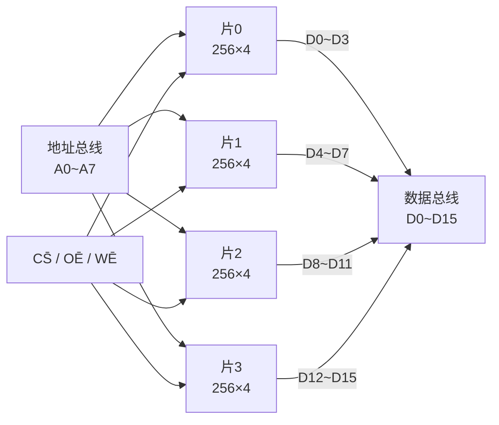
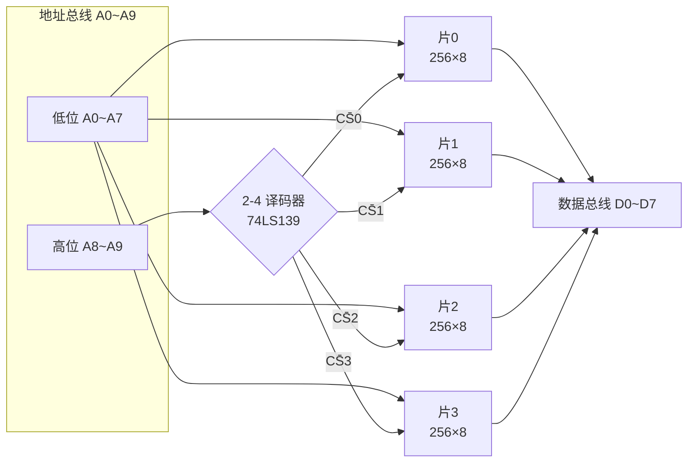
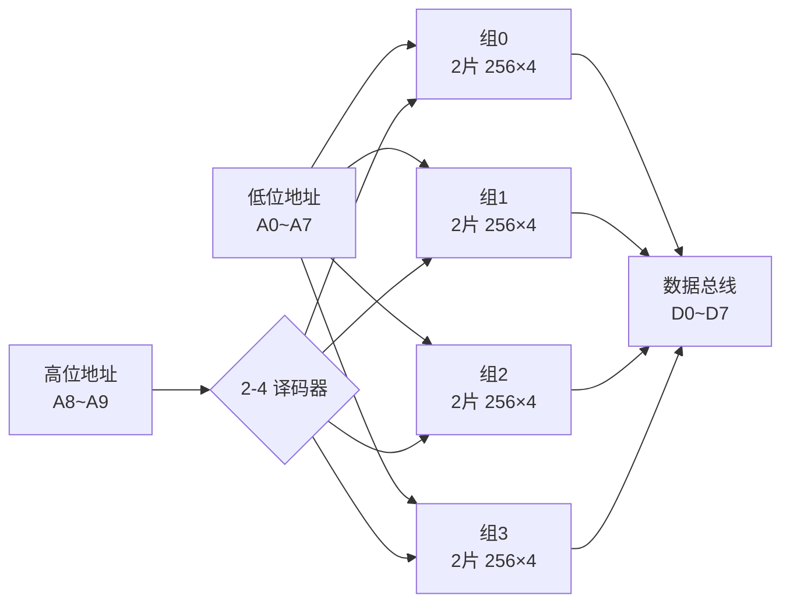

# 7.3 存储器容量扩展

> [!abstract] 本节概述
> 单片存储器芯片的字数和字长往往不能满足系统需求（如单片 $256\times4$，系统需 $1\,\text{K}\times8$）。**存储器容量扩展**通过把多片小容量芯片按一定规则连接，组合成更大容量的存储体。本节解决的核心问题是——**当目标容量大于单片容量时，应做"位扩展"、"字扩展"还是"字位同时扩展"？各芯片的地址线、数据线、片选线应如何连接？**

## 一、扩展前的容量分析

> [!theorem] 扩展判据
> 设单片容量为 $2^{n_1}\times m_1$（地址 $n_1$ 位、数据 $m_1$ 位），目标容量为 $2^{n_2}\times m_2$：
> - 若 $m_2>m_1$ 且 $n_2=n_1$：仅做**位扩展**，片数 $=\dfrac{m_2}{m_1}$；
> - 若 $n_2>n_1$ 且 $m_2=m_1$：仅做**字扩展**，片数 $=\dfrac{2^{n_2}}{2^{n_1}}=2^{n_2-n_1}$；
> - 若 $m_2>m_1$ 且 $n_2>n_1$：做**字位同时扩展**，片数 $=\dfrac{2^{n_2}\cdot m_2}{2^{n_1}\cdot m_1}$。

> [!tip] 总片数公式
> $$\boxed{\text{总片数}=\frac{\text{目标容量}}{\text{单片容量}}=\frac{2^{n_2}\times m_2}{2^{n_1}\times m_1}}$$
> 任何扩展方式都满足此式，可作为校验。

## 二、位扩展（增加数据位数）

> [!definition] 位扩展
> 当目标字长大于单片字长（$m_2>m_1$）而字数相同（$n_2=n_1$）时，把多片芯片的**地址线、片选、读写控制并联**，**数据线分别接到不同数据位**，使多片同时输出构成更宽的字。

> [!info] 位扩展连接规则
> - **地址线 $A_{n-1}\dots A_0$**：全部并联（同一地址同时选中各片对应单元）；
> - **$\overline{CS}$、$\overline{OE}$/$\overline{WE}$**：并联（各片同时工作）；
> - **数据线 $D$**：第 0 片接 $D_0\sim D_{m_1-1}$，第 1 片接 $D_{m_1}\sim D_{2m_1-1}$，依此类推。

> [!example] 位扩展例
> 用 $256\times4$ 芯片构成 $256\times16$：片数 $=16/4=4$ 片，4 片地址并联、数据分别占 4 位，构成 16 位数据宽度。

## 三、字扩展（增加存储字数）

> [!definition] 字扩展
> 当目标字数大于单片字数（$n_2>n_1$）而字长相同（$m_2=m_1$）时，把多片芯片的**低位地址、数据线并联**，**用高位地址经译码产生片选**，任一时刻只有一片工作。

> [!info] 字扩展连接规则
> - **低位地址 $A_{n_1-1}\dots A_0$**：并联到各片地址线（片内寻址）；
> - **高位地址 $A_{n_2-1}\dots A_{n_1}$**：经**片选译码器**产生 $2^{n_2-n_1}$ 个片选信号，分别接各片 $\overline{CS}$；
> - **数据线**：并联到同一数据总线（因任一时刻仅一片使能，输出三态不会冲突）；
> - **$\overline{OE}$/$\overline{WE}$**：并联。

> [!example] 字扩展地址范围
> 用 $256\times8$ 芯片 4 片构成 $1\,\text{K}\times8$：
>
> | 片号 | 高位 $A_9A_8$ | 地址范围（$A_9\dots A_0$） | 十进制 |
> | :-: | :-: | :-- | :-- |
> | 片 0 | 00 | $000\,\text{H}\sim0FF\,\text{H}$ | $0\sim255$ |
> | 片 1 | 01 | $100\,\text{H}\sim1FF\,\text{H}$ | $256\sim511$ |
> | 片 2 | 10 | $200\,\text{H}\sim2FF\,\text{H}$ | $512\sim767$ |
> | 片 3 | 11 | $300\,\text{H}\sim3FF\,\text{H}$ | $768\sim1023$ |

## 四、字位同时扩展

> [!definition] 字位同时扩展
> 当字数和字长都需扩展（$n_2>n_1$ 且 $m_2>m_1$）时，**先做位扩展成"组"，再做多组字扩展**。每组内各片地址、片选并联构成更宽字长；组间用高位地址译码选组。

> [!info] 连接步骤
> 1. 计算位扩展片数 $p=\lceil m_2/m_1\rceil$，把 $p$ 片并联为一组，得到 $2^{n_1}\times m_2$ 的组；
> 2. 计算组数 $q=2^{n_2-n_1}$，用 $n_2-n_1$ 位高位地址译码选组；
> 3. 总片数 $=p\times q$；
> 4. 同组内：地址、片选、读写控制并联，数据线分段；
> 5. 组间：低位地址、数据总线并联；高位地址经译码产生各组片选。

> [!example] 典型例题：用 $256\times4$ 构成 $1\,\text{K}\times8$
> **分析**：单片 $256\times4$（地址 $n_1=8$、字长 $m_1=4$），目标 $1\,\text{K}\times8$（$n_2=10$、$m_2=8$）。
> - 位扩展片数 $p=8/4=2$，2 片并联成一组，得到 $256\times8$；
> - 字扩展组数 $q=2^{10-8}=4$，4 组共 $4\times2=8$ 片；
> - 总片数 $=\dfrac{2^{10}\times8}{2^8\times4}=\dfrac{8192}{1024}=8$ 片 ✓。
>
> **连接**：
> - 低位地址 $A_7\dots A_0$ 并联到 8 片地址线；
> - 高位地址 $A_9A_8$ 经 2-4 译码器产生 4 个片选 $\overline{CS_0}\sim\overline{CS_3}$，分别接到 4 组；
> - 同组 2 片中：片 a 数据接 $D_0\sim D_3$，片 b 数据接 $D_4\sim D_7$；
> - $\overline{OE}$/$\overline{WE}$ 全部并联。

> [!tip] 字位扩展地址范围（接上例）
>
> | 组号 | $A_9A_8$ | 地址范围 | 数据位 |
> | :-: | :-: | :-- | :-: |
> | 组 0 | 00 | $000\,\text{H}\sim0FF\,\text{H}$ | $D_0\sim D_7$ |
> | 组 1 | 01 | $100\,\text{H}\sim1FF\,\text{H}$ | $D_0\sim D_7$ |
> | 组 2 | 10 | $200\,\text{H}\sim2FF\,\text{H}$ | $D_0\sim D_7$ |
> | 组 3 | 11 | $300\,\text{H}\sim3FF\,\text{H}$ | $D_0\sim D_7$ |

## 五、易错点

> [!warning] 易错点
> 1. **位扩展数据线并联、字扩展数据线也并联**——区别在片选：位扩展片选并联（同时工作），字扩展片选互斥（分时工作）；
> 2. **字扩展必须加片选译码器**，不能用线与直接连片选，否则多片同时驱动总线冲突；
> 3. **总片数公式** $\text{总片数}=\dfrac{\text{目标容量}}{\text{单片容量}}$ 适用于所有扩展，可作为校验；
> 4. **位扩展片内地址不变**（字数相同），字扩展才增加地址线；
> 5. **字位同时扩展先位后字**：先把片凑成所需字长为一组，再对组做字扩展；
> 6. **地址范围计算**要带上高位片选位，不要只算片内地址。

## 六、与其他小节的联系

- 字扩展的片选译码器即 [[3.3 编码器、译码器原理|3.3]] 的二进制译码器（如 74LS138/139）；
- 扩展适用于 [[7.1 ROM 只读存储器原理|ROM]] 与 [[7.2 RAM 随机存储器|RAM]] 两类芯片；
- 三态输出（[[2.4 三态门、OC 门、线与逻辑|2.4 三态门]]）是字扩展数据线并联不冲突的前提；
- 高位地址译码思想与 [[3.4 数据选择器、数据分配器|3.4 数据分配器]]一致；
- 容量扩展是 [[MOC - 第8章|第8章]] 可编程器件中存储资源组织的基础。

## 章节导航

- 上一级：[[MOC - 第7章]]
- 上一节：[[7.2 RAM 随机存储器]]
- 下一节：[[7.4 ROM 实现组合逻辑函数]]
- 习题：[[MOC - 第7章习题]]
