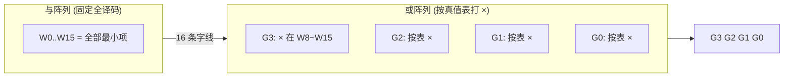

# 7.4 ROM 实现组合逻辑函数

> [!abstract] 本节概述
> [[7.1 ROM 只读存储器原理|ROM]] 的与阵列产生全部最小项、或阵列按需连接，这恰好对应"逻辑函数 = 最小项之和"的标准形式。因此 ROM 是一种**通用组合逻辑器件**：把真值表写入存储矩阵，即可实现任意多输出组合函数。本节解决的核心问题是——**如何把一个组合逻辑问题转化为 ROM 的真值表（存储内容）？ROM 实现法与译码器/数据选择器实现法有何异同？**

## 一、ROM 实现逻辑函数的原理

> [!theorem] ROM = 与阵列 + 或阵列 = 最小项求和
> 设 $n$ 个输入变量接到 ROM 的 $n$ 位地址线，则与阵列（地址译码器）固定产生全部 $2^n$ 个最小项 $m_0\sim m_{2^n-1}$（字线）；或阵列中每一根位线对应一个输出 $F_j$，其上"×"标记即该输出包含的最小项。于是：
> $$\boxed{F_j(A_{n-1}\dots A_0)=\bigvee_{i\in S_j}m_i}$$
> 其中 $S_j$ 是使 $F_j=1$ 的最小项下标集合，即真值表中 $F_j=1$ 的行。

> [!note] 与门级设计的对比
> - 门级设计需化简（卡诺图/代数法），目标是减少门数；
> - ROM 实现不需化简，直接把真值表"灌"入或阵列，规整但会"浪费"未用的最小项资源；
> - ROM 实现特别适合**多输出函数**和**输入变量多、规律复杂**的场合（如码制转换、查表）。

## 二、实现步骤

> [!info] ROM 实现组合函数的标准步骤
> 1. **列真值表**：把输入变量作为地址、输出变量作为存储内容，列出全部 $2^n$ 行；
> 2. **选 ROM 容量**：地址位数 $=$ 输入变量数 $n$，数据位数 $=$ 输出变量数 $k$，容量 $=2^n\times k$；
> 3. **填或阵列**：真值表中输出为 1 的位，在或阵列对应字线-位线交叉点打"×"；
> 4. **画阵列图**：与阵列固定全译码（打固定点），或阵列按真值表打"×"。

## 三、与译码器实现法的对比

> [!note] ROM 实现 vs 译码器实现（[[3.3 编码器、译码器原理|3.3]]）
>
> | 对比项 | ROM 实现 | 译码器（74LS138）+ 与非门实现 |
> | ------ | -------- | ----------------------------- |
> | 与阵列 | ROM 内置，固定全译码产生 $2^n$ 最小项 | 译码器输出 $\overline{m_i}$，提供最小项的反 |
> | 或运算 | 或阵列直接对最小项求和 | 外接与非门对 $\overline{m_i}$ 求与非（得 $\sum m_i$） |
> | 多输出 | 一片 ROM 可同时实现多路输出，硬件规整 | 每路输出需一个与非门，输出数受门限制 |
> | 灵活性 | 改存储内容即可改函数（可编程） | 改接门输入，硬件连线固定 |
> | 资源利用 | 与阵列固定全译码，未用最小项浪费 | 同样产生全部最小项，未用的悬空 |
> | 典型用途 | 查表、码制转换、多输出函数 | 单/少输出函数、地址译码 |

> [!tip] 何时用 ROM
> - 输入变量数 $n$ 较大（$n\ge4$）、输出路数 $k$ 较多；
> - 函数规律复杂、化简收益小（如码制转换、三角函数表）；
> - 需要后续修改函数（用 EPROM/EEPROM/Flash）。

## 四、设计例题：4 位二进制码 → 格雷码转换

> [!definition] 格雷码
> 格雷码（Gray Code）是一种**相邻两数只有一位不同**的反射二进制码，用于减少转换瞬间的多位跳变错误。4 位二进制 $B_3B_2B_1B_0$ 与格雷码 $G_3G_2G_1G_0$ 的转换关系：
> $$G_3=B_3,\quad G_2=B_3\oplus B_2,\quad G_1=B_2\oplus B_1,\quad G_0=B_1\oplus B_0$$

> [!example] 真值表与 ROM 实现
> 把 $B_3B_2B_1B_0$ 接 ROM 地址 $A_3A_2A_1A_0$，$G_3G_2G_1G_0$ 接数据 $D_3D_2D_1D_0$，列出真值表：

| 十进制 | $B_3B_2B_1B_0$ | $G_3$ | $G_2$ | $G_1$ | $G_0$ |
| :-: | :--: | :-: | :-: | :-: | :-: |
| 0 | 0000 | 0 | 0 | 0 | 0 |
| 1 | 0001 | 0 | 0 | 0 | 1 |
| 2 | 0010 | 0 | 0 | 1 | 1 |
| 3 | 0011 | 0 | 0 | 1 | 0 |
| 4 | 0100 | 0 | 1 | 1 | 0 |
| 5 | 0101 | 0 | 1 | 1 | 1 |
| 6 | 0110 | 0 | 1 | 0 | 1 |
| 7 | 0111 | 0 | 1 | 0 | 0 |
| 8 | 1000 | 1 | 1 | 0 | 0 |
| 9 | 1001 | 1 | 1 | 0 | 1 |
| 10 | 1010 | 1 | 1 | 1 | 1 |
| 11 | 1011 | 1 | 1 | 1 | 0 |
| 12 | 1100 | 1 | 0 | 1 | 0 |
| 13 | 1101 | 1 | 0 | 1 | 1 |
| 14 | 1110 | 1 | 0 | 0 | 1 |
| 15 | 1111 | 1 | 0 | 0 | 0 |

> [!info] 选片与阵列
> - ROM 容量：$2^4\times4=16\times4=64\,\text{bit}$，可选 $16\times4$ ROM 一片；
> - 与阵列：4 位地址全译码，产生 $W_0\sim W_{15}$ 共 16 条字线（固定）；
> - 或阵列：按真值表打"×"。例如 $G_3$ 在 $B_3=1$（即 $W_8\sim W_{15}$）时为 1，故 $G_3$ 位线在 $W_8\sim W_{15}$ 打"×"。

ROM 阵列图（与阵列固定全译码、或阵列按上表打"×"）：

> [!tip] 验证：$G_3=B_3$
> 由真值表，$G_3$ 在 $B_3=1$ 时为 1，与公式 $G_3=B_3$ 一致 ✓。其余位 $G_2=B_3\oplus B_2$ 等也可在表中逐行核对。

## 五、多输出函数的实现

> [!example] 用一片 ROM 同时实现全加器
> 1 位全加器有三个输入 $A,B,C_{in}$（接地址 $A_2A_1A_0$）和两个输出 $S,C_{out}$（接数据 $D_1D_0$）。列真值表写入 $8\times2$ ROM 即可，无需任何门电路。

| $A$ | $B$ | $C_{in}$ | $S$ | $C_{out}$ |
| :-: | :-: | :-: | :-: | :-: |
| 0 | 0 | 0 | 0 | 0 |
| 0 | 0 | 1 | 1 | 0 |
| 0 | 1 | 0 | 1 | 0 |
| 0 | 1 | 1 | 0 | 1 |
| 1 | 0 | 0 | 1 | 0 |
| 1 | 0 | 1 | 0 | 1 |
| 1 | 1 | 0 | 0 | 1 |
| 1 | 1 | 1 | 1 | 1 |

> [!note] 多输出优势
> ROM 实现多输出函数时各输出共享与阵列，**只增加位线、不增加字线**，硬件规整、布线简单。这是 ROM 比门级/译码器级实现多输出函数的最大优势。

## 六、易错点

> [!warning] 易错点
> 1. **ROM 实现不需化简**：直接按真值表填阵列，化简反而失去 ROM 的规整性；
> 2. **与阵列固定、或阵列可编程**：标准 ROM 只有或阵列可改，与阵列全译码固定；
> 3. **输入变量接地址、输出接数据**，方向不可反；
> 4. **容量要够**：$2^n\times k$ 必须 $\ge$ 真值表行数 $\times$ 输出位数；
> 5. **多输出共享与阵列**：不要为每个输出各用一片 ROM；
> 6. **与 PLA 区别**：PLA 的与阵列也可编程（只产生所需最小项），ROM 与阵列固定全译码（见 [[MOC - 第8章|第8章]]）。

## 七、与其他小节的联系

- 与阵列产生最小项，对应 [[3.3 编码器、译码器原理|3.3 译码器]]全译码；
- 或阵列求和对应 [[3.3 编码器、译码器原理|3.3]] 中"译码器 + 与非门"的最小项汇总；
- 实现步骤本质是 [[3.2 组合电路设计步骤|3.2 组合设计]]的查表法版本；
- 码制转换涉及 [[1.1 数制与编码：二进制、十六进制、BCD 码|1.1 编码]]；
- ROM 可编程思想延伸到 [[MOC - 第8章|第8章]] PLA/PAL/GAL/FPGA，区别在于阵列可编程性。

## 章节导航

- 上一级：[[MOC - 第7章]]
- 上一节：[[7.3 存储器容量扩展]]
- 习题：[[MOC - 第7章习题]]
