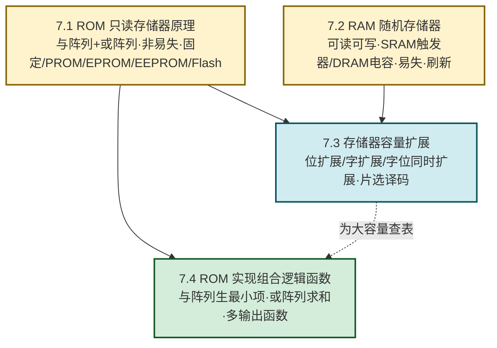

# MOC - 第7章 半导体存储器

> [!info] 本章定位
> 存储器是数字系统的**信息仓库**。本章要回答的核心问题是：**数字系统用什么器件保存程序、数据和查表？如何用阵列结构实现"地址→数据"的映射？当单片容量不够时如何扩展？如何把组合逻辑问题转化为查表问题用 ROM 实现？** 这些能力是计算机主存、CPU 缓存、嵌入式固件、码制转换电路的物理基础。
>
> 本章在 [[MOC - 第3章|第3章 组合逻辑电路]]（译码器产生最小项）和 [[MOC - 第5章|第5章 时序逻辑电路]]（触发器作为存储单元）之后展开：把"译码器 + 或门"封装为 ROM 阵列，把"触发器/电容"组织为 RAM 矩阵，从"逻辑功能"走向"数据存储"。

## 学习路线图

> [!tip] 学习顺序建议
> 先掌握两类存储器（ROM 非易失只读、RAM 易失可读写），理解"与阵列 + 或阵列"和"存储矩阵 + 读写电路"两类结构；再学容量扩展（位/字/字位）；最后学 ROM 实现组合逻辑，把存储与逻辑设计打通。

## 知识点导航

| 小节 | 标题 | 核心内容 | 关键参数/方法 |
| ---- | ---- | -------- | ------------- |
| [[7.1 ROM 只读存储器原理\|7.1]] | ROM 只读存储器原理 | 与阵列+或阵列、地址译码、读出原理、容量计算、ROM 分类 | 容量 $2^n\times m$；分类：掩模/PROM/EPROM/EEPROM/Flash |
| [[7.2 RAM 随机存储器\|7.2]] | RAM 随机存储器 | 结构、SRAM 六管触发器、DRAM 单管电容、刷新、读写时序 | SRAM 不刷新、DRAM 刷新；行列双译码 |
| [[7.3 存储器容量扩展\|7.3]] | 存储器容量扩展 | 位扩展、字扩展、字位同时扩展、片选译码 | 总片数 $=\dfrac{\text{目标容量}}{\text{单片容量}}$ |
| [[7.4 ROM 实现组合逻辑函数\|7.4]] | ROM 实现组合逻辑函数 | 与阵列生最小项、或阵列求和、多输出函数、码制转换 | $F_j=\bigvee_{i\in S_j}m_i$；选容量 $2^n\times k$ |

## ROM 与 RAM 对比

> [!summary] ROM vs RAM
>
> | 对比项 | ROM | RAM |
> | ------ | --- | --- |
> | 读写性 | 正常工作只读（部分可编程写入） | 可读可写 |
> | 易失性 | 非易失（断电保留） | 易失（断电丢失） |
> | 速度 | 较慢 | 快（SRAM 极快） |
> | 典型用途 | 程序代码、常数表、字库、码制转换 | 工作数据、缓存、主存 |
> | 结构 | 与阵列 + 或阵列 | 存储矩阵 + 读写电路 |

## 核心考点

> [!summary] 本章核心考点（7 点）
> 1. **ROM 结构**：地址译码器（与阵列，固定全译码）+ 存储矩阵（或阵列，可编程）+ 输出缓冲器；
> 2. **ROM 容量**：$2^n\times m\;\text{bit}$（$n$ 位地址、$m$ 位数据），注意 $\text{bit}$ 与 $\text{Byte}$ 换算；
> 3. **ROM 分类**：掩模 ROM（不可改）→PROM（一次）→EPROM（紫外擦）→EEPROM（电擦按字节）→Flash（电擦按块）；
> 4. **SRAM vs DRAM**：SRAM 六管触发器、不刷新、快、集成度低；DRAM 单管电容、需刷新、慢、集成度高；
> 5. **三种扩展**：位扩展（数据线分段、片选并联）、字扩展（片选译码、数据线并联）、字位同时扩展（先位后字）；
> 6. **总片数公式**：$N=\dfrac{2^{n_2}\cdot m_2}{2^{n_1}\cdot m_1}$，适用于所有扩展方式；
> 7. **ROM 实现组合逻辑**：输入接地址、输出接数据，按真值表填或阵列，不需化简，适合多输出与查表。

> [!warning] 高频易错点
> - ROM 容量单位 $\text{bit}$ 与 $\text{Byte}$ 混淆（差 8 倍）；
> - 字线数 $=2^n$ 不是 $n$；
> - DRAM 刷新原因是电容漏电，SRAM 不需刷新；
> - 位扩展与字扩展都并联数据线，区别在片选（并联 vs 译码）；
> - ROM 实现逻辑不需化简，直接灌真值表；
> - 与阵列固定、或阵列可编程是标准 ROM，与 PLA（与阵列也可编程）区别。

## 章节导航

> [!nav] 导航
> 上级：[[MOC - 数字逻辑电路|课程总览]]
> 上一章：[[MOC - 第6章|第6章 脉冲信号产生与整形电路]]
> 下一章：[[MOC - 第8章|第8章 可编程逻辑器件基础]]
> 配套习题：[[MOC - 第7章习题|第7章 习题]]
