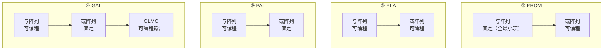

# 8.1 PLA、PAL、GAL 基础

> [!abstract] 本节概述
> 可编程逻辑器件（PLD）是一类**出厂后仍可由用户自定义内部逻辑功能**的集成电路。本节解决的核心问题是——**理解 PLD 的统一结构（与阵列 + 或阵列 + 输出单元），并据此区分 PROM、PLA、PAL、GAL 四类器件在"哪个阵列可编程、输出结构是否可重构"上的差异。** 这是从 [[3.2 组合电路设计步骤|手工搭建组合逻辑]]走向"在通用芯片上编程实现逻辑"的第一步，也为 [[8.2 FPGA 基本概念|FPGA]] 的查找表结构奠定基础。

## 一、PLD 的基本概念

> [!definition] 可编程逻辑器件（PLD）
> PLD 是一种内部包含**通用逻辑单元**（与门阵列、或门阵列）和**可编程连接点**（熔丝、反熔丝、浮栅晶体管等）的集成电路。用户通过**改变阵列中交叉点的连接状态**，即可在芯片上"写入"任意布尔函数，而无需重新设计芯片版图。
>
> PLD 的共性结构可概括为：
> $$\text{输入缓冲} \to \text{与阵列（产生乘积项）} \to \text{或阵列（求和乘积项）} \to \text{输出单元}$$
> 这正是任何"积之和"（SOP）布尔表达式的硬件对应。

> [!note] PLD 的分类层级
> | 层级 | 名称 | 典型规模 | 编程次数 |
> | ---- | ---- | -------- | -------- |
> | 简单 PLD（SPLD） | PROM、PLA、PAL、GAL | 几十~几百门 | 一次/有限次 |
> | 复杂 PLD（CPLD） | 多个 PAL/GAL 宏单元集成 | 几千~几万门 | 有限次（EEPROM/Flash） |
> | 现场可编程门阵列（FPGA） | LUT 阵列 + 触发器 | 十万~千万门 | SRAM 工艺可无限次（断电丢失） |

> [!tip] 为什么需要 PLD
> - **缩短研发周期**：用通用芯片 + 编程替代"设计专用 IC → 流片 → 测试"的漫长过程；
> - **降低小批量成本**：专用 IC 流片成本极高，PLD 适合中小批量与原型验证；
> - **可修改、可重复编程**：GAL/FPGA 可反复擦写，便于调试和升级；
> - **集成度高**：一片 PLD 可替代数十片 74 系列中规模芯片。

## 二、PLD 阵列图符号约定

> [!definition] 交叉点连接符号
> 在 PLD 阵列图中，输入线（竖线）与乘积线（横线）的交叉点有三种状态：
>
> | 符号 | 含义 | 物理实现 |
> | :---: | ---- | ---- |
> | ●（实心圆点） | **固定连接**（硬连线，不可编程） | 出厂已连好 |
> | ×（叉号） | **可编程连接**（编程后保留导通） | 熔丝完好 / 浮栅未充电 |
> | （无标记） | **不连接**（编程时已断开） | 熔丝烧断 / 浮栅充电 |

> [!note] 缓冲器表示
> PLD 阵列图的输入端使用**带互补输出的缓冲器**：一个输入 $I$ 经缓冲后产生 $I$（原码）和 $\bar I$（反码）两路信号，分别接到与阵列的竖线上，使与阵列能产生包含原变量和反变量的任意乘积项。

## 三、PROM 作为最早的 PLD

> [!definition] PROM 的 PLD 视角
> [[7.1 ROM 只读存储器原理|PROM]]（可编程只读存储器）可视为最简单的 PLD：
> - **与阵列固定**：地址译码器产生全部 $2^n$ 个最小项（与阵列出厂已连好，不可编程）；
> - **或阵列可编程**：每个数据位对应一个或门，用户通过写入 0/1 决定哪些最小项进入该或门（或阵列可编程）。
>
> 因此 PROM 实现的是**标准积之和**（最小项之和）形式，与阵列产生全部最小项，或阵列选择相加。

> [!warning] PROM 作为 PLD 的局限
> - **与阵列固定产生全部最小项**导致面积浪费：$n$ 个输入需 $2^n$ 个与门，输入数增加时阵列规模指数膨胀；
> - **未利用逻辑化简**：即使函数已化简为少量乘积项，PROM 仍要产生全部最小项，资源利用率低；
> - 因此 PROM 适合作**存储器**，仅当输入数较少（$n\le 4$）时才用作 PLD。这正是 PLA 诞生的动机。

## 四、PLA（可编程逻辑阵列）

> [!definition] PLA（Programmable Logic Array）
> PLA 的**与阵列和或阵列均可编程**：
> - 与阵列：用户编程产生**所需的乘积项**（不必产生全部最小项，可使用化简后的乘积项）；
> - 或阵列：用户编程决定每个或门接收哪些乘积项。
>
> 由于两阵列都可编程，PLA 能实现最简 SOP 形式，资源利用率高，适合输入数较多但乘积项较少的场合。

> [!example] PLA 实现半加器
> 半加器：$S=\bar A B + A \bar B$，$C=AB$（共 3 个乘积项）。
> - 与阵列编程产生 $\bar A B$、$A\bar B$、$AB$ 三个乘积项；
> - 或阵列编程：$S$ 或门连接 $\bar A B$ 与 $A\bar B$，$C$ 或门连接 $AB$。
>
> 对比 PROM 实现：需产生全部 $2^2=4$ 个最小项（$\bar A\bar B$、$\bar A B$、$A\bar B$、$AB$），其中 $\bar A\bar B$ 未被使用，浪费一条乘积线。

> [!warning] PLA 的不足
> - 两阵列都可编程使**器件速度较慢**（信号要穿过两层可编程连接，延迟大）；
> - 编程工具需完成**两级逻辑化简**并与器件资源匹配，开发较复杂；
> - 输出结构固定，缺乏寄存器与反馈，无法直接实现时序逻辑。

## 五、PAL（可编程阵列逻辑）

> [!definition] PAL（Programmable Array Logic）
> PAL 的**与阵列可编程、或阵列固定**：
> - 与阵列：用户编程产生所需乘积项（同 PLA）；
> - 或阵列：**出厂固定**，每个或门的输入数（乘积项数）已确定，连接关系不可改。
>
> 由于或阵列固定，PAL 速度比 PLA 快、价格更低；代价是每个输出的乘积项数受限，灵活性低于 PLA。

> [!note] PAL 的输出与反馈结构
> PAL 在输出端引入多种固定结构以增强能力：
> - **专用组合输出**：或门直接输出，纯组合逻辑；
> - **寄存器输出**：或门后接 D 触发器，可构成时序电路；
> - **带反馈的组合输出**：输出经缓冲反馈到与阵列，实现多级逻辑与级联；
> - **异或输出**：或门与一个异或门组合，便于实现计数器等电路。
>
> 但同一 PAL 芯片的输出结构**出厂时已固定**，用户不能选择，因此一片 PAL 只能用于特定类型的电路。

## 六、GAL（通用阵列逻辑）

> [!definition] GAL（Generic Array Logic）
> GAL 在 PAL 的基础上用**可编程的输出逻辑宏单元（OLMC）**取代固定的输出结构：
> - 与阵列可编程（同 PAL）；
> - 或阵列固定（同 PAL）；
> - **输出端增设 OLMC**，用户可通过编程选择输出模式，使同一片 GAL 适用于组合/时序/反馈等多种应用。

> [!theorem] OLMC（Output Logic Macro Cell）工作模式
> OLMC 内含**或门、异或门、D 触发器、多路选择器**等元件，通过编程一组"结构控制位"可选择以下模式：
>
> | 模式 | 输出性质 | 触发器使用 | 反馈来源 | 典型用途 |
> | ---- | -------- | ---------- | -------- | -------- |
> | 寄存器模式 | 时序输出 | 启用 | 触发器 $\bar Q$ | 计数器、状态机 |
> | 组合模式 | 组合输出 | 旁路 | 输出引脚 | 组合逻辑 |
> | 专用输入模式 | 输入 | 旁路 | 引脚输入 | 扩展输入数 |
>
> 因此 GAL 可通过配置"充当 PAL 的各种型号"，实现了**一片多用**。

> [!note] GAL 的可重复编程性
> GAL 采用 **EEPROM（电可擦除可编程只读存储器）工艺**，支持**电擦除、可重复编程**上万次，且数据可保持 20 年以上。这是 GAL 相对 PAL（一次性熔丝）的重大进步，使调试和升级成本大幅降低。

## 七、四种器件阵列结构对比

> [!summary] PROM / PLA / PAL / GAL 对比表
> | 器件 | 与阵列 | 或阵列 | 输出结构 | 编程工艺 | 重复编程 | 主要特点 |
> | ---- | :---: | :---: | -------- | -------- | :---: | -------- |
> | PROM | 固定 | 可编程 | 固定 | 熔丝/EPROM | 一次/有限 | 全最小项，资源浪费 |
> | PLA | 可编程 | 可编程 | 固定 | 熔丝 | 一次 | 灵活但速度慢、贵 |
> | PAL | 可编程 | 固定 | 多种固定 | 熔丝 | 一次 | 速度快、便宜、型号多 |
> | GAL | 可编程 | 固定 | OLMC 可编程 | EEPROM | 可重复 | 一片多用、可调试 |

## 八、易错点

> [!warning] 易错点
> 1. **PROM 是"与阵列固定"而非"与阵列可编程"**：因为它本质是存储器，地址译码（产生最小项）出厂固定，可编程的只是或阵列（存储内容）；
> 2. **PAL 与 PLA 别记反**：PAL = Programmable **Array** Logic（或阵列固定）；PLA = Programmable **Logic** Array（两阵列都可编程），靠"Array 在后=或阵列固定"可辅助记忆；
> 3. **GAL 的 OLMC 替代的是"输出结构"而非"或阵列"**：GAL 的或阵列仍固定，OLMC 只改变输出的寄存/组合/反馈方式；
> 4. **PROM 实现 $n$ 输入函数需要 $2^n$ 个与门**，输入数增加时规模爆炸，这是 PLA 出现的直接原因；
> 5. **PAL 不同型号的输出结构不可互换**，选型时必须确认输出模式与电路需求匹配；
> 6. **× 与 ● 的含义不同**：× 是"可编程且当前导通"，● 是"出厂固定连接不可改"，画图时不可混用。

## 九、与其他小节的联系

- PROM 的 PLD 视角是 [[7.1 ROM 只读存储器原理|ROM 实现组合逻辑]]的直接延伸，ROM 实现逻辑的"查表"思想将演化为 [[8.2 FPGA 基本概念|8.2 FPGA]]的查找表（LUT）；
- PLA/PAL/GAL 的与或阵列实现的是"积之和"形式，与 [[1.4 逻辑函数表示方式：真值表、表达式、卡诺图|逻辑函数 SOP 形式]]和 [[1.5 逻辑函数化简（代数法、卡诺图法）|卡诺图化简]]直接对应；
- PAL/GAL 的寄存器输出结构使其能构成时序电路，原理同 [[5.3 同步计数器与异步计数器|同步计数器]]，只是实现载体从 74 系列芯片变为可编程器件；
- GAL 的 OLMC 中的 D 触发器与 [[4.4 边沿触发器特性|边沿 D 触发器]]原理一致。

## 章节导航

- 上一级：[[MOC - 第8章]]
- 下一节：[[8.2 FPGA 基本概念]]
- 习题：[[MOC - 第8章习题]]
