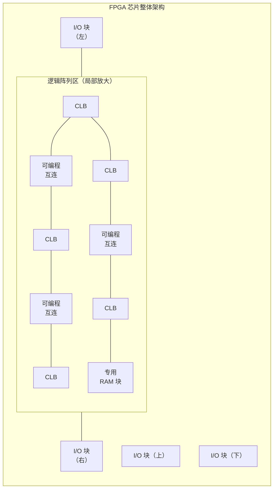

# 8.2 FPGA 基本概念

> [!abstract] 本节概述
> FPGA（现场可编程门阵列）是目前规模最大、应用最广的可编程逻辑器件。本节解决的核心问题是——**理解 FPGA 由"可编程逻辑块 + 可编程互连 + I/O 块"构成的阵列式架构，掌握查找表（LUT）用真值表存储实现任意组合逻辑的原理，并建立从设计输入到下载配置的完整设计流程认识。** LUT 本质是 [[7.1 ROM 只读存储器原理|ROM]]，这是连接本节与存储器章的关键纽带。

## 一、FPGA 的整体架构

> [!definition] FPGA 的三大组成部分
> FPGA 内部由三类可编程资源构成：
> 1. **可编程逻辑块（CLB / LAB）**：实现组合逻辑与时序逻辑的基本单元，内部含查找表（LUT）、触发器、多路选择器等；
> 2. **可编程互连网络**：布满芯片的金属线与可编程开关矩阵，连接各 CLB 之间及 CLB 与 I/O 之间；
> 3. **I/O 块（IOB）**：芯片引脚与内部逻辑之间的接口，可配置输入、输出、双向、三态等模式及电平标准。
>
> 此外，现代 FPGA 还集成了**片内 RAM 块、DSP 乘法器、锁相环（PLL）、硬核处理器**等专用资源。

> [!note] CLB 内部结构
> 一个 CLB（Configurable Logic Block）通常包含：
> - **若干个 LUT**（如 4 输入或 6 输入），实现组合逻辑；
> - **触发器**（D 触发器），用于存储状态，构成时序电路；
> - **多路选择器（MUX）**，选择 LUT 直通或经触发器输出；
> - **进位链、算术逻辑**，加速加法器等运算。
>
> LUT 输出可经多路选择器选择**直接输出（组合）**或**经触发器输出（时序）**，这正是 FPGA 既能做组合逻辑又能做时序逻辑的原因。

## 二、LUT（查找表）原理

> [!theorem] 查找表实现组合逻辑的原理
> 一个 $n$ 输入查找表（LUT）本质上是一个 $2^n \times 1$ 位的**只读存储器**：以 $n$ 个输入作为地址，从 $2^n$ 个存储单元中读出对应的函数值。
>
> 设函数 $F=f(x_1, x_2, \dots, x_n)$，将真值表的每一行输出值存入 LUT 的对应地址单元：
> $$\text{LUT}[addr] = f(x_1,\dots,x_n),\quad addr = x_1 x_2 \cdots x_n\text{（二进制）}$$
>
> 这样，任意 $n$ 输入组合逻辑都可用一张 $2^n$ 行的真值表实现，无需化简。

> [!example] 用 4 输入 LUT 实现全加器本位和 $S$
> 全加器本位和 $S=A\oplus B\oplus C_{in}$，是 3 输入函数，真值表共 $2^3=8$ 行：
>
> | $A$ | $B$ | $C_{in}$ | $S$ | LUT 地址 |
> | :---: | :---: | :---: | :---: | :---: |
> | 0 | 0 | 0 | 0 | 000 |
> | 0 | 0 | 1 | 1 | 001 |
> | 0 | 1 | 0 | 1 | 010 |
> | 0 | 1 | 1 | 0 | 011 |
> | 1 | 0 | 0 | 1 | 100 |
> | 1 | 0 | 1 | 0 | 101 |
> | 1 | 1 | 0 | 0 | 110 |
> | 1 | 1 | 1 | 1 | 111 |
>
> 将 $S$ 列 $(0,1,1,0,1,0,0,1)$ 写入 4 输入 LUT 的低 8 个单元（高位地址接 0），即可实现该函数。剩余输入可作扩展或置常量。

> [!tip] LUT 与 ROM 的关系
> LUT 本质是 [[7.1 ROM 只读存储器原理|ROM]]：用 $n$ 位地址寻址 $2^n$ 个数据单元。这正对应 ROM 实现组合逻辑的原理——把真值表存入 ROM 即可实现任意函数。FPGA 的 LUT 是**小容量、高速、分散分布**的 ROM 块，每个 CLB 内含若干个，而存储器章的 ROM 是**大容量、集中式**的存储阵列。

> [!note] LUT 级联实现更多输入
> 单个 LUT 输入数有限（常见 4 输入或 6 输入）。输入数超过 LUT 容量时，综合工具会**自动级联多个 LUT**，用多级 LUT + 多路选择器实现宽输入函数。例如 5 输入函数可用 2 个 4 输入 LUT + 1 个 2 选 1 MUX 实现（用第 5 个输入作 MUX 选择信号）。

## 三、FPGA 与 CPLD 的对比

> [!definition] CPLD（复杂可编程逻辑器件）
> CPLD 是 [[8.1 PLA、PAL、GAL 基础|GAL/PAL]]的集成升级：将多个"宏单元（类似 GAL 的 OLMC）"用可编程互连矩阵连接起来。其核心仍是**与阵列 + 或阵列（乘积项结构）**，采用 **EEPROM / Flash 工艺**，上电即可工作、断电不丢失配置。

> [!summary] FPGA 与 CPLD 对比
> | 特性 | FPGA | CPLD |
> | ---- | ---- | ---- |
> | 基本结构 | 查找表（LUT） | 乘积项（与或阵列） |
> | 工艺 | SRAM（主流）/ 反熔丝 | EEPROM / Flash |
> | 断电保持 | SRAM 型需外部配置芯片，断电丢失 | 断电保持，上电即用 |
> | 重复编程 | SRAM 型可无限次 | 有限次（万次级） |
> | 规模/密度 | 大（十万~千万门） | 小（几百~几万门） |
> | 触发器数量 | 多（适合流水线、时序密集） | 少（适合组合逻辑、简单状态机） |
> | 速度（Pin-to-Pin） | 信号经多级互连，路径延迟可变 | 乘积项直通，Pin-to-Pin 延迟确定 |
> | 典型用途 | 大规模数字系统、DSP、原型验证 | 控制逻辑、接口胶合、地址译码 |
> | 功耗 | 较高（SRAM 持续供电） | 较低（静态电流小） |

> [!tip] 选型经验
> - 需要大量触发器、深流水线、片内存储、DSP → 选 **FPGA**；
> - 需要上电即用、Pin-to-Pin 延迟确定、小规模控制逻辑 → 选 **CPLD**；
> - 这是"规模与时序确定性"与"灵活性与密度"的工程取舍。

## 四、FPGA 设计流程

> [!theorem] FPGA 典型设计流程
> 基于 FPGA 的数字系统设计分为以下阶段：
> 1. **设计输入**：用 [[8.3 Verilog 硬件描述语言入门|Verilog HDL]] 或 VHDL 描述电路（也可用原理图输入）；
> 2. **功能仿真**：在 RTL 级验证逻辑功能正确性（不考虑时序）；
> 3. **综合（Synthesis）**：将 HDL 描述映射为 LUT、触发器等基本单元及其连接（门级网表）；
> 4. **布局布线（Place & Route）**：把综合出的逻辑单元分配到芯片物理位置（CLB），并完成互连布线；
> 5. **时序仿真**：加入布局布线后的实际延迟信息，验证时序是否满足（建立/保持时间）；
> 6. **下载配置**：生成比特流文件，下载到 FPGA 的 SRAM（或外部配置芯片），芯片按配置工作。

> [!note] 配置方式
> SRAM 工艺 FPGA 断电后配置丢失，常见配置方式：
> - **主动串行（AS）**：FPGA 上电后主动从外部串行 Flash 读取配置；
> - **被动串行（PS）**：外部主控器（MCU/下载器）将配置数据串行写入 FPGA；
> - **JTAG**：通过 JTAG 接口在线下载调试，最常用。

## 五、易错点

> [!warning] 易错点
> 1. **LUT 不是乘积项结构**：LUT 用"查表（存储真值表）"实现逻辑，CPLD 用"与或阵列（乘积项）"实现逻辑，两者完全不同，不要把 FPGA 的 LUT 等同于 CPLD 的与门阵列；
> 2. **LUT 实现逻辑无需化简**：与手工设计要求最简表达式不同，LUT 直接存真值表，"化简"由综合工具在面积/速度优化时自动决定，初学者常误以为 LUT 也需要手工卡诺图化简；
> 3. **SRAM 型 FPGA 断电丢失**：必须配外部配置芯片（如 EPCS 系列），否则每次上电需重新下载，这是 FPGA 与 CPLD 的重要区别；
> 4. **$n$ 输入 LUT 需要 $2^n$ 个存储单元**：4 输入 LUT 需 16 个单元，6 输入需 64 个，输入数翻倍使存储量翻番，因此单 LUT 输入数通常不超过 6；
> 5. **CLB 内触发器有限**：FPGA 触发器虽多但仍有限，超大规模时序电路需考虑流水线平衡和资源约束。

## 六、与其他小节的联系

- LUT 本质是 [[7.1 ROM 只读存储器原理|ROM]]，与 ROM 实现组合逻辑的原理同源，是存储器章知识在 PLD 中的延伸应用；
- FPGA 的 CLB 内触发器与 [[4.4 边沿触发器特性|边沿 D 触发器]]原理一致，[[5.4 任意进制计数器设计|计数器设计]]可直接在 FPGA 上用 LUT + 触发器实现；
- FPGA 设计流程的"综合"步骤把 HDL 映射为门级网表，与 [[3.2 组合电路设计步骤|组合电路设计步骤]]的"真值表→表达式→化简→画逻辑图"思路对应，但由工具自动完成；
- CPLD 的乘积项结构直接源于 [[8.1 PLA、PAL、GAL 基础|8.1 的 PLA/PAL]]的与或阵列，是 GAL 的宏单元集成化扩展；
- FPGA 设计输入用 [[8.3 Verilog 硬件描述语言入门|8.3 Verilog HDL]]描述，是下一节的主题。

## 章节导航

- 上一级：[[MOC - 第8章]]
- 上一节：[[8.1 PLA、PAL、GAL 基础]]
- 下一节：[[8.3 Verilog 硬件描述语言入门]]
- 习题：[[MOC - 第8章习题]]
