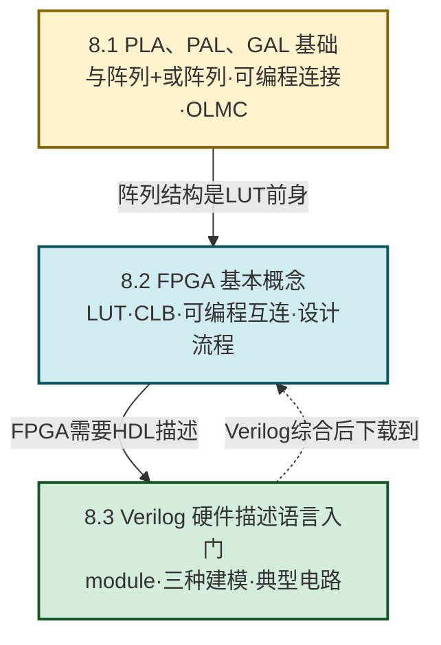

# MOC - 第8章 可编程逻辑器件基础

> [!info] 本章定位
> 可编程逻辑器件（Programmable Logic Device, PLD）是数字逻辑的**工程应用与延伸章**。本章要回答的核心问题是：**如何让用户在不重新流片的情况下，自定义芯片内部的逻辑功能？大规模逻辑电路如何用统一的结构实现任意布尔函数？如何用文本语言描述硬件并由工具自动生成电路？**
>
> 本章在 [[MOC - 第7章|第7章 半导体存储器]]之后展开：[[MOC - 第7章|ROM]]的"固定与阵列 + 可编程或阵列"结构正是最早期 PLD 的原型，ROM 实现组合逻辑的思想直接演化为 [[8.2 FPGA 基本概念|FPGA]] 中的查找表（LUT）。本章把前 7 章"用门电路和触发器手工搭电路"的思路，升级为"在可编程阵列上配置逻辑、用硬件描述语言描述电路"的现代数字系统设计方法。

## 学习路线图

> [!tip] 学习顺序建议
> 先学 8.1 理解"与或阵列 + 可编程连接点"这一 PLD 共性结构，掌握 PROM/PLA/PAL/GAL 的演进逻辑；再学 8.2 把阵列思想推广到查找表（LUT），建立 FPGA 整体架构与设计流程；最后学 8.3 用 Verilog HDL 把组合逻辑、触发器、计数器等前述知识用文本方式表达，体会"手工画图 → 文本描述 → 工具自动综合"的设计范式转变。

## 知识点导航

| 小节 | 标题 | 核心内容 | 关键概念/方法 |
| ---- | ---- | -------- | ------------- |
| [[8.1 PLA、PAL、GAL 基础\|8.1]] | PLA、PAL、GAL 基础 | PLD 共性结构、PROM/PLA/PAL/GAL 演进、阵列图符号、OLMC | 与阵列可编程 = PAL；双可编程 = PLA；OLMC = GAL |
| [[8.2 FPGA 基本概念\|8.2]] | FPGA 基本概念 | FPGA 架构（CLB + 互连 + I/O）、LUT 原理、CPLD 对比、设计流程 | LUT 本质是 ROM；$n$ 输入 LUT 实现 $2^n$ 行真值表 |
| [[8.3 Verilog 硬件描述语言入门\|8.3]] | Verilog HDL 入门 | 模块结构、wire/reg、门级/数据流/行为级建模、典型电路 | `assign` 持续赋值；`always` 过程赋值；时序电路用非阻塞 `<=` |

## 核心考点

> [!summary] 本章核心考点（7 点）
> 1. **PLD 阵列图符号约定**：实心圆点 ● 表示固定连接（硬连线），× 表示可编程连接（熔丝完好），无标记表示不连接（熔丝烧断）；
> 2. **PROM/PLA/PAL 结构区分**：PROM = 固定与阵列 + 可编程或阵列；PLA = 与阵列和或阵列均可编程；PAL = 可编程与阵列 + 固定或阵列，三者通过"哪个阵列可编程"区分；
> 3. **GAL 的 OLMC**：输出逻辑宏单元（Output Logic Macro Cell）使 GAL 可配置为组合输出/寄存器输出/反馈等多种模式，实现一片多用、可重复编程（EEPROM 工艺）；
> 4. **LUT 原理**：$n$ 输入查找表用 $2^n \times 1$ 位存储器实现任意 $n$ 输入组合逻辑，本质是 [[7.1 ROM 只读存储器原理|ROM]] 实现逻辑的延伸；
> 5. **FPGA vs CPLD**：FPGA 基于查找表（LUT）、SRAM 工艺、密度高、需配置；CPLD 基于乘积项（与或阵列）、EEPROM/Flash 工艺、上电即用、规模小；
> 6. **Verilog 三种建模**：门级结构建模（`and`/`or`/`not` 等基本门原语）、数据流建模（`assign` 持续赋值）、行为级建模（`always` 块过程赋值），组合逻辑可用 `assign` 或电平敏感 `always`，时序逻辑用边沿触发 `always`；
> 7. **阻塞与非阻塞赋值**：组合逻辑 `always` 块用阻塞赋值 `=`，时序逻辑 `always` 块用非阻塞赋值 `<=`，混用会导致竞争与功能错误。

> [!warning] 高频易错点
> - **PROM 与 PLA 的"哪个阵列可编程"易记反**：PROM 是"与阵列固定、或阵列可编程"（因为它本身是存储器，地址译码固定），PLA 是"两者都可编程"；
> - **PAL 与 PLA 仅一字之差**：PAL 的或阵列固定（出厂已连好），靠与阵列编程实现逻辑；PLA 两阵列都可编程灵活性最高但器件贵；
> - **LUT 不是乘积项**：LUT 用真值表存储方式实现逻辑，CPLD 用与或表达式方式实现，两者结构完全不同；
> - **wire 与 reg 的使用场景**：`assign` 持续赋值左侧必须是 `wire`，`always` 块内被赋值的变量必须声明为 `reg`，但 `reg` 不一定对应物理寄存器（组合 `always` 的 `reg` 仍是组合逻辑）；
> - **时序逻辑一定要用非阻塞赋值 `<=`**，否则在同一时钟沿会因求值顺序产生不可预期的竞争。

## 章节导航

> [!nav] 导航
> 上级：[[MOC - 数字逻辑电路|课程总览]]
> 上一章：[[MOC - 第7章|第7章 半导体存储器]]
> 本章为最后一章，无下一章
> 配套习题：[[MOC - 第8章习题|第8章 习题]]
