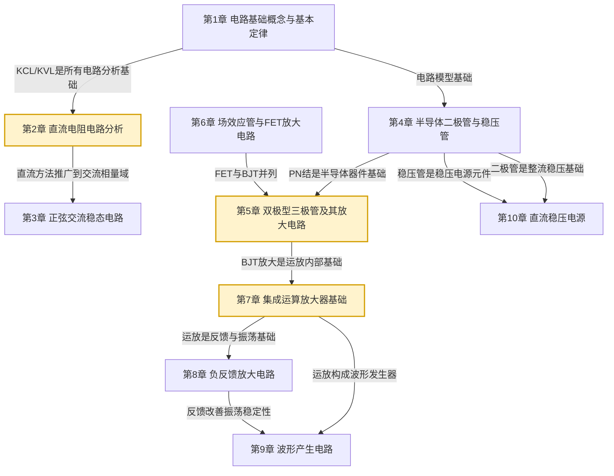

# MOC - 电路与模拟电子技术

> [!info] 课程定位
> 电路与模拟电子技术是电子、自动化、通信等专业的核心工程基础课，研究**电路基本定律、线性电路分析方法、半导体器件特性、模拟放大电路设计、集成运放应用与直流稳压电源**。课程在 [[MOC - 大学物理B]]（电磁学、电路元件的物理基础）和 [[MOC - 高等数学A(1)]]（微积分、微分方程）的数学物理基础上，建立从**集总参数电路模型**到**半导体器件电路**的完整分析体系。它要解决的核心问题是：如何用统一的电路定律（KCL/KVL、戴维南/诺顿、叠加定理）分析线性电路；如何用半导体器件（二极管、BJT、FET）实现信号的放大、运算与波形产生；如何设计稳定的直流电源为电子系统供电。

## 课程摘要

本课程围绕"**电路基础—交流稳态—半导体器件—放大电路—集成运放—反馈—波形产生—稳压电源**"八条主线展开：

1. **电路基础**（第1-2章）：电路模型、参考方向、KCL/KVL、电阻串并联、电源等效变换、支路电流法、节点电压法、叠加定理、戴维南/诺顿定理、最大功率传输；
2. **正弦交流稳态**（第3章）：相量法、RLC 阻抗与导纳、有功/无功/视在功率、串联/并联谐振、三相电路；
3. **半导体器件**（第4章）：PN 结、二极管伏安特性、整流限幅电路、稳压二极管；
4. **放大电路**（第5-6章）：BJT 三极管工作区与放大原理、共射/共集/共基放大电路静态与动态分析、分压式偏置稳定电路、MOS 管结构与特性、FET 共源放大电路；
5. **集成运放**（第7章）：理想运放模型、虚短虚断、比例/加法/减法/积分/微分运算电路、电压比较器；
6. **负反馈**（第8章）：反馈极性判断、四种反馈组态、负反馈对性能影响、深度负反馈近似计算；
7. **波形产生**（第9章）：RC 桥式振荡器、方波三角波发生器、石英晶体振荡；
8. **直流稳压电源**（第10章）：整流电路、滤波电路、线性串联稳压、三端集成稳压器。

## 章节结构与依赖关系

## 章节导航

| 章节 | 主题 | 入口 | 小节数 | 核心考点 |
| ---- | ---- | ---- | ------ | -------- |
| 第1章 | 电路基础概念与基本定律 | [[MOC - 第1章]] | 4 | 参考方向、KCL/KVL、功率计算 |
| 第2章 | 直流电阻电路分析 | [[MOC - 第2章]] | 5 | 节点电压法、叠加定理、戴维南定理 |
| 第3章 | 正弦交流稳态电路 | [[MOC - 第3章]] | 5 | 相量法、阻抗、有功无功功率、谐振 |
| 第4章 | 半导体二极管与稳压管 | [[MOC - 第4章]] | 4 | PN 结、伏安特性、整流、稳压 |
| 第5章 | 双极型三极管及其放大电路 | [[MOC - 第5章]] | 5 | BJT 工作区、Q 点、微变等效电路 |
| 第6章 | 场效应管与FET放大电路 | [[MOC - 第6章]] | 4 | MOS 管特性、FET 偏置与放大 |
| 第7章 | 集成运算放大器基础 | [[MOC - 第7章]] | 5 | 虚短虚断、比例/积分/微分运算 |
| 第8章 | 负反馈放大电路 | [[MOC - 第8章]] | 4 | 四种组态、反馈影响、深度负反馈 |
| 第9章 | 波形产生电路 | [[MOC - 第9章]] | 3 | RC 振荡、方波三角波、晶振 |
| 第10章 | 直流稳压电源 | [[MOC - 第10章]] | 4 | 整流、滤波、串联稳压、集成稳压 |

## 三大核心思想

> [!abstract] 电路与模拟电子的核心思想
> 1. **集总参数与模型化**：将实际电路元件抽象为理想模型（电阻、电容、电感、电压源、电流源），用 KCL/KVL 建立节点与回路的代数方程。参考方向是建立方程的关键约定——电流电压方向均可任意假定，由计算结果符号判定真实方向。
>
> 2. **线性叠加与等效变换**：线性电路满足叠加定理，多个电源单独作用之和等于共同作用结果；任意含源线性二端网络可等效为戴维南电压源串联电阻或诺顿电流源并联电阻。这两大原理将复杂网络化简为单回路分析。
>
> 3. **器件非线性与线性化**：半导体器件（二极管、BJT、FET）本质非线性，但在**静态工作点附近的小信号范围内**可线性化为微变等效电路（r_e、g_m 模型），从而用线性电路方法分析放大电路。这是模拟电子技术的核心方法论——直流偏置设定工作点，交流小信号分析放大性能。

## 与上下游课程的衔接

- **先修**：[[MOC - 大学物理B]]（电磁学、电场电势、洛伦兹力）、[[MOC - 高等数学A(1)]]（微积分、常微分方程）、[[MOC - 高等数学A(2)]]（相量法与复数运算）、[[MOC - 线性代数A]]（矩阵方程）
- **后续**：[[MOC - 数字逻辑电路]]（数字电路基础）、信号与系统、自动控制原理、电力电子技术
- **关联**：[[MOC - 大学物理B]] 第6-8章（电磁场为电路元件提供物理基础）

## 章节导航

- 上一级：[[MOC - 物理与电路]]
- 先修课程：[[MOC - 大学物理B]]、[[MOC - 高等数学A(1)]]

## 相关标签

#电路 #模拟电子 #模电 #直流电路 #交流电路 #半导体 #放大电路 #运放 #反馈 #稳压电源
