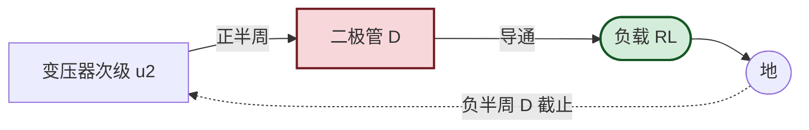
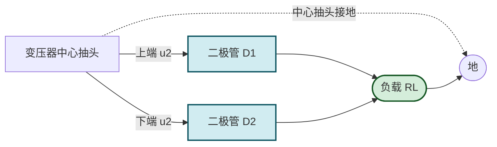
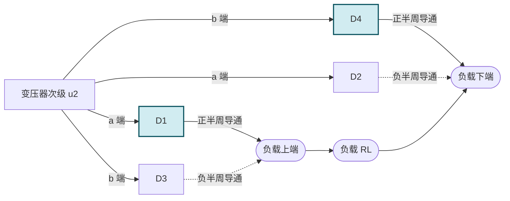

# 10.1 整流电路（半波、全波、桥式整流）

> [!abstract] 本节概述
> 整流电路利用二极管的**单向导电性**（见 [[4.1 PN 结单向导电性|4.1]]）把双向交流电转换为单向脉动直流电，是直流稳压电源的**第一级能量转换**环节。本节分析单相半波、全波（中心抽头）、桥式三种整流电路的工作原理、输出波形、直流电压估算与二极管参数选择，为 [[10.2 电容滤波、电感滤波电路|10.2]] 滤波与 [[10.3 线性串联稳压电路|10.3]] 稳压提供输入。

## 一、整流的基本概念

> [!definition] 整流
> 把交流电转换为直流电的过程称为**整流**。利用二极管的单向导电性，使电流只能单方向流过负载，从而在负载上得到单向脉动电压。

> [!info] 整流电路的分类
> | 类型 | 二极管数 | 输出波形 | 输出直流 $U_o$ | 纹波频率 |
> | ---- | -------- | -------- | -------------- | -------- |
> | 半波整流 | 1 | 半波脉动 | $0.45U_2$ | $50\,\text{Hz}$ |
> | 全波整流（中心抽头） | 2 | 全波脉动 | $0.9U_2$ | $100\,\text{Hz}$ |
> | 桥式整流 | 4 | 全波脉动 | $0.9U_2$ | $100\,\text{Hz}$ |
>
> 其中 $U_2$ 为变压器次级电压有效值，$U_o$ 为理想空载直流输出（电阻负载）。

## 二、半波整流电路

### 2.1 电路结构

> [!definition] 半波整流电路
> 变压器次级电压 $u_2=\sqrt2 U_2\sin\omega t$ 经一只二极管 D 接负载 $R_L$：
> - 正半周（$u_2>0$）：D 正偏导通，$u_o\approx u_2$（忽略管压降）；
> - 负半周（$u_2<0$）：D 反偏截止，$u_o=0$。
> 负载得到单向半波脉动电压。

### 2.2 输出直流电压与电流

> [!theorem] 半波整流输出
> 输出电压在一个周期内的平均值（直流分量）：
> $$\boxed{\,U_o=\frac{1}{2\pi}\int_0^\pi\sqrt2 U_2\sin\omega t\,d(\omega t)=\frac{\sqrt2}{\pi}U_2\approx0.45U_2\,}$$
> 输出直流电流 $I_o=U_o/R_L\approx0.45U_2/R_L$。

> [!theorem] 二极管参数
> - **最大反向电压** $U_{RM}=\sqrt2 U_2$（负半周 D 承受次级峰值反压）；
> - **平均电流** $I_F=I_o=0.45U_2/R_L$（仅一只管承担全部负载电流）；
> - 选管要求 $U_{RM(\text{额定})}\ge1.5\sqrt2 U_2$、$I_{F(\text{额定})}\ge1.5 I_o$（留 50% 余量）。

> [!warning] 半波整流的缺点
> - 输出纹波大（脉动系数 $S\approx1.57$）；
> - 变压器利用率低（仅正半周导电）；
> - 变压器有直流磁化（次级电流含直流分量），铁芯易饱和；
> - 仅适用于小功率、对纹波要求不高的场合。

## 三、全波整流电路（中心抽头）

### 3.1 电路结构

> [!definition] 全波整流电路
> 变压器次级中心抽头接地，上下两半各 $u_2$，接两只二极管 D1、D2：
> - 正半周：D1 导通、D2 截止，电流经 D1 流过 $R_L$；
> - 负半周：D2 导通、D1 截止，电流经 D2 同方向流过 $R_L$；
> 两个半周都有同向电流流过负载，输出全波脉动电压。

### 3.2 输出直流电压

> [!theorem] 全波整流输出
> $$U_o=\frac{1}{\pi}\int_0^\pi\sqrt2 U_2\sin\omega t\,d(\omega t)=\frac{2\sqrt2}{\pi}U_2\approx0.9U_2$$
> 是半波整流的两倍。纹波频率 $100\,\text{Hz}$（每个半波都出现一次）。

> [!theorem] 二极管参数
> - $U_{RM}=2\sqrt2 U_2$（截止管承受全次级峰值，因中心抽头使上下两半叠加）；
> - $I_F=I_o/2$（两管轮流导通，各承担半周期电流）。

> [!note] 全波整流的特点
> - 优点：纹波小（脉动系数 $S\approx0.67$，是半波的一半）、变压器利用率高；
> - 缺点：变压器需中心抽头、绕制复杂；二极管反峰电压高（$2\sqrt2 U_2$）；
> - 应用：早期电子设备电源、对纹波要求较高的场合。

## 四、桥式整流电路

### 4.1 电路结构

> [!definition] 桥式整流电路
> 四只二极管接成电桥形式，变压器次级接电桥一对角，负载接另一对角：
> - 正半周（$a$ 正 $b$ 负）：D1、D4 导通，D2、D3 截止，电流 $a\to D1\to R_L\to D4\to b$；
> - 负半周（$a$ 负 $b$ 正）：D2、D3 导通，D1、D4 截止，电流 $b\to D3\to R_L\to D2\to a$；
> 两个半周电流同向流过 $R_L$，输出全波脉动电压，与中心抽头全波整流效果相同。

### 4.2 输出直流电压

> [!theorem] 桥式整流输出
> $$\boxed{\,U_o=\frac{2\sqrt2}{\pi}U_2\approx0.9U_2\,}$$
> 与全波整流相同，但变压器无需中心抽头。

> [!theorem] 二极管参数
> - $U_{RM}=\sqrt2 U_2$（截止时两管串联承受次级峰值，但每管仅承受一半，实际设计按 $\sqrt2 U_2$ 选取）；
> - $I_F=I_o/2$（两管轮流导通，各承担半周期电流）；
> - 选管余量：$U_{RM(\text{额定})}\ge1.5\sqrt2 U_2$、$I_{F(\text{额定})}\ge1.5 I_o/2$。

> [!summary] 桥式整流的优点
> - 变压器无需中心抽头，绕制简单、利用率高；
> - 二极管反峰电压仅 $\sqrt2 U_2$（全波为 $2\sqrt2 U_2$），选管容易；
> - 纹波频率 $100\,\text{Hz}$，滤波容易；
> - 无直流磁化；
> - 应用最广泛，常封装为整流桥模块（4 脚封装）。

## 五、三种整流电路对比

> [!summary] 单相整流电路对比表
> | 项目 | 半波 | 全波（中心抽头） | 桥式 |
> | ---- | ---- | ---------------- | ---- |
> | 二极管数 | 1 | 2 | 4 |
> | 输出直流 $U_o$ | $0.45U_2$ | $0.9U_2$ | $0.9U_2$ |
> | 纹波频率 | $50\,\text{Hz}$ | $100\,\text{Hz}$ | $100\,\text{Hz}$ |
> | 脉动系数 $S$ | $1.57$ | $0.67$ | $0.67$ |
> | 二极管 $U_{RM}$ | $\sqrt2 U_2$ | $2\sqrt2 U_2$ | $\sqrt2 U_2$ |
> | 二极管 $I_F$ | $I_o$ | $I_o/2$ | $I_o/2$ |
> | 变压器利用率 | 低 | 较高 | 高 |
> | 变压器抽头 | 无 | 需要 | 无 |
> | 直流磁化 | 有 | 无 | 无 |
> | 应用 | 小功率 | 早期设备 | 主流 |

## 六、典型例题

### 例题 1：桥式整流参数设计

> [!example] 题目
> 设计桥式整流电路，要求输出直流 $U_o=12\,\text{V}$、$I_o=1\,\text{A}$。求：(1) 变压器次级电压 $U_2$；(2) 二极管参数 $U_{RM}$、$I_F$；(3) 选管型号建议。

**解**：

1. $U_2=U_o/0.9=12/0.9\approx13.33\,\text{V}$（取 $13\sim14\,\text{V}$ 标称变压器）。
2. $U_{RM}=\sqrt2 U_2=1.414\times13.33\approx18.86\,\text{V}$；$I_F=I_o/2=0.5\,\text{A}$。
3. 留 50% 余量：选 $U_{RM}\ge30\,\text{V}$、$I_F\ge1\,\text{A}$ 的整流二极管（如 1N5401，$100\,\text{V}/3\,\text{A}$）。

**单位检验**：$U_2$ 单位 V，$U_{RM}$ 单位 V，$I_F$ 单位 A，自洽。

### 例题 2：半波与桥式对比

> [!example] 题目
> 同一变压器 $U_2=10\,\text{V}$，分别用半波与桥式整流。求输出直流电压、二极管反峰电压、纹波频率。

**解**：

| 项目 | 半波 | 桥式 |
| ---- | ---- | ---- |
| $U_o$ | $0.45\times10=4.5\,\text{V}$ | $0.9\times10=9\,\text{V}$ |
| $U_{RM}$ | $\sqrt2\times10\approx14.14\,\text{V}$ | $14.14\,\text{V}$ |
| 纹波频率 | $50\,\text{Hz}$ | $100\,\text{Hz}$ |

桥式输出是半波的两倍，纹波频率也是两倍，滤波更容易。

**单位检验**：V、Hz，自洽。

### 例题 3：全波整流中心抽头变压器

> [!example] 题目
> 全波整流电路要求 $U_o=24\,\text{V}$、$I_o=2\,\text{A}$。求变压器次级电压（中心抽头每半边）与二极管参数。

**解**：

1. 每半边 $U_2=U_o/0.9=24/0.9\approx26.67\,\text{V}$，整个次级 $2U_2\approx53.3\,\text{V}$。
2. $U_{RM}=2\sqrt2 U_2=2\times1.414\times26.67\approx75.4\,\text{V}$；
3. $I_F=I_o/2=1\,\text{A}$；
4. 选 $U_{RM}\ge120\,\text{V}$、$I_F\ge1.5\,\text{A}$ 的二极管。

**单位检验**：V、A，自洽。

## 七、易错点

> [!warning] 易错点
> 1. **输出电压系数混淆**：半波 $0.45$、全波/桥式 $0.9$，是理想空载电阻负载的估算；接滤波电容后空载可达 $\sqrt2\approx1.414$，带载约 $1.2$；
> 2. **二极管反峰电压**：全波（中心抽头）为 $2\sqrt2 U_2$（不是 $\sqrt2 U_2$），桥式为 $\sqrt2 U_2$，二者不同；
> 3. **纹波频率**：半波 $50\,\text{Hz}$、全波/桥式 $100\,\text{Hz}$（市电 $50\,\text{Hz}$ 的两倍），影响滤波电容容量选择；
> 4. **二极管平均电流**：半波 $I_F=I_o$、全波/桥式 $I_F=I_o/2$，两管轮流导通；
> 5. **忽略管压降**：实际硅二极管正向压降 $0.7\,\text{V}$，桥式两管串联损失 $1.4\,\text{V}$，低压电源需考虑；
> 6. **变压器直流磁化**：半波整流次级含直流分量使铁芯磁化，大功率场合不能用半波；
> 7. **选管余量不足**：工程上需留 50% 以上余量，应对浪涌电流（开机滤波电容充电瞬态电流可达稳态 10 倍）。

## 八、与其他小节的联系

- 二极管单向导电性见 [[4.1 PN 结单向导电性|4.1]]、特性参数见 [[4.2 二极管伏安特性、参数|4.2]]；
- 整流后的滤波见 [[10.2 电容滤波、电感滤波电路|10.2]]；
- 稳压环节见 [[10.3 线性串联稳压电路|10.3]]、[[10.4 三端集成稳压器应用|10.4]]；
- 稳压管稳压电路见 [[4.4 稳压二极管工作原理与稳压电路|4.4]]（并联型稳压的对照）；
- 二极管限幅电路见 [[4.3 二极管整流、限幅电路|4.3]]。

## 章节导航

- 上一级：[[MOC - 第10章]]
- 下一节：[[10.2 电容滤波、电感滤波电路]]
- 习题：[[MOC - 第10章习题]]
