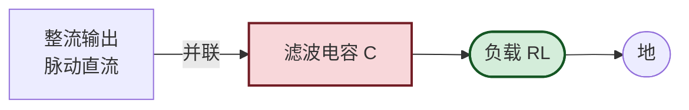
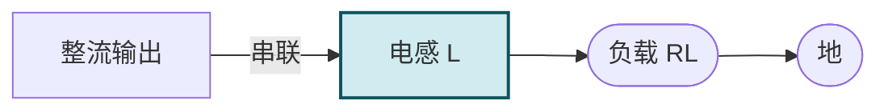
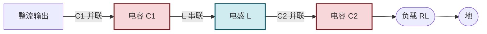

# 10.2 电容滤波、电感滤波电路

> [!abstract] 本节概述
> 整流输出是单向**脉动直流**，含大量交流纹波成分，无法直接供电子电路使用。滤波电路利用储能元件（电容储能、电感扼流）把脉动直流平滑为接近恒定的直流。本节分析电容滤波（最常用）、电感滤波、$\pi$ 型 LC 滤波的工作原理、输出电压估算与元件选择，是 [[10.3 线性串联稳压电路|10.3]] 稳压电路的前置环节。

## 一、电容滤波电路

### 1.1 电路结构

> [!definition] 电容滤波
> 在整流输出端**并联**大容量电容 $C$，与负载 $R_L$ 形成充放电回路：
> - 整流电压上升时电容充电（接近峰值 $\sqrt2 U_2$）；
> - 整流电压下降时电容通过 $R_L$ 放电，维持负载电压；
> - 电容储能使输出电压在两次充电之间平滑下降，减小纹波。

### 1.2 工作原理

> [!theorem] 电容滤波工作过程
> 1. 当 $u_2>u_c$（电容电压）时，二极管导通，$C$ 充电至 $u_2$ 峰值附近（充电时间常数小，因整流管内阻小）；
> 2. 当 $u_2<u_c$ 时，二极管截止，$C$ 经 $R_L$ 放电（放电时间常数 $\tau=R_L C$ 较大）；
> 3. 放电至下次 $u_2$ 升到 $u_c$ 时再次充电；
> 4. 输出电压为锯齿状脉动，平均值比纯电阻负载高（接近峰值）。

### 1.3 输出电压估算

> [!theorem] 电容滤波输出电压
> - **空载**（$R_L\to\infty$）：电容充电到峰值后无放电，$U_o=\sqrt2 U_2\approx1.414U_2$；
> - **带载且 $R_L C$ 足够大**（$R_L C\ge(3\sim5)T$，$T$ 为纹波周期）：$U_o\approx1.2U_2$（工程估算）；
> - **重载**（$R_L$ 小、$R_L C$ 不足）：$U_o$ 下降，趋近 $0.9U_2$（无滤波情况）。
> 工程上电容滤波后通常按 $U_o\approx1.1\sim1.2U_2$ 估算。

> [!tip] 滤波电容容量选择
> 要求放电时间常数 $R_L C\ge(3\sim5)T$（$T=1/f_r$，$f_r$ 为纹波频率）：
> - 桥式整流 $f_r=100\,\text{Hz}$，$T=10\,\text{ms}$，$C\ge\dfrac{(3\sim5)T}{R_L}$；
> - 例：$I_o=1\,\text{A}$、$U_o=12\,\text{V}$，$R_L=12\,\Omega$，$C\ge\dfrac{5\times0.01}{12}\approx4170\,\mu\text{F}$，取 $4700\,\mu\text{F}$。

### 1.4 纹波电压估算

> [!theorem] 纹波电压
> 设电容在充电后从 $U_{\max}$ 放电到 $U_{\min}$，近似线性下降，放电时间约 $T$（一个纹波周期）：
> $$\Delta U\approx\frac{I_o T}{C}$$
> 纹波系数 $S=\dfrac{\Delta U/2}{U_o}$（峰峰值的一半除以直流值）。

> [!example] 纹波计算
> 桥式整流电容滤波 $U_o=12\,\text{V}$、$I_o=1\,\text{A}$、$C=4700\,\mu\text{F}$，$f_r=100\,\text{Hz}$。
> $\Delta U=\dfrac{I_o T}{C}=\dfrac{1\times0.01}{4700\times10^{-6}}\approx2.13\,\text{V}$（峰峰值）。
> 纹波系数 $S=\dfrac{2.13/2}{12}\approx8.9\%$，需后级稳压电路进一步抑制。

## 二、电感滤波电路

### 2.1 电路结构

> [!definition] 电感滤波
> 在整流输出与负载之间**串联**电感 $L$，利用电感的"通直流、阻交流"特性（见 [[1.3 电阻、电容、电感元件特性|1.3]]）：
> - 直流分量顺利通过（电感直流电阻小）；
> - 交流纹波在电感上产生压降，被抑制；
> - 电感储能（磁场能）在纹波谷值时释放，平滑电流。

### 2.2 特点

> [!note] 电感滤波的特点
> - **优点**：二极管导通角大（接近 $180^\circ$，无电容滤波的尖峰充电电流）、对整流管冲击小、适合大电流；
> - **缺点**：电感体积大、重量重、成本高；输出电压低（$U_o\approx0.9U_2$，无提升效应）；存在铁芯磁化与电磁干扰；
> - **应用**：大功率电源、对体积重量要求不高的场合。

## 三、复式滤波电路

### 3.1 LC 滤波

> [!definition] LC 滤波
> 电感与电容组合：电感串联扼流 + 电容并联储能，比单一电容或电感滤波效果好，输出更平滑。

### 3.2 π 型 LC 滤波

> [!definition] π 型 LC 滤波
> 由两只电容 $C_1$、$C_2$ 与一只电感 $L$ 组成 π 型结构：
> - $C_1$ 先储能滤波（电容滤波）；
> - $L$ 进一步扼流抑制纹波；
> - $C_2$ 再储能平滑。
> 滤波效果优于单一元件，但体积大、成本高，适用于对纹波要求严格的高保真音频电源。

### 3.3 π 型 RC 滤波

> [definition] π 型 RC 滤波
> 用电阻 $R$ 替代电感 $L$ 构成 π 型 RC 滤波：
> - 优点：体积小、成本低；
> - 缺点：电阻上有直流压降 $(U_i-U_o)=I_o R$，效率低，仅适用于小电流场合；
> - 应用：小信号电路电源去耦。

## 四、滤波电路对比

> [!summary] 滤波电路对比表
> | 类型 | 输出电压 $U_o$ | 纹波 | 体积成本 | 二极管冲击 | 应用 |
> | ---- | -------------- | ---- | -------- | ---------- | ---- |
> | 电容滤波 | $\approx1.2U_2$ | 中 | 小 | 大（尖峰充电） | 小功率主流 |
> | 电感滤波 | $\approx0.9U_2$ | 较小 | 大 | 小 | 大功率 |
> | LC 滤波 | $\approx0.9U_2$ | 小 | 较大 | 小 | 中功率 |
> | π 型 LC | $\approx1.2U_2$ | 很小 | 大 | 较大 | 高要求 |
> | π 型 RC | $\approx1.2U_2-I_oR$ | 小 | 小 | 较大 | 小电流 |

## 五、典型例题

### 例题 1：电容滤波设计

> [!example] 题目
> 桥式整流电容滤波，要求 $U_o\approx15\,\text{V}$、$I_o=0.5\,\text{A}$，纹波峰峰值 $\Delta U\le1\,\text{V}$。求：(1) 变压器次级 $U_2$；(2) 滤波电容 $C$；(3) 二极管参数。

**解**：

1. $U_o\approx1.2U_2$，$U_2=15/1.2=12.5\,\text{V}$（取 $12\sim13\,\text{V}$）。
2. 纹波周期 $T=1/f_r=1/100=0.01\,\text{s}$。
3. $C\ge\dfrac{I_o T}{\Delta U}=\dfrac{0.5\times0.01}{1}=5000\,\mu\text{F}$，取 $4700\,\mu\text{F}/25\,\text{V}$ 标称值（耐压需 $\ge\sqrt2 U_2\approx17.7\,\text{V}$，留余量取 $25\,\text{V}$）。
4. 二极管：$U_{RM}\ge1.5\sqrt2 U_2\approx26.5\,\text{V}$（取 $50\,\text{V}$）；$I_F\ge1.5 I_o/2=0.375\,\text{A}$（取 $1\,\text{A}$）。

**单位检验**：$I_o T/\Delta U$ 单位 $\text{A}\cdot\text{s}/\text{V}=\text{F}$，自洽。

### 例题 2：纹波与放电时间常数

> [!example] 题目
> 桥式整流电容滤波 $U_2=10\,\text{V}$、$C=1000\,\mu\text{F}$、$R_L=50\,\Omega$。求：(1) $R_L C$；(2) 输出 $U_o$ 估算；(3) 纹波峰峰值 $\Delta U$。

**解**：

1. $R_L C=50\times1000\times10^{-6}=0.05\,\text{s}=50\,\text{ms}$；纹波周期 $T=10\,\text{ms}$，$R_L C/T=5\ge3$，滤波充分。
2. $U_o\approx1.2U_2=12\,\text{V}$。
3. $I_o=U_o/R_L=12/50=0.24\,\text{A}$，$\Delta U=\dfrac{I_o T}{C}=\dfrac{0.24\times0.01}{10^{-3}}=2.4\,\text{V}$。

**单位检验**：$R_L C$ 单位 $\Omega\cdot\text{F}=\text{s}$，$I_o T/C$ 单位 $\text{A}\cdot\text{s}/\text{F}=\text{V}$，自洽。

### 例题 3：空载与带载对比

> [!example] 题目
> 桥式整流电容滤波 $U_2=10\,\text{V}$。求空载与带载（$R_L=100\,\Omega$、$C=2200\,\mu\text{F}$）时的输出电压。

**解**：

1. 空载 $R_L\to\infty$，$U_o=\sqrt2 U_2=1.414\times10\approx14.14\,\text{V}$。
2. 带载 $R_L C=100\times2200\times10^{-6}=0.22\,\text{s}\gg T=0.01\,\text{s}$，$U_o\approx1.2U_2=12\,\text{V}$。
3. 空载比带载高约 $2.14\,\text{V}$，说明电容滤波输出电压随负载变化大（负载调整率差），需后级稳压。

## 六、易错点

> [!warning] 易错点
> 1. **输出电压系数混淆**：纯电阻负载 $0.9U_2$、电容滤波空载 $1.414U_2$、电容滤波带载 $1.2U_2$，三者不同；
> 2. **电容耐压选择**：必须 $\ge\sqrt2 U_2$ 且留余量，否则电容击穿；
> 3. **浪涌电流**：开机瞬间电容相当于短路，整流管浪涌电流可达稳态 10 倍以上，选管需考虑浪涌额定；
> 4. **放电时间常数不足**：$R_L C<(3\sim5)T$ 时滤波效果差，输出电压下降；
> 5. **电感滤波输出电压低**：电感滤波 $U_o\approx0.9U_2$，无电容滤波的提升效应；
> 6. **负载调整率**：电容滤波输出电压随负载变化大，不能直接作为精密电源，必须加稳压环节；
> 7. **纹波频率**：半波 $50\,\text{Hz}$、桥式 $100\,\text{Hz}$，影响 $T$ 与 $C$ 的计算。

## 七、与其他小节的联系

- 整流电路见 [[10.1 整流电路（半波、全波、桥式整流）|10.1]]；
- 滤波后稳压见 [[10.3 线性串联稳压电路|10.3]]、[[10.4 三端集成稳压器应用|10.4]]；
- 电容、电感元件特性见 [[1.3 电阻、电容、电感元件特性|1.3]]；
- RC 电路时间常数见 [[1.4 基尔霍夫电流定律、基尔霍夫电压定律|1.4]]；
- 电源去耦电容应用见 [[7.5 运放使用注意事项|7.5]]。

## 章节导航

- 上一级：[[MOC - 第10章]]
- 上一节：[[10.1 整流电路（半波、全波、桥式整流）]]
- 下一节：[[10.3 线性串联稳压电路]]
- 习题：[[MOC - 第10章习题]]
