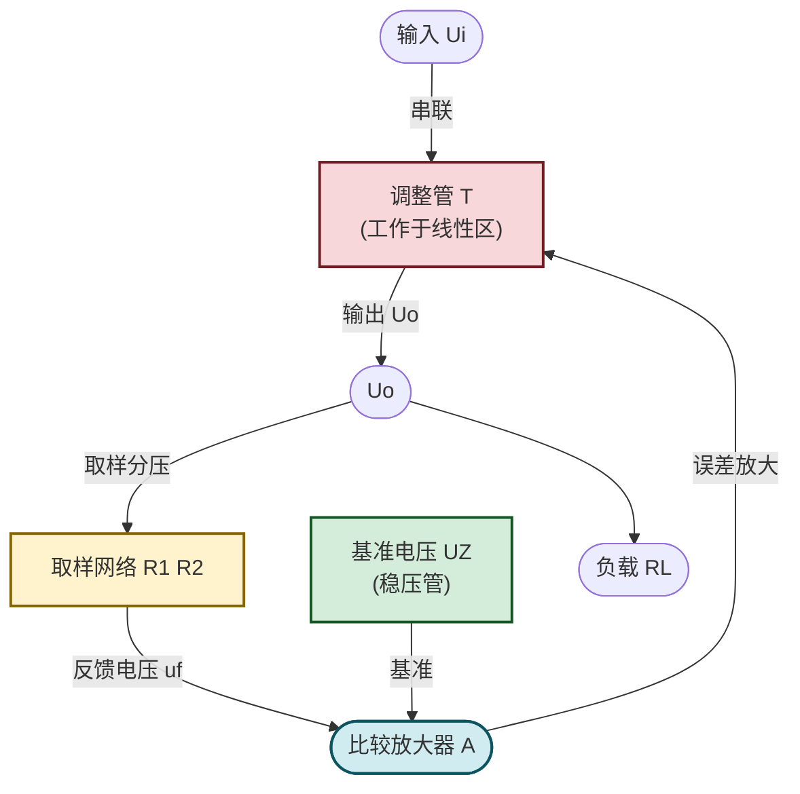

# 10.3 线性串联稳压电路

> [!abstract] 本节概述
> 线性串联稳压电路在滤波输出端**串联**一只工作于线性区的调整管（BJT 或 MOSFET），通过负反馈自动调节调整管压降，使输出电压在输入电压波动或负载变化时保持稳定。本节分析串联稳压的四环节结构（调整管、基准、取样、比较放大）、稳压原理（深度电压串联负反馈）、输出电压调节公式、效率与功耗、保护电路，是 [[10.4 三端集成稳压器应用|10.4]] 集成稳压器的内部原理基础。

## 一、稳压电源的性能指标

> [!definition] 稳压电源主要指标
> | 指标 | 定义 | 单位 | 典型值 |
> | ---- | ---- | ---- | ------ |
> | 稳压系数 $S_v$ | $\dfrac{\Delta U_o/U_o}{\Delta U_i/U_i}$（输入相对变化引起的输出相对变化） | 无量纲 | $10^{-2}\sim10^{-4}$ |
> | 负载调整率 $S_I$ | $\dfrac{\Delta U_o}{\Delta I_o}$（负载电流变化引起的输出电压变化） | Ω | $10^{-2}\sim10^{-3}\,\Omega$ |
> | 输出电阻 $R_o$ | $\left.\dfrac{\Delta U_o}{\Delta I_o}\right|_{\Delta U_i=0}$ | Ω | $<1\,\Omega$ |
> | 纹波抑制比 $S_{rip}$ | $\dfrac{\text{输入纹波}}{\text{输出纹波}}$ | dB | $40\sim80\,\text{dB}$ |
> | 效率 $\eta$ | $\dfrac{P_o}{P_i}=\dfrac{U_o I_o}{U_i I_i}$ | % | $40\sim70\%$ |

## 二、稳压管稳压电路回顾

> [!note] 稳压管稳压电路（并联型）
> 见 [[4.4 稳压二极管工作原理与稳压电路|4.4]]：稳压管与负载并联，限流电阻 $R$ 串联。
> - 输出电压 $U_o=U_Z$；
> - 限流电阻 $R$ 选择：$\dfrac{U_{i\max}-U_Z}{I_{Z\max}+I_{o\min}}\le R\le\dfrac{U_{i\min}-U_Z}{I_{Z\min}+I_{o\max}}$；
> - 缺点：输出电流小（受稳压管功率限制）、输出电压固定（等于 $U_Z$）、效率低；
> - 适用：小电流基准电压、辅助电源。

## 三、线性串联稳压电路

### 3.1 电路结构与四环节

> [!definition] 串联稳压电路四环节
> 1. **调整管 T**：功率 BJT（或 MOSFET），与负载串联，工作于线性放大区，压降 $U_{CE}$ 受基极电流控制；
> 2. **基准电压源**：稳压管提供基准 $U_Z$（见 [[4.4 稳压二极管工作原理与稳压电路|4.4]]），比较的参考；
> 3. **取样网络**：$R_1$、$R_2$（含电位器）分压取出 $u_f=\dfrac{R_2}{R_1+R_2}U_o$，反映输出电压；
> 4. **比较放大器**：运放或差动放大器，比较 $u_f$ 与 $U_Z$，放大差值 $\Delta u=u_f-U_Z$ 后驱动调整管基极。

### 3.2 稳压原理

> [!theorem] 串联稳压的负反馈原理
> 串联稳压本质是**深度电压串联负反馈**（见 [[8.2 四种反馈组态识别|8.2]]、[[8.4 深度负反馈近似计算|8.4]]）：
> 1. 设 $U_o$ 因负载增大或 $U_i$ 下降而降低；
> 2. 取样电压 $u_f=\dfrac{R_2}{R_1+R_2}U_o$ 随之降低；
> 3. 比较放大器输入差值 $\Delta u=u_f-U_Z$ 变小（更负），输出减小；
> 4. 调整管基极电流 $I_B$ 增大（注意极性：放大器输出降低意味着 PNP 调整管基极电位降低，$I_B$ 增大；或 NPN 调整管经反相放大），$U_{CE}$ 减小；
> 5. $U_o=U_i-U_{CE}$ 回升，恢复稳定。
> 反之亦然。这种"取样—比较—放大—调整"的闭环就是负反馈自动调节。

### 3.3 输出电压调节

> [!theorem] 输出电压公式
> 深度负反馈下比较放大器两输入端近似相等（虚短）：
> $$u_f=U_Z\Rightarrow\frac{R_2}{R_1+R_2}U_o=U_Z$$
> $$\boxed{\,U_o=\frac{R_1+R_2}{R_2}U_Z=\left(1+\frac{R_1}{R_2}\right)U_Z\,}$$
> 调节电位器改变 $R_1/R_2$ 即可连续调压。$R_2$ 增大时 $U_o$ 减小，$R_2$ 减小时 $U_o$ 增大。

> [!example] 输出电压调节范围
> 基准 $U_Z=6\,\text{V}$，取样电阻 $R_1=3\,\text{k}\Omega$ 固定、$R_2=0\sim5\,\text{k}\Omega$ 电位器：
> - $R_2=5\,\text{k}\Omega$：$U_o=\dfrac{3+5}{5}\times6=9.6\,\text{V}$；
> - $R_2=0$：$U_o\to\infty$（实际受 $U_i$ 限制，最小 $U_o\approx U_Z=6\,\text{V}$，因 $R_2=0$ 时 $u_f=0$ 无法等于 $U_Z$，需保留最小电阻）。
> 实际设计 $R_2$ 最小留 $1\,\text{k}\Omega$，则 $U_{o\max}=\dfrac{3+1}{1}\times6=24\,\text{V}$。
> 调节范围 $9.6\sim24\,\text{V}$。

### 3.4 调整管的选择与功耗

> [!theorem] 调整管参数
> - **最大电流** $I_{C\max}=I_{o\max}$（输出电流全部流过调整管）；
> - **最大压降** $U_{CE\max}=U_{i\max}-U_{o\min}$（输入最高、输出最低时调整管承受最大压降）；
> - **最大功耗** $P_{C\max}=(U_{i\max}-U_{o\min})I_{o\max}$；
> - **耐压** $BU_{CEO}\ge1.5 U_{CE\max}$；
> - 选管要求 $I_{CM}\ge1.5 I_{o\max}$、$P_{CM}\ge1.5 P_{C\max}$（加散热片）。

> [!theorem] 效率
> $$\eta=\frac{P_o}{P_i}=\frac{U_o I_o}{U_i I_i}\approx\frac{U_o}{U_i}$$
> （$I_i\approx I_o$，调整管基极电流远小于集电极电流）。压差 $U_i-U_o$ 越大效率越低。

> [!example] 效率与功耗计算
> $U_i=20\,\text{V}$、$U_o=12\,\text{V}$、$I_o=1\,\text{A}$：
> - 调整管功耗 $P_C=(20-12)\times1=8\,\text{W}$；
> - 输入功率 $P_i=20\times1=20\,\text{W}$；
> - 输出功率 $P_o=12\times1=12\,\text{W}$；
> - 效率 $\eta=12/20=60\%$；
> - 调整管需加装能散 $8\,\text{W}$ 的散热片。

## 四、保护电路

### 4.1 限流保护

> [!definition] 限流保护
> 在调整管发射极串联取样电阻 $R_s$，当输出电流 $I_o$ 增大使 $R_s$ 上压降超过 $0.7\,\text{V}$ 时，保护管 $T_2$ 导通，分流调整管基极电流，限制 $I_o$：
> $$I_{o\max}=\frac{0.7\,\text{V}}{R_s}$$
> 特点：保护后输出电流限制在 $I_{o\max}$，调整管仍承受 $U_i-U_o$ 压降，功耗大。

### 4.2 截流保护

> [!definition] 截流保护
> 限流保护基础上引入正反馈，使过流后输出电流不仅不增大反而**下降**到较小值（约 $I_{o\max}/3$），减小调整管功耗。适用于长时间短路的场合。

### 4.3 过热保护

> [!definition] 过热保护
> 芯片内集成温度传感器，当结温超过设定值（如 $150^\circ\text{C}$）时关断调整管，防止热击穿。温度降低后自动恢复。集成稳压器（见 [[10.4 三端集成稳压器应用|10.4]]）普遍内置。

### 4.4 过压保护

> [!definition] 过压保护
> 输出端接稳压管或晶闸管（SCR），当 $U_o$ 超过设定阈值时稳压管导通触发 SCR 导通，把输出短路，保护负载。常用于精密仪器电源。

## 五、典型例题

### 例题 1：输出电压计算

> [!example] 题目
> 串联稳压电路 $U_Z=5.1\,\text{V}$、$R_1=2\,\text{k}\Omega$、$R_2=1\,\text{k}\Omega$。求输出电压 $U_o$。

**解**：

$U_o=\dfrac{R_1+R_2}{R_2}U_Z=\dfrac{2+1}{1}\times5.1=15.3\,\text{V}$。

**单位检验**：电压 V，自洽。

### 例题 2：调整管选型

> [!example] 题目
> 串联稳压 $U_i=18\sim24\,\text{V}$、$U_o=12\,\text{V}$、$I_o=0\sim2\,\text{A}$。求调整管的最大压降、最大功耗、耐压要求。

**解**：

1. 最大压降 $U_{CE\max}=U_{i\max}-U_{o\min}=24-12=12\,\text{V}$；
2. 最大功耗 $P_{C\max}=U_{CE\max}\cdot I_{o\max}=12\times2=24\,\text{W}$；
3. 耐压 $BU_{CEO}\ge1.5\times12=18\,\text{V}$（实际取 $\ge30\,\text{V}$）；
4. 选管 $I_{CM}\ge1.5\times2=3\,\text{A}$、$P_{CM}\ge1.5\times24=36\,\text{W}$（加散热片），如 2N3055（$60\,\text{V}/15\,\text{A}/115\,\text{W}$）。

**单位检验**：V、W，自洽。

### 例题 3：限流保护设计

> [!example] 题目
> 设计限流保护，要求 $I_{o\max}=1.5\,\text{A}$。求取样电阻 $R_s$。

**解**：

$R_s=\dfrac{0.7}{I_{o\max}}=\dfrac{0.7}{1.5}\approx0.467\,\Omega$，取 $0.5\,\Omega/2\,\text{W}$ 标称值。
功耗 $P_{R_s}=I_{o\max}^2 R_s=1.5^2\times0.5=1.125\,\text{W}$，选 $2\,\text{W}$ 电阻留余量。

**单位检验**：$0.7/I$ 单位 $\text{V/A}=\Omega$，$I^2 R$ 单位 W，自洽。

### 例题 4：稳压系数与输出电阻

> [!example] 题目
> 串联稳压 $U_i=20\,\text{V}$、$U_o=12\,\text{V}$、$\Delta U_i=\pm2\,\text{V}$ 时 $\Delta U_o=\pm20\,\text{mV}$；负载 $I_o$ 从 $0.5\,\text{A}$ 增到 $1.5\,\text{A}$ 时 $\Delta U_o=50\,\text{mV}$。求稳压系数 $S_v$ 与输出电阻 $R_o$。

**解**：

1. $S_v=\dfrac{\Delta U_o/U_o}{\Delta U_i/U_i}=\dfrac{0.02/12}{2/20}=\dfrac{1.67\times10^{-3}}{0.1}=1.67\times10^{-2}$；
2. $R_o=\dfrac{\Delta U_o}{\Delta I_o}=\dfrac{0.05}{1.5-0.5}=0.05\,\Omega$。

**单位检验**：$S_v$ 无量纲，$R_o$ 单位 Ω，自洽。

## 六、易错点

> [!warning] 易错点
> 1. **输出电压公式方向**：$U_o=\dfrac{R_1+R_2}{R_2}U_Z$，$R_2$ 是接地的下取样电阻；增大 $R_2$ 使 $U_o$ 减小，方向易记反；
> 2. **调整管极性**：NPN 调整管需要基极电位高于发射极，运放输出需反相驱动；PNP 调整管反之；
> 3. **调整管压降方向**：$U_{CE}=U_i-U_o$，不是 $U_o-U_i$；
> 4. **效率公式近似条件**：$\eta\approx U_o/U_i$ 仅在 $I_i\approx I_o$（基极电流远小于集电极电流）时成立；
> 5. **限流保护电阻方向**：$R_s=0.7/I_{o\max}$，电流增大时保护，不是 $R_s=0.7 U_o$；
> 6. **取样电阻电流**：取样分压电阻的电流应远小于负载电流（通常 $1/10$ 以下），否则影响效率与取样精度；
> 7. **深度负反馈条件**：比较放大器开环增益需足够大，否则稳压精度下降。

## 七、与其他小节的联系

- 整流与滤波见 [[10.1 整流电路（半波、全波、桥式整流）|10.1]]、[[10.2 电容滤波、电感滤波电路|10.2]]；
- 稳压管基准见 [[4.4 稳压二极管工作原理与稳压电路|4.4]]；
- 调整管（BJT）工作区与放大原理见 [[5.1 BJT 三极管结构、放大原理、三种工作区|5.1]]；
- 比较放大器（运放）见 [[7.1 运放理想模型、虚短虚断概念|7.1]]、[[7.2 反相比例、同相比例运算电路|7.2]]；
- 负反馈稳压原理见 [[8.2 四种反馈组态识别|8.2]]、[[8.4 深度负反馈近似计算|8.4]]；
- 集成化见 [[10.4 三端集成稳压器应用|10.4]]。

## 章节导航

- 上一级：[[MOC - 第10章]]
- 上一节：[[10.2 电容滤波、电感滤波电路]]
- 下一节：[[10.4 三端集成稳压器应用]]
- 习题：[[MOC - 第10章习题]]
