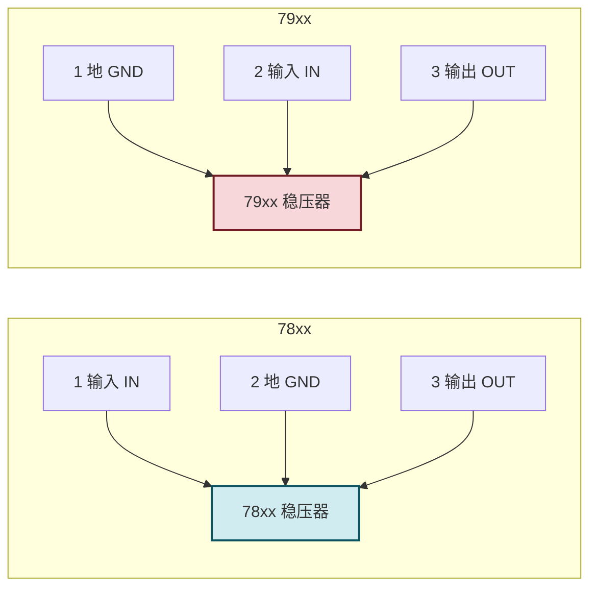
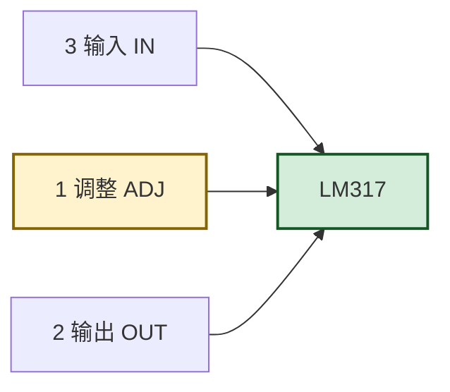

# 10.4 三端集成稳压器应用

> [!abstract] 本节概述
> 三端集成稳压器把 [[10.3 线性串联稳压电路|10.3]] 的调整管、基准、取样、比较放大与保护电路全部集成在一只三端芯片内，仅以"输入、输出、地（或调整）"三个引脚对外，使用极其方便。本节介绍固定式（78xx/79xx）与可调式（LM317/LM337）两类三端稳压器的引脚定义、基本接线、输出电压/电流计算、扩展应用（电压扩展、电流扩展、恒流源）与保护二极管接法。

## 一、三端稳压器分类

> [!summary] 三端稳压器分类
> | 类型 | 系列 | 输出极性 | 输出电压 | 输出电流 | 典型型号 |
> | ---- | ---- | -------- | -------- | -------- | -------- |
> | 固定正压 | 78xx | 正 | $5/6/9/12/15/24\,\text{V}$ | $0.1/0.5/1/3/5\,\text{A}$ | 7805、7812、7815 |
> | 固定负压 | 79xx | 负 | $-5/-6/-9/-12/-15/-24\,\text{V}$ | $0.1/0.5/1/3/5\,\text{A}$ | 7905、7912、7915 |
> | 可调正压 | LM317 | 正 | $1.25\sim37\,\text{V}$ | $0.1/0.5/1.5/3\,\text{A}$ | LM317、LM317L |
> | 可调负压 | LM337 | 负 | $-1.25\sim-37\,\text{V}$ | $0.1/0.5/1.5/3\,\text{A}$ | LM337、LM337L |
>
> 后缀 L（$0.1\,\text{A}$）、M（$0.5\,\text{A}$）、无后缀（$1.5\,\text{A}$）、T（$3\,\text{A}$）表示电流等级；封装 TO-220（$1.5\,\text{A}$）、TO-3（$3\sim5\,\text{A}$）、TO-92（$0.1\,\text{A}$）。

## 二、固定式三端稳压器（78xx/79xx）

### 2.1 引脚定义



> [!warning] 引脚定义不同
> 78xx 与 79xx 的引脚排列**不同**：
> - **78xx**：1-输入 IN、2-地 GND、3-输出 OUT；
> - **79xx**：1-地 GND、2-输入 IN、3-输出 OUT。
> 接错会损坏芯片，必须核对数据手册。

### 2.2 基本应用电路

> [!definition] 78xx 基本接线
> ```
> 输入 Ui ── Ci ──┬── 1(IN) 78xx 3(OUT) ──┬── Co ── 输出 Uo
>                 │                        │
>                 │      2(GND)            │
>                 └────────────────────────┘
> ```
> - 输入端电容 $C_i$（$0.33\,\mu\text{F}$ 陶瓷）：抑制输入端高频纹波与引线电感振荡；
> - 输出端电容 $C_o$（$0.1\,\mu\text{F}$ 陶瓷）：抑制输出高频噪声、改善瞬态响应；
> - 大容量电解电容（$10\sim100\,\mu\text{F}$）：储能滤波（可选）；
> - 输入输出压差 $U_i-U_o\ge2\sim3\,\text{V}$（最小压差，否则稳压失效）；
> - 最大输入电压 $U_{i\max}\le35\,\text{V}$（78xx）或 $-35\,\text{V}$（79xx）。

> [!example] 7805 应用
> 要求 $U_o=5\,\text{V}$、$I_o=0.5\,\text{A}$：
> - 选 7805（$5\,\text{V}/1\,\text{A}$）；
> - $U_i\ge U_o+3=8\,\text{V}$（取 $9\sim12\,\text{V}$）；
> - $C_i=0.33\,\mu\text{F}$、$C_o=0.1\,\mu\text{F}$；
> - 调整管功耗 $P_C=(U_i-U_o)I_o=(12-5)\times0.5=3.5\,\text{W}$，需加散热片。

### 2.3 双电源电路

> [!definition] ±12V 双电源
> 用 7812 与 7912 配合变压器中心抽头全波整流，产生 $\pm12\,\text{V}$ 双电源，常用于运放电路：
> ```
>         ┌── 7812 ── +12V
> 整流桥 ──┤
>         └── 7912 ── -12V
>              │
>            中心抽头 GND
> ```

## 三、可调式三端稳压器（LM317/LM337）

### 3.1 引脚定义



> [!definition] LM317 引脚
> - 1-调整端 ADJ（Adjust）；
> - 2-输出端 OUT；
> - 3-输入端 IN。

### 3.2 基本应用电路

> [!definition] LM317 基本接线
> ```
> Ui ── Ci ──┬── 3(IN) LM317 2(OUT) ──┬── Co ── Uo
>            │                         │
>            │      R1 (240Ω)          │
>            │   ┌──────┴──────┐       │
>            │   │             │       │
>            │   └── 1(ADJ)    │       │
>            │                  │       │
>            │      R2 (电位器) │       │
>            │   ┌──────┴──────┐│       │
>            │   │             ││       │
>            └───┴─────────────┴┴── GND
> ```
> - $R_1$ 接在 OUT 与 ADJ 之间（典型 $240\,\Omega$）；
> - $R_2$ 接在 ADJ 与地之间（电位器）；
> - LM317 内部维持 OUT 与 ADJ 之间 $1.25\,\text{V}$ 基准电压，故流过 $R_1$ 的电流 $I_1=1.25/R_1$；
> - 输出电压 $U_o=U_{R1}+U_{R2}=1.25+\left(\dfrac{1.25}{R_1}+I_{adj}\right)R_2\approx1.25\left(1+\dfrac{R_2}{R_1}\right)$（$I_{adj}\approx50\,\mu\text{A}$ 可忽略）。

> [!theorem] LM317 输出电压公式
> $$\boxed{\,U_o\approx1.25\left(1+\frac{R_2}{R_1}\right)\,}$$
> $R_1=240\,\Omega$ 时，$R_2=0\sim5\,\text{k}\Omega$ 电位器可调 $U_o\approx1.25\sim27.3\,\text{V}$。

> [!example] LM317 调压
> $R_1=240\,\Omega$、$R_2=2\,\text{k}\Omega$：
> $U_o=1.25\times\left(1+\dfrac{2000}{240}\right)=1.25\times9.33\approx11.67\,\text{V}$。

### 3.3 LM317 的最小负载电流

> [!note] 最小负载电流
> LM317 内部稳压电路需要至少 $5\sim10\,\text{mA}$ 电流才能正常工作。$R_1=240\,\Omega$ 时 $I_1=1.25/240\approx5.2\,\text{mA}$，已满足最小负载要求。若 $R_1$ 取过大（如 $1.2\,\text{k}\Omega$，$I_1\approx1\,\text{mA}$），需在输出端并联假负载保证空载稳压。

## 四、扩展应用

### 4.1 电压扩展

> [!definition] 高压输出扩展
> 78xx 最大输出 $24\,\text{V}$，更高电压可用：
> - 稳压管抬升地端电位：78xx 地端接稳压管到地，输出电压 $U_o=U_{xx}+U_Z$；
> - LM317 可直接输出 $37\,\text{V}$；
> - 更高电压需用高压稳压器或开关电源。

### 4.2 电流扩展

> [!definition] 大电流扩展
> 78xx 最大 $1.5\,\text{A}$（或 $5\,\text{A}$ 的 78Hxx），更大电流用：
> - 外接功率 BJT 扩流：在 78xx 输入与输出之间并接 PNP 功率管，78xx 提供基准驱动，BJT 提供大电流；
> - 扩流后输出电流可达 $5\sim10\,\text{A}$；
> - 需考虑外接管与 78xx 的电流分配与保护。

### 4.3 恒流源

> [!definition] LM317 恒流源
> 把 $R_1$ 作为负载电阻接在 OUT 与 ADJ 之间，ADJ 端直接接负载到地：
> $$I_o=\frac{1.25\,\text{V}}{R_1}$$
> 输出电流仅由 $R_1$ 决定，与负载无关（在压差允许范围内）。

> [!example] 恒流源设计
> 要求 $I_o=50\,\text{mA}$：$R_1=1.25/0.05=25\,\Omega$，取 $24\,\Omega/0.1\,\text{W}$。
> 功耗 $P=I^2 R=0.05^2\times24=0.06\,\text{W}$，选 $0.25\,\text{W}$ 电阻留余量。

## 五、保护二极管

> [!warning] 保护二极管必要性
> 集成稳压器内部含放大电路，输出端接大电容时若输入短路或断电，电容电压可能反向加在稳压器输出-输入之间，击穿芯片。需加保护二极管：
> - **输入短路保护**：在输入与输出之间反向并联二极管 D1（阳极接输出、阴极接输入），输入低于输出时 D1 导通泄放电容电荷；
> - **调整端保护**（LM317）：$R_2$ 较大时在 ADJ 与 OUT 之间反向并联二极管 D2，防止调整端电容放电损坏；
> - 输出电容小于 $10\,\mu\text{F}$ 或 $R_2$ 较小时可不接保护二极管。

## 六、典型例题

### 例题 1：7812 稳压设计

> [!example] 题目
> 用 7812 设计 $12\,\text{V}/0.5\,\text{A}$ 稳压电源，输入 $U_i=18\,\text{V}$。求：(1) 调整管功耗；(2) 散热片热阻要求（环境 $40^\circ\text{C}$、结温上限 $125^\circ\text{C}$、结-壳热阻 $5^\circ\text{C/W}$）。

**解**：

1. 功耗 $P_C=(U_i-U_o)I_o=(18-12)\times0.5=3\,\text{W}$。
2. 总热阻 $R_{\theta JA}=\dfrac{T_J-T_A}{P_C}=\dfrac{125-40}{3}\approx28.3\,\text{^\circ C/W}$；
3. 散热片热阻 $R_{\theta SA}=R_{\theta JA}-R_{\theta JC}-R_{\theta CS}\approx28.3-5-1\approx22.3\,\text{^\circ C/W}$（$R_{\theta CS}$ 为壳-散热片热阻约 $1\,\text{^\circ C/W}$）；
4. 选 $R_{\theta SA}\le20\,\text{^\circ C/W}$ 的铝散热片。

**单位检验**：W、°C/W、°C，自洽。

### 例题 2：LM317 可调电源

> [!example] 题目
> LM317 电路 $R_1=240\,\Omega$、$R_2=0\sim5\,\text{k}\Omega$ 电位器、$U_i=25\,\text{V}$。求：(1) 输出电压调节范围；(2) 最大调整管功耗（$I_o=0.5\,\text{A}$）。

**解**：

1. $U_{o\min}=1.25\times(1+0/240)=1.25\,\text{V}$；
2. $U_{o\max}=1.25\times(1+5000/240)=1.25\times21.83\approx27.3\,\text{V}$；
3. 但 $U_{o\max}\le U_i-3=22\,\text{V}$（最小压差 $3\,\text{V}$），故实际 $U_{o\max}\approx22\,\text{V}$；
4. 最大功耗出现在 $U_o$ 最低时：$P_{C\max}=(U_i-U_{o\min})I_o=(25-1.25)\times0.5\approx11.9\,\text{W}$，需较大散热片。

**单位检验**：V、W，自洽。

### 例题 3：双电源设计

> [!example] 题目
> 设计 $\pm15\,\text{V}/0.5\,\text{A}$ 双电源，用 7815 和 7915。求：(1) 变压器次级电压；(2) 滤波电容；(3) 二极管参数。

**解**：

1. $U_i\ge U_o+3=18\,\text{V}$，电容滤波 $U_i\approx1.2U_2$，$U_2=18/1.2=15\,\text{V}$（中心抽头每半边 $15\,\text{V}$，整个次级 $30\,\text{V}$）；
2. $C\ge\dfrac{I_o T}{\Delta U}=\dfrac{0.5\times0.01}{1}=5000\,\mu\text{F}$，取 $4700\,\mu\text{F}/25\,\text{V}$；
3. $U_{RM}\ge1.5\sqrt2 U_2\approx31.8\,\text{V}$（取 $50\,\text{V}$），$I_F\ge1.5\times0.25=0.375\,\text{A}$（取 $1\,\text{A}$）。

**单位检验**：V、F、A，自洽。

### 例题 4：恒流源应用

> [!example] 题目
> 用 LM317 设计 $20\,\text{mA}$ 恒流源给 LED 供电（LED 正向压降 $2\,\text{V}$）。求 $R_1$ 与最小输入电压。

**解**：

1. $R_1=\dfrac{1.25}{I_o}=\dfrac{1.25}{0.02}=62.5\,\Omega$，取 $62\,\Omega$ 标称值；
2. 功耗 $P=I^2 R=0.02^2\times62=0.0248\,\text{W}$，选 $0.25\,\text{W}$；
3. 最小输入电压 $U_{i\min}=U_o+3=U_{LED}+1.25+3=2+1.25+3=6.25\,\text{V}$（$U_o=U_{LED}+1.25$）。

**单位检验**：Ω、W、V，自洽。

## 七、易错点

> [!warning] 易错点
> 1. **78xx 与 79xx 引脚不同**：78xx 是 IN-GND-OUT、79xx 是 GND-IN-OUT，接错会损坏；
> 2. **最小压差不足**：$U_i-U_o<2\sim3\,\text{V}$ 时稳压失效，输出纹波增大；
> 3. **散热片必需**：功耗 $P=(U_i-U_o)I_o$ 全部转为热量，不加散热片会过热保护；
> 4. **输入输出电容位置**：$C_i$、$C_o$ 必须就近接在芯片引脚，引线长会振荡；
> 5. **LM317 公式记忆**：$U_o=1.25(1+R_2/R_1)$，$R_1$ 是 OUT-ADJ 间的固定电阻（$240\,\Omega$），$R_2$ 是 ADJ 到地的可变电阻；
> 6. **保护二极管方向**：输入保护二极管阳极接输出、阴极接输入（反向并联），方向错会短路；
> 7. **空载稳压**：LM317 需要 $5\sim10\,\text{mA}$ 最小负载，$R_1$ 不能过大；
> 8. **最大输入电压**：78xx 最大 $35\,\text{V}$、LM317 最大 $40\,\text{V}$，超过会击穿。

## 八、与其他小节的联系

- 整流与滤波见 [[10.1 整流电路（半波、全波、桥式整流）|10.1]]、[[10.2 电容滤波、电感滤波电路|10.2]]；
- 内部稳压原理见 [[10.3 线性串联稳压电路|10.3]]；
- 稳压管基准见 [[4.4 稳压二极管工作原理与稳压电路|4.4]]；
- 二极管保护见 [[4.3 二极管整流、限幅电路|4.3]]；
- BJT 扩流见 [[5.1 BJT 三极管结构、放大原理、三种工作区|5.1]]；
- 运放电源去耦见 [[7.5 运放使用注意事项|7.5]]。

## 章节导航

- 上一级：[[MOC - 第10章]]
- 上一节：[[10.3 线性串联稳压电路]]
- 上一章：[[MOC - 第9章|第9章 波形产生电路]]
- 习题：[[MOC - 第10章习题]]
