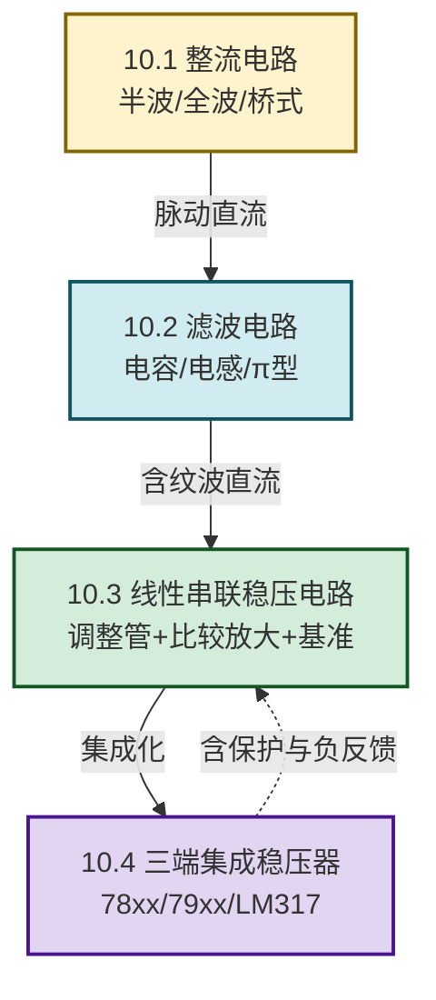

# MOC - 第10章 直流稳压电源

> [!info] 本章定位
> 直流稳压电源是把交流市电（$220\,\text{V}/50\,\text{Hz}$）转换为电子设备所需稳定直流电压（如 $5\,\text{V}$、$12\,\text{V}$、$\pm15\,\text{V}$）的**能量转换系统**。本章要回答的核心问题是：**如何通过"变压—整流—滤波—稳压"四个环节，把不稳定的交流电转换为平滑、稳定、低纹波的直流电？如何用分立元件或集成稳压器实现可调、可保护的稳压输出？**
>
> 本章是 [[MOC - 第4章|第4章 半导体二极管与稳压管]]（整流二极管、稳压二极管）、[[MOC - 第5章|第5章 双极型三极管及其放大电路]]（调整管工作于线性区）、[[MOC - 第7章|第7章 集成运算放大器基础]]（比较放大器）和 [[MOC - 第8章|第8章 负反馈放大电路]]（串联稳压是深度电压串联负反馈）的综合应用：把前几章的"信号放大"变为"功率转换"，强调效率、功率容量、热设计与保护。三端集成稳压器是分立稳压电路的集成化产物，是工程应用的主流方案。

## 学习路线图

## 知识点导航

| 小节 | 标题 | 核心内容 | 关键物理量（SI单位） |
| ---- | ---- | -------- | -------------------- |
| [[10.1 整流电路（半波、全波、桥式整流）\|10.1]] | 整流电路 | 半波整流（$U_o=0.45U_2$）、全波整流（$U_o=0.9U_2$）、桥式整流（$U_o=0.9U_2$）原理、输出波形、二极管参数选择（平均电流 $I_F$、最大反向电压 $U_{RM}$） | 输出直流电压 $U_o$（V）、纹波频率 $f_r$（Hz）、二极管反峰电压 $U_{RM}$（V） |
| [[10.2 电容滤波、电感滤波电路\|10.2]] | 电容滤波、电感滤波电路 | 电容滤波（并联电容储能充放电）、电感滤波（串联电感扼流）、$\pi$ 型 LC 滤波、输出电压估算 $U_o\approx1.2U_2$（电容滤波）、纹波系数 | 滤波电容 $C$（F）、纹波电压 $U_r$（V）、放电时间常数 $R_L C$（s） |
| [[10.3 线性串联稳压电路\|10.3]] | 线性串联稳压电路 | 串联稳压四环节（调整管、基准、取样、比较放大）、稳压原理（深度电压串联负反馈）、输出电压调节 $U_o=\dfrac{R_1+R_2}{R_2}U_Z$、调整管功耗与效率、保护电路（限流、截流、过热） | 输出电压 $U_o$（V）、调整管功耗 $P_C$（W）、效率 $\eta$（%） |
| [[10.4 三端集成稳压器应用\|10.4]] | 三端集成稳压器应用 | 固定式（78xx 正压、79xx 负压）、可调式（LM317/LM337）、基本接线、电压电流扩展、恒流源、保护二极管 | 输出电压 $U_o$（V）、压差 $U_i-U_o$（V）、最大输出电流 $I_{omax}$（A） |

## 核心考点

> [!summary] 本章核心考点（8 点）
> 1. **整流电路输出直流电压**：半波 $U_o\approx0.45U_2$、全波/桥式 $U_o\approx0.9U_2$（$U_2$ 为变压器次级有效值，空载理想值；实际带载略低）。纹波频率：半波 $50\,\text{Hz}$、全波/桥式 $100\,\text{Hz}$。
> 2. **二极管参数选择**：桥式整流每管承受最大反向电压 $U_{RM}=\sqrt2 U_2$、平均电流 $I_F=I_o/2$（每两管轮流导通）；半波 $U_{RM}=\sqrt2 U_2$、$I_F=I_o$。
> 3. **电容滤波输出电压**：空载 $U_o=\sqrt2 U_2\approx1.414U_2$；带载（$R_L C$ 足够大）$U_o\approx1.2U_2$；放电时间常数 $R_L C\ge(3\sim5)T$（$T$ 为纹波周期）。
> 4. **串联稳压原理**：取样电阻把 $U_o$ 分压送比较放大器与基准 $U_Z$ 比较，差值放大后控制调整管压降 $U_{CE}$，使 $U_o$ 稳定。本质是深度电压串联负反馈（见 [[8.4 深度负反馈近似计算|8.4]]）。
> 5. **输出电压调节公式**：$U_o=\dfrac{R_1+R_2}{R_2}U_Z$（$R_2$ 为下取样电阻、$U_Z$ 为基准稳压管电压），调节电位器改变分压比即可调压。
> 6. **效率与调整管功耗**：线性稳压效率 $\eta=\dfrac{U_o I_o}{U_i I_i}\approx\dfrac{U_o}{U_i}$（$I_i\approx I_o$），输入输出压差越大效率越低；调整管功耗 $P_C=(U_i-U_o)I_o$，是散热设计依据。
> 7. **三端稳压器分类**：78xx（正压固定）、79xx（负压固定）、LM317（正压可调 $1.25\sim37\,\text{V}$）、LM337（负压可调），输出电压 $U_o=1.25(1+R_2/R_1)$（LM317）。
> 8. **保护电路**：限流保护（取样电阻检测输出电流，过流时减小调整管基极驱动）、截流保护（正反馈使过流后电流降至较小值）、过热保护（芯片内热关断）、过压保护（稳压管钳位）。

## 自测题

> [!question]- 自测 1：整流输出电压
> 桥式整流电路变压器次级 $U_2=12\,\text{V}$（有效值），求空载理想输出直流电压 $U_o$ 与二极管承受的最大反向电压 $U_{RM}$。
>
> > [!check]- 答案
> > $U_o=0.9U_2=0.9\times12=10.8\,\text{V}$（理想空载）。
> > $U_{RM}=\sqrt2 U_2=\sqrt2\times12\approx16.97\,\text{V}$（每管截止时承受次级峰值电压）。

> [!question]- 自测 2：电容滤波输出
> 桥式整流电容滤波，$U_2=12\,\text{V}$、$R_L=100\,\Omega$、$C=2200\,\mu\text{F}$。估算输出直流电压 $U_o$ 与纹波。
>
> > [!check]- 答案
> > $R_L C=100\times2200\times10^{-6}=0.22\,\text{s}$，纹波周期 $T=1/100=0.01\,\text{s}$，$R_L C/T=22\gg3$，滤波充分。
> > $U_o\approx1.2U_2=1.2\times12=14.4\,\text{V}$。
> > 纹波估算 $\Delta U\approx\dfrac{I_o T}{C}=\dfrac{0.144\times0.01}{2200\times10^{-6}}\approx0.65\,\text{V}$（$I_o=U_o/R_L\approx0.144\,\text{A}$）。

> [!question]- 自测 3：串联稳压输出调节
> 串联稳压电路基准 $U_Z=6\,\text{V}$，取样电阻 $R_1=3\,\text{k}\Omega$、$R_2=2\,\text{k}\Omega$（$R_2$ 为下取样）。求输出电压 $U_o$。
>
> > [!check]- 答案
> > $U_o=\dfrac{R_1+R_2}{R_2}U_Z=\dfrac{3+2}{2}\times6=15\,\text{V}$。

> [!question]- 自测 4：三端稳压器输出
> LM317 电路 $R_1=240\,\Omega$（接输出端与调整端）、$R_2=2\,\text{k}\Omega$（调整端到地）。求输出电压 $U_o$。
>
> > [!check]- 答案
> > $U_o=1.25\left(1+\dfrac{R_2}{R_1}\right)=1.25\times\left(1+\dfrac{2000}{240}\right)=1.25\times9.33\approx11.67\,\text{V}$。

> [!question]- 自测 5：效率与功耗
> 串联稳压 $U_i=20\,\text{V}$、$U_o=12\,\text{V}$、$I_o=1\,\text{A}$。求调整管功耗 $P_C$ 与效率 $\eta$。
>
> > [!check]- 答案
> > $P_C=(U_i-U_o)I_o=(20-12)\times1=8\,\text{W}$。
> > $\eta=\dfrac{U_o}{U_i}=\dfrac{12}{20}=60\%$。
> > 调整管需散热片散热 $8\,\text{W}$，效率受压差限制。

## 章节导航

> [!nav] 导航
> 上级：[[MOC - 电路与模拟电子技术|课程总览]]
> 先修：[[MOC - 第4章|第4章 半导体二极管与稳压管]]（整流、稳压管基准）、[[MOC - 第7章|第7章 集成运算放大器基础]]（比较放大器）、[[MOC - 第8章|第8章 负反馈放大电路]]（深度负反馈稳压原理）
> 上一章：[[MOC - 第9章|第9章 波形产生电路]]
> 关联：[[4.3 二极管整流、限幅电路|4.3 二极管整流]]、[[4.4 稳压二极管工作原理与稳压电路|4.4 稳压管稳压]]、[[5.5 分压式静态工作点稳定电路|5.5 调整管偏置]]、[[7.5 运放使用注意事项|7.5 电源去耦]]
> 配套习题：[[MOC - 第10章习题|第10章 习题]]
