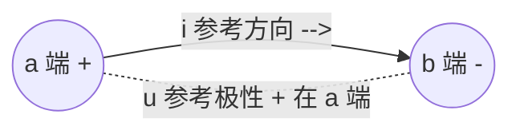

# 1.1 电路组成、模型、参考方向

> [!info] 本节定位
> 本节解决"**用什么描述电路、怎样约定方向才能列方程**"这一最基础问题。实际电器件种类繁多、特性复杂，若直接按物理原型分析将无法建立统一方程。为此本节先把实际电路抽象为**理想电路元件**与**电路模型**，再规定**电流参考方向**与**电压参考方向**——两者均可任意假定，由计算结果符号判定真实方向。这一约定是 [[1.2 电流、电压、功率计算|1.2节]] 定义 $p=ui$ 的前提，也是 [[1.4 基尔霍夫电流定律、基尔霍夫电压定律|1.4节]] 列 KCL/KVL 方程的统一规则，贯穿全课程。

## 一、电路的组成

> [!definition] 电路（Electric Circuit）
> 电路是由若干电气器件通过导线按一定方式连接而成的、能够产生电流并实现特定功能的闭合路径。其基本作用是**能量的传输与转换**或**信号的传递与处理**。

实际电路无论简繁，都由三部分组成：

| 组成部分 | 功能 | 典型器件 |
| -------- | ---- | -------- |
| **电源**（Source） | 将其他形式能量转换为电能，提供电压与电流 | 干电池、蓄电池、发电机、信号发生器 |
| **负载**（Load） | 将电能转换为其他形式能量，消耗电能 | 电阻器、电灯、电动机、扬声器 |
| **中间环节**（Intermediate） | 连接电源与负载，实现控制、保护、测量与信号变换 | 导线、开关、熔断器、变压器、放大器 |

> [!example] 电路三部分示例
> 手电筒电路：干电池（电源）→ 开关与导线（中间环节）→ 灯泡（负载）。按下开关形成闭合路径，化学能→电能→光能与热能。
> 收音机电路：天线与高频调谐电路（电源/信号源）→ 变频、中放、检波、低放各级（中间环节）→ 扬声器（负载），实现信号的选择、放大与还原。

## 二、理想电路元件

实际器件往往同时存在多种电磁效应，直接分析困难。电路理论采用**理想化**方法，把器件中起主导作用的单一电磁效应抽象为**理想电路元件**。

> [!definition] 理想电路元件（Ideal Circuit Element）
> 具有单一电磁性质、可用精确数学关系描述的二端元件，是构成电路模型的基本单元。本章涉及五种基本理想元件：

| 理想元件 | 符号 | 单位 | 主导效应 | 伏安关系（关联方向） |
| -------- | ---- | ---- | -------- | ------------------- |
| 电阻 $R$ | 矩形或折线 | 欧姆（Ω） | 耗能（不可逆电能→热能） | $u=Ri$ |
| 电感 $L$ | 线圈 | 亨利（H） | 储磁场能 | $u=L\dfrac{\mathrm di}{\mathrm dt}$ |
| 电容 $C$ | 两平行板 | 法拉（F） | 储电场能 | $i=C\dfrac{\mathrm du}{\mathrm dt}$ |
| 理想电压源 $U_S$ | 圆圈内含横线 | 伏特（V） | 提供恒定端电压 | $u=U_S$（与外电路无关） |
| 理想电流源 $I_S$ | 圆圈内含竖线 | 安培（A） | 提供恒定输出电流 | $i=I_S$（与外电路无关） |

> [!warning] 理想电源的"理想"含义
> 理想电压源内阻为零，无论流过多大电流端电压恒为 $U_S$；理想电流源内阻为无穷大，无论两端电压多高输出电流恒为 $I_S$。实际电源总有一定内阻，需用戴维南/诺顿等效模型描述（见 [[MOC - 第2章|第2章]]）。理想电源可发出也可吸收功率，需由实际方向判定。

## 三、电路模型与集总参数假设

> [!definition] 电路模型（Circuit Model）
> 用理想电路元件及其组合逼近实际器件电磁特性所得的**理想化电路**。电路理论分析的对象是电路模型，而非实际器件本身。

> [!example] 实际器件到电路模型
> - 实际电阻器：阻值随温度、频率变化，高寄生电感与电容可忽略时简化为单一电阻 $R$。
> - 实际电感线圈：低频下电感效应主导，简化为电感 $L$ 串联小电阻 $r$（铜损）；高频下还需并联分布电容。
> - 实际电容器：介质损耗用并联大电阻 $R_p$ 表示，漏流可忽略时简化为单一电容 $C$。

> [!theorem] 集总参数假设（Lumped-Parameter Assumption）
> 当电路几何尺寸 $l$ 远小于工作频率 $f$ 对应的电磁波波长 $\lambda$（即 $l\ll\lambda$，$\lambda=\dfrac{c}{f}$）时，可忽略电磁波在电路中的传播延时，认为：
> 1. 同一支路各点电流瞬时相等；
> 2. 元件两端电压为确定值，与空间位置无关；
> 3. 电场能集中于电容，磁场能集中于电感，损耗集中于电阻，三者空间分离。
>
> 此时电路可用有限个集总参数元件描述，建立常微分（而非偏微分）方程。

> [!warning] 集总参数假设的适用范围
> 工频 $f=50\,\text{Hz}$，$\lambda=\dfrac{3\times10^8}{50}=6000\,\text{km}$，普通电气设备尺寸满足 $l\ll\lambda$，集总假设成立。
> 微波 $f=10\,\text{GHz}$，$\lambda=3\,\text{cm}$，电路尺寸与之同阶，集总假设失效，须用分布参数电路（传输线方程）或电磁场理论。本章及后续各章（除特别说明）均默认集总参数假设成立。

## 四、电流的参考方向

> [!definition] 电流（Current）
> 单位时间内通过导体横截面的电荷量，记 $i$：
> $$i=\frac{\mathrm dq}{\mathrm dt}$$
> - 单位：安培（A），$1\,\text{A}=1\,\text{C/s}$
> - 方向：规定为**正电荷**流动的方向
> - 量值：可正可负，取决于 $\dfrac{\mathrm dq}{\mathrm dt}$ 的符号

实际电流方向在复杂电路中往往无法预先判断，且交流电方向随时间变化。为此引入**参考方向**这一约定。

> [!definition] 电流参考方向（Reference Direction of Current）
> 在分析电路前，对每条支路**任意假定**的一个电流方向，用箭头标在支路上。后续所有方程均基于该假定方向建立，计算结果符号给出真实方向信息：
> - $i>0$：真实方向与参考方向**相同**；
> - $i<0$：真实方向与参考方向**相反**。

> [!warning] 参考方向的"任意性"与方程"确定性"
> 参考方向可任意选取，不同选取不影响物理结果——只影响方程中各项符号与最终 $i$ 的正负，而 $i$ 与参考方向共同确定的真实方向唯一。这是电路分析与物理课"先判断真实方向再列方程"思路的根本区别。
> 一旦选定参考方向，整个分析过程中不得更改；若更改，所有相关方程需重列。

## 五、电压的参考方向

> [!definition] 电压（Voltage）
> 电场力把单位正电荷从一点移动到另一点所做的功，即两点间电势差，记 $u$：
> $$u=\frac{\mathrm dw}{\mathrm dq}$$
> - 单位：伏特（V），$1\,\text{V}=1\,\text{J/C}$
> - 方向：规定从高电势（"+"极）指向低电势（"−"极），即电压降方向
> - 量值：可正可负

> [!definition] 电压参考方向（参考极性）
> 在分析前对元件两端**任意假定**的极性，用"+"、"−"标注，"+"端为假定高电势端。计算结果：
> - $u>0$：真实极性与参考极性**相同**（"+"端确实为高电势端）；
> - $u<0$：真实极性与参考极性**相反**。

电压参考方向也可用箭头表示，箭头从假定"−"端指向假定"+"端（即指向电势升方向）；或用双下标 $u_{ab}$ 表示 $a$ 点相对于 $b$ 点的电压（$a$ 为"+"端）。

## 六、关联参考方向

> [!definition] 关联参考方向（Associated Reference Direction）
> 对同一二端元件，若电流参考方向由电压参考极性的"+"端指向"−"端（即电流与电压降方向一致），则称该元件采用**关联参考方向**。

关联参考方向的两种标注习惯：

> [!note] 关联方向的工程意义
> 关联方向下，元件伏安关系（VCR）与功率公式取最简形式：电阻 $u=Ri$、电容 $i=C\dfrac{\mathrm du}{\mathrm dt}$、电感 $u=L\dfrac{\mathrm di}{\mathrm dt}$、功率 $p=ui$。若采用非关联方向，上述公式需加负号。因此电路分析中默认采用关联方向，特殊情况才另作说明。

> [!example]- 例题 1：判断参考方向是否关联
> 图示二端元件：
> (1) 电压"+"在上、电流箭头从上端流向下端；
> (2) 电压"+"在上、电流箭头从下端流向上端；
> (3) 电压"+"在下、电流箭头从下端流向上端。
> 判断各情况是否关联。
>
> **解**：关联判据——电流参考方向由"+"端指向"−"端。
> (1) "+"在上，电流由上到下，即由"+"到"−"，**关联**。
> (2) "+"在上，电流由下到上，即由"−"到"+"，**非关联**。
> (3) "+"在下，电流由下到上，即由"+"到"−"，**关联**。
> 可见"是否关联"取决于电压极性与电流方向的相对关系，与"+"在上还是在下无关。

> [!example]- 例题 2：用参考方向判定真实方向
> 某元件采用关联参考方向，电压"+"在左端，测得 $u=-6\,\text{V}$，$i=2\,\text{A}$。判断电压与电流的真实方向，并指明元件吸收还是发出功率。
>
> **解**：
> 1. 电压：参考"+"在左端，$u=-6\,\text{V}<0$，真实极性与参考相反，故真实"+"端在右端。
> 2. 电流：关联方向下电流参考方向由左端（参考"+"）指向右端，$i=2\,\text{A}>0$，真实方向与参考相同，即由左端流向右端。
> 3. 功率（关联方向）：$p=ui=(-6)\times 2=-12\,\text{W}<0$，元件**发出**功率 $12\,\text{W}$。
> 4. 物理解释：电流实际由右端（真实高电势）流向左端（真实低电势），即由高电势流向低电势经过元件——但这与电源内部行为相反，说明该元件实质为电源，对外发出功率。
>
> **单位检验**：$u$（V）$\times i$（A）$=$ W，量纲正确。

> [!example]- 例题 3：参考方向改变对方程的影响
> 节点 A、B 间电阻 $R=5\,\Omega$，电流真实方向由 A 流向 B，大小为 $3\,\text{A}$。
> (1) 取电流参考方向 A→B，求 $i$；
> (2) 改取电流参考方向 B→A，求 $i$，并验证两种取向下 $u=Ri$（关联方向）结果一致。
>
> **解**：
> (1) 参考方向 A→B 与真实方向一致，$i=+3\,\text{A}$。
> 关联方向下电压"+"端在 A：$u=Ri=5\times 3=15\,\text{V}$，即 A 端电势比 B 端高 $15\,\text{V}$。
>
> (2) 参考方向 B→A 与真实方向相反，$i=-3\,\text{A}$。
> 关联方向下电压"+"端在 B：$u=Ri=5\times(-3)=-15\,\text{V}$，即 B 端相对 A 端为 $-15\,\text{V}$，等价于 A 端比 B 端高 $15\,\text{V}$。
>
> **结论**：两种参考方向选取下，电阻两端电压降（A 比 B 高 $15\,\text{V}$）一致，只是 $i$、$u$ 的代数符号随参考方向改变。验证了"参考方向任意，结果唯一"。

## 本节小结

> [!summary] 关系链
> **实际电路**（电源/负载/中间环节）→ 抽象 **理想电路元件**（R/L/C/电压源/电流源）→ 组合成 **电路模型**（集总参数假设下）→ 对每条支路标 **电流参考方向** 与 **电压参考极性** → 优先采用 **关联参考方向**（电流由"+"指向"−"）→ 由计算结果符号判定真实方向。
>
> 参考方向约定是 [[1.2 电流、电压、功率计算|1.2节]] 定义 $p=ui$ 与判定吸收/发出功率的前提，也是 [[1.4 基尔霍夫电流定律、基尔霍夫电压定律|1.4节]] 列 KCL/KVL 方程的统一规则。

## 章节导航

> [!nav] 导航
> [[MOC - 第1章|本章目录]] · 本节：1.1 · 下一节：[[1.2 电流、电压、功率计算]] · [[1.3 电阻、电容、电感元件特性]] · [[1.4 基尔霍夫电流定律、基尔霍夫电压定律]]
