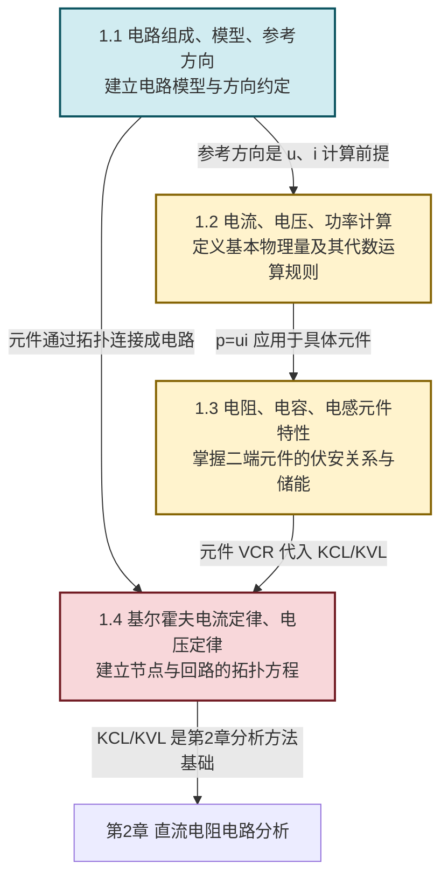

# MOC - 第1章 电路基础概念与基本定律

> [!info] 本章定位
> 本章是整门《电路与模拟电子技术》的**方法论起点**，也是后续所有电路分析（直流电阻电路、交流稳态、半导体放大电路、运放、反馈、稳压电源）的共同基石。它回答的核心问题是：**如何把实际电器件抽象为可计算的电路模型，并用统一的代数方程描述电流、电压与功率的分布规律**。
>
> 为此本章建立两条主线：一是**电路模型与参考方向约定**——将实际器件抽象为理想电路元件（R/L/C/电压源/电流源），并规定电流电压方向可任意假定、由符号判定真实方向；二是**两大拓扑定律**——基尔霍夫电流定律 KCL（节点电流代数和为零，本质电荷守恒）与基尔霍夫电压定律 KVL（回路电压代数和为零，本质能量守恒）。这两条定律仅依赖电路拓扑结构，与元件性质无关，因而适用于直流、交流、瞬态、线性、非线性的一切电路。
>
> 本章基于**集总参数假设**（元件尺寸远小于工作频率对应的电磁波波长），且仅讨论直流稳态下的定义与定律形式；交流相量域的推广见 [[MOC - 第3章|第3章]]，含动态元件的瞬态分析见后续课程。

## 学习路线图

## 知识点导航

| 小节 | 标题 | 核心内容 | 关键物理量（SI 单位） |
| ---- | ---- | -------- | -------------------- |
| [[1.1 电路组成、模型、参考方向\|1.1]] | 电路组成、模型、参考方向 | 电路三部分（电源/负载/中间环节）、理想电路元件、电路模型、集总参数假设、电流/电压参考方向、关联参考方向 | 电流 $i$（A）、电压 $u$（V） |
| [[1.2 电流、电压、功率计算\|1.2]] | 电流、电压、功率计算 | 电流 $i=\dfrac{\mathrm dq}{\mathrm dt}$、电压 $u=\dfrac{\mathrm dw}{\mathrm dq}$、功率 $p=ui$、关联方向下吸收/发出功率判据、功率守恒 $\sum p=0$ | 功率 $p$（W）、电荷 $q$（C）、能量 $w$（J） |
| [[1.3 电阻、电容、电感元件特性\|1.3]] | 电阻、电容、电感元件特性 | 电阻 $u=Ri$、电容 $i=C\dfrac{\mathrm du}{\mathrm dt}$、电感 $u=L\dfrac{\mathrm di}{\mathrm dt}$、储能公式、理想电压源与电流源 | $R$（Ω）、$C$（F）、$L$（H）、储能 $w$（J） |
| [[1.4 基尔霍夫电流定律、基尔霍夫电压定律\|1.4]] | 基尔霍夫电流定律、电压定律 | 节点/支路/回路定义、KCL $\sum i=0$（电荷守恒）、KVL $\sum u=0$（能量守恒）、广义节点、应用步骤 | 电流代数和（A）、电压代数和（V） |

## 核心考点

> [!summary] 本章核心考点（7 点）
> 1. **参考方向的任意性与符号判定**：电流参考方向与电压参考极性均可任意假定，是建立电路方程的"约定"。真实方向由计算结果符号判定——$i>0$ 表示真实方向与参考方向一致，$i<0$ 表示相反。这是电路分析与物理课"标定真实方向"的最大差别，必须严格区分。
> 2. **关联参考方向**：当电流参考方向由电压参考极性"+"端指向"−"端时称为关联参考方向。关联方向下 $p=ui>0$ 表示元件**吸收**功率，$p<0$ 表示**发出**功率；非关联方向下结论相反。功率正负号判据是必考题型。
> 3. **功率守恒**：任一完整电路中所有支路功率代数和为零，即 $\sum p=0$（吸收功率之和 = 发出功率之和）。这是能量守恒在电路中的体现，常用于校验计算结果。
> 4. **三种基本元件的伏安关系**：电阻 $u=Ri$（关联方向，瞬时同相）；电容 $i=C\dfrac{\mathrm du}{\mathrm dt}$（电压电流为微分关系，隔直通交）；电感 $u=L\dfrac{\mathrm di}{\mathrm dt}$（电流电压为微分关系，通直阻交）。注意公式均默认关联参考方向，方向改变需加负号。
> 5. **储能公式**：电容储能 $w_C=\dfrac12 C u^2$，电感储能 $w_L=\dfrac12 L i^2$，均为非负量，与电流/电压方向无关。电阻不储能，仅耗能 $p_R=Ri^2=\dfrac{u^2}{R}\geq 0$。
> 6. **KCL 与 KVL 的代数式**：KCL $\sum i=0$（流入节点电流代数和为零，本质电荷守恒）；KVL $\sum u=0$（沿回路一周电压代数和为零，本质能量守恒）。两者均依赖**参考方向**与**绕行方向**的约定，列方程前必须先标注。
> 7. **KCL/KVL 的应用步骤**：标节点→标各支路电流电压参考方向→选回路绕行方向→列 KCL/KVL 方程→联立求解。注意 KCL/KVL 只与拓扑有关，与元件性质无关；具体数值需结合元件伏安关系（VCR）才能解出。

## 自测题

> [!question]- 自测 1：关联参考方向与功率判定
> 某二端元件电压 $u=10\,\text{V}$（+ 在上、− 在下），电流 $i=-2\,\text{A}$（参考方向向上）。判断参考方向是否关联，并求该元件吸收或发出的功率。
>
> > [!check]- 答案
> > 电流参考方向（向上）由"−"端指向"+"端，与电压参考极性相反，故为**非关联参考方向**。
> > 非关联方向下功率 $p=-ui=-10\times(-2)=20\,\text{W}$。
> > 由于非关联方向下 $p>0$ 表示元件**发出**功率，故该元件发出 $20\,\text{W}$。
> > 校验：可改用关联方向公式 $p_{\text{吸}}=ui'=u(-i)=10\times 2=20\,\text{W}$（吸收），即实际发出 $20\,\text{W}$，结论一致。

> [!question]- 自测 2：功率守恒校验
> 一直流电路含一个 $12\,\text{V}$ 理想电压源与三个电阻 $R_1=2\,\Omega$、$R_2=4\,\Omega$、$R_3=6\,\Omega$ 并联接于电源两端。求电源发出功率与各电阻吸收功率之和，验证功率守恒。
>
> > [!check]- 答案
> > 并联各电阻两端电压均为 $U=12\,\text{V}$。
> > $I_1=U/R_1=6\,\text{A}$，$I_2=U/R_2=3\,\text{A}$，$I_3=U/R_3=2\,\text{A}$。
> > 电源提供总电流 $I=I_1+I_2+I_3=11\,\text{A}$，电源发出功率 $P_{\text{源}}=UI=12\times 11=132\,\text{W}$。
> > 各电阻吸收功率：$P_1=U^2/R_1=144/2=72\,\text{W}$，$P_2=144/4=36\,\text{W}$，$P_3=144/6=24\,\text{W}$，合计 $72+36+24=132\,\text{W}$。
> > $\sum p=P_{\text{吸}}-P_{\text{发}}=132-132=0$，功率守恒。

> [!question]- 自测 3：KCL 节点方程
> 节点 A 有 4 条支路，已知 $i_1=3\,\text{A}$（流入）、$i_2=-2\,\text{A}$（参考方向流入）、$i_3=5\,\text{A}$（参考方向流出）。求第 4 条支路电流 $i_4$（参考方向流出）。
>
> > [!check]- 答案
> > 约定流入为正，则 KCL：$i_1+i_2-i_3-i_4=0$。
> > $i_2=-2\,\text{A}$（参考流入但实际流出）。
> > 代入：$3+(-2)-5-i_4=0 \Rightarrow -4-i_4=0 \Rightarrow i_4=-4\,\text{A}$。
> > 即 $i_4$ 实际为 $-4\,\text{A}$（参考方向流出，但实际流入节点 $4\,\text{A}$）。

> [!question]- 自测 4：KVL 回路方程
> 单回路顺时针绕行，依次含电压源 $U_S=10\,\text{V}$（沿绕行方向为升压）、电阻 $R_1=2\,\Omega$、电阻 $R_2=3\,\Omega$，回路电流 $I$ 沿绕行方向。列 KVL 方程并求 $I$。
>
> > [!check]- 答案
> > 沿顺时针绕行，电压升取负、电压降取正（约定）：$-U_S+U_1+U_2=0$，即 $-10+2I+3I=0$。
> > 解得 $5I=10$，$I=2\,\text{A}$。
> > 单位检验：$U=RI$ 中 $R$（Ω）、$I$（A）相乘得 V，与 $U_S$ 量纲一致。

## 章节导航

> [!nav] 导航
> 上级：[[MOC - 电路与模拟电子技术|电路与模拟电子技术 课程总览]]
> 先修课程：[[MOC - 大学物理B|大学物理B]]（电磁学基础）
> 下一章：[[MOC - 第2章|第2章 直流电阻电路分析]]
> 配套习题：[[MOC - 第1章习题|第1章 习题]]
