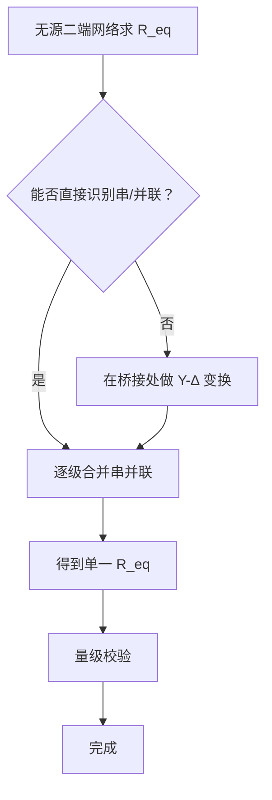
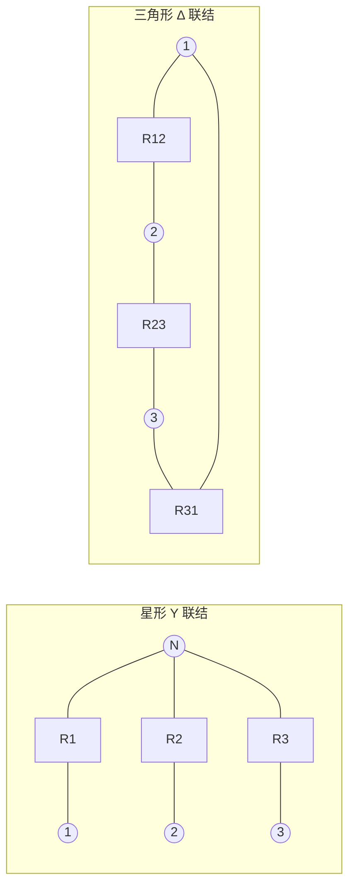

# 2.1 电阻串并联、分压分流公式

> [!info] 本节定位
> 电路分析的起点是**等效化简**：在不改变端口电压电流关系的前提下，把多个电阻组成的二端网络用一个等效电阻代替，从而把复杂网络降为单回路。本节解决两个核心问题——
> 1. 如何用**串并联**与**Y-Δ变换**计算无源网络的等效电阻；
> 2. 在串联电路中如何由总电压求各电阻电压（**分压**），在并联电路中如何由总电流求各支路电流（**分流**）。
> 这两套工具是后续 [[2.3 支路电流法、节点电压法]]、[[2.4 叠加定理、戴维南定理、诺顿定理]] 化简电路的基础。

## 一、电阻串联

> [!definition] 电阻串联
> 若 $n$ 个电阻 $R_1, R_2, \dots, R_n$ **首尾相接、流过同一电流** $i$，则称它们串联。串联总电压等于各电阻电压之和。

$$u = u_1 + u_2 + \dots + u_n = \sum_{k=1}^{n} u_k$$

### 1.1 等效电阻

由欧姆定律 $u_k = R_k i$ 代入上式：

$$u = \sum_{k=1}^{n} R_k i = i \sum_{k=1}^{n} R_k$$

> [!theorem] 串联等效电阻
> $n$ 个电阻串联的等效电阻等于各电阻之和：
> $$\boxed{R_{\text{eq}} = R_1 + R_2 + \dots + R_n = \sum_{k=1}^{n} R_k}$$
> 单位：欧姆（$\Omega$）。等效电阻**大于**任一串联电阻。

### 1.2 分压公式

> [!theorem] 分压公式
> 串联电路中第 $k$ 个电阻上的电压 $u_k$ 与总电压 $u$ 之比，等于 $R_k$ 与 $R_{\text{eq}}$ 之比：
> $$\boxed{u_k = u \cdot \frac{R_k}{R_{\text{eq}}} = u \cdot \frac{R_k}{R_1 + R_2 + \dots + R_n}}$$

两电阻串联的常用形式：

$$u_1 = u \cdot \frac{R_1}{R_1 + R_2}, \quad u_2 = u \cdot \frac{R_2}{R_1 + R_2}$$

> [!warning] 分压公式易错点
> 1. 分压公式只对**串联**成立，并联时不能用。
> 2. 电压 $u_k$ 的方向与电流 $i$ 一致（关联参考方向）；若题目给出反向参考方向，结果需加负号。
> 3. 各电压之和应等于总电压，可作为校验：$\sum u_k = u$。

## 二、电阻并联

> [!definition] 电阻并联
> 若 $n$ 个电阻 $R_1, R_2, \dots, R_n$ **两端电压相同** $u$，则称它们并联。并联总电流等于各支路电流之和。

$$i = i_1 + i_2 + \dots + i_n = \sum_{k=1}^{n} i_k$$

### 2.1 等效电阻与等效电导

由 $i_k = u / R_k = G_k u$（$G_k = 1/R_k$ 为电导，单位西门子 S）：

$$i = \sum_{k=1}^{n} \frac{u}{R_k} = u \sum_{k=1}^{n} G_k$$

> [!theorem] 并联等效电导/电阻
> $n$ 个电阻并联时，等效**电导**等于各电导之和：
> $$\boxed{G_{\text{eq}} = G_1 + G_2 + \dots + G_n = \sum_{k=1}^{n} \frac{1}{R_k}}$$
> 等效电阻为其倒数：
> $$\boxed{\frac{1}{R_{\text{eq}}} = \sum_{k=1}^{n} \frac{1}{R_k}}, \quad R_{\text{eq}} = \left(\sum_{k=1}^{n} \frac{1}{R_k}\right)^{-1}$$
> 等效电阻**小于**任一并联电阻。

**两电阻并联**的常用形式（记忆口诀"积比和"）：

$$R_{\text{eq}} = \frac{R_1 R_2}{R_1 + R_2}$$

### 2.2 分流公式

> [!theorem] 分流公式
> 并联电路中第 $k$ 条支路的电流 $i_k$ 与总电流 $i$ 之比，等于该支路电导与总电导之比：
> $$\boxed{i_k = i \cdot \frac{G_k}{G_{\text{eq}}} = i \cdot \frac{1/R_k}{\sum 1/R_j}}$$

**两电阻并联**的常用形式——注意电阻大的支路电流小：

$$i_1 = i \cdot \frac{R_2}{R_1 + R_2}, \quad i_2 = i \cdot \frac{R_1}{R_1 + R_2}$$

> [!warning] 分流公式易错点
> 两电阻并联分流时，$i_1$ 表达式中分子是**对方电阻** $R_2$，不是 $R_1$。这是因为电导 $G_1 = 1/R_1$，而 $i_1 = i \cdot G_1/(G_1+G_2) = i \cdot (1/R_1)/[(R_1+R_2)/(R_1 R_2)] = i \cdot R_2/(R_1+R_2)$。

## 三、等效电阻求解步骤

> [!tip] 求解无源二端网络等效电阻的一般步骤
> 1. **标节点**：识别哪些点是同电位节点，可合并标注。
> 2. **找串并联**：从离端口最远端开始，逐步向端口合并串、并联电阻。
> 3. **遇桥打Y-Δ**：若出现电桥（如惠斯通电桥）或既非纯串也非纯并结构，用 Y-Δ 变换打开"桥"。
> 4. **化简到单电阻** $R_{\text{eq}}$。
> 5. **校验**：等效电阻应介于最小并联值与最大串联值之间，量级合理。

## 四、星形-三角形（Y-Δ）等效变换

当电路中存在既非纯串联也非纯并联的"桥形"结构时，需用 Y-Δ 变换将其转化为可串并联化简的形式。

### 4.1 结构定义

- **三角形（Δ）联结**：三个电阻 $R_{12}, R_{23}, R_{31}$ 首尾相接成闭合三角，三个顶点引出三个端钮。
- **星形（Y）联结**：三个电阻 $R_1, R_2, R_3$ 的一端接公共节点（中性点），另一端分别引出三个端钮。

### 4.2 变换公式

> [!theorem] Y-Δ 等效变换公式
> 等效条件：变换前后任意两端钮间的等效电阻相同。
>
> **Δ → Y**（已知 $R_{12}, R_{23}, R_{31}$，求 $R_1, R_2, R_3$）：
> $$\boxed{R_1 = \frac{R_{12} R_{31}}{R_{12} + R_{23} + R_{31}}, \quad R_2 = \frac{R_{12} R_{23}}{R_{12} + R_{23} + R_{31}}, \quad R_3 = \frac{R_{23} R_{31}}{R_{12} + R_{23} + R_{31}}}$$
> 规律：某端 Y 电阻等于该端相邻两 Δ 电阻之积除以三电阻之和。
>
> **Y → Δ**（已知 $R_1, R_2, R_3$，求 $R_{12}, R_{23}, R_{31}$）：
> $$\boxed{R_{12} = \frac{R_1 R_2 + R_2 R_3 + R_3 R_1}{R_3}, \quad R_{23} = \frac{R_1 R_2 + R_2 R_3 + R_3 R_1}{R_1}, \quad R_{31} = \frac{R_1 R_2 + R_2 R_3 + R_3 R_1}{R_2}}$$
> 规律：某 Δ 电阻等于 Y 三电阻两两乘积之和除以**对端**的 Y 电阻。

> [!tip] 对称情况简化
> 当三个电阻相等 $R_1 = R_2 = R_3 = R_Y$ 且 $R_{12} = R_{23} = R_{31} = R_\Delta$ 时：
> $$R_\Delta = 3 R_Y, \quad R_Y = \frac{R_\Delta}{3}$$
> 即对称 Δ 的每个电阻是对称 Y 的 3 倍。

### 4.3 何时使用 Y-Δ 变换

- 电桥电路（如惠斯通电桥）不满足平衡条件时。
- 三端网络中出现"桥接"结构，无法直接串并联化简时。
- 选变换哪一组的原则：变换后应使剩余部分能继续串并联合并。

## 五、典型例题

### 例题 1：分压电路计算

> [!example] 例题 1
> 如图，$U_s = 12\,\text{V}$ 的直流电压源串联 $R_1 = 4\,\Omega$、$R_2 = 8\,\Omega$，求各电阻电压 $u_1, u_2$ 及电流 $i$。

**解：**

1. 等效电阻：$R_{\text{eq}} = R_1 + R_2 = 4 + 8 = 12\,\Omega$
2. 电流：$i = U_s / R_{\text{eq}} = 12/12 = 1\,\text{A}$
3. 分压：
   - $u_1 = U_s \cdot R_1/R_{\text{eq}} = 12 \times 4/12 = 4\,\text{V}$
   - $u_2 = U_s \cdot R_2/R_{\text{eq}} = 12 \times 8/12 = 8\,\text{V}$
4. 校验：$u_1 + u_2 = 4 + 8 = 12\,\text{V} = U_s$ ✓

### 例题 2：分流与并联化简

> [!example] 例题 2
> 电流源 $I_s = 9\,\text{A}$ 并联 $R_1 = 6\,\Omega$、$R_2 = 3\,\Omega$，求等效电阻、端电压及各支路电流。

**解：**

1. 等效电阻（"积比和"）：$R_{\text{eq}} = R_1 R_2/(R_1+R_2) = 6 \times 3/(6+3) = 18/9 = 2\,\Omega$
2. 端电压：$u = I_s \cdot R_{\text{eq}} = 9 \times 2 = 18\,\text{V}$
3. 分流（注意分子用对方电阻）：
   - $i_1 = I_s \cdot R_2/(R_1+R_2) = 9 \times 3/9 = 3\,\text{A}$
   - $i_2 = I_s \cdot R_1/(R_1+R_2) = 9 \times 6/9 = 6\,\text{A}$
4. 校验：$i_1 + i_2 = 3 + 6 = 9\,\text{A} = I_s$ ✓；$u/R_1 = 18/6 = 3\,\text{A} = i_1$ ✓

> [!note] 电阻大者分流小：$R_2 < R_1$，故 $i_2 > i_1$，电流更愿意走小电阻支路。

### 例题 3：Y-Δ 变换化简桥形网络

> [!example] 例题 3
> 惠斯通电桥如图，$R_1 = R_2 = R_3 = R_4 = R_5 = 3\,\Omega$，端钮 1-2 间各电阻构成桥形（$R_1$ 1-3、$R_2$ 2-3、$R_3$ 3-4、$R_4$ 1-4、$R_5$ 2-4，节点3、4间无直接连接而通过 $R_3$ 相连——标准桥结构）。求端口 1-2 的等效电阻 $R_{12}$。

**解：**

由于三桥臂对称，将节点 1、2、3 处的 Δ（$R_1, R_2, R_5$ 均不构成与节点 1-2-3 的三角）——更稳妥地，取由 $R_1, R_4$ 及 $R_1$-节点3-$R_2$-节点2 构成的部分。因对称且各电阻均 $3\,\Omega$，把节点 1、3、2 构成的 Δ 中含 $R_3$ 的 Y 变换（此处取 $R_1, R_2, R_3$ 组成的 Y：节点 3 为中性点，端钮 1-2-4）变换为 Δ：

对称情况 $R_Y = 3\,\Omega$，则 $R_\Delta = 3 R_Y = 9\,\Omega$。变换后节点 1-2、2-4、4-1 间各并联一个 $9\,\Omega$ 电阻，原 $R_4, R_5$ 分别与其中两个并联：

- 节点 1-2 间：$9\,\Omega$（来自变换）与原无直接边，即仅 $9\,\Omega$。
- 节点 1-4 间：$9\,\Omega \parallel R_4 = 9 \parallel 3 = 9 \times 3/(9+3) = 27/12 = 2.25\,\Omega$
- 节点 2-4 间：$9\,\Omega \parallel R_5 = 2.25\,\Omega$

节点 1-2 的等效电阻 = 节点 1-4 串 节点 4-2 后再与节点 1-2 直连 $9\,\Omega$ 并联：

$$R_{12} = 9 \parallel (2.25 + 2.25) = 9 \parallel 4.5 = \frac{9 \times 4.5}{9 + 4.5} = \frac{40.5}{13.5} = 3\,\Omega$$

校验：全对称电桥 5 个 $3\,\Omega$ 电阻，由对称性节点 3、4 等电位，$R_5$ 无电流可视为断开，则 $R_{12} = (R_1 \parallel R_4) + (R_2 \parallel R_5)'$ ……由对称视 $R_5$ 断开后 $R_{12} = (3\parallel3) + (3\parallel3) = 1.5 + 1.5 = 3\,\Omega$ ✓ 量级一致。

> [!warning] 对称电桥的快捷判断
> 当 $R_1/R_2 = R_4/R_5$（电桥平衡）时，桥支路 $R_3$ 中无电流，节点 3、4 等电位，$R_3$ 既可视为短路也可视为断开，等效电阻可直接用串并联求，无需 Y-Δ 变换。

## 六、本节要点小结

| 方法 | 适用场景 | 关键公式 |
| ---- | ---- | ---- |
| 串联等效 | 同一电流流过各电阻 | $R_{\text{eq}} = \sum R_k$ |
| 分压 | 串联求各电阻电压 | $u_k = u \cdot R_k/R_{\text{eq}}$ |
| 并联等效 | 同一电压加于各电阻 | $1/R_{\text{eq}} = \sum 1/R_k$ |
| 分流 | 并联求各支路电流 | $i_k = i \cdot G_k/G_{\text{eq}}$ |
| Y-Δ 变换 | 桥形或三端无源网络 | $R_\Delta = 3R_Y$（对称） |

## 章节导航

- [[MOC - 第2章|本章导航]]
- 上一节：[[第1章 电路基础概念与基本定律|第1章 电路基础概念与基本定律]]
- 下一节：[[2.2 电压源、电流源、电源等效变换]]
- 相关：[[2.3 支路电流法、节点电压法]]、[[2.4 叠加定理、戴维南定理、诺顿定理]]、[[2.5 最大功率传输定理]]
