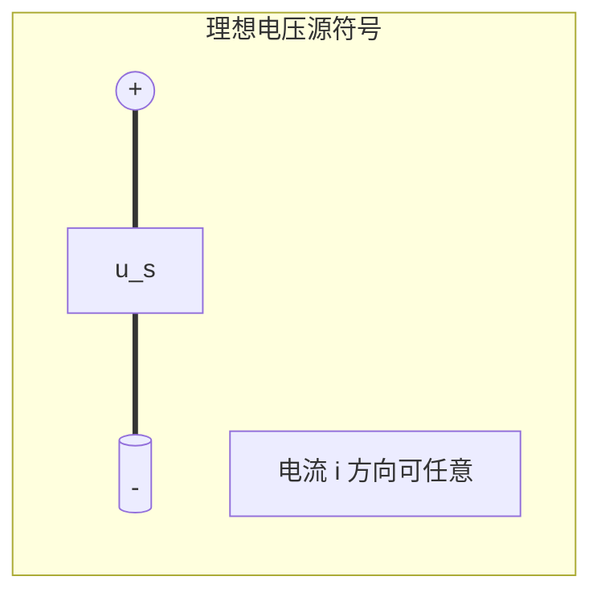
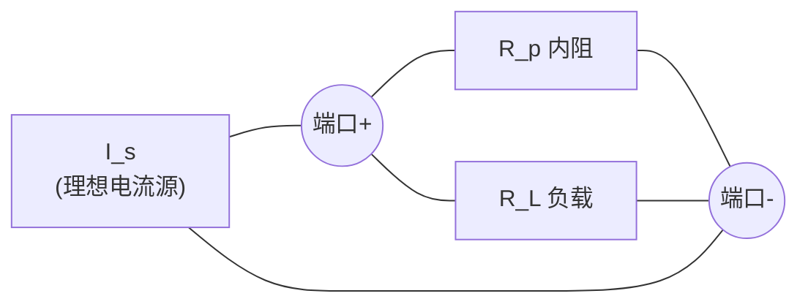
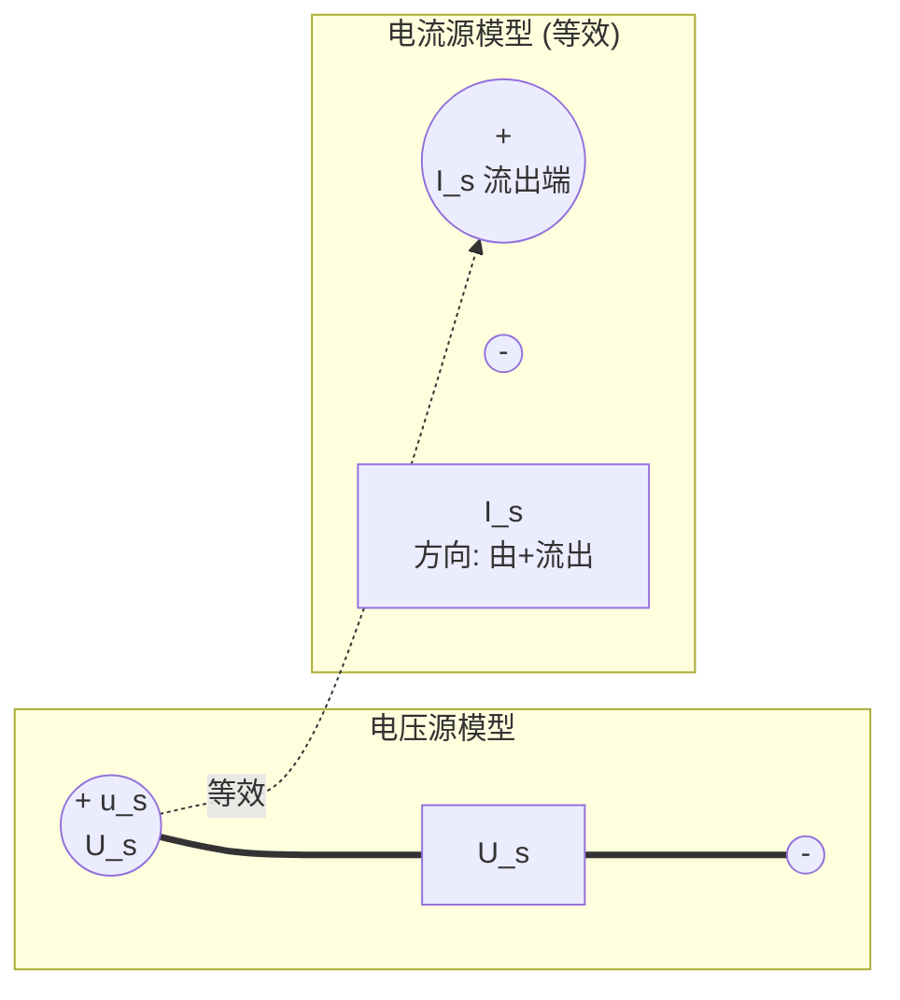

# 2.2 电压源、电流源、电源等效变换

> [!info] 本节定位
> 实际电源既非理想电压源也非理想电流源：带载后端电压会随负载变化。为用 [[2.1 电阻串并联、分压分流公式]] 的串并联方法分析含源网络，需要建立**实际电源的电路模型**，并在两种模型（戴维南形式 / 诺顿形式）之间进行**等效变换**，从而把多个电源合并化简。本节是 [[2.4 叠加定理、戴维南定理、诺顿定理]] 中"求等效内阻"和"求等效电源"的直接前置。

## 一、理想电压源

> [!definition] 理想电压源
> 理想电压源是一个二端元件，其**端电压 $u_s$ 由电源自身决定，与流过它的电流 $i$ 无关**（即与外接负载无关）；流过它的电流由外电路决定。

### 1.1 伏安特性

$$u = u_s \quad (\text{对任意 } i)$$

在 $u$-$i$ 平面上是一条**平行于 $i$ 轴、纵截距为 $u_s$ 的水平直线**。



### 1.2 重要性质

> [!theorem] 理想电压源的关键性质
> 1. 端电压恒定，不随负载变化。
> 2. 流过的电流 $i = u_s / R_L$ 完全由外电路决定；$R_L \to 0$（短路）时 $i \to \infty$，故**理想电压源不允许短路**。
> 3. 与理想电压源并联的任何元件（电阻、电流源等）**不影响端口电压**，对外等效时可被去掉（求等效内阻时并联元件开路保留电压源）。
> 4. 多个理想电压源**串联**可等效为一个，等效电压为各电压源代数和（同向相加，反向相减）。

> [!warning] 理想电压源并联
> 仅当各电压源**电压相等、极性相同**时才允许并联，否则违反 KVL（形成无穷大环流）。实际工程中绝不应将不同电压的理想电压源直接并联。

## 二、理想电流源

> [!definition] 理想电流源
> 理想电流源是一个二端元件，其**输出电流 $i_s$ 由电源自身决定，与端电压 $u$ 无关**；其端电压由外电路决定。

### 2.1 伏安特性

$$i = i_s \quad (\text{对任意 } u)$$

在 $u$-$i$ 平面上是一条**平行于 $u$ 轴、横截距为 $i_s$ 的竖直直线**。

### 2.2 重要性质

> [!theorem] 理想电流源的关键性质
> 1. 输出电流恒定，不随负载变化。
> 2. 端电压 $u = i_s \cdot R_L$ 完全由外电路决定；$R_L \to \infty$（开路）时 $u \to \infty$，故**理想电流源不允许开路**。
> 3. 与理想电流源串联的任何元件**不影响端口电流**，对外等效时可被去掉（短接）。
> 4. 多个理想电流源**并联**可等效为一个，等效电流为各电流源代数和（同向相加，反向相减）。

> [!warning] 理想电流源串联
> 仅当各电流源**电流相等、方向相同**时才允许串联，否则违反 KCL。

## 三、实际电源的两种模型

实际电源带载后端电压会随负载电流增大而下降，说明内部存在"内阻"分压（或分流）效应。可用两种模型描述。

### 3.1 实际电压源（戴维南形式）

> [!definition] 实际电压源模型
> 理想电压源 $U_s$ **串联内阻 $R_s$**，端电压随输出电流增大而下降：
> $$u = U_s - R_s \, i$$
> 内阻 $R_s$ 越小，越接近理想电压源（带载能力强）。

```mermaid
flowchart LR
    Us["U_s<br/>(理想电压源)"] --- A((+))
    A --- Rs[R_s 内阻] --- B((端口))
    B --- R_load[R_L 负载]
    R_load --- C((-))
    C --- Us
```

外特性曲线：在 $u$-$i$ 平面上是斜率为 $-R_s$、纵截距 $U_s$ 的下降直线。

### 3.2 实际电流源（诺顿形式）

> [!definition] 实际电流源模型
> 理想电流源 $I_s$ **并联内阻 $R_p$**，输出电流随端电压增大而减小（部分电流被内阻分流）：
> $$i = I_s - \frac{u}{R_p}$$
> 内阻 $R_p$ 越大，越接近理想电流源（带载能力强）。



## 四、电源等效变换

### 4.1 等效变换条件

> [!theorem] 实际电压源与实际电流源的等效变换
> 若实际电压源（$U_s$ 串 $R_s$）与实际电流源（$I_s$ 并 $R_p$）的端口伏安关系完全相同，则二者对外电路等效。比较两模型伏安关系：
>
> 电压源模型：$u = U_s - R_s i \;\Rightarrow\; i = \dfrac{U_s}{R_s} - \dfrac{u}{R_s}$
>
> 电流源模型：$i = I_s - \dfrac{u}{R_p}$
>
> 两式恒相等，得等效条件：
> $$\boxed{R_s = R_p \;\triangleq\; R_{\text{eq}}, \quad U_s = R_{\text{eq}} \cdot I_s \;\;(\text{即 } I_s = U_s / R_{\text{eq}})}$$

即内阻数值相等，且电压源电压等于电流源电流乘以内阻。

### 4.2 方向关系（关键易错点）

> [!warning] 等效变换时的极性/方向对应
> 变换前后必须保证**开路电压方向一致、短路电流方向一致**：
> - 电压源 $U_s$ 的"+"端对应电流源 $I_s$ 流出的端钮；
> - 即电流源 $I_s$ 的方向是从电压源"+"端**流出**、经外电路回到"−"端。
>
> 反之，将电流源化为电压源时，$U_s$ 的"+"极性取 $I_s$ 流出端。



### 4.3 等效变换应用步骤

> [!tip] 用电源等效变换化简含源网络的步骤
> 1. 把混联电源逐个统一为同一种形式（全电压源或全电流源）。
> 2. 串联的电压源合并（电压代数和）；并联的电流源合并（电流代数和）。
> 3. 串联的电压源串内阻可与外接电阻合并为新内阻；并联的电流源并内阻可与外接电阻合并为新内阻。
> 4. 反复"电压源串电阻 ⇄ 电流源并电阻"变换，逐步把网络化为单回路或双节点。
> 5. 求出端口响应后，再回到原电路求各支路量。

> [!note] 等效变换的局限
> 等效变换只保证**端口**伏安关系相同，不保证内部功率相同。求电源内部损耗功率、内阻上电流时，必须回到**原模型**计算，不能用等效模型代替。

## 五、典型例题

### 例题 1：电压源化为电流源

> [!example] 例题 1
> 实际电压源 $U_s = 12\,\text{V}$ 串联内阻 $R_s = 4\,\Omega$，将其等效为电流源模型，并求两种模型在负载 $R_L = 8\,\Omega$ 下的输出电流与端电压。

**解：**

1. 等效电流：$I_s = U_s / R_s = 12/4 = 3\,\text{A}$，内阻 $R_p = R_s = 4\,\Omega$。
2. 电流源 $I_s$ 方向：从电压源"+"端流出。
3. 验证（电压源模型）：
   - $i = U_s/(R_s + R_L) = 12/(4+8) = 1\,\text{A}$
   - $u = i \cdot R_L = 1 \times 8 = 8\,\text{V}$
4. 验证（电流源模型）：$R_p \parallel R_L = 4 \times 8/(4+8) = 32/12 = 8/3\,\Omega$
   - $u = I_s \cdot (R_p \parallel R_L) = 3 \times 8/3 = 8\,\text{V}$ ✓
   - $i = u/R_L = 8/8 = 1\,\text{A}$ ✓

两种模型端口响应完全一致，验证了等效性。

### 例题 2：多电源网络化简

> [!example] 例题 2
> 电路含两支路并联于端口 a-b：支路1 为 $U_{s1} = 10\,\text{V}$ 串 $R_1 = 2\,\Omega$（"+"接 a）；支路2 为 $U_{s2} = 6\,\text{V}$ 串 $R_2 = 2\,\Omega$（"+"接 a）。求端口 a-b 的戴维南等效（开路电压与等效内阻）。

**解：**

1. 将两电压源支路化为电流源：
   - 支路1：$I_{s1} = U_{s1}/R_1 = 10/2 = 5\,\text{A}$ 并 $R_1 = 2\,\Omega$，方向由 a 流出（因 $U_{s1}$"+"接 a）。
   - 支路2：$I_{s2} = U_{s2}/R_2 = 6/2 = 3\,\text{A}$ 并 $R_2 = 2\,\Omega$，方向由 a 流出。
2. 两电流源并联合并：$I_s = I_{s1} + I_{s2} = 5 + 3 = 8\,\text{A}$（同向相加）。
3. 两内阻并联：$R_p = R_1 \parallel R_2 = 2 \times 2/(2+2) = 1\,\Omega$。
4. 开路电压（端电压）：$U_{oc} = I_s \cdot R_p = 8 \times 1 = 8\,\text{V}$（a 正 b 负）。
5. 化回电压源模型：$U_s = U_{oc} = 8\,\text{V}$，$R_s = R_p = 1\,\Omega$。

校验（直接分压法）：两电压源串两内阻形成单回路，回路电流 $i = (U_{s1}-U_{s2})/(R_1+R_2) = (10-6)/4 = 1\,\text{A}$（由 $U_{s1}$ 驱动，经 a 流向 b 再回 $U_{s2}$）；$U_{ab} = U_{s2} + i \cdot R_2 = 6 + 1 \times 2 = 8\,\text{V}$ ✓

### 例题 3：含电流源串联支路的化简

> [!example] 例题 3
> 端口 a-b 间有电流源 $I_s = 2\,\text{A}$ 串联电阻 $R = 5\,\Omega$ 后并联负载，求对外等效电路。

**解：**

与理想电流源串联的电阻不影响端口电流（性质 3），对外等效时该电阻可短接去掉。故端口对外等效为理想电流源 $I_s = 2\,\text{A}$，无内阻并联（即 $R_p \to \infty$）。

> [!warning] 但若求 $R = 5\,\Omega$ 上的功率或电流，必须回到原电路：电流源电流 $2\,\text{A}$ 全部流过 $R$，$P_R = I_s^2 R = 4 \times 5 = 20\,\text{W}$，等效电路中已无此电阻，不能在等效模型中求。

## 六、本节要点小结

| 电源类型 | 模型 | 端口关系 | 内阻影响 |
| ---- | ---- | ---- | ---- |
| 理想电压源 | $U_s$（无内阻） | $u = U_s$ | $R_s = 0$，不可短路 |
| 理想电流源 | $I_s$（无内阻） | $i = I_s$ | $R_p = \infty$，不可开路 |
| 实际电压源 | $U_s$ 串 $R_s$ | $u = U_s - R_s i$ | $R_s$ 越小越理想 |
| 实际电流源 | $I_s$ 并 $R_p$ | $i = I_s - u/R_p$ | $R_p$ 越大越理想 |

> [!summary] 等效变换口诀
> "串压并流，方向对应；内阻相等，$U=IR$；求外用等效，求内回原模。"

## 章节导航

- [[MOC - 第2章|本章导航]]
- 上一节：[[2.1 电阻串并联、分压分流公式]]
- 下一节：[[2.3 支路电流法、节点电压法]]
- 相关：[[2.4 叠加定理、戴维南定理、诺顿定理]]、[[2.5 最大功率传输定理]]
