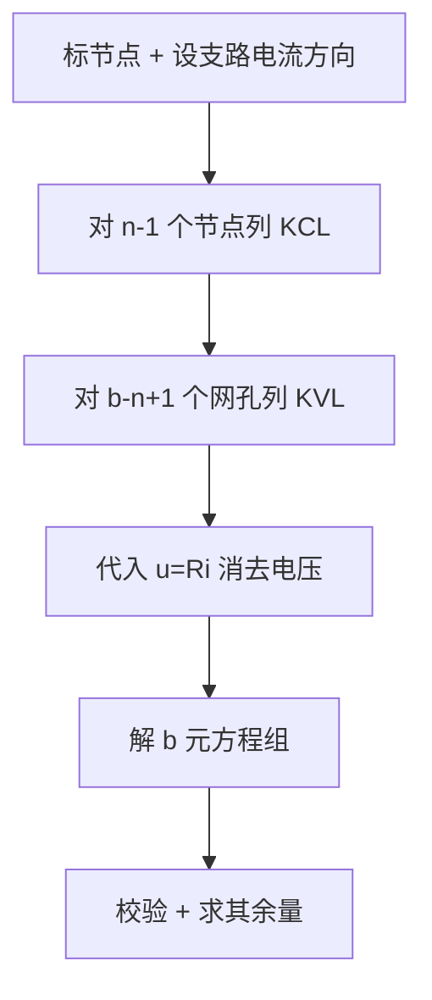

# 2.3 支路电流法、节点电压法

> [!info] 本节定位
> 当电路**无法用串并联和电源等效变换直接化简**（如多回路、多电源交叉耦合）时，需要回到电路最根本的约束——KCL 与 KVL，建立方程组求解。本节给出两类**通用系统化方法**：
> 1. **支路电流法**：以支路电流为未知量，直接列写 KCL+KVL，是最基础的"暴力法"；
> 2. **节点电压法**：以节点电压为未知量，只列 KCL，是**工程上最常用、方程数最少**的方法，也是本章核心。
> 这两种方法构成 [[2.4 叠加定理、戴维南定理、诺顿定理]] 求开路电压、短路电流的计算基础。

## 一、支路电流法

### 1.1 基本思想

> [!definition] 支路电流法
> 以每条支路的电流为未知量，对电路列写**独立的 KCL 方程和 KVL 方程**，解出全部支路电流，再由欧姆定律求各支路电压。

设电路有 $b$ 条支路、$n$ 个节点。需要 $b$ 个独立方程：

> [!theorem] 支路电流法方程数
> - **KCL 方程**：$n-1$ 个（任选一个节点作参考节点，对其余 $n-1$ 个节点列 KCL）。
> - **KVL 方程**：$b - (n-1) = b - n + 1$ 个（沿 $b-n+1$ 个独立回路列 KVL）。
> - 合计 $b$ 个方程，恰好解 $b$ 个支路电流。

### 1.2 标准步骤

> [!tip] 支路电流法解题步骤
> 1. **标节点**：给各节点编号，选定参考节点。
> 2. **设支路电流**：为每条支路设定电流参考方向（箭头），并在图上标出。
> 3. **列 KCL**：对 $n-1$ 个非参考节点列 $\sum i_{\text{入}} = \sum i_{\text{出}}$（流入取正、流出取负，或反之统一即可）。
> 4. **选独立回路列 KVL**：通常选**网孔**（平面电路的内回路，自动独立），沿回路绕行方向列 $\sum u = 0$（电压降取正、电压升取负）。
> 5. **代入欧姆定律** $u_k = R_k i_k$，把 KVL 中的电压用支路电流表示。
> 6. **解 $b$ 元方程组**，得各支路电流。
> 7. **校验**：用未列方程的回路验证 KVL，或用参考节点验证 KCL。

### 1.3 注意事项

> [!warning] 支路电流法的常见陷阱
> 1. **含电流源支路**：电流源支路电流已知，无需再设未知量；但其端电压未知，KVL 回路经过它时需设为额外未知量，或选**不经过电流源**的回路列 KVL。
> 2. **含受控源**：先把受控源当独立源处理，再补一个**控制量方程**（把控制量用支路电流表示）。
> 3. **回路独立性**：选网孔可保证独立；若选非网孔回路，须保证每个新回路至少含一条未被用过的新支路。
> 4. **方向约定**：参考方向任意，但一旦设定，KCL/KVL 中符号必须与之一致；结果为负表示真实方向与参考方向相反。

### 1.4 例题：支路电流法

> [!example] 例题 1
> 两电压源并联供电电路：节点 A 连接 $U_{s1}=10\,\text{V}$ 串 $R_1=2\,\Omega$ 到节点 B（参考节点），$U_{s2}=8\,\text{V}$ 串 $R_2=2\,\Omega$ 到节点 B，A-B 间接负载 $R_3=4\,\Omega$。求各支路电流。

**解：**

1. 支路数 $b=3$，节点数 $n=2$（A、B），需 3 个方程：1 个 KCL + 2 个 KVL。
2. 设支路电流 $i_1$（经 $R_1$ 由 B 流向 A 方向——即 $U_{s1}$ 驱动）、$i_2$（经 $R_2$ 由 B 流向 A）、$i_3$（经 $R_3$ 由 A 流向 B），方向均标于图。
3. KCL（节点 A）：$i_1 + i_2 = i_3$。
4. KVL（回路1：$U_{s1}$-$R_1$-$R_3$）：$-U_{s1} + R_1 i_1 + R_3 i_3 = 0$，即 $2 i_1 + 4 i_3 = 10$。
5. KVL（回路2：$U_{s2}$-$R_2$-$R_3$）：$-U_{s2} + R_2 i_2 + R_3 i_3 = 0$，即 $2 i_2 + 4 i_3 = 8$。
6. 代入 $i_3 = i_1 + i_2$：
   - $2 i_1 + 4(i_1 + i_2) = 10 \Rightarrow 6 i_1 + 4 i_2 = 10$
   - $2 i_2 + 4(i_1 + i_2) = 8 \Rightarrow 4 i_1 + 6 i_2 = 8$
7. 联立解：$18 i_1 + 12 i_2 = 30$，$8 i_1 + 12 i_2 = 16$，相减 $10 i_1 = 14 \Rightarrow i_1 = 1.4\,\text{A}$；回代 $6(1.4) + 4 i_2 = 10 \Rightarrow 4 i_2 = 1.6 \Rightarrow i_2 = 0.4\,\text{A}$；$i_3 = 1.4 + 0.4 = 1.8\,\text{A}$。
8. 校验：$R_3$ 两端电压 $u_{AB} = R_3 i_3 = 4 \times 1.8 = 7.2\,\text{V}$；$U_{s1} - R_1 i_1 = 10 - 2 \times 1.4 = 7.2\,\text{V}$ ✓；$U_{s2} - R_2 i_2 = 8 - 2 \times 0.4 = 7.2\,\text{V}$ ✓。

## 二、节点电压法（核心方法）

### 2.1 基本思想

> [!definition] 节点电压法
> 选一个节点为**参考节点**（电位取 0），其余 $n-1$ 个节点的电位称为**节点电压**。以节点电压为未知量，对每个非参考节点列 KCL，解出节点电压后再求支路电流。

> [!theorem] 节点电压法的方程数
> 仅需 $n-1$ 个 KCL 方程，比支路电流法的 $b$ 个方程**少 $b-n+1$ 个**。对节点少、支路多的电路（如电子电路）尤为高效，是工程首选方法。

### 2.2 标准步骤

> [!tip] 节点电压法解题步骤
> 1. **选参考节点**：通常选支路最多、或连接电源最多的节点，便于列方程。
> 2. **设节点电压**：其余 $n-1$ 个节点电位设为 $u_{n1}, u_{n2}, \dots, u_{n(n-1)}$（相对参考点）。
> 3. **列 KCL**：对每个非参考节点，列出"流出该节点的电流代数和 = 0"。
> 4. **用节点电压表示支路电流**：
>    - 电阻支路 $R$ 连接节点 $p$、$q$：$i = (u_{np} - u_{nq})/R$（由 $p$ 流向 $q$）。
>    - 串联电阻+电压源支路：把电压源移到等号右边（视为已知注入电流）。
> 5. **整理成标准形式** $\sum G_{pk} u_{nk} = \sum i_{sp}$，解线性方程组。
> 6. **求支路电流** $i_k = (u_{np} - u_{nq})/R_k$，并校验。

### 2.3 标准节点方程的形式

对节点 $p$，KCL 方程可写成：

$$\boxed{\sum_{q \neq p} G_{pq}(u_{np} - u_{nq}) = \sum i_{sp}}$$

其中：
- $G_{pq} = 1/R_{pq}$ 为节点 $p$ 与 $q$ 之间直接连接的电阻的电导；
- 等号左端为从节点 $p$ 经各电阻**流出**的电流之和；
- 等号右端 $\sum i_{sp}$ 为流入节点 $p$ 的**等效电源电流**之和。

整理为：

$$G_{pp} u_{np} - \sum_{q \neq p} G_{pq} u_{nq} = \sum i_{sp}$$

其中 $G_{pp} = \sum_{q \neq p} G_{pq}$ 称为节点 $p$ 的**自电导**（与 $p$ 相连的所有电阻电导之和），$G_{pq}$ 为节点 $p$、$q$ 间的**互电导**（取负号）。

> [!note] 等效电源电流 $\sum i_{sp}$ 的来源
> - 与节点 $p$ 直接相连的**独立电流源**：流入 $p$ 取正，流出取负。
> - 电压源 $U_s$ 串联电阻 $R$ 支路连接 $p$ 与参考点：等效为注入电流 $U_s / R$（$U_s$ 正极朝 $p$ 时取正）。
> - 电压源串联电阻支路连接 $p$ 与 $q$：注入 $p$ 的电流为 $U_s/R$（按极性取正负），同时该支路电导 $1/R$ 仍计入自电导与互电导。

### 2.4 含纯电压源支路的处理

> [!warning] 纯电压源（无串联电阻）支路的处理
> 纯电压源支路电流不能用 $(u_{np}-u_{nq})/R$ 表示（$R=0$，电导无穷）。两种处理方法：
> 1. **参考节点法**：把纯电压源一端定为参考节点，则另一端节点电压**已知**（等于电压源电压），该节点不必列方程，方程数减 1。
> 2. **超节点（广义节点）法**：把电压源两端节点连同电压源看成一个"超节点"，对超节点整体列一个 KCL（两节点 KCL 相加，消去流过电压源的内部电流），再补一个约束方程 $u_{np} - u_{nq} = U_s$。

### 2.5 节点电压法的优缺点

> [!summary] 节点电压法适用与优缺点
> **优点**：
> - 方程数少（$n-1$），尤其适合节点少、支路多的电路；
> - 步骤规整、便于编程（标准形式 $G U = I$）；
> - 对非平面电路同样适用（不依赖网孔）。
>
> **缺点**：
> - 含纯电压源时需特殊处理（超节点或选参考点）；
> - 含受控源时需补控制量方程，矩阵不再对称；
> - 节点多、支路少的电路（如单回路）反不如网孔法简洁。

## 三、典型例题

### 例题 2：节点电压法（基本形式）

> [!example] 例题 2
> 用节点电压法重解例题 1：节点 A 经 $R_1=2\,\Omega$ 接 $U_{s1}=10\,\text{V}$ 到参考点 B，经 $R_2=2\,\Omega$ 接 $U_{s2}=8\,\text{V}$ 到 B，A-B 间接 $R_3=4\,\Omega$。$U_{s1}$、$U_{s2}$ 正极均朝 A。求 $u_A$ 及各支路电流。

**解：**

1. 选 B 为参考点，$u_B = 0$，未知量仅 $u_A$。
2. 节点 A 的自电导：$G_{AA} = 1/R_1 + 1/R_2 + 1/R_3 = 1/2 + 1/2 + 1/4 = 1.25\,\text{S}$。
3. 等效电源电流（电压源串电阻化为电流源注入 A）：
   - $U_{s1}/R_1 = 10/2 = 5\,\text{A}$（正极朝 A，注入 A 取正）
   - $U_{s2}/R_2 = 8/2 = 4\,\text{A}$（注入 A 取正）
   - $\sum i_{sA} = 5 + 4 = 9\,\text{A}$
4. 节点方程：$G_{AA} \cdot u_A = \sum i_{sA}$，即 $1.25 \, u_A = 9$。
5. 解得：$u_A = 9/1.25 = 7.2\,\text{V}$。
6. 求支路电流（由 A 流向 B 为正）：
   - $i_1$（$R_1$ 支路，A→B）：$i_1 = (u_A - U_{s1})/R_1 = (7.2 - 10)/2 = -1.4\,\text{A}$（负号表示实际由 B 流向 A，即 $U_{s1}$ 放出 $1.4\,\text{A}$，与例题 1 一致）。
   - $i_2$（$R_2$ 支路，A→B）：$i_2 = (u_A - U_{s2})/R_2 = (7.2 - 8)/2 = -0.4\,\text{A}$（实际由 B 流向 A，$0.4\,\text{A}$）。
   - $i_3$（$R_3$ 支路，A→B）：$i_3 = u_A/R_3 = 7.2/4 = 1.8\,\text{A}$。
7. 校验 KCL（节点 A）：$i_1 + i_2 + i_3 = -1.4 + (-0.4) + 1.8 = 0$ ✓

与支路电流法结果完全一致，但只需 1 个方程。

### 例题 3：含电流源与多节点的电路

> [!example] 例题 3
> 三节点电路：参考节点 0；节点 1 经 $R_1=2\,\Omega$ 接 0，经 $R_2=4\,\Omega$ 接节点 2；节点 2 经 $R_3=2\,\Omega$ 接 0；节点 1 接入电流源 $I_{s1}=6\,\text{A}$ 流入，节点 2 接入电流源 $I_{s2}=2\,\text{A}$ 流出。求 $u_1, u_2$。

**解：**

1. 未知量 $u_1, u_2$，列两个节点方程。
2. 节点 1：
   - 自电导 $G_{11} = 1/R_1 + 1/R_2 = 1/2 + 1/4 = 0.75\,\text{S}$
   - 互电导 $G_{12} = 1/R_2 = 0.25\,\text{S}$
   - 注入电流 $\sum i_{s1} = I_{s1} = 6\,\text{A}$
   - 方程：$0.75 u_1 - 0.25 u_2 = 6$
3. 节点 2：
   - 自电导 $G_{22} = 1/R_2 + 1/R_3 = 1/4 + 1/2 = 0.75\,\text{S}$
   - 互电导 $G_{21} = 1/R_2 = 0.25\,\text{S}$
   - 注入电流 $\sum i_{s2} = -I_{s2} = -2\,\text{A}$（电流源流出节点 2）
   - 方程：$-0.25 u_1 + 0.75 u_2 = -2$
4. 联立求解：
   - 由方程1：$0.75 u_1 - 0.25 u_2 = 6 \Rightarrow 3 u_1 - u_2 = 24 \Rightarrow u_2 = 3 u_1 - 24$
   - 代入方程2：$-0.25 u_1 + 0.75(3 u_1 - 24) = -2 \Rightarrow -0.25 u_1 + 2.25 u_1 - 18 = -2 \Rightarrow 2 u_1 = 16 \Rightarrow u_1 = 8\,\text{V}$
   - $u_2 = 3 \times 8 - 24 = 0\,\text{V}$
5. 校验 KCL（节点 1）：流出的电流 $= u_1/R_1 + (u_1 - u_2)/R_2 = 8/2 + 8/4 = 4 + 2 = 6\,\text{A} = I_{s1}$ ✓
6. 节点 2 校验：流入 $= (u_1 - u_2)/R_2 = 2\,\text{A}$，流出 $= u_2/R_3 + I_{s2} = 0/2 + 2 = 2\,\text{A}$ ✓

### 例题 4：含纯电压源（超节点法）

> [!example] 例题 4
> 节点 A 经 $R_1=4\,\Omega$ 接参考点 0；节点 B 经 $R_2=2\,\Omega$ 接 0；A、B 间接理想电压源 $U_s=6\,\text{V}$（A 正 B 负）；节点 A 另接电流源 $I_s=3\,\text{A}$ 流入。求 $u_A, u_B$。

**解：**

A、B 间纯电压源无串联电阻，用超节点法。

1. 约束方程：$u_A - u_B = U_s = 6$。
2. 把 A、B 视为一个超节点，列 KCL（流出超节点的电流和 = 流入）：
   - 经 $R_1$ 流出 A 到 0：$u_A / R_1 = u_A/4$
   - 经 $R_2$ 流出 B 到 0：$u_B / R_2 = u_B/2$
   - 注入超节点的电流源：$I_s = 3\,\text{A}$
   - 方程：$u_A/4 + u_B/2 = 3$
3. 联立：
   - $u_A = u_B + 6$
   - $(u_B + 6)/4 + u_B/2 = 3 \Rightarrow u_B/4 + 1.5 + u_B/2 = 3 \Rightarrow 3u_B/4 = 1.5 \Rightarrow u_B = 2\,\text{V}$
   - $u_A = 2 + 6 = 8\,\text{V}$
4. 校验：$u_A/4 + u_B/2 = 8/4 + 2/2 = 2 + 1 = 3\,\text{A} = I_s$ ✓

## 四、两种方法对比

| 方法 | 未知量 | 方程数 | 适用场景 | 关键约束 |
| ---- | ---- | ---- | ---- | ---- |
| 支路电流法 | 支路电流 $i_k$ | $b$（$n-1$ KCL + $b-n+1$ KVL） | 支路少、教学直观 | 网孔独立 |
| 节点电压法 | 节点电压 $u_{nk}$ | $n-1$（仅 KCL） | 节点少、工程首选 | 纯电压源需超节点 |

> [!summary] 选择建议
> - 节点数 $n \leq$ 网孔数 → 用节点电压法；
> - 仅需求某一支路电流 → 先用 [[2.4 叠加定理、戴维南定理、诺顿定理]] 化简；
> - 含大量电流源 → 节点电压法更优（电流源直接进入 $\sum i_s$）。

## 章节导航

- [[MOC - 第2章|本章导航]]
- 上一节：[[2.2 电压源、电流源、电源等效变换]]
- 下一节：[[2.4 叠加定理、戴维南定理、诺顿定理]]
- 相关：[[2.1 电阻串并联、分压分流公式]]、[[2.5 最大功率传输定理]]
