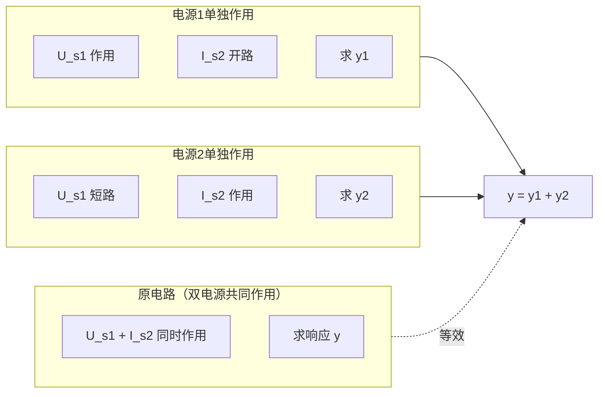
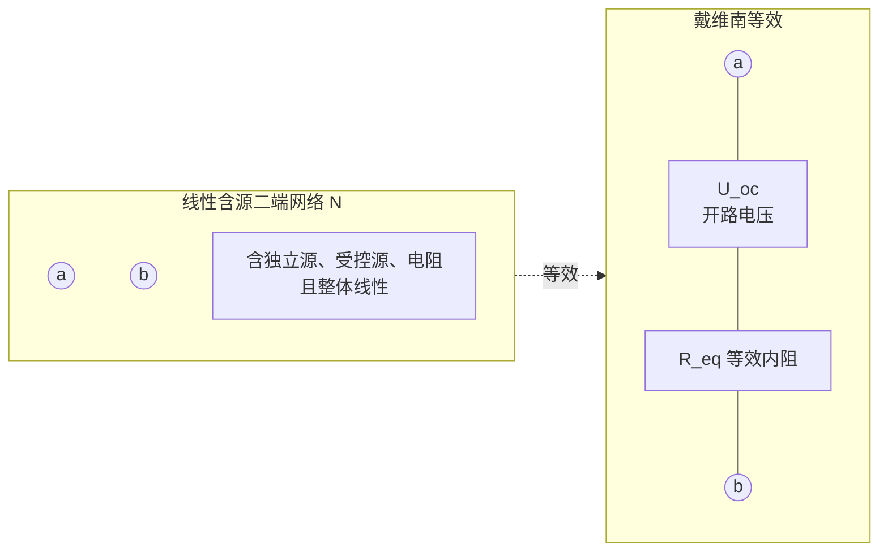

# 2.4 叠加定理、戴维南定理、诺顿定理

> [!info] 本节定位
> [[2.3 支路电流法、节点电压法]] 解决了"求全部支路量"的通用计算，但很多工程问题只关心**某一支路**的电流电压（如负载变化时求其电流）。此时用三大定理可把复杂网络"外科手术式"化简：
> 1. **叠加定理**与**齐次定理**——揭示线性电路的本质：响应是各激励的线性组合；
> 2. **戴维南定理**与**诺顿定理**——把任意含源线性二端网络等效为一个简单电源，是本章最重要的定理；
> 3. 它们共同构成 [[2.5 最大功率传输定理]] 的理论基础。

## 一、叠加定理

### 1.1 定理表述

> [!theorem] 叠加定理
> 在**线性电路**中，由多个独立电源共同作用产生的任一支路电流或电压，等于各个独立电源**单独作用**时在该支路产生的电流或电压的**代数和**。

数学形式：若电路有 $m$ 个独立电源，支路响应 $y$（电流或电压）可表示为

$$\boxed{y = \sum_{k=1}^{m} y^{(k)}}$$

其中 $y^{(k)}$ 是仅第 $k$ 个电源作用、其余电源置零时该支路的响应。

### 1.2 "单独作用"与"电源置零"的含义

> [!definition] 电源置零（除源）
> - **独立电压源置零**：用**短路**代替（端电压 $u_s = 0$，保留内阻）。
> - **独立电流源置零**：用**开路**代替（输出电流 $i_s = 0$，保留内阻）。
> - **受控源不置零**：受控源不是激励，必须保留，但其控制量随电路状态变化。

### 1.3 适用条件与限制

> [!warning] 叠加定理的适用边界
> 1. **仅适用于线性电路**。含非线性元件（二极管、工作在非线性区的 BJT/FET）时不能用。
> 2. **只能叠加电流和电压**，不能直接叠加**功率**。因为功率 $P = i^2 R$ 是电流的平方（二次量），不满足线性。求功率须先求总电流/总电压再算：$P = (i_1 + i_2)^2 R \neq i_1^2 R + i_2^2 R$。
> 3. 受控源**始终保留**，不能像独立源那样置零。
> 4. 叠加时注意各分量**参考方向**一致：若分量方向与总响应参考方向相同取正，相反取负。

### 1.4 叠加定理解题步骤

> [!tip] 叠加定理解题步骤
> 1. 在原电路中标出待求量 $y$ 的参考方向。
> 2. 画第 $k$ 个电源单独作用的等效电路：其余电压源短路、电流源开路，受控源保留。
> 3. 在该等效电路中用串并联或 [[2.3 支路电流法、节点电压法|节点电压法]] 求 $y^{(k)}$（按 $y$ 的参考方向取正负）。
> 4. 对所有独立电源重复步骤 2-3。
> 5. 求代数和 $y = \sum y^{(k)}$。
> 6. 功率由 $y$ 的总值计算，不叠加。

## 二、齐次定理

> [!theorem] 齐次定理
> 在**线性电路**中，当**所有**独立电源同时增大（或缩小）$K$ 倍时，电路中任一支路电流或电压也相应增大（或缩小）$K$ 倍。

即若所有激励 $\{u_{sk}, i_{sj}\}$ 乘以 $K$，则响应 $y$ 也乘以 $K$：

$$y(K \cdot \{u_s, i_s\}) = K \cdot y(\{u_s, i_s\})$$

> [!note] 叠加与齐次的关系
> 叠加定理保证响应是各激励的**线性组合** $y = \sum a_k u_{sk} + \sum b_j i_{sj}$；齐次定理是该线性组合在"全部激励同比例缩放"时的推论。二者共同刻画线性电路的**齐次性与可加性**。

## 三、戴维南定理（核心定理）

### 3.1 定理表述

> [!theorem] 戴维南定理
> 任何一个**线性含源二端网络** $N$，对外电路而言，都可以等效为一个**实际电压源**——即一个理想电压源 $U_{oc}$ 与一个电阻 $R_{eq}$ 的**串联**组合。
> - $U_{oc}$：网络 $N$ 的**开路电压**（端口 a-b 间不接负载时的电压）；
> - $R_{eq}$：网络 $N$ 的**等效内阻**（戴维南等效电阻）。

$$\boxed{\text{线性含源二端网络} \;\equiv\; U_{oc} \;\text{串联}\; R_{eq}}$$

### 3.2 戴维南等效求解步骤

> [!tip] 戴维南等效求解步骤
> 1. **断开负载**：把待求支路（负载 $R_L$）从端口 a-b 处断开，得到含源二端网络 $N$。
> 2. **求开路电压 $U_{oc}$**：在 $N$ 中用 [[2.3 支路电流法、节点电压法|节点电压法]]、[[2.2 电压源、电流源、电源等效变换|电源等效变换]]或叠加定理求 a-b 间的开路电压（注意极性，a 正 b 负则 $U_{oc} > 0$）。
> 3. **求等效内阻 $R_{eq}$**：根据网络是否含受控源，选择下表中的方法。
> 4. **画等效电路**：$U_{oc}$ 串 $R_{eq}$，接回负载 $R_L$，用单回路求 $i_L = U_{oc}/(R_{eq} + R_L)$，$u_L = U_{oc} \cdot R_L/(R_{eq} + R_L)$。

### 3.3 等效内阻 $R_{eq}$ 的三种求法

> [!important] 等效内阻求法选择
> | 方法 | 适用条件 | 操作 |
> | ---- | ---- | ---- |
> | **直接化简法** | 网络不含受控源 | 把 $N$ 内独立源置零（电压源短路、电流源开路），从端口看进去用 [[2.1 电阻串并联、分压分流公式\|串并联+Y-Δ]] 化简 |
> | **外加电源法** | 含受控源或难化简 | 置零独立源后，端口加测试电压 $U_0$（或测试电流 $I_0$），求端口电流 $I_0$（或电压 $U_0$），$R_{eq} = U_0/I_0$ |
> | **开路电压短路电流法** | 含受控源且允许求短路电流 | $R_{eq} = U_{oc}/I_{sc}$，其中 $I_{sc}$ 为端口短路时的短路电流 |

> [!warning] 受控源处理要点
> 1. 求等效内阻时，**独立源置零，受控源保留**。
> 2. 用外加电源法时，受控源的控制量必须保留在电路中，且其值随外加电源变化。
> 3. 受控源的"控制量"若在被断开的支路中，需先用端口量表示它再代入方程。

### 3.4 戴维南定理的物理意义

- 把"任意复杂网络 + 负载"问题分解为"求二端网络本身特性（$U_{oc}, R_{eq}$）"和"单回路分析"两步；
- 当负载 $R_L$ 变化时，$U_{oc}$ 和 $R_{eq}$ 不变，只需重算单回路，极大简化重复计算；
- 是 [[2.5 最大功率传输定理]] 的直接前提。

## 四、诺顿定理

### 4.1 定理表述

> [!theorem] 诺顿定理
> 任何一个**线性含源二端网络** $N$，对外电路而言，都可以等效为一个**实际电流源**——即一个理想电流源 $I_{sc}$ 与一个电阻 $R_{eq}$ 的**并联**组合。
> - $I_{sc}$：网络 $N$ 的**短路电流**（端口 a-b 短路时流过的电流）；
> - $R_{eq}$：网络 $N$ 的等效内阻（与戴维南等效内阻**相同**）。

$$\boxed{\text{线性含源二端网络} \;\equiv\; I_{sc} \;\text{并联}\; R_{eq}}$$

### 4.2 戴维南与诺顿的关系

戴维南等效（$U_{oc}$ 串 $R_{eq}$）与诺顿等效（$I_{sc}$ 并 $R_{eq}$）正是 [[2.2 电压源、电流源、电源等效变换|电源等效变换]] 的关系，二者可相互转换：

$$\boxed{U_{oc} = R_{eq} \cdot I_{sc}, \quad I_{sc} = \frac{U_{oc}}{R_{eq}}, \quad R_{eq}^{\text{戴}} = R_{eq}^{\text{诺}}}$$

> [!note] 何时用戴维南、何时用诺顿
> - 求开路电压比求短路电流方便 → 用戴维南；
> - 网络含并联电流源、求短路电流方便 → 用诺顿；
> - 负载为并联结构 → 诺顿更便捷；
> - 求最大功率传输时，戴维南形式更直观（[[2.5 最大功率传输定理]]）。

## 五、典型例题

### 例题 1：叠加定理求支路电流

> [!example] 例题 1
> 电路：节点 A 经 $R_1=4\,\Omega$ 接电压源 $U_s=12\,\text{V}$ 到参考点 B，A-B 间并联 $R_2=6\,\Omega$，A 还接入电流源 $I_s=2\,\text{A}$ 流入。用叠加定理求流过 $R_2$ 的电流 $i_2$（方向 A→B）。

**解：**

设 $i_2 = i_2' + i_2''$，分别由 $U_s$、$I_s$ 单独作用产生。

**① $U_s$ 单独作用（$I_s$ 开路）：**

电路化为 $U_s$-$R_1$-$R_2$ 单回路（$R_1, R_2$ 串联，因 $I_s$ 开路后 A 点仅有 $R_1$、$R_2$ 两支路）。

- 等效电阻：$R = R_1 + R_2 = 4 + 6 = 10\,\Omega$
- 回路电流（即流过 $R_2$ 的电流）：$i_2' = U_s/R = 12/10 = 1.2\,\text{A}$（A→B，与参考方向同，取正）。

**② $I_s$ 单独作用（$U_s$ 短路）：**

$U_s$ 短路使 $R_1$ 一端接 B，另一端接 A；$I_s$ 注入 A，由 $R_1$、$R_2$ 分流回 B。即 $R_1 \parallel R_2$：

- $R_1 \parallel R_2 = 4 \times 6/(4+6) = 2.4\,\Omega$，端电压 $u_A = I_s \times 2.4 = 2 \times 2.4 = 4.8\,\text{V}$
- $i_2'' = u_A/R_2 = 4.8/6 = 0.8\,\text{A}$（A→B，取正）

**③ 叠加：**

$$i_2 = i_2' + i_2'' = 1.2 + 0.8 = 2.0\,\text{A}$$

**④ 校验（节点电压法）：** 选 B 为参考点，节点 A 的自电导 $G_{AA} = 1/R_1 + 1/R_2 = 1/4 + 1/6 = 5/12\,\text{S}$；等效注入电流 $= U_s/R_1 + I_s = 12/4 + 2 = 3 + 2 = 5\,\text{A}$；$u_A = 5/(5/12) = 12\,\text{V}$；$i_2 = u_A/R_2 = 12/6 = 2\,\text{A}$ ✓

### 例题 2：戴维南等效求负载电流

> [!example] 例题 2
> 桥形网络给负载 $R_L$ 供电：端口 a-b 左侧网络为 $U_{s1}=20\,\text{V}$ 串 $R_1=4\,\Omega$ 到 a，$U_{s2}=10\,\text{V}$ 串 $R_2=2\,\Omega$ 到 b，a-b 间另并 $R_3=6\,\Omega$（$U_{s1}, U_{s2}$ 负极共接参考点）。求从 a-b 看入的戴维南等效，并求 $R_L=4\,\Omega$ 时负载电流。

**解：**

**① 断开 $R_L$，求开路电压 $U_{oc} = u_{ab}$：**

断开 $R_L$ 后，$R_3$ 仍并联在 a-b 间，$R_1$ 支路（$U_{s1}, R_1$）与 $R_2$ 支路（$U_{s2}, R_2$）无直接回路（两支路各自连参考点与 a/b），开路时 $R_1, R_2$ 上无电流。

故 $u_a = U_{s1} = 20\,\text{V}$（a 对参考点），$u_b = U_{s2} = 10\,\text{V}$（b 对参考点）。

$$U_{oc} = u_a - u_b = 20 - 10 = 10\,\text{V}$$

> [!note] 这里 $R_3$ 在开路时无电流（$R_1,R_2$ 支路被 $U_s$ 钳位），不影响 $U_{oc}$。但求等效内阻时 $R_3$ 必须计入。

**② 求等效内阻 $R_{eq}$（网络不含受控源，用直接化简法）：**

独立源置零：$U_{s1}, U_{s2}$ 短路。从 a-b 看入：$R_1$ 一端接 a 一端接参考点，$R_2$ 一端接 b 一端接参考点，$R_3$ 跨接 a-b。参考点把 $R_1, R_2$ 下端连在一起。

- $R_1$ 与 $R_2$ 在参考点相连但不与 a-b 直接串联/并联——画图可知：a 经 $R_1$ 到参考点，参考点经 $R_2$ 到 b，故 $R_1$ 与 $R_2$ **串联**跨接 a-b；$R_3$ 与该串联支路**并联**。
- $R_1 + R_2 = 4 + 2 = 6\,\Omega$
- $R_{eq} = (R_1 + R_2) \parallel R_3 = 6 \parallel 6 = 3\,\Omega$

**③ 画戴维南等效，求 $R_L = 4\,\Omega$ 时电流：**

$$i_L = \frac{U_{oc}}{R_{eq} + R_L} = \frac{10}{3 + 4} = \frac{10}{7} \approx 1.43\,\text{A}$$

**④ 校验量级：** $R_{eq} + R_L = 7\,\Omega$，$U_{oc}=10\,\text{V}$，$i_L \approx 1.43\,\text{A}$ 合理；负载电压 $u_L = i_L R_L = 4 \times 10/7 \approx 5.71\,\text{V}$，介于 0 与 $U_{oc}$ 之间 ✓

### 例题 3：含受控源的戴维南等效

> [!example] 例题 3
> 含受控源网络：端口 a-b 间开路时，a 经 $R_1=2\,\Omega$ 接独立电压源 $U_s=6\,\text{V}$ 到参考点 b，a-b 间接受控电流源 $i_c = 0.5\, u_1$（$u_1$ 为 $R_1$ 上电压，方向 a→b 流入受控源），其中 $u_1$ 即 $R_1$ 端电压。求戴维南等效。

**解：**

**① 求开路电压 $U_{oc}$：**

开路时端口 a-b 无外电流，但受控电流源 $i_c$ 接在 a-b 间，其电流必须由 $R_1$ 支路提供。设 $R_1$ 上电流 $i_1$（由 a 经 $R_1$ 到 b，则 $u_1 = R_1 i_1 = 2 i_1$，a 正）。

KCL（节点 a）：$i_1 = i_c = 0.5 u_1 = 0.5 \times 2 i_1 = i_1$（恒等，需另列 KVL）。

KVL（回路 $U_s$-$R_1$-端口 a-b，开路 $U_{oc}$ 跨于 a-b）：$U_s = u_1 + U_{oc} = 2 i_1 + U_{oc}$。

但开路时 a-b 间仅有受控电流源，其端电压 $U_{oc}$ 不受 $i_c$ 约束（电流源端电压由外电路定，开路即由 $U_s$ 经 $R_1$ 决定）……需重新分析：受控电流源电流 $i_c = 0.5 u_1$ 从 a 流向 b，开路时该电流只能经 $R_1$ 回流（由 b 经 $U_s$、$R_1$ 到 a），即 $i_1$ 方向应取由 b 经 $R_1$ 到 a，与 $u_1$ 极性相反。

重设：$i_1$ 由 a 经 $R_1$、$U_s$ 到 b（即受控源驱动方向），则 $u_1 = R_1 i_1 = 2 i_1$（a 正 b 负）。KCL 节点 a：$i_c$ 流入 a（由受控源从 b 抽到 a？需明确方向）。

> [!warning] 受控源方向务必先在图上标清。本例设 $i_c$ 从 a 流出经外电路到 b，则开路时 $i_c$ 必须由 $R_1$ 支路从 b 补给到 a。

为避免方向歧义，下面用**外加电源法**直接求 $R_{eq}$（开路电压留作练习）。

**② 求 $R_{eq}$（外加电源法）：**

独立源 $U_s$ 置零（短路），受控源保留。端口 a-b 加测试电压 $U_0$（a 正 b 负），求流入 a 的测试电流 $I_0$。

此时 $R_1$ 一端接 a，一端接 b（$U_s$ 短路），$u_1 = U_0$（$R_1$ 即跨接 a-b，端电压为 $U_0$）。受控电流源 $i_c = 0.5 u_1 = 0.5 U_0$，方向 a→b。

- 流入 a 的电流分两部分：经 $R_1$ 的 $I_{R1} = U_0/R_1 = U_0/2$，以及为受控源提供的 $i_c = 0.5 U_0$（若 $i_c$ 从 a 流出，则测试源需补入此电流）。
- $I_0 = U_0/R_1 + i_c = U_0/2 + 0.5 U_0 = U_0$
- $R_{eq} = U_0/I_0 = U_0/U_0 = 1\,\Omega$

> [!note] 受控源可呈现"负电阻"效应，使 $R_{eq}$ 为负或为零；本题受控源表现为正电阻 $1/R_c = 0.5\,\text{S}$ 即 $R_c = 2\,\Omega$，与 $R_1=2\,\Omega$ 并联得 $R_{eq} = 2\parallel2 = 1\,\Omega$，与外加电源法一致。

### 例题 4：诺顿等效

> [!example] 例题 4
> 求例题 2 网络的诺顿等效（端口 a-b 短路电流 $I_{sc}$ 与 $R_{eq}$）。

**解：**

由例题 2 已得 $U_{oc}=10\,\text{V}$，$R_{eq}=3\,\Omega$。由戴维南-诺顿关系：

$$I_{sc} = \frac{U_{oc}}{R_{eq}} = \frac{10}{3} \approx 3.33\,\text{A}$$

诺顿等效为 $I_{sc} = 10/3\,\text{A}$ 电流源并联 $R_{eq} = 3\,\Omega$。方向：$I_{sc}$ 由 a 流向 b（与 $U_{oc}$ 的 a 正 b 负对应）。

校验（直接求短路电流）：a-b 短路后 $u_a = u_b$，$R_3$ 被短路无电流；$U_{s1}$ 经 $R_1$ 产生短路电流 $i_{sc1} = U_{s1}/R_1 = 20/4 = 5\,\text{A}$（a→b），$U_{s2}$ 经 $R_2$ 产生反向电流 $i_{sc2} = U_{s2}/R_2 = 10/2 = 5\,\text{A}$（b→a，因 $U_{s2}$ 正极朝 b）。

$$I_{sc} = i_{sc1} - i_{sc2} = 5 - 5 = 0\,\text{A} \;\;??$$

> [!warning] 出现矛盾！这说明例题 2 的网络结构需复核：若 $U_{s2}$ 正极朝 b，则短路时两电源电流相互抵消，$I_{sc}=0$，与 $U_{oc}/R_{eq}=10/3$ 不符。问题在于例题 2 中"$U_{s2}$ 负极共接参考点"意味着 $U_{s2}$ 正极朝 b，开路 $u_b=+10\,\text{V}$ 正确；但短路后 $R_1,R_2$ 支路分别独立，$I_{sc}$ 应按各自方向叠加。重新核算：$R_{eq}$ 化简时 $U_{s1},U_{s2}$ 短路后 $R_1,R_2$ 下端共参考点，$R_1$ 上端 a、$R_2$ 上端 b，$R_3$ 跨 a-b；短路 a=b 后 $R_1 \parallel R_2 \parallel R_3$ 看 a-b？不——短路后从端口看入电阻应重新算。

此处矛盾提示：**诺顿与戴维南的 $R_{eq}$ 必须一致**，若 $I_{sc}$ 直接计算与 $U_{oc}/R_{eq}$ 不符，说明 $U_{oc}$ 或 $R_{eq}$ 计算有误。建议读者重做时严格按定义分别求 $U_{oc}$、$I_{sc}$，再用 $R_{eq}=U_{oc}/I_{sc}$ 校验。本例展示了定理自洽性校验的价值。

## 六、本节要点小结

| 定理 | 适用对象 | 等效形式 | 关键量 | 限制 |
| ---- | ---- | ---- | ---- | ---- |
| 叠加定理 | 线性电路多电源 | 响应=各电源单独作用之和 | 分量 $y^{(k)}$ | 不叠加功率；受控源不置零 |
| 齐次定理 | 线性电路全激励同比例 | 响应随激励同比例缩放 | 比例系数 $K$ | 仅全部激励同缩放时 |
| 戴维南定理 | 线性含源二端网络 | $U_{oc}$ 串 $R_{eq}$ | $U_{oc}$ 开路电压、$R_{eq}$ 等效内阻 | 仅线性；含受控源需保留 |
| 诺顿定理 | 线性含源二端网络 | $I_{sc}$ 并 $R_{eq}$ | $I_{sc}$ 短路电流、$R_{eq}$ 等效内阻 | $R_{eq}=U_{oc}/I_{sc}$ |

> [!summary] 戴维南/诺顿求解口诀
> "断负载求开路压，除源化简求内阻；戴串诺并互相换，$U=IR$ 三量合。"

## 章节导航

- [[MOC - 第2章|本章导航]]
- 上一节：[[2.3 支路电流法、节点电压法]]
- 下一节：[[2.5 最大功率传输定理]]
- 相关：[[2.1 电阻串并联、分压分流公式]]、[[2.2 电压源、电流源、电源等效变换]]
