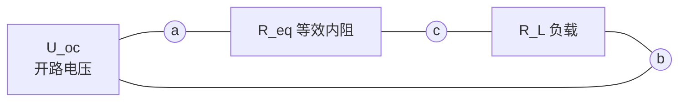
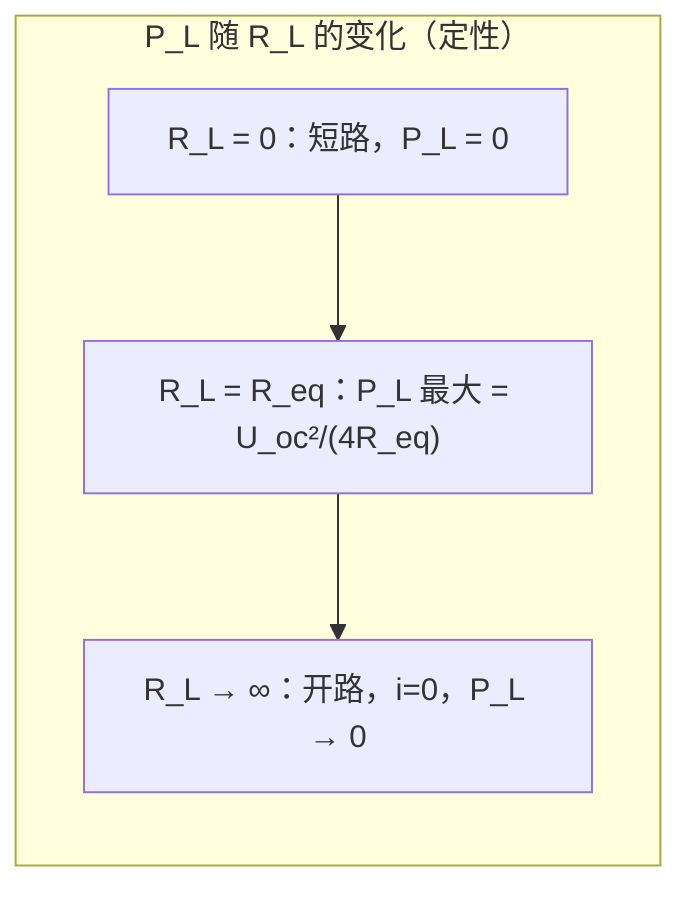

# 2.5 最大功率传输定理

> [!info] 本节定位
> 在电子电路与信号传输中，常需要让负载从含源网络获得**最大功率**（如天线接收、传感器信号放大、音频输出阻抗匹配）。本节用 [[2.4 叠加定理、戴维南定理、诺顿定理|戴维南定理]] 把含源网络等效为 $U_{oc}$ 串 $R_{eq}$，再求负载 $R_L$ 取何值时获得最大功率，并讨论此时的效率。它是直流电阻电路分析的收尾应用，也是后续 [[第3章 正弦交流稳态电路|交流电路]] 中"共轭匹配"的直流原型。

## 一、问题建模

任意线性含源二端网络接负载 $R_L$，由 [[2.4 叠加定理、戴维南定理、诺顿定理|戴维南定理]] 等效为开路电压 $U_{oc}$ 串联等效内阻 $R_{eq}$：

回路电流（即负载电流，方向顺时针）：

$$i_L = \frac{U_{oc}}{R_{eq} + R_L}$$

负载 $R_L$ 获得的功率：

$$P_L = i_L^2 R_L = \left(\frac{U_{oc}}{R_{eq} + R_L}\right)^2 R_L = \frac{U_{oc}^2 \, R_L}{(R_{eq} + R_L)^2}$$

**问题**：$R_L$ 取何值时 $P_L$ 最大？最大功率是多少？

## 二、最大功率传输条件

### 2.1 定理表述

> [!theorem] 最大功率传输定理
> 设线性含源二端网络的戴维南等效为 $U_{oc}$ 串联 $R_{eq}$（$R_{eq} > 0$），则当负载电阻满足
> $$\boxed{R_L = R_{eq}}$$
> 时，负载获得**最大功率**
> $$\boxed{P_{L,\max} = \frac{U_{oc}^2}{4 R_{eq}}}$$
> 此条件称为**负载匹配**（load matching）。

### 2.2 推导

> [!proof] 用求导法推导
> 把 $P_L$ 对 $R_L$ 求导（视 $U_{oc}, R_{eq}$ 为常数）：
> $$P_L = U_{oc}^2 \cdot \frac{R_L}{(R_{eq} + R_L)^2}$$
> 令 $\dfrac{dP_L}{dR_L} = 0$：
> $$\frac{d}{dR_L}\left[\frac{R_L}{(R_{eq} + R_L)^2}\right] = \frac{(R_{eq} + R_L)^2 \cdot 1 - R_L \cdot 2(R_{eq} + R_L)}{(R_{eq} + R_L)^4} = \frac{R_{eq} + R_L - 2 R_L}{(R_{eq} + R_L)^3} = \frac{R_{eq} - R_L}{(R_{eq} + R_L)^3} = 0$$
> 解得 $R_L = R_{eq}$。
>
> 二阶导数或函数变化趋势可验证此为**极大值**点（$R_L < R_{eq}$ 时 $dP_L/dR_L > 0$，$R_L > R_{eq}$ 时 $dP_L/dR_L < 0$）。
>
> 代入 $R_L = R_{eq}$：
> $$P_{L,\max} = \frac{U_{oc}^2 \cdot R_{eq}}{(R_{eq} + R_{eq})^2} = \frac{U_{oc}^2 R_{eq}}{4 R_{eq}^2} = \frac{U_{oc}^2}{4 R_{eq}}$$

### 2.3 $P_L$-$R_L$ 曲线特征

> [!note] 两个边界
> - $R_L = 0$（短路）：$i_L = U_{oc}/R_{eq}$ 最大，但 $R_L$ 上压降为零，$P_L = i^2 \cdot 0 = 0$。
> - $R_L \to \infty$（开路）：$i_L \to 0$，$P_L \to 0$。
> 极值出现在两端之间的 $R_L = R_{eq}$。

## 三、效率问题

### 3.1 效率定义

> [!definition] 传输效率
> 传输效率 $\eta$ 定义为负载功率 $P_L$ 与电源（戴维南等效源）输出功率 $P_s$ 之比：
> $$\eta = \frac{P_L}{P_s} = \frac{i_L^2 R_L}{i_L^2 (R_{eq} + R_L)} = \frac{R_L}{R_{eq} + R_L}$$

### 3.2 匹配时的效率

> [!warning] 最大功率传输时效率仅为 50%
> 当 $R_L = R_{eq}$（匹配）时：
> $$\eta = \frac{R_{eq}}{R_{eq} + R_{eq}} = \frac{1}{2} = 50\%$$
> 即等效内阻 $R_{eq}$ 上消耗的功率与负载获得的功率**相等**，各占一半。

### 3.3 适用场景区分

> [!important] 电力系统 vs 电子电路
> | 场景 | 目标 | 是否追求匹配 |
> | ---- | ---- | ---- |
> | **电力系统**（发电、输电） | 高效率传输电能 | **不追求匹配**。匹配时效率仅 50%，浪费严重；应使 $R_L \gg R_{eq}$（内阻尽量小），效率接近 100% |
> | **电子电路**（信号传输、放大器输出） | 负载获得最大信号功率 | **追求匹配** $R_L = R_{eq}$。信号微弱，效率不是首要目标，关键是让负载拿到最大功率 |
> | **音频、射频** | 阻抗匹配 | 追求匹配，减少反射（交流情况见 [[第3章 正弦交流稳态电路]]） |

> [!warning] 常见误区
> "匹配时效率最高"是错误的。匹配时**负载功率最大**，但效率固定为 50%；效率随 $R_L/R_{eq}$ 增大而趋近 100%（但此时功率趋近 0）。二者是不同优化目标，不能混淆。

## 四、典型例题

### 例题 1：求最大功率及对应负载

> [!example] 例题 1
> 含源线性二端网络戴维南等效为 $U_{oc} = 12\,\text{V}$，$R_{eq} = 3\,\Omega$。求：(1) 负载获得最大功率时的 $R_L$ 与 $P_{L,\max}$；(2) 此时内阻消耗的功率与效率；(3) 若 $R_L = 6\,\Omega$，负载功率与效率。

**解：**

**(1) 匹配条件与最大功率：**

$$R_L = R_{eq} = 3\,\Omega$$

$$P_{L,\max} = \frac{U_{oc}^2}{4 R_{eq}} = \frac{12^2}{4 \times 3} = \frac{144}{12} = 12\,\text{W}$$

**(2) 内阻消耗功率与效率：**

回路电流 $i_L = U_{oc}/(R_{eq} + R_L) = 12/(3+3) = 2\,\text{A}$。

- 内阻消耗：$P_{R_{eq}} = i_L^2 R_{eq} = 2^2 \times 3 = 12\,\text{W}$（恰等于负载功率）。
- 电源输出总功率：$P_s = U_{oc} \cdot i_L = 12 \times 2 = 24\,\text{W}$。
- 效率：$\eta = P_L/P_s = 12/24 = 50\%$ ✓

**(3) $R_L = 6\,\Omega$ 时：**

- $i_L = 12/(3+6) = 12/9 = 4/3\,\text{A} \approx 1.33\,\text{A}$
- $P_L = i_L^2 R_L = (4/3)^2 \times 6 = (16/9) \times 6 = 96/9 \approx 10.67\,\text{W}$（小于 $12\,\text{W}$，符合预期）
- 效率：$\eta = R_L/(R_{eq} + R_L) = 6/9 \approx 66.7\%$（高于 50%，但功率反而降低）

> [!note] 对比可见：$R_L$ 增大后效率上升但功率下降，验证"功率最大"与"效率最高"是不同目标。

### 例题 2：先求戴维南等效再求最大功率

> [!example] 例题 2
> 电路：$U_s = 18\,\text{V}$ 串联 $R_1 = 6\,\Omega$ 后并联 $R_2 = 3\,\Omega$，从并联端口 a-b 引出接负载 $R_L$。求 $R_L$ 为何值时获得最大功率，并求 $P_{L,\max}$。

**解：**

**① 求戴维南等效：**

- **开路电压 $U_{oc}$**：断开 $R_L$，$R_2$ 上无电流（开路），$U_s$ 经 $R_1$ 后端口电压等于 $R_2$ 端电压。因 $R_2$ 开路无电流，$U_{oc} = U_s = 18\,\text{V}$（$R_1$ 上无压降）。

  > [!warning] 这里需复核：断开 $R_L$ 后 $R_2$ 是否仍构成回路？$R_2$ 跨接 a-b，开路后 $R_2$ 一端 a、一端 b，无外回路则 $R_2$ 无电流，$u_a = u_b + 0$……但 $U_s$ 串 $R_1$ 接在 a-b 间，形成 $U_s$-$R_1$-$R_2$ 回路。重算：$R_1, R_2$ 串联分压，$U_{oc} = u_{R_2} = U_s \cdot R_2/(R_1+R_2) = 18 \times 3/(6+3) = 18 \times 1/3 = 6\,\text{V}$。

- **等效内阻 $R_{eq}$**：$U_s$ 短路后，从 a-b 看入为 $R_1 \parallel R_2 = 6 \times 3/(6+3) = 2\,\Omega$。

**② 最大功率：**

$$R_L = R_{eq} = 2\,\Omega$$

$$P_{L,\max} = \frac{U_{oc}^2}{4 R_{eq}} = \frac{6^2}{4 \times 2} = \frac{36}{8} = 4.5\,\text{W}$$

**③ 校验：** 匹配时 $i_L = U_{oc}/(R_{eq}+R_L) = 6/(2+2) = 1.5\,\text{A}$，$P_L = i_L^2 R_L = 1.5^2 \times 2 = 2.25 \times 2 = 4.5\,\text{W}$ ✓

### 例题 3：含受控源网络的最大功率

> [!example] 例题 3
> 端口 a-b 左侧网络：$I_s = 4\,\text{A}$ 流入节点 a，a 经 $R_1 = 2\,\Omega$ 接参考点 b，a-b 间有 CCVS 受控电压源 $u_c = 2 i_1$（$i_1$ 为流过 $R_1$ 的电流，方向 a→b），受控源与 $R_1$ 串联跨接 a-b。求 $R_L$ 获得最大功率的条件与 $P_{L,\max}$。

**解：**

**① 求开路电压 $U_{oc}$：**

开路时 $R_L$ 断开，端口 a-b 无外电流。$I_s$ 注入 a，只能经 $R_1$-受控源串联支路回到 b：$i_1 = I_s = 4\,\text{A}$（a→b 方向）。

- $R_1$ 上电压：$u_{R_1} = R_1 i_1 = 2 \times 4 = 8\,\text{V}$（a 正）
- 受控源电压：$u_c = 2 i_1 = 2 \times 4 = 8\,\text{V}$（极性需按图，设 a 正 b 负）
- 开路电压：$U_{oc} = u_{R_1} + u_c = 8 + 8 = 16\,\text{V}$

**② 求等效内阻（外加电源法）：**

$I_s$ 开路（独立电流源置零），受控源保留。端口加 $U_0$，求 $I_0$。

此时 $R_1$ 与受控源串联跨接 a-b，流过该支路的电流 $i_1$ 同时是受控源控制量。

- 支路方程：$U_0 = R_1 i_1 + u_c = 2 i_1 + 2 i_1 = 4 i_1$，故 $i_1 = U_0/4$。
- $I_0 = i_1 = U_0/4$（仅此一条支路）。
- $R_{eq} = U_0/I_0 = 4\,\Omega$。

**③ 最大功率：**

$$R_L = R_{eq} = 4\,\Omega, \quad P_{L,\max} = \frac{U_{oc}^2}{4 R_{eq}} = \frac{16^2}{4 \times 4} = \frac{256}{16} = 16\,\text{W}$$

**④ 校验：** 匹配时 $i_L = 16/(4+4) = 2\,\text{A}$，$P_L = 2^2 \times 4 = 16\,\text{W}$ ✓；$i_1$ 此时为端口电流 $2\,\text{A}$，受控源 $u_c = 2 \times 2 = 4\,\text{V}$，$u_{R_1}=4\,\text{V}$，端口 $U = 4+4 = 8\,\text{V} = i_L R_L = 2 \times 4 = 8\,\text{V}$ ✓。

## 五、本节要点小结

| 项目 | 公式/结论 |
| ---- | ---- |
| 最大功率条件 | $R_L = R_{eq}$（负载电阻 = 戴维南等效内阻） |
| 最大功率值 | $P_{L,\max} = \dfrac{U_{oc}^2}{4 R_{eq}}$ |
| 匹配时电流 | $i_L = \dfrac{U_{oc}}{2 R_{eq}}$ |
| 匹配时效率 | $\eta = 50\%$ |
| 适用场景 | 电子电路信号传输（非电力系统） |

> [!summary] 求解流程
> "戴维南等效求两量（$U_{oc}, R_{eq}$），令 $R_L = R_{eq}$ 得匹配，$P_{\max} = U_{oc}^2/(4R_{eq})$，效率对半记心上。"

## 章节导航

- [[MOC - 第2章|本章导航]]
- 上一节：[[2.4 叠加定理、戴维南定理、诺顿定理]]
- 下一节：[[MOC - 第3章|第3章 正弦交流稳态电路]]（交流情况的共轭匹配）
- 相关：[[2.1 电阻串并联、分压分流公式]]、[[2.2 电压源、电流源、电源等效变换]]、[[2.3 支路电流法、节点电压法]]
