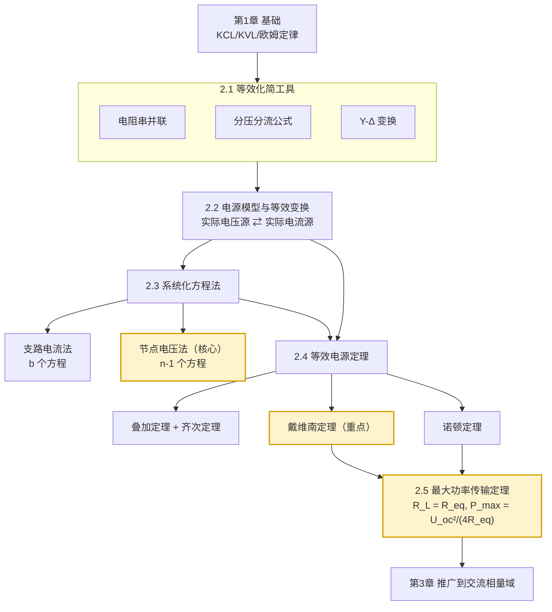

# MOC - 第2章 直流电阻电路分析

> [!info] 本章定位
> 第1章建立了电路基本变量（电压、电流、功率）与基本定律（KCL、KVL、欧姆定律），解决了**单回路**的简单分析。第2章把这些定律系统化、方法化，解决**多回路、多电源的复杂线性电阻电路**分析问题。
>
> 本章要回答的核心问题是：
> 1. 如何把复杂无源网络**等效化简**为单一电阻？（[[2.1 电阻串并联、分压分流公式]]）
> 2. 如何建立**通用方程组**求解任意电路的全部支路量？（[[2.3 支路电流法、节点电压法]]）
> 3. 如何把任意含源二端网络**等效为一个简单电源**，只求某条支路的响应？（[[2.4 叠加定理、戴维南定理、诺顿定理]]）
> 4. 如何让负载从网络获得**最大功率**？（[[2.5 最大功率传输定理]]）
>
> 这些方法不仅用于直流电阻电路，将推广到 [[第3章 正弦交流稳态电路|交流相量域]]，是整个电路分析的方法论基石。

## 本章学习路线图

## 知识点导航

| 小节 | 标题 | 入口 | 核心内容 | 重要度 |
| ---- | ---- | ---- | ---- | ---- |
| 2.1 | 电阻串并联、分压分流公式 | [[2.1 电阻串并联、分压分流公式]] | 串并联等效、分压/分流公式、Y-Δ 变换 | ★★★ |
| 2.2 | 电压源、电流源、电源等效变换 | [[2.2 电压源、电流源、电源等效变换]] | 理想/实际电源模型、$U_s=R_s I_s$ 等效变换 | ★★★ |
| 2.3 | 支路电流法、节点电压法 | [[2.3 支路电流法、节点电压法]] | b 个 vs n-1 个方程、超节点法 | ★★★★★ |
| 2.4 | 叠加定理、戴维南定理、诺顿定理 | [[2.4 叠加定理、戴维南定理、诺顿定理]] | 线性叠加、$U_{oc}$ 串 $R_{eq}$、$I_{sc}$ 并 $R_{eq}$ | ★★★★★ |
| 2.5 | 最大功率传输定理 | [[2.5 最大功率传输定理]] | $R_L=R_{eq}$、$P_{\max}=U_{oc}^2/(4R_{eq})$、效率 50% | ★★★★ |

> [!tip] 学习顺序建议
> 严格按 2.1 → 2.2 → 2.3 → 2.4 → 2.5 顺序学习，前后依赖紧密：2.1 的化简能力是 2.2 电源变换的基础；2.2 与 2.3 共同服务于 2.4 求开路电压与等效内阻；2.4 直接导出 2.5。**2.3 节点电压法**和 **2.4 戴维南定理**是重中之重，须达到熟练计算程度。

## 核心考点

> [!important] 本章 6-8 个核心考点
> 1. **电阻等效化简**：串并联 + Y-Δ 变换求无源二端网络等效电阻，特别是桥形网络。
> 2. **分压与分流公式**：两电阻串联分压、两电阻并联分流（注意分流分子用对方电阻）。
> 3. **电源等效变换**：实际电压源 ⇄ 实际电流源，$U_s = R_s I_s$，方向对应（$U_s$"+"端 = $I_s$ 流出端）。
> 4. **节点电压法**（高频核心）：列标准节点方程 $G_{pp}u_{np} - \sum G_{pq}u_{nq} = \sum i_{sp}$，含纯电压源用超节点法。
> 5. **叠加定理**：电源单独作用（电压源短路、电流源开路、受控源保留），**不能叠加功率**。
> 6. **戴维南定理**（必考重点）：求 $U_{oc}$（开路电压）与 $R_{eq}$（等效内阻三法：直接化简、外加电源、$U_{oc}/I_{sc}$）。
> 7. **诺顿定理**：$I_{sc}$ 并 $R_{eq}$，与戴维南互为电源等效变换关系。
> 8. **最大功率传输**：$R_L = R_{eq}$ 时 $P_{\max} = U_{oc}^2/(4R_{eq})$，效率 50%，区分电力系统与电子电路适用场景。

## 自测题

> [!question] 自测题 1（等效电阻）
> 求三个 $6\,\Omega$ 电阻接成 Δ 形时，任两端钮间的等效电阻。
>
> 

> 
答案

> 对称 Δ，$R_\Delta = 6\,\Omega$。任两端钮间等效 = 一个 $6\,\Omega$ 直接与另外两个 $6\,\Omega$ 串联（$12\,\Omega$）并联：$R = 6 \parallel 12 = 6 \times 12/(6+12) = 72/18 = 4\,\Omega$。
> 或用 Δ→Y：$R_Y = R_\Delta/3 = 2\,\Omega$，任两端 = $R_Y + R_Y = 4\,\Omega$ ✓
> 

> [!question] 自测题 2（节点电压法）
> 两节点电路：节点 A 经 $2\,\Omega$ 接 $10\,\text{V}$ 电压源到参考点（正极朝 A），经 $4\,\Omega$ 接参考点，求 $u_A$。
>
> 

> 
答案

> 自电导 $G_{AA} = 1/2 + 1/4 = 0.75\,\text{S}$；等效注入电流 $= 10/2 = 5\,\text{A}$（电压源串电阻化为电流源）。
> $u_A = 5/0.75 = 20/3 \approx 6.67\,\text{V}$。
> 校验：经 $2\,\Omega$ 流出 $(20/3-10)/2 = (-10/3)/2 = -5/3\,\text{A}$；经 $4\,\Omega$ 流出 $(20/3)/4 = 5/3\,\text{A}$；和为 0 ✓
> 

> [!question] 自测题 3（戴维南等效）
> 含源网络开路电压 $U_{oc} = 9\,\text{V}$，短路电流 $I_{sc} = 3\,\text{A}$。求戴维南等效与诺顿等效，并求 $R_L = 3\,\Omega$ 时负载功率。
>
> 

> 
答案

> $R_{eq} = U_{oc}/I_{sc} = 9/3 = 3\,\Omega$。
> 戴维南：$9\,\text{V}$ 串 $3\,\Omega$。诺顿：$3\,\text{A}$ 并 $3\,\Omega$。
> $R_L = 3\,\Omega = R_{eq}$，恰为匹配：$P_L = U_{oc}^2/(4R_{eq}) = 81/12 = 6.75\,\text{W}$。
> 校验：$i_L = 9/(3+3) = 1.5\,\text{A}$，$P_L = 1.5^2 \times 3 = 6.75\,\text{W}$ ✓
> 

> [!question] 自测题 4（叠加定理）
> 判断：用叠加定理求某电阻功率时，可先求各电源单独作用时的功率再相加。（√/×）
>
> 

> 
答案

> ×。功率是电流（或电压）的二次函数 $P=i^2R$，不满足线性。必须先用叠加求出总电流（或总电压），再由总值算功率：$P = (i_1+i_2)^2 R \neq i_1^2 R + i_2^2 R$。
> 

## 与上下游章节的衔接

- **先修**：[[MOC - 第1章|第1章 电路基础概念与基本定律]]（KCL/KVL、参考方向、欧姆定律、功率计算）
- **后续推广**：[[MOC - 第3章|第3章 正弦交流稳态电路]]——把电阻推广为阻抗 $Z$，节点电压法、戴维南/诺顿定理、叠加定理在相量域完全适用；最大功率传输推广为"共轭匹配" $Z_L = Z_{eq}^*$
- **应用**：[[MOC - 第5章 双极型三极管及其放大电路|第5章]] 放大电路静态工作点计算、[[MOC - 第7章 集成运算放大器基础|第7章]] 运放电路分析均依赖本章方法

## 章节导航

- 上一级：[[MOC - 电路与模拟电子技术|课程总览]]
- 上一章：[[MOC - 第1章|第1章 电路基础概念与基本定律]]
- 下一章：[[MOC - 第3章|第3章 正弦交流稳态电路]]
- 本章习题：[[MOC - 第2章习题|第2章 习题]]
