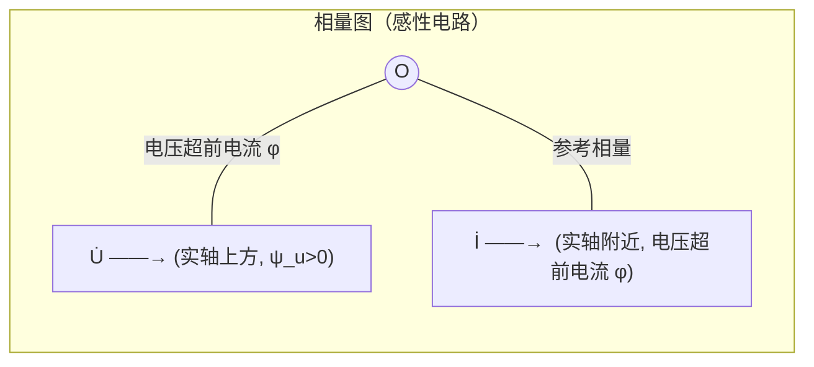

# 3.1 正弦量、相量表示法

> [!info] 本节定位
> 本节是整个第3章的**数学基础**。正弦交流电在时域中是关于时间 $t$ 的三角函数，直接求解含 RLC 的微分方程计算量大且物理图像不直观。**相量法**的核心思想是：在单一频率正弦稳态下，所有电压电流都是同频率正弦量，只需用"幅值 + 初相"两个常数即可区分；而这两个常数恰好对应一个复数的模和幅角。于是把三角函数运算转换为复数（代数）运算，把微分/积分运算转换为乘除 $j\omega$ 的代数运算，使交流稳态分析可套用直流电阻电路的全部方法。

## 一、正弦量及其三要素

### 1.1 正弦量的瞬时表达式

> [!definition] 正弦量
> 随时间按正弦（或余弦）规律变化的电压、电流统称正弦量。以电压为例，其瞬时值表达式为
>
> $$u(t)=U_m\sin(\omega t+\psi_u)$$
>
> 其中 $U_m$ 为**幅值（最大值）**，$\omega$ 为**角频率**，$\psi_u$ 为**初相位**。三者合称正弦量的三要素，给定三要素即唯一确定一个正弦量。

> [!warning] 函数形式约定
> 工程上正弦量一般采用 $\sin$ 形式书写。若题目用 $\cos$，应统一化为 $\sin$（用 $\cos\alpha=\sin(\alpha+90°)$）后再做相位比较，避免因函数基准不同导致的相位差错误。本章一律采用 $\sin$ 形式。

### 1.2 三要素的物理意义与单位

| 要素 | 符号 | 物理意义 | SI 单位 | 关系 |
| ---- | ---- | -------- | ------- | ---- |
| 幅值 | $U_m,\ I_m$ | 正弦量的最大瞬时值 | V, A | $U_m=\sqrt2\,U$ |
| 角频率 | $\omega$ | 单位时间相位变化率 | rad/s | $\omega=2\pi f=2\pi/T$ |
| 初相 | $\psi$ | $t=0$ 时刻的相位 | rad 或 ° | $|\psi|\le180°$ |
| 频率 | $f$ | 每秒周期数 | Hz | $f=1/T$ |
| 周期 | $T$ | 完成一个循环的时间 | s | 我国工频 $f=50$ Hz，$T=20$ ms |

### 1.3 有效值（RMS）

> [!definition] 有效值
> 设周期电流 $i(t)$ 与直流电流 $I$ 通过相同电阻 $R$，在一个周期 $T$ 内产生的热量相等，则 $I$ 称为该周期电流的**有效值**（方均根值，RMS）：
>
> $$I=\sqrt{\frac{1}{T}\int_0^T i^2(t)\,\mathrm dt}$$
>
> 对正弦量 $i=I_m\sin(\omega t+\psi)$ 代入得：

$$I=\frac{I_m}{\sqrt2}=0.707\,I_m$$

> [!note] 工程量均为有效值
> 日常生活中所说的"220 V 交流电"、"5 A 电流"指的都是有效值。交流电压表、电流表的读数亦为有效值。电机、电器的额定电压电流均为有效值。**只有绝缘耐压、二极管反向耐压等场合才关心幅值**（因击穿取决于瞬时最大值）。

## 二、相位与相位差

> [!definition] 相位差
> 两个**同频率**正弦量的相位之差称为相位差，记作 $\varphi$。设 $u=U_m\sin(\omega t+\psi_u)$，$i=I_m\sin(\omega t+\psi_i)$，则
>
> $$\varphi=\psi_u-\psi_i$$
>
> 相位差等于初相之差，与时间 $t$ 无关。

> [!warning] 同频率约束
> 相位差**只对同频率正弦量定义**。不同频率正弦量之间的相位差随时间变化，无意义。

> [!example] 相位关系的四种情形
> 设 $\varphi=\psi_u-\psi_i$（电压相对电流）：
> - $\varphi>0$：电压**超前**电流，呈**感性**（如 RL 电路）。
> - $\varphi<0$：电压**滞后**电流，呈**容性**（如 RC 电路）。
> - $\varphi=0$：同相（如纯电阻或谐振状态）。
> - $\varphi=\pm90°$：正交（纯电感 $\varphi=+90°$；纯电容 $\varphi=-90°$）。
> - $\varphi=\pm180°$：反相。

## 三、复数及其运算

相量法以复数为工具，必须熟练掌握复数的三种表示及其互化。

### 3.1 复数的三种形式

> [!definition] 复数的三种表示
> 设复数 $A=a+jb$（$j=\sqrt{-1}$，工程上用 $j$ 避免与电流 $i$ 混淆）：
>
> 1. **代数形式**：$A=a+jb$，$a=\mathrm{Re}(A)$ 为实部，$b=\mathrm{Im}(A)$ 为虚部。
> 2. **指数形式**：$A=|A|e^{j\theta}$，$|A|=\sqrt{a^2+b^2}$ 为模，$\theta=\arctan\dfrac{b}{a}$ 为幅角。
> 3. **极坐标形式**：$A=|A|\angle\theta$，是指数形式的工程简写。
>
> 三者关系：$a=|A|\cos\theta$，$b=|A|\sin\theta$。

> [!warning] 象限与幅角
> 用 $\arctan(b/a)$ 求幅角时须结合 $a,b$ 符号判定象限，否则易错 $180°$。例如 $A=-1-j1$，$\arctan(1)=45°$，但实际位于第三象限，$\theta=-135°$ 或 $225°$。

### 3.2 复数运算规则

| 运算 | 推荐形式 | 公式 |
| ---- | -------- | ---- |
| 加减 | 代数 | $(a+jb)\pm(c+jd)=(a\pm c)+j(b\pm d)$ |
| 乘除 | 极坐标 | $A_1 A_2=|A_1||A_2|\angle(\theta_1+\theta_2)$；$\dfrac{A_1}{A_2}=\dfrac{|A_1|}{|A_2|}\angle(\theta_1-\theta_2)$ |
| 旋转 | 指数 | $A\cdot e^{j\alpha}=|A|\angle(\theta+\alpha)$，乘 $e^{j90°}=j$ 相当于逆时针转 $90°$ |

> [!theorem] 旋转因子 $j$ 的几何意义
> 任意复数乘 $j$（即 $e^{j90°}$），其模不变，幅角增加 $90°$，相当于在复平面上**逆时针旋转 $90°$**；乘 $-j$ 则**顺时针旋转 $90°$**。这一性质是"电感电压超前电流 $90°$、电容电压滞后电流 $90°$"的数学根源。

## 四、相量表示法

### 4.1 相量的定义

> [!theorem] 正弦量与复数的对应（相量法基础）
> 设正弦量 $i(t)=\sqrt2\,I\sin(\omega t+\psi_i)$，可由复数 $I e^{j\psi_i}e^{j\omega t}$ 取虚部得到：
>
> $$i(t)=\mathrm{Im}\left[\sqrt2\,I e^{j\psi_i}\,e^{j\omega t}\right]$$
>
> 由于 $\omega$ 对所有同频正弦量相同，**可省略旋转因子 $e^{j\omega t}$**，仅保留"有效值 + 初相"构成的复数作为正弦量的代表，称为**相量**：

$$\dot I=I e^{j\psi_i}=I\angle\psi_i\quad(\text{有效值相量})$$

> 也可采用最大值相量 $\dot I_m=I_m\angle\psi_i$。本章统一使用**有效值相量**，与电压表电流表读数一致。

> [!warning] 相量法的适用前提
> 1. 电路中**所有电源为同频率正弦量**；
> 2. 电路处于**稳态**（暂态已衰减完毕）；
> 3. 电路为**线性**电路（满足叠加定理）。
>
> 不满足以上条件时相量法不成立，应改用微分方程时域分析或拉氏变换。

### 4.2 相量与时域的相互转换

> [!example] 相量 ↔ 瞬时值
> **已知瞬时值求相量**：$u(t)=220\sqrt2\sin(314t+45°)$ V  
> 角频率 $\omega=314$ rad/s，有效值 $U=220$ V，初相 $\psi_u=45°$  
> 相量 $\dot U=220\angle45°$ V。
>
> **已知相量还原瞬时值**：$\dot I=10\angle{-30°}$ A，$\omega=100$ rad/s  
> $i(t)=10\sqrt2\sin(100t-30°)$ A。

### 4.3 相量图

相量图是复平面上用带箭头线段表示相量的图形：线段长度按比例表示模，与正实轴夹角表示幅角。同频率相量绘于同一图上，能直观显示相位关系。

> [!note] 作相量图的约定
> 通常选某一相量为**参考相量**（令其初相为零，沿正实轴方向），其他相量按相对相位差绘制。串联电路常以电流为参考（因电流相同），并联电路常以电压为参考。

## 五、相量运算与基尔霍夫定律的相量形式

### 5.1 同频率正弦量的代数和

> [!theorem] 相量法核心结论
> 若干**同频率**正弦量之和仍为同频率正弦量，其相量等于各分量的相量之和：
>
> $$i=i_1+i_2+\cdots+i_n \quad\Longleftrightarrow\quad \dot I=\dot I_1+\dot I_2+\cdots+\dot I_n$$
>
> 时域的三角函数加法 → 复数代数加法。

> [!warning] 不可相加不同频率正弦量的相量
> 相量求和的前提是同频率。若 $i_1$ 频率为 $50$ Hz、$i_2$ 频率为 $100$ Hz，合成结果已非正弦量，必须用时域函数相加，不可用相量法。

### 5.2 基尔霍夫定律的相量形式

> [!theorem] KCL/KVL 相量形式
> 在正弦稳态下，节点电流定律与回路电压定律的相量形式为：
>
> $$\text{KCL}:\quad \sum \dot I_k=0\qquad\qquad \text{KVL}:\quad \sum \dot U_k=0$$
>
> 即用相量（复数）代替直流电路中的实数电流电压，第2章的全部电路分析方法（节点法、网孔法、叠加定理、戴维南定理等）形式上不变地推广到交流稳态。

## 六、典型例题

### 例题 1：相量加减

> [!example] 已知 $i_1=8\sqrt2\sin(314t+60°)$ A，$i_2=6\sqrt2\sin(314t-30°)$ A，求 $i_1+i_2$。

**解**：

(1) 写出有效值相量：
$$\dot I_1=8\angle60°=4+j6.93\text{ A}$$
$$\dot I_2=6\angle{-30°}=5.20-j3\text{ A}$$

(2) 相量相加（代数形式）：
$$\dot I=\dot I_1+\dot I_2=(4+5.20)+j(6.93-3)=9.20+j3.93\text{ A}$$

(3) 化为极坐标：
$$|\dot I|=\sqrt{9.20^2+3.93^2}=10.0\text{ A},\quad \varphi=\arctan\frac{3.93}{9.20}=23.1°$$
$$\dot I=10\angle23.1°\text{ A}$$

(4) 还原瞬时值：
$$i(t)=10\sqrt2\sin(314t+23.1°)\text{ A}$$

> [!note] 相量图验证
> 由相量图可见，$\dot I_1$、$\dot I_2$ 夹角 $90°$，合成相量模 $|\dot I|=\sqrt{8^2+6^2}=10$ A 与计算结果一致。

### 例题 2：相位差判定

> [!example] 已知 $u=311\sin(314t-45°)$ V，$i=14.1\sin(314t+15°)$ A。求相位差并判定电路性质。

**解**：$\varphi=\psi_u-\psi_i=(-45°)-(+15°)=-60°<0$，电压滞后电流 $60°$，电路呈**容性**。  
有效值：$U=311/\sqrt2=220$ V，$I=14.1/\sqrt2=10$ A。

### 例题 3：相量乘除

> [!example] 已知 $\dot U=100\angle30°$ V，$\dot I=5\angle{-30°}$ A，求比值 $\dot U/\dot I$ 并解释其物理意义。

**解**：
$$Z=\frac{\dot U}{\dot I}=\frac{100\angle30°}{5\angle{-30°}}=20\angle60°\,\Omega=10+j17.3\,\Omega$$

比值 $Z$ 即电路的**阻抗**（见 [[3.2 RLC 元件相量模型、阻抗与导纳]]）。阻抗角 $60°>0$，电压超前电流 $60°$，电路呈感性。

## 本节小结

| 内容 | 关键公式 |
| ---- | -------- |
| 三要素 | $u=U_m\sin(\omega t+\psi)$，$\omega=2\pi f$ |
| 有效值 | $U=U_m/\sqrt2$ |
| 相位差 | $\varphi=\psi_u-\psi_i$ |
| 相量 | $\dot U=U\angle\psi_u$ |
| KCL/KVL | $\sum\dot I=0$，$\sum\dot U=0$ |

## 章节导航

- 本章首页：[[MOC - 第3章]]
- 上一节：—（本章起始）
- 下一节：[[3.2 RLC 元件相量模型、阻抗与导纳]]
- 相关：[[3.3 正弦电路功率：有功、无功、视在功率]]、[[3.4 串联谐振、并联谐振]]

## 相关标签

#电路 #交流电路 #相量法 #复数
