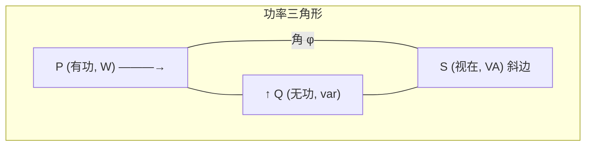
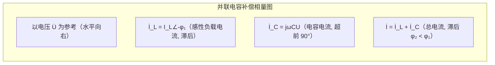

# 3.3 正弦电路功率：有功、无功、视在功率

> [!info] 本节定位
> 直流电路中功率仅有 $P=UI$ 一种形式，而交流电路中因电压电流存在相位差，瞬时功率周期性正负波动（电感电容与电源往返交换能量），单一功率量不足以刻画能量过程。本节建立**有功、无功、视在三种功率**与**复功率**体系，全面度量能量的真实消耗、往返交换与设备容量占用；并以**功率因数提高**作为最重要的工程应用——通过并联电容就地补偿无功，减小线路电流与损耗，提升输电效率。本节是本章的工程重点。

## 一、瞬时功率

> [!definition] 瞬时功率
> 设二端网络端口 $u(t)=\sqrt2 U\sin\omega t$，$i(t)=\sqrt2 I\sin(\omega t-\varphi)$（电流滞后电压 $\varphi$，即阻抗角，感性时 $\varphi>0$），瞬时功率：
>
> $$p(t)=u(t)\,i(t)=UI\cos\varphi - UI\cos(2\omega t-\varphi)$$
>
> 进一步用三角恒等变形：
>
> $$p(t)=\underbrace{UI\cos\varphi\,(1-\cos 2\omega t)}_{\text{不可逆部分}}+\underbrace{UI\sin\varphi\,\sin 2\omega t}_{\text{可逆往返部分}}$$

> [!note] 瞬时功率的物理分解
> - 第一项恒非负（$1-\cos 2\omega t\ge0$），是单向流入网络被电阻消耗的能量，**平均**即为有功功率；
> - 第二项以 $2\omega$ 频率正负交变，代表电感/电容与电源周期性交换的能量，**平均为零**，但决定无功功率大小。
> - 当 $\varphi=0$（纯阻）瞬时功率非负，电路只吸收能量；当 $\varphi=\pm90°$（纯电抗）瞬时功率全为往返部分，平均功率为零。

## 二、有功功率、无功功率、视在功率

### 2.1 有功功率 P

> [!definition] 有功功率（平均功率）
> 瞬时功率在一个周期内的平均值，即电路实际消耗的电功率：
>
> $$P=\frac{1}{T}\int_0^T p\,\mathrm dt = UI\cos\varphi\quad(\text{W，瓦特})$$
>
> - 仅电阻分量消耗：$P=I^2 R=U_R I=\dfrac{U_R^2}{R}$
> - $\cos\varphi$ 称为**功率因数**，$\varphi$ 是阻抗角（电压超前电流的相位差）
> - 纯电感、纯电容 $P=0$（不耗能，仅储能往返）

### 2.2 无功功率 Q

> [!definition] 无功功率
> 度量电感/电容与电源之间往返交换能量的规模（瞬时功率往返部分的幅值）：
>
> $$Q=UI\sin\varphi\quad(\text{var，乏})$$
>
> - 纯电感：$Q_L=U_L I=I^2 X_L>0$（吸收无功，规定为正）
> - 纯电容：$Q_C=-U_C I=-I^2 X_C<0$（发出无功，规定为负）
> - 电阻：$Q_R=0$
> - RLC 串联总无功：$Q=Q_L+Q_C=I^2(X_L-X_C)=UI\sin\varphi$

> [!warning] 无功并非"无用"
> 无功功率反映磁场/电场储能与电源的交换，虽平均不消耗能量，但占用线路与设备容量。电机、变压器靠磁场工作，需要一定的无功建立磁场；无功不足将导致电压跌落。故无功不是"无用"，而是须就地平衡的能量交换量。

### 2.3 视在功率 S

> [!definition] 视在功率
> 端口电压有效值与电流有效值的乘积，表示电气设备的**容量**（在 $\cos\varphi=1$ 时能输出的最大有功）：
>
> $$S=UI\quad(\text{VA，伏安})$$
>
> 变压器、发电机铭牌上的"额定容量"即以 kVA 标注，原因正是容量由 $U,I$ 决定，与负载的 $\cos\varphi$ 无关。

### 2.4 功率三角形与功率因数

> [!theorem] 功率三角形
> 三种功率满足直角三角形关系：
>
> $$S^2=P^2+Q^2,\qquad S=\sqrt{P^2+Q^2}$$
> $$\cos\varphi=\frac{P}{S},\quad \sin\varphi=\frac{Q}{S},\quad \tan\varphi=\frac{Q}{P}$$
>
> 阻抗角 $\varphi$ 同时是功率因数角、阻抗角和电压电流相位差角——三者统一。

### 2.5 三种功率对照

| 名称 | 符号 | 公式 | 单位 | 物理含义 |
| ---- | ---- | ---- | ---- | -------- |
| 有功功率 | $P$ | $UI\cos\varphi=I^2 R$ | W | 实际消耗 |
| 无功功率 | $Q$ | $UI\sin\varphi=I^2 X$ | var | 能量交换规模 |
| 视在功率 | $S$ | $UI=\sqrt{P^2+Q^2}$ | VA | 设备容量 |

## 三、复功率

> [!definition] 复功率
> 定义电压相量与电流相量**共轭**之积：
>
> $$\tilde S=\dot U\dot I^{\,*}=UI\angle\varphi=P+jQ\quad(\text{VA})$$
>
> - 实部为有功 $P$，虚部为无功 $Q$，模为视在 $S$，幅角为阻抗角 $\varphi$；
> - 复功率把三种功率统一为一个复数，便于用代数关系分析。

> [!proof] 复功率推导
> 设 $\dot U=U\angle\psi_u$，$\dot I=I\angle\psi_i$，$\dot I^{\,*}=I\angle{-\psi_i}$，则
> $$\tilde S=\dot U\dot I^{\,*}=UI\angle(\psi_u-\psi_i)=UI\angle\varphi=UI\cos\varphi+j\,UI\sin\varphi=P+jQ$$

> [!theorem] 复功率守恒（无功平衡）
> 在正弦稳态下，电源发出的复功率等于各负载吸收的复功率之和：
>
> $$\tilde S_{\text{电源}}=\sum \tilde S_k\quad\Longrightarrow\quad P_{\text{源}}=\sum P_k,\quad Q_{\text{源}}=\sum Q_k$$
>
> 即有功、无功分别守恒。利用此结论可检验电路计算的正确性。

## 四、功率因数的提高

### 4.1 提高功率因数的意义

> [!abstract] 为什么提高功率因数
> 1. **减小线路电流**：$I=\dfrac{P}{U\cos\varphi}$，在 $P,U$ 不变时，$\cos\varphi\uparrow\Rightarrow I\downarrow$，线路铜耗 $I^2 R_{\text{线}}$ 显著下降；
> 2. **释放设备容量**：$S=\dfrac{P}{\cos\varphi}$，$\cos\varphi\uparrow\Rightarrow S\downarrow$，变压器、发电机可多带负载；
> 3. **减少电压降**：线路电流减小使线路压降 $IZ_{\text{线}}$ 降低，受端电压质量改善；
> 4. 供电部门对 $\cos\varphi<0.9$ 的用户加收"力调电费"，故功率因数补偿有直接经济意义。

### 4.2 并联电容补偿原理

> [!theorem] 感性负载并联电容提高功率因数
> 设负载原有功 $P$、功率因数 $\cos\varphi_1$（感性），目标提高到 $\cos\varphi_2$，在负载两端并联电容 $C$：
>
> - **并联电容不改变负载本身**：负载电压 $U$、电流 $I_L$、有功 $P$ 不变；
> - 电容支路提供无功 $Q_C=-\omega C U^2<0$（发出无功）；
> - 由无功守恒：$Q_2=Q_1+Q_C$，即 $P\tan\varphi_2=P\tan\varphi_1-\omega C U^2$，解得：
>
> $$C=\frac{P}{\omega U^2}\,(\tan\varphi_1-\tan\varphi_2)$$
>
> 补偿前后电流由 $I_1=\dfrac{P}{U\cos\varphi_1}$ 减小为 $I_2=\dfrac{P}{U\cos\varphi_2}$。

> [!warning] 补偿后功率因数角 $\varphi_2$ 仍为容性还是感性
> - **欠补偿**：$\cos\varphi_2<1$ 且仍感性（$Q_C<Q_L$）；
> - **全补偿**：$\cos\varphi_2=1$，$\varphi_2=0$，总电流最小，呈纯阻；
> - **过补偿**：$Q_C>Q_L$，总电路呈容性，电流反而回升，且增加电容投资，应避免。
>
> 工程上常补偿到 $\cos\varphi_2\approx0.9\sim0.95$（滞后）即可，避免过补偿。

### 4.3 补偿相量图

## 五、典型例题

### 例题 1：单端口功率全面计算

> [!example] 二端网络 $\dot U=100\angle0°$ V，$\dot I=8\angle{-36.9°}$ A（关联方向）。求 $P,Q,S,\cos\varphi$ 并指出电路性质。

**解**：

(1) 阻抗角 $\varphi=\psi_u-\psi_i=0-(-36.9°)=36.9°$。  
(2) $P=UI\cos\varphi=100\times8\times\cos36.9°=640$ W  
(3) $Q=UI\sin\varphi=100\times8\times\sin36.9°=480$ var（感性，$Q>0$）  
(4) $S=UI=800$ VA  
(5) $\cos\varphi=\cos36.9°=0.8$（感性，滞后）

校验：$S^2=P^2+Q^2\Rightarrow640^2+480^2=640000=800^2$ ✓。

### 例题 2：功率因数提高（核心应用）

> [!example] 某感性负载 $P=10$ kW，$\cos\varphi_1=0.6$（滞后），接 $U=220$ V、$f=50$ Hz 电源。欲将功率因数提高到 $\cos\varphi_2=0.9$（仍滞后），求应并联的电容 $C$ 及补偿前后线路电流。

**解**：

(1) 求补偿前后无功：
$$\varphi_1=\arccos0.6=53.13°,\ \tan\varphi_1=1.333$$
$$\varphi_2=\arccos0.9=25.84°,\ \tan\varphi_2=0.484$$

(2) 电容：
$$C=\frac{P}{\omega U^2}(\tan\varphi_1-\tan\varphi_2)=\frac{10^4}{2\pi\times50\times220^2}(1.333-0.484)$$
$$C=\frac{10^4\times0.849}{314\times48400}=\frac{8490}{15197600}=5.586\times10^{-4}\text{ F}=558.6\,\mu\text F$$

(3) 电流变化：
$$I_1=\frac{P}{U\cos\varphi_1}=\frac{10000}{220\times0.6}=75.76\text{ A}$$
$$I_2=\frac{P}{U\cos\varphi_2}=\frac{10000}{220\times0.9}=50.51\text{ A}$$

电流由 $75.76$ A 降至 $50.51$ A，下降 $33.3\%$，而负载实际消耗的 $P=10$ kW 不变。

> [!note] 关键不变量
> 并联电容补偿过程中，**$P$ 与 $U$ 恒定**，仅无功与总电流变化。这是分析补偿问题的切入点，避免对负载内部重新计算。

### 例题 3：负载功率因数角与元件参数反推

> [!example] 一台交流电动机 $\dot U=220\angle0°$ V，$\dot I=10\angle{-60°}$ A，工频。视其为 RL 串联模型，求 $R,L$ 及 $P,Q,S$。

**解**：

(1) 阻抗：$Z=\dfrac{\dot U}{\dot I}=\dfrac{220\angle0°}{10\angle{-60°}}=22\angle60°=11+j19.05\,\Omega$。  
故 $R=11\,\Omega$，$X_L=19.05\,\Omega$，$L=\dfrac{X_L}{\omega}=\dfrac{19.05}{314}=60.7$ mH。

(2) 功率：
$$P=UI\cos\varphi=220\times10\times\cos60°=1100\text{ W}$$
$$Q=UI\sin\varphi=220\times10\times\sin60°=1905\text{ var}$$
$$S=UI=2200\text{ VA},\quad\cos\varphi=0.5$$

校验：$I^2R=100\times11=1100$ W ✓；$I^2X_L=100\times19.05=1905$ var ✓。

## 六、最大有功功率传输（拓展）

> [!theorem] 正弦稳态最大功率传输
> 含源二端网络（戴维南等效 $\dot U_S$ 串 $Z_S=R_S+jX_S$）接负载 $Z_L$，当满足共轭匹配
>
> $$Z_L=Z_S^{\,*}=R_S-jX_S$$
>
> 时负载获得最大有功功率 $P_{\max}=\dfrac{U_S^2}{4R_S}$。这一结论把直流电路的最大功率传输推广到复阻抗域。

## 本节小结

| 名称 | 公式 | 单位 |
| ---- | ---- | ---- |
| 有功 | $P=UI\cos\varphi=I^2R$ | W |
| 无功 | $Q=UI\sin\varphi=I^2X$ | var |
| 视在 | $S=UI=\sqrt{P^2+Q^2}$ | VA |
| 复功率 | $\tilde S=\dot U\dot I^{\,*}=P+jQ$ | VA |
| 功率因数 | $\cos\varphi=P/S$ | — |
| 补偿电容 | $C=\dfrac{P}{\omega U^2}(\tan\varphi_1-\tan\varphi_2)$ | F |

## 章节导航

- 本章首页：[[MOC - 第3章]]
- 上一节：[[3.2 RLC 元件相量模型、阻抗与导纳]]
- 下一节：[[3.4 串联谐振、并联谐振]]
- 相关：[[3.1 正弦量、相量表示法]]、[[3.5 三相交流电路基础]]、[[MOC - 第3章习题]]

## 相关标签

#电路 #交流电路 #有功功率 #无功功率 #功率因数
