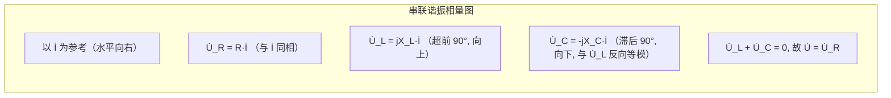

# 3.4 串联谐振、并联谐振

> [!info] 本节定位
> 谐振是 RLC 电路在特定频率下电抗抵消、电路呈纯阻性的特殊工作状态。本节是本章的**物理重点**：串联谐振时阻抗最小、电流最大且电感电容上出现远高于电源的**过电压**，是高压实验与无线电调谐的基础；并联谐振时阻抗最大、电流最小，是滤波与选频放大器的核心机制。谐振是 [[3.2 RLC 元件相量模型、阻抗与导纳]] 中"虚部为零"的特殊情形，其能量过程（电场磁场周期交换）由 [[3.3 正弦电路功率：有功、无功、视在功率]] 中 $Q_L+Q_C=0$ 描述。

## 一、谐振的普遍定义

> [!definition] 谐振
> 含电感 $L$ 与电容 $C$ 的二端无源网络，当端口电压电流**同相**（阻抗角 $\varphi=0$，电抗 $X=0$ 或电纳 $B=0$）时，称电路发生**谐振**。此时电路呈纯阻性，无功功率 $Q=0$（电源与电路之间无能量交换，仅电感电容之间互换）。

> [!note] 谐振的物理本质
> 谐振时电感吸收的无功 $Q_L=I^2X_L$ 与电容发出的无功 $Q_C=-I^2X_C$ 大小相等符号相反，电场与磁场能量在 $L$、$C$ 之间自洽往返，**电源只补充电阻消耗的有功**。这正是谐振条件下电源"看到"纯电阻的根源。

## 二、串联谐振（RLC 串联）

### 2.1 谐振条件与谐振频率

> [!theorem] 串联谐振条件
> RLC 串联阻抗 $Z=R+j\left(\omega L-\dfrac{1}{\omega C}\right)$，谐振要求虚部为零：
>
> $$X_L=X_C\quad\Longleftrightarrow\quad\omega L=\frac{1}{\omega C}$$
>
> 解得谐振角频率与频率：
>
> $$\omega_0=\frac{1}{\sqrt{LC}}\quad(\text{rad/s}),\qquad f_0=\frac{1}{2\pi\sqrt{LC}}\quad(\text{Hz})$$
>
> **谐振频率只由 $L,C$ 决定，与 $R$ 无关**；调节 $L$ 或 $C$ 可实现调谐（收音机选台原理）。

### 2.2 串联谐振的主要特点

> [!abstract] 串联谐振五大特征
> 1. **阻抗最小且为纯阻**：$Z_0=R$，$|Z|$ 取最小值；
> 2. **电流最大且与电压同相**：$I_0=\dfrac{U}{R}$，$\varphi=0$；
> 3. **电感与电容电压大小相等、相位相反**：$\dot U_L=-\dot U_C$，二者在 KVL 中互相抵消，$\dot U=\dot U_R$；
> 4. **过电压现象**：$U_L=U_C=Q\cdot U$，当 $Q\gg1$ 时电感、电容电压远大于电源电压；
> 5. **无功自平衡**：$Q_L+Q_C=0$，电源只提供有功 $P=I_0^2 R=U^2/R$。

### 2.3 品质因数 Q

> [!definition] 串联谐振品质因数
> 谐振时电感（或电容）电压与电源电压之比，定义为品质因数：
>
> $$Q=\frac{U_L}{U}=\frac{U_C}{U}=\frac{\omega_0 L}{R}=\frac{1}{\omega_0 C R}=\frac{1}{R}\sqrt{\frac{L}{C}}$$
>
> - $Q$ 无量纲，反映谐振电路"过电压"与"选频能力"的程度；
> - 工程上 $Q$ 通常在 $10\sim200$，故 $U_L,U_C$ 可达电源电压的几十至几百倍。

> [!proof] 品质因数三种表达等价性
> 谐振时 $I_0=U/R$，$U_L=I_0\omega_0 L=\dfrac{U}{R}\omega_0 L=\dfrac{\omega_0 L}{R}U=QU$；  
> $U_C=I_0\dfrac{1}{\omega_0 C}=\dfrac{U}{R\omega_0 C}=\dfrac{1}{\omega_0 C R}U=QU$；  
> 代入 $\omega_0=1/\sqrt{LC}$：$\dfrac{\omega_0 L}{R}=\dfrac{1}{R}\sqrt{\dfrac{L}{C}}$，$\dfrac{1}{\omega_0 C R}=\dfrac{1}{R}\sqrt{\dfrac{L}{C}}$，三者一致。 ∎

> [!warning] 过电压的工程危害与利用
> - **危害**：在电力系统中串联谐振引起的过电压可能击穿绝缘、烧毁设备（如铁磁谐振过电压），需避免；
> - **利用**：在无线电中用于将微弱信号放大到可检波幅度，是谐振放大器与谐振接收机的基础。

### 2.4 串联谐振相量图

谐振时 $\dot U_L$ 与 $\dot U_C$ 大小相等、方向相反，合成后为零，仅余 $\dot U_R$ 与 $\dot U$ 重合：

## 三、并联谐振

### 3.1 RLC 并联电路谐振

> [!theorem] 并联谐振条件
> RLC 并联导纳 $Y=\dfrac{1}{R}+j\left(\omega C-\dfrac{1}{\omega L}\right)$，谐振要求虚部（电纳）为零：
>
> $$\omega C=\frac{1}{\omega L}\quad\Longleftrightarrow\quad\omega_0=\frac{1}{\sqrt{LC}}$$
>
> 谐振频率与串联谐振**公式相同**：$f_0=\dfrac{1}{2\pi\sqrt{LC}}$。

### 3.2 并联谐振主要特点

> [!abstract] 并联谐振五大特征（理想 RLC 并联）
> 1. **导纳最小、阻抗最大且为纯阻**：$Y_0=1/R$，$Z_0=R$，$|Z|$ 取最大值；
> 2. **总电流最小且与电压同相**：$I_0=U/R$，$\varphi=0$；
> 3. **电感与电容支路电流大小相等、相位相反**：$\dot I_L=-\dot I_C$，二者在 KCL 中抵消；
> 4. **过电流现象**：$I_L=I_C=Q\cdot I$，支路电流可远大于电源电流；
> 5. 并联品质因数 $Q=\dfrac{\omega_0 C}{1/R}=\dfrac{R}{\omega_0 L}=\dfrac{R}{\sqrt{L/C}}$，$R$ 越大 $Q$ 越高。

> [!warning] 串、并联谐振的"对偶性"
> | 项目 | 串联谐振 | 并联谐振 |
> | ---- | -------- | -------- |
> | 阻抗 | 最小 $Z=R$ | 最大 $Z=R$ |
> | 电流 | 最大 $I=U/R$ | 最小 $I=U/R$ |
> | 现象 | 过电压 $U_L=U_C=QU$ | 过电流 $I_L=I_C=QI$ |
> | $Q$ 表达 | $Q=\omega_0 L/R$ | $Q=R/(\omega_0 L)=\omega_0 C R$ |
>
> 注意：电感串电阻（实际电感模型）与电感并电阻对应的并联谐振 $Q$ 表达式不同，应按电路实际结构推导，不可机械套用。

### 3.3 实际电感的并联谐振（工程常见模型）

实际电感存在铜损，常用"电感 $L$ 串联电阻 $r$"再与电容 $C$ 并联的模型。当 $r\ll\omega_0 L$（高 $Q$ 条件）时：

- 谐振频率近似仍为 $\omega_0\approx\dfrac{1}{\sqrt{LC}}$；
- 谐振阻抗 $Z_0\approx\dfrac{L}{Cr}=\dfrac{Q^2}{1}\cdot r$（其中 $Q=\omega_0 L/r$），可达很大值；
- 这是电子电路中"LC 并联回路作放大器负载"的常用模型。

## 四、谐振电路的频率特性与选频

### 4.1 幅频特性与通频带

> [!theorem] 串联谐振的选频特性
> 电流幅频特性（电源电压 $U$ 恒定）：
>
> $$I(\omega)=\frac{U}{\sqrt{R^2+\left(\omega L-\dfrac{1}{\omega C}\right)^2}}$$
>
> 在 $\omega=\omega_0$ 处取最大 $I_0=U/R$，偏离 $\omega_0$ 时电流下降。当 $I$ 降到 $I_0/\sqrt2$ 时对应频率 $\omega_1,\omega_2$，二者之间宽度称为**通频带（带宽）**：

$$\mathrm{BW}=\omega_2-\omega_1=\frac{\omega_0}{Q}\quad(\text{rad/s})$$

或 $B=f_2-f_1=\dfrac{f_0}{Q}$（Hz）。

> [!note] $Q$ 与选频能力的矛盾
> - $Q$ 越大 → 通频带越窄 → 选择性越好（对干扰频率抑制越强）；
> - $Q$ 越大 → 信号通过带宽越小 → 可能滤除信号的有用边带，造成失真。
>
> 工程需在"选择性"与"信号保真"之间折中选取 $Q$。

### 4.2 谐振应用

> [!example] 谐振的典型应用
> 1. **调谐接收**：收音机输入回路用可变电容 $C$ 调节 $f_0$ 至目标电台载频，使该电台信号在电容两端获得最大电压，其他电台被抑制；
> 2. **谐振放大器**：以 LC 并联回路作放大器负载，对谐振频率信号阻抗最大、增益最高；
> 3. **陷波/吸收回路**：串联谐振对特定频率呈低阻，将其旁路吸收（如电源滤波器抑制特定谐波）；
> 4. **无功补偿**：见 [[3.3 正弦电路功率：有功、无功、视在功率]]，并联电容补偿感性无功本质是利用电容的容性电抗抵消感性电抗；
> 5. **感应加热与介质加热**：利用谐振获得大电流或高电压以高效加热。

## 五、典型例题

### 例题 1：串联谐振全面计算

> [!example] RLC 串联电路 $R=5\,\Omega$，$L=100\,\mu\text H$，$C=100\text{ pF}$，电源电压 $U=1$ mV。求 $f_0$、$Q$、谐振电流 $I_0$、$U_L$ 与 $U_C$。

**解**：

(1) 谐振频率：
$$f_0=\frac{1}{2\pi\sqrt{LC}}=\frac{1}{2\pi\sqrt{100\times10^{-6}\times100\times10^{-12}}}=\frac{1}{2\pi\times10^{-7}}=1.592\times10^6\text{ Hz}=1.592\text{ MHz}$$

(2) 品质因数（用 $\omega_0 L/R$）：
$$\omega_0=2\pi f_0=10^7\text{ rad/s}$$
$$X_L=\omega_0 L=10^7\times100\times10^{-6}=1000\,\Omega$$
$$Q=\frac{X_L}{R}=\frac{1000}{5}=200$$

(3) 谐振电流与元件电压：
$$I_0=\frac{U}{R}=\frac{1\times10^{-3}}{5}=0.2\text{ mA}$$
$$U_L=U_C=Q\cdot U=200\times1\text{ mV}=200\text{ mV}=0.2\text{ V}$$

> [!warning] 过电压比
> 电源仅 1 mV，电感电容电压达 200 mV，是电源的 200 倍。这正是高 $Q$ 串联谐振在无线电接收中放大微弱信号的原理。

### 例题 2：调谐电容求解

> [!example] 收音机输入回路 $L=300\,\mu\text H$，$R=10\,\Omega$，欲接收 $f_0=820$ kHz 电台。求调谐电容 $C$ 与回路 $Q$。

**解**：

(1) 由 $f_0=\dfrac{1}{2\pi\sqrt{LC}}$ 解出 $C$：
$$C=\frac{1}{(2\pi f_0)^2 L}=\frac{1}{(2\pi\times820\times10^3)^2\times300\times10^{-6}}$$
$$2\pi f_0=5.152\times10^6,\quad(2\pi f_0)^2=2.654\times10^{13}$$
$$C=\frac{1}{2.654\times10^{13}\times3\times10^{-4}}=\frac{1}{7.96\times10^9}=1.256\times10^{-10}\text{ F}=125.6\text{ pF}$$

(2) 品质因数：
$$\omega_0=2\pi f_0=5.152\times10^6\text{ rad/s}$$
$$Q=\frac{\omega_0 L}{R}=\frac{5.152\times10^6\times300\times10^{-6}}{10}=\frac{1545.6}{10}=154.6$$

(3) 通频带：
$$B=\frac{f_0}{Q}=\frac{820\times10^3}{154.6}=5305\text{ Hz}\approx5.3\text{ kHz}$$

> [!note] 选台与通频带
> $B\approx5.3$ kHz 略大于调幅广播音频带宽，足以让信号通过而抑制邻频干扰；这正是中波收音机输入回路的设计取舍。

### 例题 3：并联谐振与谐振阻抗

> [!example] RLC 并联电路 $R=20\text{ k}\Omega$，$L=1\text{ mH}$，$C=1\,\mu\text F$，电源 $U=10$ V。求 $f_0$、$Q$、谐振时总电流 $I_0$ 与电感支路电流 $I_L$。

**解**：

(1) 谐振频率（与串联同式）：
$$f_0=\frac{1}{2\pi\sqrt{LC}}=\frac{1}{2\pi\sqrt{10^{-3}\times10^{-6}}}=\frac{1}{2\pi\times10^{-4.5}}=5033\text{ Hz}\approx5.03\text{ kHz}$$

(2) 品质因数（并联，$Q=R/(\omega_0 L)$）：
$$\omega_0=2\pi f_0=31623\text{ rad/s}$$
$$Q=\frac{R}{\omega_0 L}=\frac{20000}{31623\times10^{-3}}=\frac{20000}{31.62}=632.5$$

(3) 总电流：
$$I_0=\frac{U}{R}=\frac{10}{20000}=0.5\text{ mA}$$

(4) 电感支路电流：
$$I_L=\frac{U}{\omega_0 L}=\frac{10}{31.62}=0.316\text{ A}=316\text{ mA}$$

校验：$I_L=Q\cdot I_0=632.5\times0.5=316.3$ mA ✓（过电流现象，支路电流为电源电流的 632 倍）。

> [!warning] 过电流与导线选型
> 并联谐振支路电流远大于电源电流，故设计电感线圈线径、电容额定电流时必须按支路电流而非电源电流取值。

## 六、本节小结

| 项目 | 串联谐振 | 并联谐振（理想） |
| ---- | -------- | ---------------- |
| 谐振条件 | $X_L=X_C$ | $B_C=B_L$ |
| 谐振频率 | $f_0=\dfrac{1}{2\pi\sqrt{LC}}$ | 同左 |
| 谐振阻抗 | $Z_0=R$（最小） | $Z_0=R$（最大） |
| 谐振电流 | $I_0=U/R$（最大） | $I_0=U/R$（最小） |
| 现象 | 过电压 $U_L=U_C=QU$ | 过电流 $I_L=I_C=QI$ |
| 品质因数 | $Q=\dfrac{\omega_0 L}{R}$ | $Q=\dfrac{R}{\omega_0 L}$ |
| 通频带 | $B=f_0/Q$ | $B=f_0/Q$ |

## 章节导航

- 本章首页：[[MOC - 第3章]]
- 上一节：[[3.3 正弦电路功率：有功、无功、视在功率]]
- 下一节：[[3.5 三相交流电路基础]]
- 相关：[[3.2 RLC 元件相量模型、阻抗与导纳]]、[[MOC - 第3章习题]]

## 相关标签

#电路 #交流电路 #谐振 #品质因数 #频率选择
