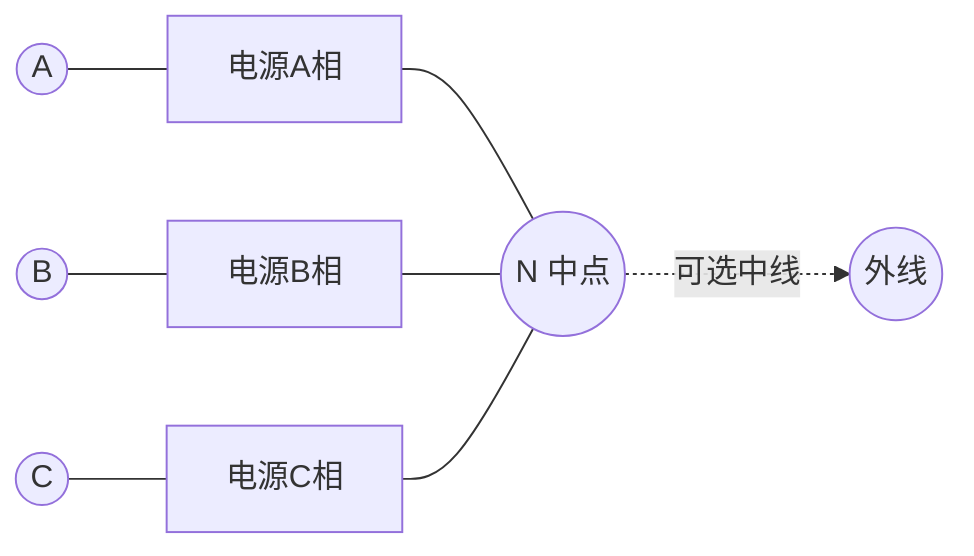

# 3.5 三相交流电路基础

> [!info] 本节定位
> 三相制是电力生产、传输与分配的主流方式——同样材料下三相输电比单相更经济、电机容量更大且运行更平稳。本节把单相相量法推广到对称三相系统：电源由三组幅值相等、频率相同、相位互差 $120°$ 的正弦电压构成；负载按星形（Y）或三角形（△）连接。核心结论是：对称三相电路可**归并为一相等效单相电路**计算，三相功率 $P=\sqrt3 U_L I_L\cos\varphi$ 形式简洁。本节是 [[3.2 RLC 元件相量模型、阻抗与导纳]] 与 [[3.3 正弦电路功率：有功、无功、视在功率]] 的工程综合应用。

## 一、对称三相电源

> [!definition] 对称三相电源
> 由三个独立正弦电压源组成，其瞬时表达式（以 A 相为参考）：
>
> $$u_A=U_m\sin\omega t$$
> $$u_B=U_m\sin(\omega t-120°)$$
> $$u_C=U_m\sin(\omega t+120°)$$
>
> 相量形式：
>
> $$\dot U_A=U\angle0°,\quad \dot U_B=U\angle{-120°},\quad \dot U_C=U\angle120°$$
>
> 三相幅值相等、频率相同、相位依次滞后 $120°$，称为**对称三相电源**。相序 A→B→C 称为**正序**（顺相序）。

> [!theorem] 对称三相电压之和为零
> $$\dot U_A+\dot U_B+\dot U_C=0\quad(\text{时域 }u_A+u_B+u_C=0)$$
>
> 这是三相系统平衡性的核心结论，也是星形连接中性点可不引出（无中线电流）的根源。

> [!warning] 相序的工程意义
> 相序决定三相电动机的旋转方向。调换任意两相接线即可反转。检修大型设备前必须核对相序，避免电机反转造成机械或工艺事故。

## 二、电源与负载的连接方式

### 2.1 星形连接（Y 接）

> [!definition] 星形连接
> 将三相电源（或负载）的三个**末端**连在一起形成**中点 N**，三个**首端**引出作为端线（相线）A、B、C；中点可引出中线（零线）。

> [!theorem] Y 接的线-相关系
> - **相电压** $\dot U_P$：每相电源（或负载）两端的电压，如 $\dot U_{AN}$；
> - **线电压** $\dot U_L$：两根相线之间的电压，如 $\dot U_{AB}=\dot U_A-\dot U_B$。
>
> 对称 Y 接：
>
> $$\boxed{U_L=\sqrt3\,U_P\approx1.732\,U_P},\qquad I_L=I_P$$
>
> 线电压超前对应相电压 $30°$，如 $\dot U_{AB}=\sqrt3\,\dot U_A\angle30°$。

> [!proof] 线电压与相电压关系
> $\dot U_{AB}=\dot U_A-\dot U_B=U\angle0°-U\angle{-120°}=U[1-(-\tfrac12-j\tfrac{\sqrt3}{2})]=U(\tfrac32+j\tfrac{\sqrt3}{2})$  
> 模：$|\dot U_{AB}|=U\sqrt{\tfrac94+\tfrac34}=U\sqrt3$；幅角：$\arctan\dfrac{\sqrt3/2}{3/2}=30°$。故 $\dot U_{AB}=\sqrt3 U\angle30°$。 ∎

> [!example] 我国低压配电
> 民用 $U_P=220$ V（相电压，即相线对中线），则 $U_L=\sqrt3\times220=380$ V（线电压，即两相线间）。"380/220 V"系统即此。

### 2.2 三角形连接（△ 接）

> [!definition] 三角形连接
> 将三相电源（或负载）首尾依次相连形成闭合回路，三个连接点引出三根相线。电源 △ 接必须保证 $\dot U_A+\dot U_B+\dot U_C=0$，否则回路内出现环流。

> [!theorem] △ 接的线-相关系
> 对称 △ 接：
>
> $$\boxed{U_L=U_P},\qquad I_L=\sqrt3\,I_P\approx1.732\,I_P$$
>
> 线电流滞后对应相电流 $30°$。

### 2.3 两种连接对照

| 项目 | 星形 Y | 三角形 △ |
| ---- | ------ | -------- |
| 线电压 $U_L$ | $\sqrt3\,U_P$ | $U_P$ |
| 线电流 $I_L$ | $I_P$ | $\sqrt3\,I_P$ |
| 中线 | 可引出 | 无 |
| 提供两种电压 | 是（如 380/220） | 否 |
| 适用 | 配电、电机绕组 | 变压器、电机降压起动 |

## 三、对称三相电路计算

### 3.1 一相等效法

> [!theorem] 对称三相电路归一相计算
> 当电源对称、负载对称且（Y 接时）中线阻抗不影响时，三相完全对称，各相独立且相同。可将电路化为**单相等效电路**（通常取 A 相）用单相相量法求解，结果按对称关系推及 B、C 相。
>
> 对称条件下中线电流 $\dot I_N=\dot I_A+\dot I_B+\dot I_C=0$，中线可省（三相三线制）。

### 3.2 对称三相功率

> [!theorem] 对称三相功率公式
> - 有功：$P=\sqrt3\,U_L I_L\cos\varphi=3\,U_P I_P\cos\varphi$
> - 无功：$Q=\sqrt3\,U_L I_L\sin\varphi$
> - 视在：$S=\sqrt3\,U_L I_L=\sqrt{P^2+Q^2}$
> - 瞬时功率：**恒定**，$p(t)=P$（不随时间波动）
>
> 其中 $\varphi$ 是每相负载的阻抗角（相电压超前相电流的相位差），与连接方式无关。

> [!proof] $P=\sqrt3 U_L I_L\cos\varphi$
> Y 接：$U_P=U_L/\sqrt3$，$I_P=I_L$，$P=3U_P I_P\cos\varphi=3\cdot\dfrac{U_L}{\sqrt3}\cdot I_L\cos\varphi=\sqrt3 U_L I_L\cos\varphi$。  
> △ 接：$U_P=U_L$，$I_P=I_L/\sqrt3$，$P=3U_L\cdot\dfrac{I_L}{\sqrt3}\cos\varphi=\sqrt3 U_L I_L\cos\varphi$。  
> 两种连接统一为同一公式。 ∎

> [!note] 三相瞬时功率恒定的意义
> 对称三相系统的瞬时功率为常数 $P$（不像单相以 $2\omega$ 波动），使发电机机械转矩平稳、电动机运转无 100 Hz 脉动，是三相制优于单相制的重要动力方面。

## 四、不对称三相电路与中线作用

### 4.1 不对称情形

> [!definition] 不对称三相电路
> 三相负载阻抗不等（$Z_A\neq Z_B\neq Z_C$）或电源不对称时，称不对称三相电路。此时各相电流大小相位不同，无法用一相等效法，须逐相或用节点电压法（中点位移法）分析。

### 4.2 中线的作用

> [!warning] 中线在不对称 Y-Y 系统中的关键作用
> 在 Y 接不对称负载中：
> - **有中线且中线阻抗为零**（理想中线）：各相负载承受确定的电源相电压，互不影响，各相可独立计算；
> - **无中线或中线断开**：负载中点 $N'$ 与电源中点 $N$ 之间出现**中点位移电压** $\dot U_{N'N}\neq0$，使各相负载电压不再等于电源相电压，有的相升高、有的相降低，可能导致设备过压或欠压损坏。

> [!example] 中线断开的危害
> 三相四线制照明系统中，若中线因故障断开，且三相负载不平衡（如 A 相重载、B、C 相轻载），重载相电压降低、灯变暗，轻载相电压升高、灯易烧毁。故**民用配电严禁在中线上装设开关或熔断器**，且中线截面不得小于相线。

### 4.3 不对称三相功率

不对称时总有功等于各相有功之和：
$$P=P_A+P_B+P_C=U_{AN}I_A\cos\varphi_A+U_{BN}I_B\cos\varphi_B+U_{CN}I_C\cos\varphi_C$$

工程上常用**二瓦计法**（两块功率表）测量三相三线制总有功，无论对称与否均适用。

## 五、典型例题

### 例题 1：对称 Y-Y 电路一相法

> [!example] 对称三相电源 Y 接，相电压 $U_P=220$ V，负载 Y 接每相 $Z=8+j6=10\angle36.9°\,\Omega$，线路阻抗不计。求线电流、三相有功、无功、视在功率。

**解**：

(1) 取 A 相，$\dot U_A=220\angle0°$ V：
$$\dot I_A=\frac{\dot U_A}{Z}=\frac{220\angle0°}{10\angle36.9°}=22\angle{-36.9°}\text{ A}$$

(2) 由对称性：
$$\dot I_B=22\angle{-156.9°}\text{ A},\quad \dot I_C=22\angle83.1°\text{ A}$$
线电流等于相电流，$I_L=22$ A。

(3) 功率（$\cos\varphi=\cos36.9°=0.8$，$\sin\varphi=0.6$）：
$$P=\sqrt3 U_L I_L\cos\varphi=\sqrt3\times380\times22\times0.8=11.58\text{ kW}$$
$$Q=\sqrt3 U_L I_L\sin\varphi=\sqrt3\times380\times22\times0.6=8.68\text{ kvar}$$
$$S=\sqrt3 U_L I_L=\sqrt3\times380\times22=14.47\text{ kVA}$$

校验：$P=3I_P^2 R=3\times22^2\times8=11.62$ kW ✓。

### 例题 2：负载 △ 接计算

> [!example] 对称三相电源 $U_L=380$ V，负载 △ 接每相 $Z=10\angle{-30°}\,\Omega$。求相电流、线电流、总有功。

**解**：

(1) △ 接 $U_P=U_L=380$ V：
$$\dot I_{AB}=\frac{\dot U_{AB}}{Z}=\frac{380\angle0°}{10\angle{-30°}}=38\angle30°\text{ A}$$

(2) 线电流：$I_L=\sqrt3 I_P=\sqrt3\times38=65.8$ A，滞后相电流 $30°$：
$$\dot I_A=65.8\angle0°\text{ A}$$

(3) 总有功（$\cos\varphi=\cos(-30°)=0.866$）：
$$P=\sqrt3 U_L I_L\cos\varphi=\sqrt3\times380\times65.8\times0.866=37.5\text{ kW}$$

校验：$P=3I_P^2 R=3\times38^2\times(10\cos30°)=3\times1444\times8.66=37.5$ kW ✓。

### 例题 3：Y-△ 负载变换

> [!example] 对称电源 $U_L=380$ V，将上例 △ 接负载 $Z_\triangle=10\angle{-30°}\,\Omega$ 改为 Y 接，求线电流与总有功，并比较。

**解**：

(1) Y-△ 阻抗等效变换：$Z_Y=\dfrac{Z_\triangle}{3}=\dfrac{10\angle{-30°}}{3}=3.33\angle{-30°}\,\Omega$。

(2) Y 接 $U_P=U_L/\sqrt3=220$ V：
$$I_L=I_P=\frac{U_P}{|Z_Y|}=\frac{220}{3.33}=66\text{ A}$$

(3) 有功：
$$P=\sqrt3 U_L I_L\cos\varphi=\sqrt3\times380\times66\times0.866=37.5\text{ kW}$$

> [!note] Y-△ 等效不改变端口特性
> 同一负载 Y、△ 两种接法，按 $Z_Y=Z_\triangle/3$ 等效变换后，对外电路（线电压、线电流、功率）完全相同。但元件承受的电压电流不同：Y 接相电压低、相电流等于线电流；△ 接相电压等于线电压、相电流为线电流的 $1/\sqrt3$。电动机降压起动常用 Y-△ 起动：起动时 Y 接使相电压降至 $1/\sqrt3$，限制起动电流。

## 六、本节小结

| 连接 | 线电压 | 线电流 | 三相功率（对称） |
| ---- | ------ | ------ | ---------------- |
| Y 接 | $U_L=\sqrt3 U_P$ | $I_L=I_P$ | $P=\sqrt3 U_L I_L\cos\varphi$ |
| △ 接 | $U_L=U_P$ | $I_L=\sqrt3 I_P$ | $P=\sqrt3 U_L I_L\cos\varphi$ |
| 中线作用 | 不对称 Y 系统中维持各相电压额定 | | |

## 章节导航

- 本章首页：[[MOC - 第3章]]
- 上一节：[[3.4 串联谐振、并联谐振]]
- 下一章：[[MOC - 第4章]]（半导体二极管与稳压管）
- 相关：[[3.1 正弦量、相量表示法]]、[[3.2 RLC 元件相量模型、阻抗与导纳]]、[[3.3 正弦电路功率：有功、无功、视在功率]]、[[MOC - 第3章习题]]

## 相关标签

#电路 #交流电路 #三相电路 #三相功率
