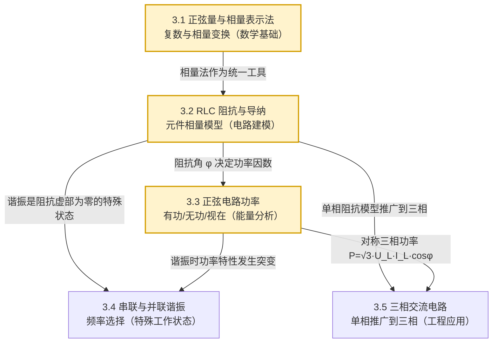

# MOC - 第3章 正弦交流稳态电路

> [!info] 本章定位
> 第3章把第2章建立的直流线性电路分析方法（KCL/KVL、节点电压法、戴维南定理、叠加定理）推广到**正弦激励下的稳态响应**。其核心工具是**相量法**：借助复数把时域中关于 $t$ 的微分/积分方程转化为频域中的复数代数方程，使交流稳态电路可以套用直流电阻电路的全部结论。本章要解决的核心问题是：在单一频率正弦电源作用下，如何统一表示电压电流、如何刻画 RLC 元件的频域行为、如何度量能量传输与交换、如何利用谐振实现选频、如何把单相分析推广到工程中最常用的三相系统。

## 学习路线图

## 知识点导航

| 小节 | 标题 | 核心内容 | 难度 |
| ---- | ---- | -------- | ---- |
| 3.1 | [[3.1 正弦量、相量表示法]] | 三要素、有效值、相位差、复数三种形式、相量表示与运算 | ★★ |
| 3.2 | [[3.2 RLC 元件相量模型、阻抗与导纳]] | R/L/C 相量模型、$Z=R+jX$、$Y=G+jB$、阻抗串并联、相量欧姆定律 | ★★★ |
| 3.3 | [[3.3 正弦电路功率：有功、无功、视在功率]] | 瞬时功率、$P/Q/S$、功率因数、功率三角形、复功率、并联电容提高 $\cos\varphi$ | ★★★★ |
| 3.4 | [[3.4 串联谐振、并联谐振]] | 谐振条件与频率、串联过电压、品质因数 $Q$、并联谐振特点、选频应用 | ★★★★ |
| 3.5 | [[3.5 三相交流电路基础]] | 对称三相电源、Y/△ 连接的线-相关系、$P=\sqrt3 U_L I_L\cos\varphi$、中线作用 | ★★★ |

## 核心考点

> [!abstract] 本章六大考点
> 1. **相量变换与运算**：由正弦量瞬时式写出相量 $\dot{U}=U\angle\psi$，反之由相量还原瞬时值；掌握复数代数/指数/极坐标三种形式互化。
> 2. **阻抗等效与相量欧姆定律**：$\dot U=Z\dot I$，$Z=R+j(X_L-X_C)$；RLC 串并联化简，求总阻抗、总电流、各支路电压电流。
> 3. **功率三要素与功率因数**：$P=UI\cos\varphi$（W）、$Q=UI\sin\varphi$（var）、$S=UI$（VA），$S^2=P^2+Q^2$；明确 $\varphi$ 是阻抗角，也是电压超前电流的相位差。
> 4. **功率因数提高**：感性负载并联电容补偿无功，**有功功率 $P$ 与端电压 $U$ 保持不变**，电容补偿量 $Q_C=-\omega C U^2$，由 $\cos\varphi_1\to\cos\varphi_2$ 求 $C$。
> 5. **串联谐振**：$X_L=X_C$ 时 $Z=R$ 最小、电流最大、电压电流同相、电感与电容电压为电源电压的 $Q$ 倍；$f_0=\dfrac{1}{2\pi\sqrt{LC}}$，$Q=\dfrac{\omega_0 L}{R}=\dfrac{1}{\omega_0 CR}$。
> 6. **三相电路**：Y 接 $U_L=\sqrt3 U_P$、$I_L=I_P$；△接 $U_L=U_P$、$I_L=\sqrt3 I_P$；对称负载 $P=\sqrt3 U_L I_L\cos\varphi$；中线为不对称负载提供返回通路。

## 自测题

> [!question]- 自测1（相量法）
> 已知 $i_1(t)=10\sqrt2\sin(314t+30°)\text{ A}$，$i_2(t)=10\sin(314t-60°)\text{ A}$，求 $i=i_1+i_2$ 的瞬时表达式。
>
> **解**：先统一为最大值相量（或有效值相量）。$i_1$ 有效值相量 $\dot I_1=10\angle30°$，$i_2$ 有效值相量 $\dot I_2=\dfrac{10}{\sqrt2}\angle{-60°}=7.07\angle{-60°}$。  
> 代数化：$\dot I_1=8.66+j5$，$\dot I_2=3.54-j6.12$。  
> $\dot I=\dot I_1+\dot I_2=12.2-j1.12=12.25\angle{-5.24°}$ A。  
> 故 $i(t)=12.25\sqrt2\sin(314t-5.24°)\text{ A}=17.3\sin(314t-5.24°)\text{ A}$。

> [!question]- 自测2（阻抗与功率）
> RLC 串联电路接 $u=220\sqrt2\sin(314t)\text{ V}$，$R=30\,\Omega$，$L=0.159\text{ H}$，$C=80\,\mu\text F$。求电流 $i$、有功功率 $P$、功率因数 $\cos\varphi$。
>
> **解**：$X_L=\omega L=314\times0.159=50\,\Omega$，$X_C=\dfrac{1}{\omega C}=\dfrac{1}{314\times80\times10^{-6}}=39.8\,\Omega$。  
> $Z=R+j(X_L-X_C)=30+j10.2=31.7\angle18.8°\,\Omega$。  
> $\dot I=\dfrac{\dot U}{Z}=\dfrac{220\angle0°}{31.7\angle18.8°}=6.94\angle{-18.8°}$ A。  
> $i(t)=6.94\sqrt2\sin(314t-18.8°)$ A。  
> $P=UI\cos\varphi=220\times6.94\times\cos18.8°=1443$ W（或 $P=I^2R=6.94^2\times30=1443$ W）。  
> $\cos\varphi=\cos18.8°=0.947$（感性，电流滞后电压）。

> [!question]- 自测3（谐振）
> RLC 串联电路 $R=10\,\Omega$，$L=10\text{ mH}$，$C=1\,\mu\text F$。求谐振频率 $f_0$、品质因数 $Q$、谐振时电感电压 $U_L$ 与电源电压 $U$ 之比。
>
> **解**：$f_0=\dfrac{1}{2\pi\sqrt{LC}}=\dfrac{1}{2\pi\sqrt{10\times10^{-3}\times1\times10^{-6}}}=1591.5$ Hz。  
> $\omega_0=2\pi f_0=10^4$ rad/s。  
> $Q=\dfrac{\omega_0 L}{R}=\dfrac{10^4\times10\times10^{-3}}{10}=10$。  
> 谐振时 $U_L=QU=10U$，即电感（电容）电压为电源电压的 10 倍（过电压现象）。

> [!question]- 自测4（三相功率）
> 对称三相负载 Y 接，接 $U_L=380$ V 工频电源，每相 $Z=10\angle53.1°\,\Omega$。求相电流、线电流、三相总有功功率。
>
> **解**：Y 接 $U_P=U_L/\sqrt3=220$ V。  
> $I_P=I_L=U_P/|Z|=220/10=22$ A。  
> $\cos\varphi=\cos53.1°=0.6$。  
> $P=\sqrt3 U_L I_L\cos\varphi=\sqrt3\times380\times22\times0.6=8688$ W $\approx8.69$ kW。

## 章节导航

- 上一级：[[MOC - 电路与模拟电子技术]]
- 上一章：[[MOC - 第2章]]（直流电阻电路分析）
- 下一章：[[MOC - 第4章]]（半导体二极管与稳压管）
- 本章习题：[[MOC - 第3章习题]]
- 知识点小节：
  - [[3.1 正弦量、相量表示法]]
  - [[3.2 RLC 元件相量模型、阻抗与导纳]]
  - [[3.3 正弦电路功率：有功、无功、视在功率]]
  - [[3.4 串联谐振、并联谐振]]
  - [[3.5 三相交流电路基础]]

## 相关标签

#电路 #交流电路 #相量法 #阻抗 #有功功率 #无功功率 #谐振 #三相电路
