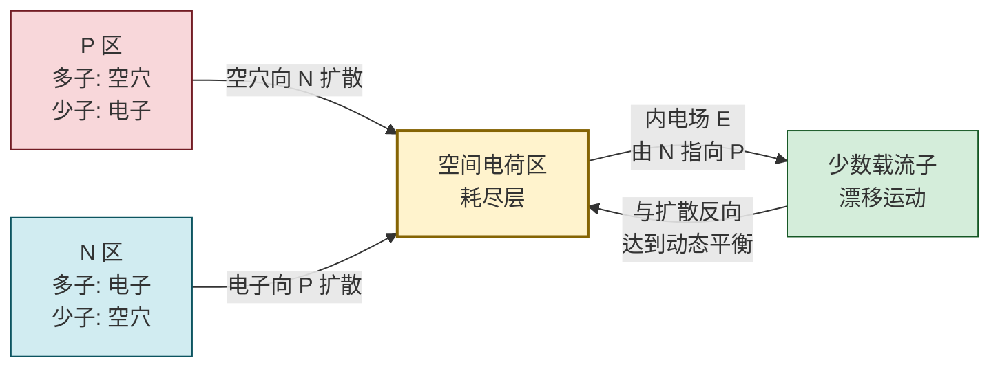

# 4.1 PN 结单向导电性

> [!info] 本节定位
> 本节是整个半导体器件体系的**物理基础**。它要回答的核心问题是：**为什么一块半导体材料经过掺杂和接触之后，会表现出"一个方向导通、另一个方向截止"的非线性导电特性？** 答案是 **PN 结（PN junction）**——P 型与 N 型半导体接触面形成的空间电荷区，在动态平衡下产生内电场，使外加电压极性决定多数载流子能否越过结区。
>
> 本节建立的肖克莱方程 $I=I_S\left(e^{qU/kT}-1\right)$ 是 [[4.2 二极管伏安特性、参数|4.2]]（二极管伏安曲线的数学描述）、[[4.3 二极管整流、限幅电路|4.3]]（电路分析中理想/恒压降模型的依据）和 [[4.4 稳压二极管工作原理与稳压电路|4.4]]（反向击穿特性的基础）的共同前提，也是 [[MOC - 第5章|第5章 BJT]] 内两个 PN 结分析的起点。

## 一、本征半导体与杂质半导体

> [!definition] 本征半导体
> 纯净的、不含杂质且晶格完整的半导体称为**本征半导体（intrinsic semiconductor）**，常用材料为硅（Si，价电子数 4）和锗（Ge）。在绝对零度时价带全满、导带全空，表现为绝缘体；温度升高后，价电子获得能量挣脱共价键束缚形成**自由电子（free electron）**，并在原共价键位置留下带正电的**空穴（hole）**。本征激发成对产生电子—空穴对，故本征半导体中电子浓度 $n$ 与空穴浓度 $p$ 相等：
> $$n=p=n_i\quad(\text{m}^{-3})$$
> $n_i$ 称为本征载流子浓度，随温度升高按指数规律增大。室温（$300\,\text{K}$）下硅的 $n_i\approx 1.5\times10^{16}\,\text{m}^{-3}$，锗的 $n_i\approx 2.5\times10^{19}\,\text{m}^{-3}$。

> [!note] 半导体导电能力的特点
> - 介于导体与绝缘体之间，电阻率约 $10^{-5}\sim10^7\,\Omega\cdot\text{m}$；
> - **热敏性**：温度升高使 $n_i$ 增大，电导率上升（与金属相反）；
> - **光敏性**：光照也可激发电子—空穴对，电导率增大；
> - **掺杂可调性**：掺入微量杂质可显著改变导电能力，这是制造器件的关键。

> [!definition] 杂质半导体（N 型与 P 型）
> 在本征半导体中掺入五价或三价元素杂质，分别得到两类杂质半导体：
>
> - **N 型半导体**：掺入五价元素（磷 P、砷 As、锑 Sb）。一个杂质原子替换一个硅原子后多出一个价电子，该电子束缚松散、极易成为自由电子。此时电子为**多数载流子（多子）**，空穴为**少数载流子（少子）**，$n\gg p$。五价杂质称为**施主杂质（donor）**。
> - **P 型半导体**：掺入三价元素（硼 B、镓 Ga、铟 In）。杂质原子替换硅原子后缺少一个价电子，形成一个可接受电子的空位即空穴。此时空穴为**多子**，电子为**少子**，$p\gg n$。三价杂质称为**受主杂质（acceptor）**。

> [!warning] 多子与少子的关键区别
> 1. **多子浓度**主要由掺杂浓度决定（$n\approx N_D$ 或 $p\approx N_A$，$N_D$、$N_A$ 为施主/受主浓度），受温度影响小；
> 2. **少子浓度**由本征激发产生，对温度极为敏感——这是半导体器件高温性能退化的根本原因（详见 [[4.2 二极管伏安特性、参数|4.2]] 温度影响）；
> 3. 整体电中性：N 型中 $n=p+N_D^+$，P 型中 $p=n+N_A^-$。
> 4. 不要误以为 N 型半导体带负电、P 型带正电——它们整体均呈电中性，只是载流子类型不同。

## 二、PN 结的形成

> [!definition] PN 结
> 将 P 型半导体与 N 型半导体通过合金法、扩散法等工艺紧密接触，在交界处形成的特殊区域称为 **PN 结**。其形成过程是扩散运动与漂移运动动态平衡的结果。

> [!theorem] PN 结形成过程
> 1. **扩散运动**：接触瞬间，P 区空穴浓度远高于 N 区，N 区电子浓度远高于 P 区，浓度差驱使多子向对方区域扩散（P 区空穴→N 区，N 区电子→P 区），并在结区附近复合。
> 2. **空间电荷区**：多子扩散离开后，P 区侧留下带负电的受主离子（$N_A^-$），N 区侧留下带正电的施主离子（$N_D^+$），这些离子固定在晶格中不能移动，于是在交界面两侧形成一层很薄的、无自由载流子的区域——**空间电荷区**，又称**耗尽层（depletion layer）**。
> 3. **内电场**：空间电荷区的正负离子产生由 N 区指向 P 区的电场 $E$，称为**内电场（内建电场）**，对应接触电势差 $U_D$（硅约 $0.6\sim0.8\,\text{V}$，锗约 $0.2\sim0.3\,\text{V}$）。
> 4. **漂移运动**：内电场驱使少子（P 区电子、N 区空穴）沿电场方向越过结区，称为**漂移运动**，方向与扩散相反。
> 5. **动态平衡**：扩散电流随耗尽层展宽减小，漂移电流随之增大，最终二者大小相等、方向相反，PN 结宏观无电流，达到**动态平衡**。

> [!note] 耗尽层的几点性质
> - 耗尽层内几乎无自由载流子，电阻率很高，相当于绝缘介质；
> - 耗尽层宽度由掺杂浓度决定：掺杂越浓、宽度越窄；两侧掺杂不对称时，耗尽层主要向低掺杂一侧扩展；
> - 内建电势差 $U_D$ 与材料、掺杂、温度有关，是 PN 结单向导电性的"势垒"。

## 三、PN 结的单向导电性

> [!theorem] 单向导电性
> PN 结外加电压极性不同时，导电能力差异巨大：
> - **正向偏置（正偏）**：P 接正、N 接负，外加电场与内电场反向，削弱内电场、耗尽层变窄、势垒降低，多数载流子大量扩散越过结区，形成较大的**正向电流**，PN 结**导通**；
> - **反向偏置（反偏）**：P 接负、N 接正，外加电场与内电场同向，增强内电场、耗尽层变宽、势垒升高，扩散被抑制，仅有少子漂移形成的极小**反向饱和电流**，PN 结**截止**。

| 偏置条件 | 外电场方向 | 耗尽层 | 主要运动 | 电流大小 | 状态 |
| -------- | ---------- | ------ | -------- | -------- | ---- |
| 正偏（P+ N−） | 与内电场反向 | 变窄 | 多子扩散 | 大（mA 级） | 导通 |
| 反偏（P− N+） | 与内电场同向 | 变宽 | 少子漂移 | 极小（μA 级） | 截止 |

> [!warning] 单向导电性的适用边界
> 1. 反偏电压超过**击穿电压**后，反向电流急剧增大，单向导电性被破坏（见 [[4.2 二极管伏安特性、参数|4.2]] 反向击穿区）；
> 2. 反向饱和电流由少子漂移形成，对温度极为敏感，高温下"截止"性能变差；
> 3. 单向导电性是"近似"的，并非反偏时完全无电流，只是相对正向电流可忽略。

## 四、PN 结的伏安特性方程（肖克莱方程）

> [!theorem] 肖克莱方程（Shockley equation）
> 理想 PN 结的电流—电压关系为
> $$\boxed{\,I=I_S\left(e^{qU/kT}-1\right)\,}\quad(\text{A})$$
> 其中：
> - $I$ 为流过 PN 结的电流（A），规定正偏电流方向为正；
> - $U$ 为 PN 结两端电压（V），规定 P 端相对 N 端为正；
> - $I_S$ 为**反向饱和电流**（A），与材料、掺杂、温度有关，室温下硅 PN 结约 $10^{-12}\sim10^{-9}\,\text{A}$；
> - $q=1.602\times10^{-19}\,\text{C}$ 为电子电荷量；
> - $k=1.381\times10^{-23}\,\text{J/K}$ 为玻尔兹曼常量；
> - $T$ 为热力学温度（K）。

> [!note] 热电压 $U_T$
> 定义**热电压（温度当量）**
> $$U_T=\frac{kT}{q}$$
> 室温 $T=300\,\text{K}$ 时
> $$U_T=\frac{1.381\times10^{-23}\times300}{1.602\times10^{-19}}\approx 0.0259\,\text{V}\approx 26\,\text{mV}$$
> 故 $\dfrac{q}{kT}=\dfrac{1}{U_T}\approx 38.7\,\text{V}^{-1}$，方程可写为 $I=I_S\left(e^{U/U_T}-1\right)$。

> [!proof] 肖克莱方程的两个极限
> - **正偏且 $U\gg U_T$**（约 $U>0.1\,\text{V}$）：$e^{U/U_T}\gg1$，故
>   $$I\approx I_S e^{U/U_T}$$
>   电流随电压指数增长，正向导通。
> - **反偏且 $|U|\gg U_T$**（约 $U<-0.1\,\text{V}$）：$e^{U/U_T}\to0$，故
>   $$I\approx -I_S$$
>   电流与电压无关、近似为 $-I_S$，即反向饱和电流，方向与规定正方向相反。

> [!warning] 肖克莱方程的局限性
> 肖克莱方程是**理想模型**，忽略了：
> 1. **大注入效应**：正向大电流时注入载流子浓度接近甚至超过掺杂浓度，方程偏离指数关系；
> 2. **中性区串联电阻**：实际 PN 结存在体电阻和接触电阻，大电流时压降不可忽略；
> 3. **产生—复合电流**：耗尽层内的复合（正偏小电流）与产生（反偏）电流未计入，使实际低电流区偏离方程；
> 4. **反向击穿**：方程在反偏未击穿区才成立，击穿后电流急剧增大无法用该式描述。
> 因此工程上多在指数关系成立的中等电流区使用，定量分析常改用简化模型（见 [[4.3 二极管整流、限幅电路|4.3]]）。

## 五、典型例题

### 例题 1：正向电流比估算

> [!example] 题目
> 硅 PN 结在室温（$T=300\,\text{K}$）下，反向饱和电流 $I_S=1\,\text{nA}$。分别计算正偏电压 $U=0.60\,\text{V}$ 与 $U=0.65\,\text{V}$ 时的正向电流，并比较。

**解**：$U_T\approx 26\,\text{mV}=0.026\,\text{V}$，$I=I_S\left(e^{U/U_T}-1\right)\approx I_S e^{U/U_T}$（因 $e^{U/U_T}\gg1$）。

$U=0.60\,\text{V}$：
$$I_1=10^{-9}\times e^{0.60/0.026}=10^{-9}\times e^{23.08}\approx 10^{-9}\times 1.07\times10^{10}\approx 10.7\,\text{A}$$

$U=0.65\,\text{V}$：
$$I_2=10^{-9}\times e^{0.65/0.026}=10^{-9}\times e^{25.00}\approx 10^{-9}\times 7.20\times10^{10}\approx 72.0\,\text{A}$$

电流比 $\dfrac{I_2}{I_1}=\dfrac{72.0}{10.7}\approx 6.73$，即电压仅增加 $0.05\,\text{V}$，电流增大到约 $6.7$ 倍。

> [!note] 物理意义
> 指数关系使正向电流对电压极为敏感——这正是二极管"正向电压近似恒定"的根源：电流变化几个数量级，电压仅在小范围内变化（硅约 $0.6\sim0.8\,\text{V}$）。但本例算出的电流已达数十安培，实际二极管会因串联电阻与功耗限制远小于此，说明肖克莱方程在大电流区已不适用。

### 例题 2：温度对反向饱和电流的影响

> [!example] 题目
> 锗 PN 结 $I_S(300\,\text{K})=1\,\mu\text{A}$。近似认为温度每升高 $10\,\circ\text{C}$，$I_S$ 翻倍。求 $T=320\,\text{K}$（约 $47\,\circ\text{C}$）时的 $I_S$，并说明对反偏截止的影响。

**解**：温度升高 $\Delta T=320-300=20\,\text{K}$，对应 $20/10=2$ 次翻倍：
$$I_S(320\,\text{K})=1\,\mu\text{A}\times2^2=4\,\mu\text{A}$$

反偏时 $I\approx-I_S$，反向漏电流增大到 4 倍。继续升温会使少子浓度急剧上升，反向电流显著增大，"截止"性能退化，严重时 PN 结因过热损坏。

**单位检验**：$I_S$ 单位 A；温度采用热力学温标 K，$10\,\text{K}$ 与 $10\,\circ\text{C}$ 间隔相同。

### 例题 3：由伏安特性反推 $I_S$

> [!example] 题目
> 室温下测得某硅 PN 结正偏 $U=0.55\,\text{V}$ 时 $I=0.10\,\text{mA}$。忽略串联电阻，估算其反向饱和电流 $I_S$。

**解**：由 $I=I_S e^{U/U_T}$（正偏近似）：
$$I_S=I\,e^{-U/U_T}=0.10\times10^{-3}\times e^{-0.55/0.026}=10^{-4}\times e^{-21.15}\approx 10^{-4}\times 6.92\times10^{-10}\approx 6.9\times10^{-14}\,\text{A}$$

约为 $69\,\text{fA}$，与硅 PN 结典型量级一致。

**单位检验**：$I$（A）× 无量纲指数因子 = A，自洽。

## 六、易错点

> [!warning] 易错点
> 1. **混淆多子与少子**：N 型多子是电子（不是空穴），P 型多子是空穴。多子由掺杂提供、浓度高且稳定；少子由本征激发产生、浓度低但对温度极敏感。
> 2. **内电场方向记反**：内电场由 N 区指向 P 区（由正离子指向负离子），不是由 P 指向 N。正偏是外电场与内电场反向（即 P 加正压）。
> 3. **正偏导通原因误解**：导通不是"外电压克服内电场把电子直接推过去"，而是势垒降低使多子扩散重新占主导。本质是扩散与漂移平衡被打破。
> 4. **反向饱和电流恒定**：反偏时 $I\approx -I_S$ 与电压无关，但它强依赖温度——不要把它当作"与一切无关的常数"。
> 5. **肖克莱方程符号**：方程中 $U$ 规定 P 端相对 N 端为正，反偏时 $U<0$；$I$ 正方向为 P→N（正向）。代入时务必带符号。
> 6. **指数近似条件**：$I\approx I_S e^{U/U_T}$ 仅在 $U\gg U_T$（约 $U>0.1\,\text{V}$）成立；接近零偏时必须保留 $-1$ 项。

## 七、与其他小节的联系

- 本节的伏安特性方程直接给出 [[4.2 二极管伏安特性、参数|4.2]] 二极管特性曲线的数学描述，并定义死区电压、导通电压等工程参数；
- 本节建立的"正偏导通、反偏截止"是 [[4.3 二极管整流、限幅电路|4.3]] 理想模型与恒压降模型的物理依据；
- 反偏击穿区（本节未展开）是 [[4.4 稳压二极管工作原理与稳压电路|4.4]] 稳压管工作的物理基础；
- PN 结是 [[MOC - 第5章|第5章]] BJT（两个 PN 结背靠背）与 [[MOC - 第6章|第6章]] FET 的核心结构；
- 本章 MOC：[[MOC - 第4章]]。

## 章节导航

- 上一级：[[MOC - 第4章]]
- 先修：[[MOC - 大学物理B]]（固体能带、电场对电荷作用）
- 下一节：[[4.2 二极管伏安特性、参数]]
- 习题：[[MOC - 第4章习题]]
