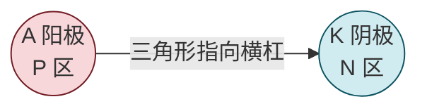
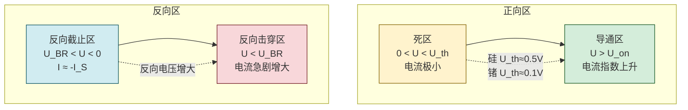

# 4.2 二极管伏安特性、参数

> [!info] 本节定位
> 本节把 [[4.1 PN 结单向导电性|4.1]] 的 PN 结物理原理**器件化**，回答两个工程问题：**实际二极管的电流—电压曲线长什么样？选用一只二极管时需要关心哪些极限参数？** 伏安特性曲线是 [[4.3 二极管整流、限幅电路|4.3]] 选择简化模型（理想/恒压降/折线）的依据，反向击穿区则是 [[4.4 稳压二极管工作原理与稳压电路|4.4]] 稳压管工作的物理基础。
>
> 本节区分**理想特性（肖克莱方程）**与**实际特性（含死区、串联电阻、击穿）**，强调不要把理想模型结论无条件推广到实际器件（参见局部规则）。

## 一、二极管的结构与符号

> [!definition] 半导体二极管
> **半导体二极管（semiconductor diode）**是由一个 PN 结加上引线、用管壳封装而成的两端器件。P 区引出端为**阳极（anode，A）**，N 区引出端为**阴极（cathode，K）**。其电路符号与PN结方向一致：阳极侧（三角形）对应 P 区，阴极侧（横杠）对应 N 区。

> [!note] 常见二极管类型（按材料与工艺）
> - 按材料：硅二极管、锗二极管、砷化镓等；
> - 按结构：点接触型（结面积小、结电容小、适用于高频检波，电流小）、面接触型（结面积大、电流大、适用于整流，工作频率低）、平面型（集成电路工艺）；
> - 按功能：普通整流管、开关管、稳压管、发光管、光电管等。本章主要讨论普通硅整流二极管。

## 二、二极管的伏安特性曲线

二极管的伏安特性是流过它的电流 $I$ 与两端电压 $U$（阳极相对阴极）的关系曲线。实际特性在 [[4.1 PN 结单向导电性|4.1]] 肖克莱方程基础上增加了死区、串联电阻和反向击穿。

### 1. 正向特性

> [!definition] 死区与导通电压
> - **死区电压 $U_{th}$（dead voltage）**：正向电压较小时，外加电场不足以显著削弱内电场，正向电流极小、近似为零。该电压范围称为死区。
>   - 硅管：$U_{th}\approx 0.5\,\text{V}$
>   - 锗管：$U_{th}\approx 0.1\,\text{V}$
> - **导通电压 $U_{on}$（turn-on voltage）**：正向电压超过死区后电流显著增大，工程上把对应明显导通的电压称为导通电压（正向压降）。
>   - 硅管：$U_{on}\approx 0.6\sim0.7\,\text{V}$（典型取 $0.7\,\text{V}$）
>   - 锗管：$U_{on}\approx 0.2\sim0.3\,\text{V}$（典型取 $0.3\,\text{V}$）

> [!note] 死区的物理来源
> 肖克莱方程 $I=I_S(e^{U/U_T}-1)$ 在 $U$ 很小时 $I$ 很小但并非严格为零。死区是工程上的近似——当正向电流远小于可测量阈值（如 $\mu\text{A}$ 级）时认为"未导通"。死区电压与 $I_S$、$U_T$ 有关：$I_S$ 越小（硅）、$U_{th}$ 越大。

### 2. 反向特性

> [!definition] 反向饱和电流与击穿
> - **反向截止区**：反偏电压未达到击穿电压时，反向电流很小且基本不随电压变化，约等于 $-I_S$（反向饱和电流）。室温下硅管 $I_S$ 约 $\mu\text{A}\sim\text{nA}$ 量级，锗管较大（$\mu\text{A}$ 级）。
> - **反向击穿区**：反向电压增大到 **击穿电压 $U_{BR}$** 后，反向电流急剧增大，发生反向击穿。

### 3. 反向击穿的两种机理

> [!theorem] 雪崩击穿与齐纳击穿
> | 类型 | 雪崩击穿（avalanche breakdown） | 齐纳击穿（zener breakdown） |
> | ---- | -------------------------------- | -------------------------- |
> | 机理 | 少子在耗尽层强电场加速获得足够能量，碰撞晶格原子产生电子—空穴对，新生载流子再被加速碰撞，形成"雪崩"式倍增 | 耗尽层极薄时强电场直接把价电子从共价键中拉出（隧道效应），产生大量电子—空穴对 |
> | 发生条件 | 掺杂浓度较低、耗尽层较宽、击穿电压较高（一般 $U_{BR}>6\,\text{V}$） | 掺杂浓度较高、耗尽层很薄、击穿电压较低（一般 $U_{BR}<4\,\text{V}$） |
> | 温度系数 | 正温度系数（温度升高，$U_{BR}$ 升高） | 负温度系数（温度升高，$U_{BR}$ 降低） |
> | 可逆性 | 未过功耗时为非破坏性、可逆 | 同上 |
>
> $4\sim6\,\text{V}$ 区间二者并存。**只要限制功耗（不超过 $P_{ZM}$），击穿是可逆的**，这正是稳压管的工作基础（见 [[4.4 稳压二极管工作原理与稳压电路|4.4]]）。

> [!warning] 击穿≠损坏
> 反向击穿本身并非立即损坏——只要流过的电流被外电路限制、功耗不超过允许值，PN 结可反复工作于击穿区（稳压管即如此）。损坏发生在**过功耗导致热失控**时。不要把"击穿"与"烧毁"混为一谈。

## 三、二极管的主要参数

> [!definition] 二极管主要参数
> 1. **最大整流电流 $I_F$（maximum forward current）**：二极管长期工作时允许通过的最大正向平均电流（A）。超过会使 PN 结过热损坏。大功率整流管需配散热片。
> 2. **最高反向工作电压 $U_{RM}$（maximum reverse voltage）**：二极管工作时允许施加的最大反向电压（V），通常取击穿电压 $U_{BR}$ 的一半左右（$U_{RM}\approx0.5\,U_{BR}$）以保证安全裕量。超过可能进入击穿区。
> 3. **反向电流 $I_R$（reverse current）**：在规定反向电压下的实际反向电流（A），包含 $I_S$ 与表面漏电流。硅管远小于锗管；该值越小越好，且对温度敏感。
> 4. **最高工作频率 $f_M$（maximum frequency）**：二极管能正常工作的最高频率（Hz），受 PN 结结电容（势垒电容 + 扩散电容）限制。频率过高时结电容充放电使单向导电性退化。整流管 $f_M$ 较低，开关管、点接触管较高。
> 5. **正向压降 $U_F$**：在工作电流下的正向电压（V），硅管约 $0.7\,\text{V}$，锗管约 $0.3\,\text{V}$，大电流时略升。

> [!note] 选用二极管的安全裕量原则
> 实际电路中应使工作电流 $I\le0.5\sim0.8\,I_F$、反向电压 $\le U_{RM}$，并预留温度裕量。型号数据必须查对应**数据手册及版本**（局部规则要求），不同厂家、不同批次参数可能差异。

## 四、温度对二极管特性的影响

> [!theorem] 温度影响
> 1. **反向饱和电流 $I_S$ 随温度升高急剧增大**：近似规律为温度每升高 $10\,\circ\text{C}$，$I_S$ 翻倍。硅管在 $25\,\circ\text{C}$ 与 $100\,\circ\text{C}$ 的 $I_S$ 可相差数百倍。
> 2. **正向特性随温度升高而左移**：相同正向电流下，温度每升高 $1\,\circ\text{C}$，正向压降约减小 $2\sim2.5\,\text{mV}$（硅）。即 $U_{on}$ 随温度升高而降低。
> 3. **击穿电压 $U_{BR}$ 随温度变化**：雪崩击穿（正温度系数）随温度升高而升高，齐纳击穿（负温度系数）则相反。
> 4. **结温限制**：硅管最高结温约 $150\sim200\,\circ\text{C}$，锗管约 $75\sim85\,\circ\text{C}$。超过会使器件永久损坏。

> [!warning] 高温设计的隐患
> 高温下反向电流增大、正向压降减小，可能导致原本"截止"的二极管漏电流不可忽略、稳压值漂移。设计稳压电路或高精度整流时必须进行温度核算，不能把室温测得的特性直接推广到全部工作温度范围。

## 五、典型例题

### 例题 1：导通状态判断与电流估算

> [!example] 题目
> 硅二极管电路：电源 $U_S=5\,\text{V}$，串联限流电阻 $R=2\,\text{k}\Omega$，二极管导通压降按恒压降模型取 $U_{on}=0.7\,\text{V}$。求回路电流 $I$ 与二极管功耗 $P_D$。

**解**：硅二极管正偏导通，由 KVL：
$$I=\frac{U_S-U_{on}}{R}=\frac{5-0.7}{2\times10^3}=\frac{4.3}{2000}=2.15\times10^{-3}\,\text{A}=2.15\,\text{mA}$$
二极管功耗：
$$P_D=U_{on}\cdot I=0.7\times2.15\times10^{-3}\approx 1.51\times10^{-3}\,\text{W}=1.51\,\text{mW}$$

**单位检验**：$\text{V}/\Omega=\text{A}$；$\text{V}\cdot\text{A}=\text{W}$，自洽。功耗远小于普通二极管 $P_{ZM}$，安全。

### 例题 2：反向击穿电压裕量校核

> [!example] 题目
> 桥式整流电路，变压器次级有效值 $U_2=24\,\text{V}$。若选最高反向工作电压 $U_{RM}=50\,\text{V}$ 的二极管是否安全？给出选型建议。

**解**：桥式整流中每个二极管承受的最大反向电压为
$$U_{RM\text{(实际)}}=\sqrt2\,U_2=1.414\times24\approx 33.9\,\text{V}$$
选 $U_{RM}=50\,\text{V}$ 的管子，裕量 $50-33.9=16.1\,\text{V}$，安全。

但考虑电网波动 $\pm10\%$ 与浪涌，建议 $U_{RM}\ge1.5\sim2$ 倍实际最大反压：
$$U_{RM}\ge 2\times33.9\approx 68\,\text{V}$$
建议选 $U_{RM}\ge100\,\text{V}$ 的型号（如 1N4002，$U_{RM}=100\,\text{V}$）。

**单位检验**：电压单位 V，比例无量纲，自洽。

### 例题 3：温度对正向压降的影响估算

> [!example] 题目
> 硅二极管在 $25\,\circ\text{C}$ 工作电流下正向压降 $U_F=0.72\,\text{V}$。估算环境温度升至 $75\,\circ\text{C}$ 时同电流下的正向压降。

**解**：硅二极管正向压降温度系数约 $-2\,\text{mV}/\circ\text{C}$。温度升高 $\Delta T=75-25=50\,\circ\text{C}$：
$$\Delta U_F=-2\times10^{-3}\times50=-0.10\,\text{V}$$
$$U_F(75\,\circ\text{C})=0.72-0.10=0.62\,\text{V}$$

> [!note] 工程意义
> 高温下正向压降减小，意味着同样电源电压下电流会增大——大功率整流器并联均流、热稳定性分析必须考虑这一点。

## 六、易错点

> [!warning] 易错点
> 1. **死区电压与导通电压混淆**：死区电压 $U_{th}$（硅 $0.5\,\text{V}$）是电流开始明显增大的阈值，导通电压 $U_{on}$（硅 $0.7\,\text{V}$）是工程正常工作压降，二者不同。
> 2. **硅锗参数张冠李戴**：硅管死区 $0.5\,\text{V}$、导通 $0.7\,\text{V}$；锗管死区 $0.1\,\text{V}$、导通 $0.3\,\text{V}$。题目未注明材料时按硅处理（现代电路主流）。
> 3. **$U_{RM}$ 与 $U_{BR}$ 关系**：$U_{RM}$ 是允许工作反压（约 $U_{BR}/2$），不是击穿电压。超过 $U_{RM}$ 不一定立即击穿，但失去安全裕量。
> 4. **反向饱和电流当作常数**：$I_S$ 强依赖温度，高温下漏电流可能增大数个量级，不能把室温数据无条件用于高温。
> 5. **击穿即损坏的错误观念**：只要限制功耗，反向击穿可逆（稳压管正是利用这点）。损坏的判据是结温与功耗，不是"是否击穿"。
> 6. **最高工作频率被忽略**：低频整流管用于高频检波时单向导电性退化，须按 $f_M$ 选型。

## 七、与其他小节的联系

- 本节伏安特性是 [[4.1 PN 结单向导电性|4.1]] 肖克莱方程的工程化呈现，明确了死区、导通电压等实际参数；
- 本节的正向特性分段（死区/导通）是 [[4.3 二极管整流、限幅电路|4.3]] 三种简化模型（理想/恒压降/折线）的依据；
- 本节的反向击穿区机理是 [[4.4 稳压二极管工作原理与稳压电路|4.4]] 稳压管工作的物理基础；
- 二极管参数 $I_F$、$U_{RM}$、$f_M$ 是 [[MOC - 第10章|第10章]] 整流电源选型的依据；
- 本章 MOC：[[MOC - 第4章]]。

## 章节导航

- 上一级：[[MOC - 第4章]]
- 先修：[[4.1 PN 结单向导电性]]
- 下一节：[[4.3 二极管整流、限幅电路]]
- 习题：[[MOC - 第4章习题]]
