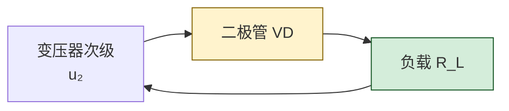
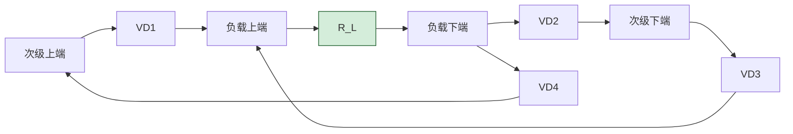

# 4.3 二极管整流、限幅电路

> [!info] 本节定位
> 本节把 [[4.2 二极管伏安特性、参数|4.2]] 的器件特性用于**电路分析**，回答两个问题：**面对一只非线性的二极管，怎样建立可手算的简化模型？又如何用这些模型分析整流、限幅、钳位等典型电路？**
>
> 本节是 [[4.4 稳压二极管工作原理与稳压电路|4.4]] 稳压电路（限流电阻分析）和 [[MOC - 第10章|第10章 直流稳压电源]]（整流滤波）的直接前置，整流输出公式 $U_o=0.45U_2$（半波）、$U_o=0.9U_2$（全波/桥式）是后续滤波稳压设计的输入量。
>
> 电路分析遵循局部规则：明确参考方向、节点、二极管导通条件与极性，模型简化要说明近似假设，不得把理想模型结论无条件推广到精度要求高的场合。

## 一、二极管的简化模型

实际二极管伏安特性是非线性的，直接用肖克莱方程难以手算。工程上按精度要求建立三种简化模型。

> [!definition] 1. 理想二极管模型
> 把二极管视为理想开关：
> - **正向偏置**：相当于**短路**（导通，$U_D=0$，正向电阻为零）；
> - **反向偏置**：相当于**开路**（截止，$I=0$，反向电阻无穷大）。
>
> 适用于：电源电压远大于二极管导通压降（如 $U\gg0.7\,\text{V}$，例如几十伏以上）、精度要求不高的场合。

> [!definition] 2. 恒压降模型（常数压降模型）
> 认为二极管导通时正向压降恒定为 $U_{on}$（硅取 $0.7\,\text{V}$，锗取 $0.3\,\text{V}$）：
> - **正向导通**：$U_D=U_{on}$（相当于一个 $U_{on}$ 的电压源）；
> - **反偏或正偏低于 $U_{on}$**：截止，$I=0$。
>
> 适用于：电源电压数伏到数十伏、需考虑二极管压降但精度要求一般的场合。是本章电路分析**最常用**的模型。

> [!definition] 3. 折线模型（含动态电阻）
> 把正向特性用一条斜线近似：导通后
> $$U_D=U_{on}+r_D\,I$$
> 其中 $r_D=\dfrac{\Delta U}{\Delta I}=\dfrac{U_T}{I_Q}$ 为**动态电阻（交流电阻）**，$I_Q$ 为工作点电流。反偏仍截止。
>
> 适用于：信号幅度较小（毫伏级）、需考虑二极管压降随电流变化的较精确分析。

> [!warning] 模型选择原则
> 1. 信号幅度远大于 $0.7\,\text{V}$ → 理想模型；
> 2. 信号幅度数伏，需体现压降 → 恒压降模型；
> 3. 信号幅度小、需精确小信号分析 → 折线模型或微变等效（$r_D$）；
> 4. **绝不能用理想模型分析稳压值、精密限幅电平**等需要体现压降的场合；
> 5. 模型只在工作范围内有效，超出（如击穿、大电流）需换用更精确模型。

## 二、整流电路

整流电路利用二极管单向导电性，把交流电转换为脉动直流。设变压器次级电压
$$u_2=\sqrt2\,U_2\sin\omega t\quad(\text{V})$$
$U_2$ 为有效值（V），$\omega$ 为角频率（rad/s）。

### 1. 半波整流

> [!definition] 半波整流电路
> 一只二极管 VD 与负载 $R_L$ 串联，接在变压器次级两端。
> - $u_2>0$（正半周）：VD 正偏导通（理想模型），$u_o=u_2$；
> - $u_2<0$（负半周）：VD 反偏截止，$u_o=0$。

> [!theorem] 半波整流输出
> 输出电压为一个周期内正半周的平均值：
> $$\boxed{\,U_o=\frac{1}{2\pi}\int_0^\pi\sqrt2\,U_2\sin\omega t\,d(\omega t)=\frac{\sqrt2}{\pi}U_2\approx0.45\,U_2\,}\quad(\text{V})$$
> 输出电流平均值 $I_o=U_o/R_L$（A）。
> 二极管承受最大反向电压：$U_{RM}=\sqrt2\,U_2$（V）。
> 二极管平均电流：$I_D=I_o$（A）。

### 2. 全波整流（中心抽头式）

> [!definition] 全波整流
> 变压器次级中心抽头，接两只二极管 VD1、VD2，负载接在抽头与两管阴极公共点之间。
> - 正半周：VD1 导通、VD2 截止，电流经 VD1 流过 $R_L$；
> - 负半周：VD2 导通、VD1 截止，电流经 VD2 流过 $R_L$（方向相同）。
>
> 这样正负半周都被利用。

> [!theorem] 全波整流输出
> $$\boxed{\,U_o=\frac{1}{\pi}\int_0^\pi\sqrt2\,U_2\sin\omega t\,d(\omega t)=\frac{2\sqrt2}{\pi}U_2\approx0.9\,U_2\,}\quad(\text{V})$$
> （$U_2$ 为半个次级绕组的有效值）
> 二极管承受最大反向电压：$U_{RM}=2\sqrt2\,U_2$（V）（两倍半个绕组峰值）。
> 每管平均电流：$I_D=I_o/2$（A）。

### 3. 桥式整流

> [!definition] 桥式整流
> 用四只二极管接成桥式，负载接在桥的输出端。变压器次级无需中心抽头。
> - 正半周：电流路径"次级上端→VD1→$R_L$→VD2→次级下端"；
> - 负半周：电流路径"次级下端→VD3→$R_L$→VD4→次级上端"。
>
> 每半周各有两只二极管串联导通，负载电流方向始终一致。

> [!theorem] 桥式整流输出
> $$\boxed{\,U_o\approx0.9\,U_2\,}\quad(\text{V})$$
> 二极管承受最大反向电压：$U_{RM}=\sqrt2\,U_2$（V）（仅半个次级绕组）。
> 每管平均电流：$I_D=I_o/2$（A）。

> [!note] 三种整流的对比
> | 类型 | 二极管数 | $U_o$ | 单管 $U_{RM}$ | 单管平均电流 | 变压器利用 |
> | ---- | -------- | ----- | ------------- | ------------ | ---------- |
> | 半波 | 1 | $0.45U_2$ | $\sqrt2 U_2$ | $I_o$ | 低（仅用半周） |
> | 全波（中心抽头） | 2 | $0.9U_2$ | $2\sqrt2 U_2$ | $I_o/2$ | 中（需中心抽头） |
> | 桥式 | 4 | $0.9U_2$ | $\sqrt2 U_2$ | $I_o/2$ | 高（结构简单，最常用） |

## 三、限幅电路

限幅电路（削波电路）利用二极管导通/截止状态切换，把输入信号某一部分"削去"，使输出限制在一定范围。

> [!definition] 限幅电路分类
> - **上限幅**：削去输入高于某电平 $U_{ref}$ 的部分，输出上限为 $U_{ref}$；
> - **下限幅**：削去输入低于某电平的部分，输出下限为 $U_{ref}$；
> - **双向限幅**：上下限幅组合，输出限制在 $[U_{ref1},U_{ref2}]$ 区间。

### 典型上限幅电路分析

设二极管 VD 阳极接输出端、阴极接参考电压 $U_{ref}$（恒压降模型 $U_{on}$）。

> [!example] 上限幅电路
> 输入 $u_i=10\sin\omega t\,\text{V}$，VD 阴极接 $U_{ref}=5\,\text{V}$，阳极接输出。硅管 $U_{on}=0.7\,\text{V}$。求输出 $u_o$。

**解**：VD 导通条件为 $u_i-U_{ref}\ge U_{on}$，即 $u_i\ge U_{ref}+U_{on}=5.7\,\text{V}$。
- 当 $u_i<5.7\,\text{V}$：VD 截止，输出跟随输入 $u_o=u_i$；
- 当 $u_i\ge5.7\,\text{V}$：VD 导通，输出被钳在 $u_o=U_{ref}+U_{on}=5.7\,\text{V}$。

故输出顶部被削平在 $5.7\,\text{V}$，正半周超过 $5.7\,\text{V}$ 部分被削去。

> [!warning] 限幅电平的方向判别
> 二极管阴极接参考电压 → 上限幅；阳极接参考电压 → 下限幅。导通时输出电平 = $U_{ref}\pm U_{on}$（方向取决于二极管朝向），务必画电路图判断。

## 四、钳位电路

> [!definition] 钳位电路
> 钳位电路（clamper）通过电容的"记忆"作用，把信号波形的顶部或底部钳制到某个固定直流电平，而不改变波形形状。典型结构为：电容 $C$ 与二极管 VD 串联后跨接在信号通路，配合适当偏置。

> [!note] 钳位与限幅的区别
> - **限幅**改变波形形状（削去一部分）；
> - **钳位**不改变波形形状，只改变其直流基准（整体上下平移）。
> 二极管导通时给电容充电到某电平，截止时电容保持电压，使输出整体偏移。

### 典型顶部钳位电路

设输入 $u_i=U_m\sin\omega t$，VD 与负载并联（阴极接地），$C$ 串联在输入端。

- 负半周 VD 导通，$C$ 充电至 $U_m$（左负右正）；
- 正半周 VD 截止，$u_o=u_i+U_m$，输出顶部被钳到 $+U_m$ 附近、底部到 $0$。

> [!warning] 钳位电路分析要点
> 1. 先确定二极管导通的半周，分析电容充电稳态电压；
> 2. 另一半周二极管截止，电容电压与信号叠加决定输出；
> 3. 假设 $RC\gg T$（信号周期），电容电压在截止半周近似不变；
> 4. 接有偏置电源时，钳位电平相应偏移。

## 五、典型例题

### 例题 1：桥式整流参数计算

> [!example] 题目
> 桥式整流电路，变压器次级 $U_2=20\,\text{V}$，负载 $R_L=100\,\Omega$。求输出平均电压 $U_o$、负载电流 $I_o$、每管平均电流与每管承受的最大反向电压，并选型。

**解**：
$$U_o=0.9U_2=0.9\times20=18\,\text{V}$$
$$I_o=\frac{U_o}{R_L}=\frac{18}{100}=0.18\,\text{A}=180\,\text{mA}$$
每管平均电流：
$$I_D=\frac{I_o}{2}=90\,\text{mA}$$
每管最大反向电压：
$$U_{RM}=\sqrt2\,U_2=1.414\times20\approx28.3\,\text{V}$$

选型建议：$I_F\ge2I_D=180\,\text{mA}$，$U_{RM}\ge2\times28.3\approx57\,\text{V}$，选 1N4001（$I_F=1\,\text{A}$，$U_{RM}=50\,\text{V}$）裕量略紧，建议 1N4002（$U_{RM}=100\,\text{V}$）。

**单位检验**：$\text{V}/\Omega=\text{A}$，自洽。

### 例题 2：恒压降模型分析限幅电路

> [!example] 题目
> 电路：输入 $u_i$ 经二极管 VD（阳极接输入）到输出，输出端接 $R_L$ 到地；VD 阴极接参考电压 $U_{ref}=3\,\text{V}$。硅管 $U_{on}=0.7\,\text{V}$，$u_i=8\sin\omega t\,\text{V}$。画出 $u_o$ 波形并求其峰值。

**解**：VD 导通条件 $u_i\ge U_{ref}+U_{on}=3.7\,\text{V}$。
- $u_i<3.7\,\text{V}$：VD 截止，$R_L$ 无电流，$u_o=u_i$；
- $u_i\ge3.7\,\text{V}$：VD 导通，$u_o=U_{ref}+U_{on}=3.7\,\text{V}$（上限幅）。

波形：正弦波在 $3.7\,\text{V}$ 处被削顶，负半周完整保留（最低 $-8\,\text{V}$）。峰值 $u_{o,\max}=3.7\,\text{V}$，最小值 $u_{o,\min}=-8\,\text{V}$。

**单位检验**：电压单位 V，自洽。

### 例题 3：双限幅电路分析

> [!example] 题目
> 双向限幅电路：两只硅二极管 VD1、VD2 反向并联后跨接在输出端（与负载 $R_L$ 并联），限流电阻 $R$ 串联在输入端。输入 $u_i=12\sin\omega t\,\text{V}$。用理想模型（$U_{on}=0$）与恒压降模型（$U_{on}=0.7\,\text{V}$）分别求输出限幅范围。

**解**：
- **理想模型**：正负半周任一方向电压超过 $0$ 即有一只二极管导通，输出被钳在 $0\,\text{V}$ 附近，限幅范围 $[-0,+0]$（实际无意义，说明理想模型不适用于精密限幅）。
- **恒压降模型**：VD1 正向导通时 $u_o=+0.7\,\text{V}$，VD2 反向（即另一只正向）导通时 $u_o=-0.7\,\text{V}$。
  - $|u_i|\le0.7\,\text{V}$ 时两只均截止，$u_o=u_i\cdot\dfrac{R_L}{R+R_L}$（分压）；
  - $|u_i|>0.7\,\text{V}$ 时相应二极管导通，$u_o$ 被钳在 $\pm0.7\,\text{V}$。

故输出限制在 $-0.7\,\text{V}\le u_o\le+0.7\,\text{V}$（导通段），形成双向削波。

> [!note] 工程意义
> 双向限幅常用于信号保护（如运放输入端钳位，防止过压损坏）。理想模型会得出"输出恒为零"的错误结论，说明精密限幅必须用恒压降或折线模型。

## 六、易错点

> [!warning] 易错点
> 1. **整流系数记错**：半波 $0.45$、全波/桥式 $0.9$，二者正好 2 倍关系；$U_2$ 是有效值，不是峰值，$U_o=0.45U_2$ 不是 $0.45\times\sqrt2U_2$。
> 2. **二极管反压误判**：全波（中心抽头）单管反压为 $2\sqrt2U_2$（两倍半个绕组峰值），桥式为 $\sqrt2U_2$，二者不同。
> 3. **每管平均电流**：桥式和全波每管 $I_o/2$，半波单管 $I_o$，不要混用。
> 4. **限幅电平漏算 $U_{on}$**：恒压降模型下钳位电平应为 $U_{ref}+U_{on}$（或 $U_{ref}-U_{on}$），不是 $U_{ref}$。
> 5. **理想模型滥用**：精密限幅、稳压值分析用理想模型会得错误结论，必须按精度要求选模型。
> 6. **二极管方向画反**：上限幅与下限幅的二极管朝向相反，画反会得到相反的削波方向。
> 7. **忽略负载分压**：限幅电路截止段输出并非严格等于输入，须经 $R$ 与 $R_L$ 分压（当 $R_L\gg R$ 时才近似相等）。

## 七、与其他小节的联系

- 本节模型建立在 [[4.2 二极管伏安特性、参数|4.2]] 伏安特性分段的基础上；
- 本节的恒压降模型、动态电阻 $r_D$ 概念是 [[4.4 稳压二极管工作原理与稳压电路|4.4]] 稳压电路分析（含 $r_Z$）的方法论基础；
- 整流电路是 [[MOC - 第10章|第10章]] 直流稳压电源的前端，$U_o=0.9U_2$ 是滤波电容选型的输入；
- 二极管理想/恒压降模型也是 [[MOC - 第7章|第7章]] 运放输入保护、[[MOC - 第9章|第9章]] 波形产生电路限幅的基础；
- 本章 MOC：[[MOC - 第4章]]。

## 章节导航

- 上一级：[[MOC - 第4章]]
- 先修：[[4.2 二极管伏安特性、参数]]
- 下一节：[[4.4 稳压二极管工作原理与稳压电路]]
- 习题：[[MOC - 第4章习题]]
