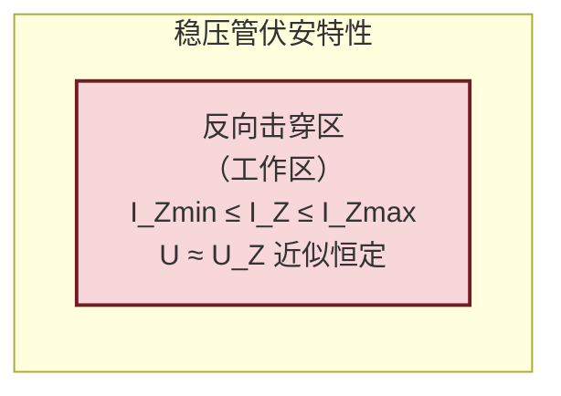
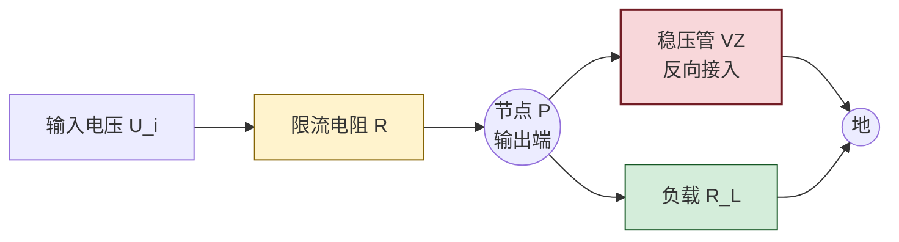

# 4.4 稳压二极管工作原理与稳压电路

> [!info] 本节定位
> 本节是第4章的**工程重点**。它要回答的核心问题是：**如何利用 PN 结的反向击穿特性，构建一个在输入电压或负载变化时仍能输出近似恒定电压的简单稳压电路？** 关键在于把 [[4.2 二极管伏安特性、参数|4.2]] 反向击穿区"电流大范围变化而电压几乎不变"的特性，通过一只**限流电阻** $R$ 转化为负载端的电压稳定。
>
> 本节综合运用 [[4.1 PN 结单向导电性|4.1]] 的击穿机理与 [[4.3 二极管整流、限幅电路|4.3]] 的电路模型方法，是 [[MOC - 第10章|第10章 直流稳压电源]] 中"稳压环节"的最简实现，也是后续串联反馈式稳压电路的物理原型。
>
> 注意局部规则：器件参数记录工作区、额定值与温度条件；限流电阻选择必须给出电流范围与功耗核算，不能脱离工作区理想化。

## 一、稳压二极管的工作原理

> [!definition] 稳压二极管
> **稳压二极管（zener diode，稳压管）**是一种专门工作在**反向击穿区**的硅半导体二极管。利用反向击穿区电流在较大范围内变化而两端电压基本恒定的特性，实现稳压。其电路符号与普通二极管相同，但工作状态反向。

> [!theorem] 稳压原理
> 由 [[4.2 二极管伏安特性、参数|4.2]]，反向击穿有两种机理：
> - **齐纳击穿**（高掺杂、$U_{BR}<4\,\text{V}$）：强电场直接拉出价电子；
> - **雪崩击穿**（低掺杂、$U_{BR}>6\,\text{V}$）：载流子碰撞倍增。
>
> 击穿区内，反向电流 $I_Z$ 在 $I_{Z\min}\sim I_{Z\max}$ 范围内变化时，管端电压基本维持在稳定电压 $U_Z$ 附近，仅随电流缓慢变化（动态电阻 $r_Z$ 很小）。**只要功耗不超过 $P_{ZM}$，工作于击穿区是非破坏性、可逆的**——这正是稳压管区别于普通二极管"避免击穿"的设计意图。

> [!warning] 工作区与极限
> 1. 稳压管必须反偏使用（阴极接高电位），与普通二极管正偏导通相反；
> 2. 工作电流必须满足 $I_{Z\min}\le I_Z\le I_{Z\max}$：低于 $I_{Z\min}$ 脱离击穿区、稳压失效；高于 $I_{Z\max}$ 过功耗烧毁；
> 3. 击穿区稳压是有条件的——电流变化范围、温度、动态电阻都影响稳压精度，不能视为理想电压源。

## 二、稳压管的主要参数

> [!definition] 稳压管主要参数
> 1. **稳定电压 $U_Z$（zener voltage）**：在规定测试电流 $I_Z$ 下稳压管两端的反向电压（V）。同一型号有离散性，通常给出范围（如 $5.8\sim6.0\,\text{V}$）。
> 2. **稳定电流 $I_Z$（zener current）**：对应稳定电压 $U_Z$ 的标称工作电流（A），是参数测试条件，也是设计参考点。
> 3. **最小稳定电流 $I_{Z\min}$**：维持击穿、保证稳压的最小电流（A），低于则脱离击穿区。
> 4. **最大稳定电流 $I_{Z\max}$**：受最大耗散功率限制的最大允许电流（A），$I_{Z\max}=P_{ZM}/U_Z$。
> 5. **最大耗散功率 $P_{ZM}$（maximum power dissipation）**：稳压管允许的最大功耗（W），$P_{ZM}=U_Z\cdot I_{Z\max}$，超过会因过热损坏。
> 6. **动态电阻 $r_Z$（dynamic resistance）**：工作点附近电压变化量与电流变化量之比：
>    $$r_Z=\frac{\Delta U_Z}{\Delta I_Z}\quad(\Omega)$$
>    $r_Z$ 越小，稳压性能越好（电流变化引起的电压波动越小）。一般 $r_Z$ 为几欧到几十欧。

> [!note] 温度系数
> 稳压值 $U_Z$ 随温度变化：
> - $U_Z<4\,\text{V}$（齐纳击穿为主）：负温度系数，温度升高 $U_Z$ 降低；
> - $U_Z>6\,\text{V}$（雪崩击穿为主）：正温度系数，温度升高 $U_Z$ 升高；
> - $U_Z\approx5\sim6\,\text{V}$：温度系数接近零，稳压值最稳定。
>
> 高精度稳压常用两只温度系数相反的稳压管串联补偿，或选用精密基准源。

## 三、稳压管稳压电路

### 1. 电路结构

> [!definition] 稳压管稳压电路
> 由限流电阻 $R$ 与稳压管 VZ 组成：输入电压 $U_i$ 经 $R$ 后，稳压管 VZ 与负载 $R_L$ **并联**（VZ 阴极接 $U_i$ 正端、阳极接地）。

> [!note] 电流关系（KCL）
> 节点 P 处：
> $$I_R=I_Z+I_L$$
> 其中 $I_R=\dfrac{U_i-U_Z}{R}$（限流电阻电流），$I_L=\dfrac{U_Z}{R_L}$（负载电流）。
> 故
> $$I_Z=\frac{U_i-U_Z}{R}-\frac{U_Z}{R_L}$$
> 设计目标：在 $U_i$、$R_L$ 全部变化范围内，保证 $I_{Z\min}\le I_Z\le I_{Z\max}$。

### 2. 稳压原理

> [!theorem] 稳压过程
> - **输入电压 $U_i$ 升高**：$I_R$ 增大，因 VZ 处于击穿区，多余电流几乎全部流入 VZ 使 $I_Z$ 增大，而 $U_Z$ 仅极小增大（$r_Z$ 很小）。负载电压 $U_o\approx U_Z$ 基本不变。
> - **负载电流 $I_L$ 增大（$R_L$ 减小）**：$I_L$ 增大占去更多 $I_R$，$I_Z$ 相应减小，但只要仍 $\ge I_{Z\min}$，$U_Z$ 几乎不变。
> - **反向**情况同理，$I_Z$ 自动调节吸收或释放电流变化。
>
> 本质：限流电阻 $R$ 把输入/负载的变化转化为 $I_Z$ 的变化，而 VZ 击穿区把 $I_Z$ 的变化"吸收"为近似恒定的 $U_Z$。

### 3. 输出电压的稳定性评估

> [!theorem] 输出电压变化量
> 考虑动态电阻 $r_Z$ 时，输出电压变化量近似为
> $$\Delta U_o\approx\frac{r_Z\parallel R_L}{R+r_Z\parallel R_L}\,\Delta U_i\approx\frac{r_Z}{R}\,\Delta U_i\quad(R\gg r_Z,\,R_L\gg r_Z)$$
> 称为**稳压系数（电压调整率）**。$r_Z$ 越小、$R$ 越大，稳压越好，但 $R$ 受功耗与最小电流限制。

## 四、限流电阻的选择

> [!theorem] 限流电阻取值范围
> 设输入电压范围为 $[U_{i\min},U_{i\max}]$，负载电流范围为 $[I_{L\min},I_{L\max}]$，稳压管参数 $U_Z$、$I_{Z\min}$、$I_{Z\max}$。
>
> - 当 $U_i$ 最大、$I_L$ 最小时，$I_Z$ 最大，须 $I_Z\le I_{Z\max}$，得 $R$ 的**下限**：
> $$\boxed{\,R\ge R_{\min}=\frac{U_{i\max}-U_Z}{I_{Z\max}+I_{L\min}}\,}$$
> - 当 $U_i$ 最小、$I_L$ 最大时，$I_Z$ 最小，须 $I_Z\ge I_{Z\min}$，得 $R$ 的**上限**：
> $$\boxed{\,R\le R_{\max}=\frac{U_{i\min}-U_Z}{I_{Z\min}+I_{L\max}}\,}$$
>
> 合法条件 $R_{\min}\le R\le R_{\max}$，且 $R_{\min}\le R_{\max}$（否则无解，需更换稳压管或调整输入范围）。

> [!note] 限流电阻功耗
> $R$ 的实际功耗：
> $$P_R=(U_i-U_Z)^2/R\quad(\text{W})$$
> 选 $R$ 时其额定功率应 $\ge2P_{R,\max}$（2 倍裕量），$P_{R,\max}$ 取 $U_i=U_{i\max}$ 时。

> [!warning] 设计校核清单
> 1. 验证 $R_{\min}\le R_{\max}$，否则方案不成立；
> 2. 选标称值 $R\in[R_{\min},R_{\max}]$，居中为佳；
> 3. 校核稳压管功耗 $P_Z=U_Z I_Z\le P_{ZM}$（取 $I_Z=I_{Z\max}$ 时最严苛）；
> 4. 校核 $R$ 功耗并选额定功率；
> 5. 高温场景需核算 $U_Z$ 温度漂移与 $I_{Z\max}$ 降额。

## 五、稳压电路的应用与局限

> [!note] 应用场景
> - 小功率、低精度直流稳压（如基准电压、运放偏置）；
> - 信号限幅、过压保护；
> - 电平移动与钳位；
> - 与运放组合构成精密基准源。

> [!warning] 局限性
> 1. **输出电压固定**：$U_Z$ 由型号决定，不可调；
> 2. **输出电流小**：受 $P_{ZM}$ 限制，一般几十毫安量级，大电流需串联稳压或开关电源；
> 3. **效率低**：限流电阻 $R$ 始终消耗功率，$U_i$ 与 $U_Z$ 差值越大效率越低；
> 4. **精度有限**：受 $r_Z$、温度系数、$U_Z$ 离散性影响，稳压精度通常 $1\%\sim5\%$；
> 5. **负载调整率有限**：负载电流大幅变化时 $I_Z$ 可能越界。
>
> 大电流、高精度场合应改用串联反馈稳压或集成稳压器（见 [[MOC - 第10章|第10章]]）。

## 六、典型例题

### 例题 1：限流电阻范围计算

> [!example] 题目
> 稳压管稳压电路：$U_Z=6\,\text{V}$，$I_{Z\min}=5\,\text{mA}$，$I_{Z\max}=40\,\text{mA}$，$P_{ZM}=0.25\,\text{W}$。输入 $U_i$ 在 $11\sim14\,\text{V}$ 间波动，负载电流 $I_L$ 在 $0\sim20\,\text{mA}$ 间变化。求限流电阻 $R$ 的取值范围，并选标称值。

**解**：
$I_{L\min}=0\,\text{mA}$，$I_{L\max}=20\,\text{mA}$；$U_{i\min}=11\,\text{V}$，$U_{i\max}=14\,\text{V}$。

下限（$U_i$ 最大、$I_L$ 最小，$I_Z$ 最大）：
$$R_{\min}=\frac{U_{i\max}-U_Z}{I_{Z\max}+I_{L\min}}=\frac{14-6}{(40+0)\times10^{-3}}=\frac{8}{0.040}=200\,\Omega$$

上限（$U_i$ 最小、$I_L$ 最大，$I_Z$ 最小）：
$$R_{\max}=\frac{U_{i\min}-U_Z}{I_{Z\min}+I_{L\max}}=\frac{11-6}{(5+20)\times10^{-3}}=\frac{5}{0.025}=200\,\Omega$$

恰好 $R_{\min}=R_{\max}=200\,\Omega$，余量为零，工程上不可取——需放宽 $I_{Z\max}$ 或调整输入范围。

**校核功耗**：$P_{Z,\max}=U_Z\cdot I_{Z\max}=6\times0.040=0.24\,\text{W}\le P_{ZM}=0.25\,\text{W}$，刚达标。
$R$ 功耗：$P_R=\dfrac{(U_{i\max}-U_Z)^2}{R}=\dfrac{8^2}{200}=0.32\,\text{W}$，选 $\ge0.5\,\text{W}$ 电阻。

> [!note] 设计改进
> 此题裕量为零说明参数搭配紧张。可将 $I_{Z\max}$ 提升至 $50\,\text{mA}$（选 $P_{ZM}=0.4\,\text{W}$ 的管子），则 $R_{\min}=160\,\Omega$，与 $R_{\max}=200\,\Omega$ 间有裕量，可取 $180\,\Omega$。

### 例题 2：稳压系数估算

> [!example] 题目
> 稳压管 $U_Z=6\,\text{V}$、$r_Z=10\,\Omega$，限流电阻 $R=500\,\Omega$，负载 $R_L=2\,\text{k}\Omega$。输入 $U_i$ 由 $12\,\text{V}$ 升至 $13\,\text{V}$，估算输出变化量 $\Delta U_o$ 与稳压系数。

**解**：$r_Z\parallel R_L\approx\dfrac{10\times2000}{10+2000}\approx9.95\,\Omega\approx r_Z$。
$$\Delta U_o\approx\frac{r_Z\parallel R_L}{R+r_Z\parallel R_L}\Delta U_i\approx\frac{9.95}{500+9.95}\times1\approx0.0195\,\text{V}\approx19.5\,\text{mV}$$
稳压系数 $\dfrac{\Delta U_o/\Delta U_i}{U_o/U_i}\approx\dfrac{0.0195/1}{6/12}=0.039$（约 $3.9\%$）。

**单位检验**：$\Delta U_o$ 单位 V，比例无量纲，自洽。

### 例题 3：负载电流变化下的校核

> [!example] 题目
> 稳压管 $U_Z=8\,\text{V}$、$I_{Z\min}=3\,\text{mA}$、$I_{Z\max}=30\,\text{mA}$，输入 $U_i=15\,\text{V}$ 恒定，限流电阻 $R=300\,\Omega$。求允许的负载电流范围 $I_L$ 与对应负载电阻范围。

**解**：$I_R=\dfrac{U_i-U_Z}{R}=\dfrac{15-8}{300}=\dfrac{7}{300}\approx23.3\,\text{mA}$。
由 $I_Z=I_R-I_L$：
- $I_Z=I_{Z\max}=30\,\text{mA}$ 对应 $I_L=I_R-I_{Z\max}=23.3-30=-6.7\,\text{mA}$，负值说明 $I_R$ 不足以使 $I_Z$ 达 $I_{Z\max}$，故最大 $I_Z$ 实际为 $I_R=23.3\,\text{mA}<I_{Z\max}$，功耗安全。
- $I_Z=I_{Z\min}=3\,\text{mA}$ 对应 $I_{L\max}=I_R-I_{Z\min}=23.3-3=20.3\,\text{mA}$。

故 $I_L\in[0,20.3\,\text{mA}]$，对应 $R_L\ge\dfrac{U_Z}{I_{L\max}}=\dfrac{8}{0.0203}\approx394\,\Omega$（开路时 $I_L=0$ 也允许）。

**单位检验**：电流 mA，电阻 Ω，自洽。

## 七、易错点

> [!warning] 易错点
> 1. **稳压管极性接反**：稳压管工作于反偏，阴极接高电位；按普通二极管正偏接会使其正向导通变成 $0.7\,\text{V}$"稳压管"，失去稳压作用。
> 2. **$I_{Z\min}$ 与 $I_Z$ 混淆**：$I_Z$ 是标称工作电流（参数测试条件），$I_{Z\min}$ 是维持击穿的最小电流，二者不同。
> 3. **限流电阻范围算反**：$R_{\min}$ 对应 $I_Z$ 最大（$U_i$ 最大、$I_L$ 最小），$R_{\max}$ 对应 $I_Z$ 最小（$U_i$ 最小、$I_L$ 最大）。条件用错会得到错误范围。
> 4. **忽略功耗校核**：仅算电流范围不够，必须校核 $P_Z\le P_{ZM}$ 与 $P_R$ 额定功率。
> 5. **动态电阻当作开路**：$r_Z$ 不为零，电流变化时 $U_Z$ 会变，精密场合不可忽略。
> 6. **理想化稳压源**：把稳压管当作理想电压源，忽略温度漂移、$r_Z$、离散性，会高估稳压精度。
> 7. **负载开路误判**：负载开路时 $I_L=0$，$I_Z=I_R$ 最大，须校核是否超 $I_{Z\max}$。

## 八、与其他小节的联系

- 本节建立在 [[4.2 二极管伏安特性、参数|4.2]] 反向击穿区特性基础上，击穿机理（雪崩/齐纳）决定了 $U_Z$ 范围与温度系数；
- 本节使用的限流电阻、动态电阻 $r_Z$ 概念承接 [[4.3 二极管整流、限幅电路|4.3]] 的电路模型方法；
- 本节是 [[MOC - 第10章|第10章]] 直流稳压电源"稳压环节"的最简实现，后续串联反馈稳压、集成稳压器是其精度与电流能力的提升；
- 稳压管也常作为 [[MOC - 第7章|第7章 运放]] 电路的基准电压源、[[MOC - 第9章|第9章]] 振荡器的限幅元件；
- 本章 MOC：[[MOC - 第4章]]。

## 章节导航

- 上一级：[[MOC - 第4章]]
- 先修：[[4.2 二极管伏安特性、参数]]、[[4.3 二极管整流、限幅电路]]
- 关联：[[MOC - 第10章|第10章 直流稳压电源]]（稳压环节的工程化）
- 习题：[[MOC - 第4章习题]]
