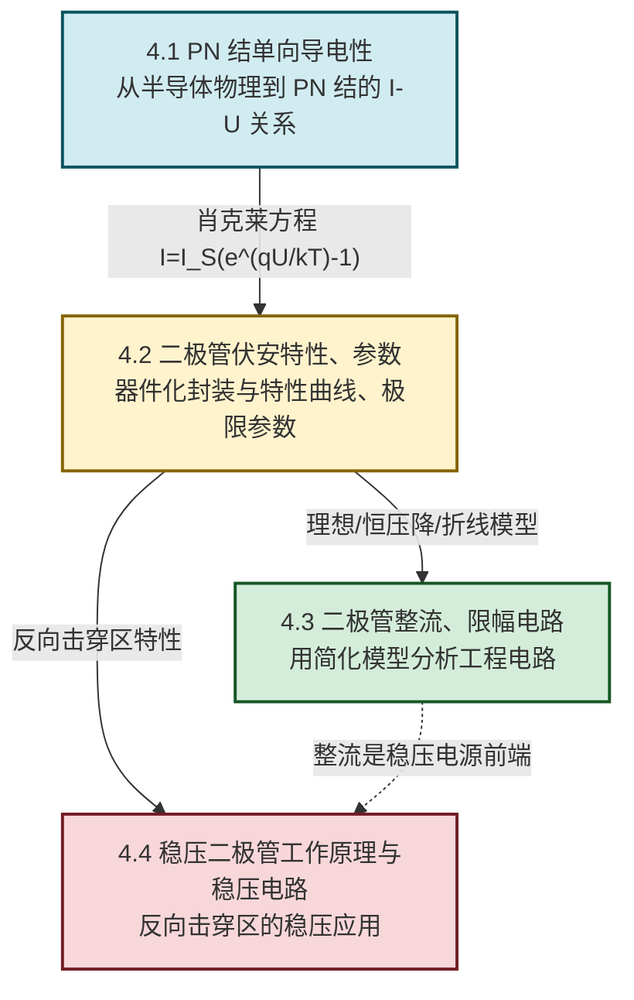

# MOC - 第4章 半导体二极管与稳压管

> [!info] 本章定位
> 半导体二极管与稳压管（Semiconductor Diodes and Zener Diodes）是模拟电子技术的**器件起点**。本章要回答的核心问题是：**半导体材料为何能实现"单向导电"，又如何利用这种非线性特性完成整流、限幅与稳压？**
>
> 本章在 [[MOC - 第3章|第3章 正弦交流稳态电路]]（交流电源、相量分析）和 [[MOC - 大学物理B|大学物理B]]（固体物理初步、能带、电场对载流子的作用）基础上展开：PN 结是半导体器件的"原子单元"，后续 [[MOC - 第5章|第5章 双极型三极管]]（BJT 由两个 PN 结构成）、[[MOC - 第6章|第6章 场效应管]]（FET 含 PN 结或 MOS 结构）以及 [[MOC - 第10章|第10章 直流稳压电源]]（整流、滤波、稳压都依赖二极管与稳压管）都以本章为前提。
>
> 讨论范围限定于**常温（约 $300\,\text{K}$）、低频小信号**下的硅/锗二极管与硅稳压管；高频效应（势垒电容、扩散电容）、噪声特性、光电器件不在本章基本范围。公式中各物理量均采用 SI 单位，电压单位为伏特（V），电流单位为安培（A）。

## 学习路线图

## 知识点导航

| 小节 | 标题 | 核心内容 | 关键物理量（SI单位） |
| ---- | ---- | -------- | -------------------- |
| [[4.1 PN 结单向导电性\|4.1]] | PN 结单向导电性 | 本征/杂质半导体、多数与少数载流子、PN 结形成（扩散—漂移动态平衡、空间电荷区、内电场）、正偏导通反偏截止、肖克莱方程 $I=I_S\left(e^{qU/kT}-1\right)$ | 电压 $U$（V）、电流 $I$（A）、温度 $T$（K） |
| [[4.2 二极管伏安特性、参数\|4.2]] | 二极管伏安特性、参数 | 二极管结构、伏安特性曲线（死区电压、导通电压、反向饱和电流、击穿区）、最大整流电流 $I_F$、最高反向工作电压 $U_{RM}$、最高工作频率 $f_M$、温度影响 | 导通电压 $U_{on}$（V）、$I_F$（A）、$U_{RM}$（V） |
| [[4.3 二极管整流、限幅电路\|4.3]] | 二极管整流、限幅电路 | 理想模型、恒压降模型、折线模型、半波/全波/桥式整流（$U_o=0.45U_2$、$0.9U_2$）、限幅与钳位电路 | 输出平均电压 $U_o$（V）、变压器次级有效值 $U_2$（V） |
| [[4.4 稳压二极管工作原理与稳压电路\|4.4]] | 稳压二极管工作原理与稳压电路 | 稳压管工作于反向击穿区、稳定电压 $U_Z$、稳定电流 $I_Z$、最大耗散功率 $P_{ZM}$、动态电阻 $r_Z$、稳压管稳压电路、限流电阻选择 | $U_Z$（V）、$I_Z$（A）、$P_{ZM}$（W）、$r_Z$（Ω） |

## 核心考点

> [!summary] 本章核心考点（7 点）
> 1. **PN 结的形成与单向导电性**：P 区多数载流子为空穴、N 区为电子；扩散运动与漂移运动达到动态平衡形成空间电荷区（耗尽层）与内电场；正偏削弱内电场、扩散为主→导通，反偏增强内电场、漂移为主→截止。这是后续所有半导体器件的物理基础。
> 2. **肖克莱方程**：$I=I_S\left(e^{qU/kT}-1\right)$，常温下 $q/kT\approx 38.7\,\text{V}^{-1}$（即 $U_T=kT/q\approx 26\,\text{mV}$）。正偏 $U\gg U_T$ 时 $I\approx I_S e^{qU/kT}$ 指数增长；反偏时 $I\approx -I_S$（饱和）。注意方程是理想模型，未含大注入、串联电阻等实际效应。
> 3. **二极管伏安特性的分段描述**：正向区有死区电压（硅约 $0.5\,\text{V}$、锗约 $0.1\,\text{V}$）与导通电压（硅约 $0.7\,\text{V}$、锗约 $0.3\,\text{V}$）；反向区有反向饱和电流 $I_S$；反向击穿区分为雪崩击穿与齐纳击穿。需区分两类击穿的机理与可逆性。
> 4. **二极管三种简化模型**：理想模型（正偏短路、反偏开路）、恒压降模型（正向压降恒为 $U_{on}$）、折线模型（含导通电压与等效电阻 $r_D$）。工程分析需按精度要求选模型，切忌用理想模型分析稳压或精确定量。
> 5. **整流电路计算**：半波整流 $U_o=0.45U_2$、$I_o=U_o/R_L$；桥式/全波整流 $U_o=0.9U_2$。二极管承受最高反向电压半波与桥式均为 $\sqrt2 U_2$，全波为 $2\sqrt2 U_2$；桥式每管平均电流 $I_o/2$。
> 6. **限幅与钳位电路分析**：限幅电路切去输入波形某部分（上限幅/下限幅/双向限幅），关键是判断二极管导通条件与限幅电平；钳位电路将信号顶部或底部钳制到固定电平，需注意电容的"记忆"作用。
> 7. **稳压管稳压电路设计与限流电阻选择**：稳压管工作于反向击穿区，动态电阻 $r_Z$ 越小稳压性能越好；限流电阻 $R$ 必须满足 $I_{Z\min}\le I_Z\le I_{Z\max}$，对应 $\dfrac{U_{i\max}-U_Z}{I_{Z\max}+I_{L\min}}\le R\le\dfrac{U_{i\min}-U_Z}{I_{Z\min}+I_{L\max}}$。

## 自测题

> [!question]- 自测 1：PN 结单向导电性原理
> 简述 PN 结的形成过程，并解释为何正向偏置时导通、反向偏置时截止。
>
> > [!check]- 答案
> > P 区与 N 区接触后，多数载流子（P 区空穴、N 区电子）向对方扩散并复合，留下不能移动的离子，形成空间电荷区（耗尽层）与由 N 指向 P 的内电场。内电场产生与扩散反向的漂移运动，二者达到动态平衡，PN 结宏观无电流。
> > - **正偏**（P 接正、N 接负）：外电场与内电场反向，削弱内电场、耗尽层变窄，扩散为主，多数载流子大量越过结区，形成较大正向电流→导通。
> > - **反偏**（P 接负、N 接正）：外电场与内电场同向，增强内电场、耗尽层变宽，扩散被抑制，只有少数载流子漂移形成极小的反向饱和电流→截止。

> [!question]- 自测 2：整流输出电压
> 变压器次级电压 $u_2=\sqrt2 U_2\sin\omega t$，$U_2=20\,\text{V}$。分别求半波整流与桥式整流的输出平均电压 $U_o$ 与二极管承受的最大反向电压 $U_{RM}$。
>
> > [!check]- 答案
> > 半波：$U_o=0.45U_2=0.45\times20=9.0\,\text{V}$；$U_{RM}=\sqrt2 U_2\approx 1.414\times20\approx 28.3\,\text{V}$。
> > 桥式：$U_o=0.9U_2=0.9\times20=18.0\,\text{V}$；每管 $U_{RM}=\sqrt2 U_2\approx 28.3\,\text{V}$（不导通时承受变压器次级全电压）。

> [!question]- 自测 3：稳压管限流电阻范围
> 稳压管 $U_Z=6\,\text{V}$、$I_{Z\min}=5\,\text{mA}$、$I_{Z\max}=40\,\text{mA}$，输入电压 $U_i=12\,\text{V}$（恒定），负载 $R_L=600\,\Omega$。求限流电阻 $R$ 的取值范围。
>
> > [!check]- 答案
> > 负载电流 $I_L=U_Z/R_L=6/600=10\,\text{mA}$（恒定）。
> > $I_Z$ 最大时 $R$ 最小：$R_{\min}=\dfrac{U_i-U_Z}{I_{Z\max}+I_L}=\dfrac{12-6}{(40+10)\times10^{-3}}=\dfrac{6}{0.050}=120\,\Omega$。
> > $I_Z$ 最小时 $R$ 最大：$R_{\max}=\dfrac{U_i-U_Z}{I_{Z\min}+I_L}=\dfrac{12-6}{(5+10)\times10^{-3}}=\dfrac{6}{0.015}=400\,\Omega$。
> > 故 $120\,\Omega\le R\le400\,\Omega$，取标称值如 $220\,\Omega$。

> [!question]- 自测 4：恒压降模型分析
> 硅二极管电路，输入 $u_i=10\sin\omega t\,\text{V}$，二极管 VD 串联后接负载到地（二极管阳极接输入）。用恒压降模型（$U_{on}=0.7\,\text{V}$）画出输出 $u_o$ 波形并求一个周期内输出电压的平均值。
>
> > [!check]- 答案
> > 仅当 $u_i>0.7\,\text{V}$ 时 VD 导通，$u_o=u_i-0.7$；$u_i\le0.7\,\text{V}$ 时 VD 截止，$u_o=0$。该电路为削去底部（含负半周与低于 $0.7\,\text{V}$ 部分）的限幅电路，正半周峰值输出 $10-0.7=9.3\,\text{V}$。
> > 输出在一个周期内仅有部分正半周导通，平均值为正值但小于半波整流。定量需积分：导通角范围 $\theta\in[\theta_0,\pi-\theta_0]$，$\theta_0=\arcsin(0.7/10)\approx4.01^\circ$，$U_o\approx\dfrac{1}{2\pi}\int_{\theta_0}^{\pi-\theta_0}(10\sin\theta-0.7)\,d\theta\approx 2.78\,\text{V}$（近似估算）。

## 章节导航

> [!nav] 导航
> 上级：[[MOC - 电路与模拟电子技术|课程总览]]
> 先修：[[MOC - 第3章|第3章 正弦交流稳态电路]]（交流电源、相量）、[[MOC - 大学物理B|大学物理B]]（固体能带、电场对载流子作用）
> 下一章：[[MOC - 第5章|第5章 双极型三极管及其放大电路]]（BJT 由两个 PN 结构成）
> 关联：[[MOC - 第10章|第10章 直流稳压电源]]（整流滤波稳压的器件基础）
> 配套习题：[[MOC - 第4章习题|第4章 习题]]
