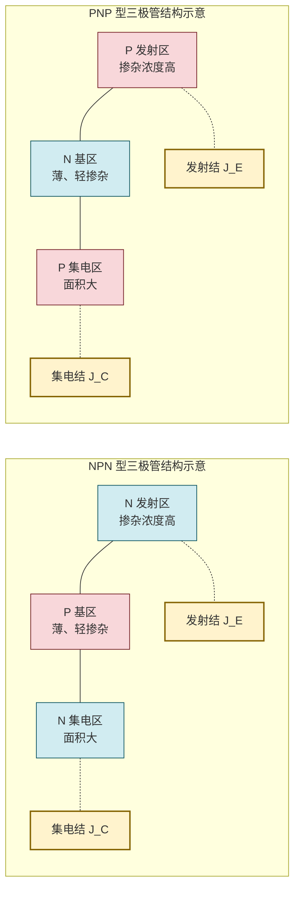
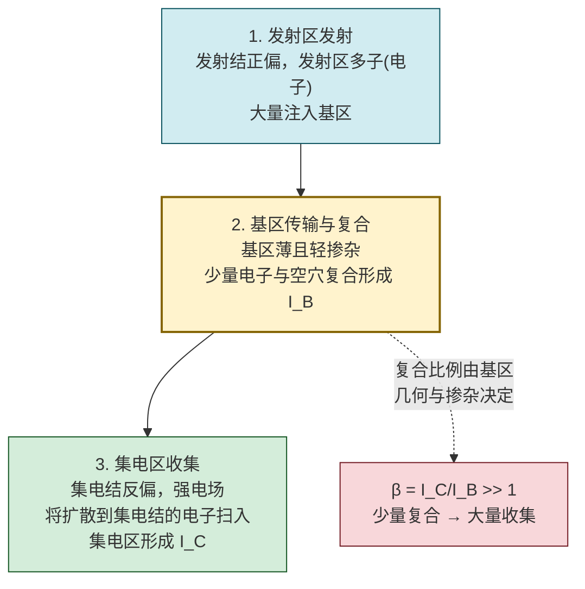
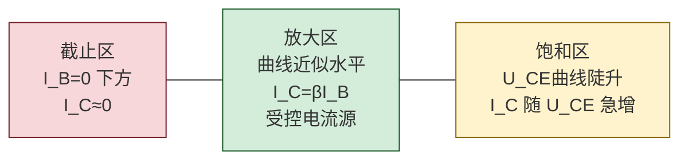

# 5.1 BJT 三极管结构、放大原理、三种工作区

> [!info] 本节定位
> 本节是整个放大电路体系的**器件物理基础**。它要回答的核心问题是：**由两个 PN 结背靠背构成的三端半导体器件，为什么能把微小的基极电流变化转化为较大的集电极电流变化，从而实现"电流放大"？** 答案在于 BJT 的**非对称结构**（发射区高掺杂、基区薄而轻掺杂、集电区面积大）与**载流子在基区的传输—复合过程**。
>
> 本节建立的电流关系 $I_E=I_B+I_C$、电流放大系数 $\beta=\Delta I_C/\Delta I_B$、三种工作区（截止/放大/饱和）的概念，是 [[5.2 共射放大电路静态分析、Q 点计算|5.2]]（Q 点必须落在放大区）、[[5.3 微变等效电路、电压放大倍数计算|5.3]]（微变等效电路中的受控源 $\beta I_b$）、[[5.5 分压式静态工作点稳定电路|5.5]]（温度对 $\beta$、$I_{CBO}$、$U_{BE}$ 的影响）的共同前提。BJT 内两个 PN 结的物理可追溯至 [[4.1 PN 结单向导电性|4.1 PN 结单向导电性]]。

## 一、BJT 的结构与符号

> [!definition] 双极型三极管（BJT）
> 双极型三极管（Bipolar Junction Transistor, BJT，简称三极管）是由**三个掺杂区、两个 PN 结**构成的三端半导体器件。三个掺杂区分别称为**发射区（Emitter, E）**、**基区（Base, B）**、**集电区（Collector, C）**；两个 PN 结为**发射结（BE 结）**（发射区—基区）与**集电结（BC 结）**（基区—集电区）。三个区引出的电极分别称为发射极 E、基极 B、集电极 C。

按掺杂排列顺序，BJT 分为 NPN 与 PNP 两种类型：

> [!note] BJT 结构的三个非对称特征（放大作用的根源）
> 1. **发射区掺杂浓度最高**：保证发射结正偏时能向基区注入大量多数载流子（NPN 中是电子）；
> 2. **基区很薄且掺杂浓度最低**：使注入基区的载流子只有少量复合、绝大部分扩散到集电结被收集，从而 $I_C\gg I_B$；
> 3. **集电结面积大**：便于收集从基区扩散过来的载流子，并利于散热。
> 这三点是 BJT 区别于"两个二极管背靠背"的关键——后者无放大作用，正是缺乏这种非对称结构。

> [!warning] BJT 不是两个二极管的简单串联
> 若仅看 PN 结排布，NPN 像两个二极管阳极相连（PN + NP），但用两个二极管这样接**没有放大作用**。原因：放大依赖载流子**穿过基区**被集电结收集，而两个独立二极管间没有"薄基区"的几何结构。判断 BJT 好坏时用万用表测两个结的单向导电性是必要的，但不足以保证放大功能。

### 电路符号

| 类型 | 符号特征 | 电流方向 |
| ---- | -------- | -------- |
| NPN | 发射极箭头**向外**（由 B 指向 E） | $I_B,I_C$ 流入，$I_E$ 流出 |
| PNP | 发射极箭头**向内**（由 E 指向 B） | $I_E$ 流入，$I_B,I_C$ 流出 |

> [!note] 符号记忆
> 发射极箭头方向 = 发射结正偏时**发射极电流的实际方向**。NPN 中发射区向基区发射电子（电流方向与电子流相反，故由 B→E，箭头向外）；PNP 中发射区向基区发射空穴（电流方向与空穴流相同，由 E→B，箭头向内）。

## 二、BJT 的电流关系与放大原理

### 2.1 电流关系

> [!theorem] BJT 三个电极电流的关系
> 无论 NPN 还是 PNP，无论工作在哪个区，三个电极电流始终满足基尔霍夫电流定律（KCL）：
> $$\boxed{\,I_E=I_B+I_C\,}\quad(\text{A})$$
> 即发射极电流等于基极电流与集电极电流之和（以各电流的实际方向为正）。
>
> 在**放大区**，集电极电流由基极电流控制：
> $$I_C=\beta I_B+I_{CEO}\approx\beta I_B$$
> 其中 $\beta$ 为直流电流放大系数（通常 $20\sim200$），$I_{CEO}$ 为集电极—发射极穿透电流（基极开路时 C-E 间的漏电流，硅管很小可忽略）。故放大区近似有
> $$I_E=I_B+I_C\approx(1+\beta)I_B$$

> [!definition] 电流放大系数
> - **直流电流放大系数**：$\bar\beta=\dfrac{I_C}{I_B}$（放大区，忽略 $I_{CEO}$）
> - **交流电流放大系数**：$\beta=\dfrac{\Delta I_C}{\Delta I_B}$（放大区，$U_{CE}$ 恒定时）
> 工程上 $\bar\beta\approx\beta$，常统一记为 $\beta$。$\beta$ 反映基极电流对集电极电流的**控制能力**，是 BJT 的核心参数。

### 2.2 放大原理（以 NPN 为例）

> [!theorem] BJT 放大原理
> 放大区下（发射结正偏、集电结反偏），BJT 内部发生"**发射—传输—收集**"三步过程，使小 $I_B$ 控制大 $I_C$：

> [!proof] 为什么 $I_C\gg I_B$？
> 设发射区注入基区的电子流为 $I_{EN}$（构成 $I_E$ 的主要部分），在基区复合的部分记为 $I_{BN}$（与基区多子空穴复合，由外电路补充形成 $I_B$），扩散到集电结被收集的部分记为 $I_{CN}$（构成 $I_C$ 的主要部分）。由电荷守恒：
> $$I_{EN}=I_{BN}+I_{CN}$$
> 基区很薄（微米量级）且轻掺杂，电子在基区的复合概率很低，故 $I_{CN}\gg I_{BN}$。定义
> $$\beta\approx\frac{I_{CN}}{I_{BN}}=\frac{\text{被收集的载流子}}{\text{复合的载流子}}$$
> 由于基区几何结构使复合很少，$\beta$ 可达几十至一百多。这就是"小 $I_B$ 控制大 $I_C$"的物理本质——**输入回路（基区复合）用很小的电流控制了输出回路（集电区收集）的大电流**。

> [!warning] 放大原理的适用条件
> 1. 必须**发射结正偏、集电结反偏**（放大区偏置），否则载流子传输过程不成立；
> 2. 放大是对**变化量**（交流小信号）而言：$\Delta I_C=\beta\Delta I_B$，直流偏置只是建立工作条件；
> 3. $\beta$ 并非严格常数，受 $I_C$ 大小、温度、管子个体差异影响，设计时需留裕量。

## 三、BJT 的三种工作区

> [!theorem] 三种工作区及其偏置条件
> BJT 的工作状态由两个 PN 结的偏置极性决定，分为三个区：

| 工作区 | 发射结偏置 | 集电结偏置 | 电流关系 | 典型特征 |
| ------ | ---------- | ---------- | -------- | -------- |
| **截止区** | 反偏（或零偏） | 反偏 | $I_B=0$，$I_C\approx I_{CEO}\approx0$ | C-E 间近似开路，相当于**断开开关** |
| **放大区** | 正偏 | 反偏 | $I_C=\beta I_B$，$U_{CE}>U_{BE}$ | 受控电流源特性，用于**放大** |
| **饱和区** | 正偏 | 正偏 | $I_C<\beta I_B$，$U_{CE}=U_{CES}\approx0.3\,\text{V}$ | C-E 间压降很小，相当于**闭合开关** |

> [!note] 工作区的工程判定法（NPN，已知三极对地电位）
> - 截止区：$U_{BE}<U_{on}$（约 $0.5\,\text{V}$），发射结未导通；
> - 放大区：$U_{BE}\approx0.7\,\text{V}$（正偏导通）且 $U_{CE}>U_{BE}$（即 $U_C>U_B$，集电结反偏）；
> - 饱和区：$U_{BE}\approx0.7\,\text{V}$（正偏导通）且 $U_{CE}<U_{BE}$（即 $U_C<U_B$，集电结正偏），$U_{CE}=U_{CES}\approx0.3\,\text{V}$。
> PNP 判定同理，但电压极性相反（$U_{EB}\approx0.7\,\text{V}$、$U_{EC}>U_{EB}$ 放大）。

### 3.1 输出特性曲线

> [!definition] 输出特性曲线
> 输出特性曲线描述在基极电流 $I_B$ 一定的条件下，集电极电流 $I_C$ 随管压降 $U_{CE}$ 变化的关系：
> $$I_C=f(U_{CE})\big|_{I_B=\text{常数}}$$
> 取一组不同 $I_B$ 值得到一簇曲线，可划分为三个工作区：

> [!note] 放大区曲线"近似水平"的物理意义
> 放大区内 $I_C$ 几乎不随 $U_{CE}$ 变化（曲线水平），说明集电结反偏电压只要足够大，就能把扩散到集电结的载流子全部收集——再多增大 $U_{CE}$ 也不能收集更多载流子，$I_C$ 仅由 $I_B$ 决定。这就是"受控电流源"特性的体现。但实际曲线略向上翘（厄尔利效应，Early effect），对应有限的输出电阻 $r_{ce}$，在 [[5.3 微变等效电路、电压放大倍数计算|5.3]] 中常忽略。

### 3.2 饱和区与截止区的开关应用

> [!example] BJT 作开关
> 饱和区与截止区合称"开关工作区"。BJT 作开关时：
> - **截止（断开）**：$I_B=0$，$I_C\approx0$，$U_{CE}\approx V_{CC}$，C-E 间断路；
> - **饱和（导通）**：$I_B\ge I_{BS}=I_{CS}/\beta$（临界饱和基极电流），$U_{CE}=U_{CES}\approx0.3\,\text{V}$，C-E 间近似短路。
> 驱动 BJT 深度饱和可减小导通压降，但会因存储电荷增加降低开关速度（数字电路中需权衡）。

## 四、BJT 的主要参数

> [!definition] BJT 主要参数
> 1. **电流放大系数**
>    - 直流 $\bar\beta=I_C/I_B$；交流 $\beta=\Delta I_C/\Delta I_B$（$U_{CE}$ 恒定）。
>    - $\beta$ 受温度影响显著：温度每升高 $1\,\circ\text{C}$，$\beta$ 约增大 $0.5\%\sim1\%$。
> 2. **极间反向电流**
>    - $I_{CBO}$：发射极开路时集电极—基极间的反向饱和电流（少子漂移形成），对温度极敏感。
>    - $I_{CEO}$：基极开路时集电极—发射极间的穿透电流，$I_{CEO}=(1+\beta)I_{CBO}$。
>    - $I_{CEO}$ 越小管子质量越好；硅管 $I_{CBO}$ 通常是纳安级，锗管是微安级。
> 3. **极限参数**
>    - $I_{CM}$：集电极最大允许电流（$\beta$ 下降到额定值 $2/3$ 时的 $I_C$）；
>    - $P_{CM}$：集电极最大允许耗散功率，$P_C=I_C U_{CE}\le P_{CM}$，由散热条件决定，需配合热设计；
>    - $BU_{CBO}$：发射极开路时 C-B 间反向击穿电压；
>    - $BU_{CEO}$：基极开路时 C-E 间反向击穿电压（通常 $BU_{CEO}<BU_{CBO}$）；
>    - $BU_{EBO}$：集电极开路时 E-B 间反向击穿电压（很小，约 $5\,\text{V}$，发射结易击穿）。

> [!warning] 安全工作区（SOA）与温度影响
> 1. BJT 必须工作在**安全工作区（Safe Operating Area, SOA）**内：$I_C<I_{CM}$、$U_{CE}<BU_{CEO}$、$P_C<P_{CM}$，且不超出二次击穿线（功率管）；
> 2. $P_{CM}$ 随环境温度升高而下降，需查器件手册的降额曲线；
> 3. $I_{CBO}$、$I_{CEO}$ 随温度按指数增长（约每升 $10\,\circ\text{C}$ 翻倍），高温下漏电流不可忽略，这是 [[5.5 分压式静态工作点稳定电路|5.5]] 讨论 Q 点漂移的根源；
> 4. 发射结反向击穿电压 $BU_{EBO}$ 很小，使用中应避免发射结承受较大反压。

## 五、典型例题

### 例题 1：工作区判定

> [!example] 题目
> 测得电路中三个 NPN 三极管的各极电位如下，分别判断其工作区（硅管 $U_{on}=0.7\,\text{V}$，$U_{CES}=0.3\,\text{V}$）：
> (1) $U_B=0.7\,\text{V}$，$U_C=5\,\text{V}$，$U_E=0\,\text{V}$；
> (2) $U_B=0.7\,\text{V}$，$U_C=0.3\,\text{V}$，$U_E=0\,\text{V}$；
> (3) $U_B=0\,\text{V}$，$U_C=12\,\text{V}$，$U_E=0\,\text{V}$。

**解**：

(1) $U_{BE}=0.7-0=0.7\,\text{V}$，发射结正偏导通；$U_{BC}=0.7-5=-4.3\,\text{V}<0$，集电结反偏。
发射结正偏、集电结反偏 → **放大区**。（也可用 $U_{CE}=5\,\text{V}>U_{BE}=0.7\,\text{V}$ 判定）

(2) $U_{BE}=0.7-0=0.7\,\text{V}$，发射结正偏导通；$U_{BC}=0.7-0.3=0.4\,\text{V}>0$，集电结正偏。
两结均正偏 → **饱和区**。（$U_{CE}=0.3\,\text{V}=U_{CES}$ 也直接说明饱和）

(3) $U_{BE}=0-0=0\,\text{V}<U_{on}=0.7\,\text{V}$，发射结未导通（反偏或零偏）；集电结 $U_{BC}=0-12=-12\,\text{V}<0$ 反偏。
两结均未正偏 → **截止区**。

> [!note] 判定要领
> 先看发射结是否正偏导通（$U_{BE}\approx0.7\,\text{V}$）；若未导通即为截止；若导通，再看集电结：$U_C>U_B$（集电结反偏）→ 放大，$U_C<U_B$（集电结正偏）→ 饱和。

### 例题 2：电流计算

> [!example] 题目
> 某 NPN 三极管处于放大区，测得 $I_B=20\,\mu\text{A}$，$I_C=2\,\text{mA}$。求 $\bar\beta$、$I_E$，并估算该管 $\beta$ 值。

**解**：
$$\bar\beta=\frac{I_C}{I_B}=\frac{2\times10^{-3}}{20\times10^{-6}}=\frac{2\times10^{-3}}{2\times10^{-5}}=100$$
$$I_E=I_B+I_C=20\,\mu\text{A}+2\,\text{mA}=0.02\,\text{mA}+2\,\text{mA}=2.02\,\text{mA}$$
放大区 $\beta\approx\bar\beta=100$。

**单位检验**：$\bar\beta=\text{A}/\text{A}$ 无量纲，$I_E$ 为 A，正确。

### 例题 3：穿透电流估算

> [!example] 题目
> 某硅三极管 $I_{CBO}=0.1\,\mu\text{A}$，$\beta=80$。求 $I_{CEO}$，并说明温度升高到 $70\,\circ\text{C}$（约 $343\,\text{K}$）时 $I_{CEO}$ 的大致变化。

**解**：
$$I_{CEO}=(1+\beta)I_{CBO}=(1+80)\times0.1\,\mu\text{A}=81\times0.1\,\mu\text{A}=8.1\,\mu\text{A}$$

温度由 $300\,\text{K}$（约 $27\,\circ\text{C}$）升至 $343\,\text{K}$（约 $70\,\circ\text{C}$），升高约 $43\,\circ\text{C}$。硅管 $I_{CBO}$ 约每升 $10\,\circ\text{C}$ 翻倍，故
$$I_{CBO}(70\,\circ\text{C})\approx0.1\times2^{43/10}\approx0.1\times2^{4.3}\approx0.1\times19.7\approx1.97\,\mu\text{A}$$
$$I_{CEO}(70\,\circ\text{C})\approx81\times1.97\approx160\,\mu\text{A}=0.16\,\text{mA}$$

可见高温下穿透电流显著增大，可能使 Q 点上移甚至接近饱和——这正是 [[5.5 分压式静态工作点稳定电路|5.5]] 分压式偏置要解决的问题。

## 六、易错点

> [!warning] 易错点
> 1. **混淆 $\beta$ 与 $\alpha$**：$\beta=\Delta I_C/\Delta I_B$ 是基极到集电极的放大；$\alpha=\Delta I_C/\Delta I_E$ 是发射极到集电极的传输系数（$\alpha<1$，约 $0.98\sim0.995$）。关系 $\beta=\alpha/(1-\alpha)$，$\alpha=\beta/(1+\beta)$。
> 2. **电流方向记反**：NPN 中 $I_B,I_C$ 流入管子、$I_E$ 流出；PNP 相反。代入 KCL 时务必用实际方向或统一规定正方向。
> 3. **工作区判定只看 $U_{BE}$**：放大与饱和都满足 $U_{BE}\approx0.7\,\text{V}$，必须再比较 $U_{CE}$ 与 $U_{BE}$（或 $U_C$ 与 $U_B$）才能区分。仅凭 $I_B>0$ 不能判定放大。
> 4. **把饱和区 $I_C=\beta I_B$ 当作普遍关系**：饱和区 $I_C<\beta I_B$，$I_C$ 由外电路（$R_c$ 与 $V_{CC}$）决定，不再受 $\beta I_B$ 控制。
> 5. **$U_{CES}$ 与 $U_{BE}$ 混淆**：饱和时 $U_{CE}=U_{CES}\approx0.3\,\text{V}$（C-E 间压降），$U_{BE}\approx0.7\,\text{V}$（B-E 间压降）仍然成立，二者不同。
> 6. **忽略 $I_{CEO}$ 的温度敏感性**：$I_{CEO}=(1+\beta)I_{CBO}$，由于 $\beta$ 放大作用，$I_{CEO}$ 比 $I_{CBO}$ 大得多且随温度急剧增大，是高温下电路失效的主要因素。

## 七、与其他小节的联系

- BJT 两个 PN 结的物理直接源于 [[4.1 PN 结单向导电性|4.1 PN 结单向导电性]]，发射结正偏/反偏对应 4.1 的单向导电性；
- 三种工作区（尤其放大区偏置条件）是 [[5.2 共射放大电路静态分析、Q 点计算|5.2]] 计算 Q 点并判断其是否合理的前提；
- 放大区 $I_C=\beta I_B$ 的受控关系是 [[5.3 微变等效电路、电压放大倍数计算|5.3]] 微变等效电路中受控电流源 $\beta I_b$ 的来源；
- $\beta$、$I_{CBO}$、$U_{BE}$ 随温度变化是 [[5.5 分压式静态工作点稳定电路|5.5]] Q 点漂移分析与稳定设计的依据；
- BJT 的开关工作（截止+饱和）是数字电路的逻辑门实现基础；
- 本章 MOC：[[MOC - 第5章]]。

## 章节导航

- 上一级：[[MOC - 第5章]]
- 先修：[[4.1 PN 结单向导电性]]（PN 结物理）、[[4.2 二极管伏安特性、参数]]（结的特性）
- 下一节：[[5.2 共射放大电路静态分析、Q 点计算]]
- 习题：[[MOC - 第5章习题]]
