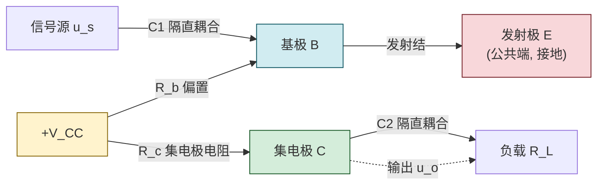
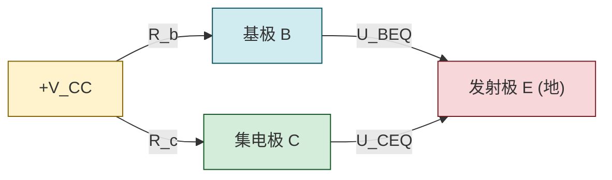

# 5.2 共射放大电路静态分析、Q 点计算

> [!info] 本节定位
> 本节是放大电路分析的**起点**。它要回答的核心问题是：**要使 BJT 实现不失真放大，应如何用外部元件为其建立合适的工作状态？** 答案是设计**偏置电路**，使三极管在无信号输入时处于放大区内的一个确定点——**静态工作点（Quiescent point, Q 点）**。
>
> 本节以**共射极固定偏置放大电路**为基本模型，建立"放大电路组成 → 静态与动态分离 → 直流通路画法 → Q 点计算 → Q 点位置与失真关系"的分析链条。这套方法是 [[5.3 微变等效电路、电压放大倍数计算|5.3]]（动态分析的前提是 Q 点已知）、[[5.4 共集、共基放大电路特点|5.4]]（其他组态同样需先求 Q 点）、[[5.5 分压式静态工作点稳定电路|5.5]]（改进偏置以稳定 Q 点）的共同基础。Q 点必须在放大区，这一判据来自 [[5.1 BJT 三极管结构、放大原理、三种工作区|5.1]]。

## 一、共射放大电路的组成

> [!definition] 共射放大电路（Common-Emitter, CE）
> 共射放大电路以**发射极为输入回路与输出回路的公共端**（交流接地），基极为信号输入端，集电极为信号输出端。它是最基本的 BJT 放大电路组态，同时具有电压放大和电流放大能力。

### 1.1 基本电路组成

典型的共射固定偏置放大电路由以下部分构成：

| 组成部分 | 元件 | 作用 |
| -------- | ---- | ---- |
| 三极管 VT | NPN 型 BJT | 核心放大器件，利用 $I_C=\beta I_B$ 实现电流控制 |
| 直流电源 $V_{CC}$ | 直流电压源（V） | 为电路提供能量，并保证发射结正偏、集电结反偏 |
| 基极偏置电阻 $R_b$ | 大电阻（$\text{k}\Omega$ 量级） | 限制基极电流 $I_B$，建立合适 Q 点 |
| 集电极电阻 $R_c$ | 电阻（$\text{k}\Omega$ 量级） | 把集电极电流变化转化为电压变化输出，并限制 $I_C$ |
| 耦合电容 $C_1,C_2$ | 大电容（$\mu\text{F}$ 量级） | 隔直流、通交流：使信号源与放大电路、放大电路与负载直流隔离，而交流信号无阻碍通过 |
| 负载 $R_L$ | 电阻（$\text{k}\Omega$ 量级） | 放大电路的负载，接收输出信号 |

> [!note] 电路拓扑（NPN 共射固定偏置）
> - $V_{CC}$ 正端经 $R_c$ 接集电极 C，负端接地（公共端）；
> - $V_{CC}$ 正端经 $R_b$ 接基极 B；
> - 发射极 E 直接接地；
> - 信号源 $u_s$ 经 $C_1$ 接基极；集电极经 $C_2$ 接负载 $R_L$ 到地。
> 该电路输入回路（B-E）与输出回路（C-E）以发射极为公共端，故称共射电路。

### 1.2 各元件的工程作用

> [!theorem] 元件作用解析
> 1. **$V_{CC}$**：直流偏置电源，保证发射结正偏、集电结反偏（放大区偏置），同时是输出信号能量的来源（放大电路本质是"用小信号控制电源能量的转换"）；
> 2. **$R_b$**：基极偏置电阻，与 $V_{CC}$ 共同确定 $I_{BQ}=(V_{CC}-U_{BEQ})/R_b$。$R_b$ 通常远大于 $R_c$，因为 $I_B$ 是 $\mu\text{A}$ 级；
> 3. **$R_c$**：集电极电阻，作用有二：一是限制 $I_C$ 防止烧管；二是把 $I_C$ 的变化转化为 $U_{CE}=V_{CC}-I_C R_c$ 的变化，从而输出电压信号。没有 $R_c$ 则 $U_{CE}\equiv V_{CC}$，输出为零；
> 4. **$C_1,C_2$**：耦合电容（隔直电容），对直流呈开路（隔离信号源、负载对直流偏置的影响），对交流呈短路（信号无衰减通过）。容量需足够大以满足最低工作频率下的容抗远小于与之串联的电阻。

> [!warning] 耦合电容的"隔直通交"是近似
> "隔直"指稳态下电容充电完毕后无直流电流通过；"通交"指对交流信号容抗 $X_C=1/(\omega C)$ 足够小。若信号频率过低或电容过小，$X_C$ 不可忽略，信号会被衰减并产生相移。本章分析均假设 $C_1,C_2$（及旁路电容 $C_e$）对交流信号短路，这一假设在 [[5.3 微变等效电路、电压放大倍数计算|5.3]] 中是画交流通路的关键。

## 二、静态与动态的概念

> [!definition] 静态与动态
> - **静态**：放大电路**无输入信号**（$u_s=0$）时的工作状态。此时电路中只有直流，三极管各极电压、电流为恒定的直流值，称为**静态工作点 Q**：$I_{BQ},I_{CQ},U_{CEQ}$。
> - **动态**：放大电路**有输入信号**（$u_s\ne0$）时的工作状态。此时各极电压、电流在静态值基础上叠加交流变化量。若信号足够小，三极管工作在 Q 点附近的线性区，可用微变等效电路分析（见 [[5.3 微变等效电路、电压放大倍数计算|5.3]]）。

> [!theorem] 叠加原理在放大电路中的体现
> 在小信号条件下，放大电路可视为**直流（静态）电路与交流（动态）电路的叠加**：
> $$\text{总量}=\text{直流（静态）量}+\text{交流（动态）量}$$
> 例如 $i_C=I_{CQ}+i_c$，$u_{CE}=U_{CEQ}+u_{ce}$。
> 这使得我们可以**分别**计算静态量和动态量：静态分析用直流通路，动态分析用交流通路。二者前提是 Q 点在放大区且信号足够小。

## 三、直流通路与 Q 点计算

### 3.1 直流通路画法

> [!theorem] 直流通路画法
> 画直流通路的原则：**耦合电容、旁路电容开路**（电容对直流稳态为开路），直流电压源保留。
> 对共射固定偏置电路，直流通路即去掉 $C_1,C_2$（信号源与负载也一并去除），保留 $V_{CC},R_b,R_c$ 与三极管。

### 3.2 固定偏置电路 Q 点计算

> [!theorem] 固定偏置电路 Q 点公式
> 对图示共射固定偏置电路（NPN 硅管，$U_{BEQ}\approx0.7\,\text{V}$），由直流通路：
>
> **基极回路**（沿 $V_{CC}\to R_b\to B\to E\to$ 地）：
> $$\boxed{\,I_{BQ}=\frac{V_{CC}-U_{BEQ}}{R_b}\,}\quad(\text{A})$$
>
> **集电极电流**（放大区 $I_C=\beta I_B$）：
> $$I_{CQ}=\beta I_{BQ}\quad(\text{A})$$
>
> **集电极回路**（沿 $V_{CC}\to R_c\to C\to E\to$ 地）：
> $$\boxed{\,U_{CEQ}=V_{CC}-I_{CQ}R_c\,}\quad(\text{V})$$

> [!proof] 公式推导
> 1. 基极回路由 KVL：$V_{CC}=I_{BQ}R_b+U_{BEQ}$，故 $I_{BQ}=(V_{CC}-U_{BEQ})/R_b$。
> 2. 放大区假设 $I_C=\beta I_B$，故 $I_{CQ}=\beta I_{BQ}$。
> 3. 集电极回路由 KVL：$V_{CC}=I_{CQ}R_c+U_{CEQ}$，故 $U_{CEQ}=V_{CC}-I_{CQ}R_c$。
> 注意第 2 步**假设了放大区**，求出 Q 点后必须验证 $U_{CEQ}>U_{CES}$（约 $0.3\,\text{V}$），否则实际在饱和区，公式 $I_C=\beta I_B$ 不成立。

> [!warning] Q 点必须在放大区——验证不可省
> 求出 $U_{CEQ}$ 后必须检验：
> 1. $I_{BQ}>0$（发射结正偏导通），否则截止；
> 2. $U_{CEQ}>U_{CES}\approx0.3\,\text{V}$（或更严格地 $U_{CEQ}>U_{BEQ}\approx0.7\,\text{V}$），否则饱和。
> 若算出 $U_{CEQ}<0$ 或 $U_{CEQ}<U_{CES}$，说明三极管已饱和，实际 $I_{CQ}\ne\beta I_{BQ}$，需重新按饱和区计算：$I_{CS}=(V_{CC}-U_{CES})/R_c$，$U_{CEQ}=U_{CES}$。

### 3.3 静态工作点的图解法

> [!note] 图解法求 Q 点
> 在输出特性曲线族上，集电极回路方程 $U_{CE}=V_{CC}-I_C R_c$ 是一条直线，称为**直流负载线（DC load line）**：
> - 与横轴交点：$I_C=0$，$U_{CE}=V_{CC}$；
> - 与纵轴交点：$U_{CE}=0$，$I_C=V_{CC}/R_c$；
> - 斜率：$-1/R_c$。
>
> Q 点 = 直流负载线与对应 $I_B=I_{BQ}$ 那条输出特性曲线的交点。图解法直观显示 Q 点在特性曲线上的位置，便于判断是否靠近饱和区或截止区（见下文失真分析）。

## 四、Q 点位置对失真的影响

> [!theorem] Q 点位置与非线性失真
> 若 Q 点设置不当或信号过大，输出波形会被削顶或削底，产生**非线性失真**：

| Q 点位置 | 偏置特点 | 失真类型 | 现象（NPN 共射） |
| -------- | -------- | -------- | ---------------- |
| Q 点过高（$I_{CQ}$ 偏大，$U_{CEQ}$ 偏小） | 靠近饱和区 | **饱和失真**（底部失真） | 输出电压 $u_{CE}$ 负半周（底部）被削平 |
| Q 点过低（$I_{CQ}$ 偏小，$U_{CEQ}$ 偏大） | 靠近截止区 | **截止失真**（顶部失真） | 输出电压 $u_{CE}$ 正半周（顶部）被削平 |

> [!note] 失真方向的记忆（NPN 共射）
> - 共射电路输出 $u_o=u_{ce}$ 与输入 $u_i$ 反相，故输出电压"顶部"对应 $u_{CE}$ 减小（$i_C$ 增大方向）；
> - 饱和时 $i_C$ 不能再增大（被 $R_c,V_{CC}$ 限制），$u_{CE}$ 减小到 $U_{CES}$ 后不再减小 → **底部**被削；
> - 截止时 $i_C$ 不能再减小（最低为零），$u_{CE}$ 增大到 $V_{CC}$ 后不再增大 → **顶部**被削。
> 故 NPN 共射：**饱和削底，截止削顶**。PNP 极性相反，失真方向也相反。

> [!warning] 失真分析的限制
> 1. 上述"削顶/削底"判定基于输入为正弦信号且幅度足够大才会出现可见削波；小信号下即使 Q 点偏置不理想，也可能暂未表现出明显失真，但动态范围已受限；
> 2. 实际最大不失真输出幅度由 Q 点到饱和区边界与到截止区边界的较小者决定；
> 3. Q 点还会随温度漂移（见 [[5.5 分压式静态工作点稳定电路|5.5]]），固定偏置电路稳定性差，工程中多用分压式偏置。

## 五、典型例题

### 例题 1：固定偏置 Q 点计算与工作区验证

> [!example] 题目
> 共射固定偏置电路，$V_{CC}=12\,\text{V}$，$R_b=300\,\text{k}\Omega$，$R_c=3\,\text{k}\Omega$，硅 NPN 管 $\beta=50$，$U_{BEQ}=0.7\,\text{V}$，$U_{CES}=0.3\,\text{V}$。求 Q 点并判断是否在放大区。

**解**：
$$I_{BQ}=\frac{V_{CC}-U_{BEQ}}{R_b}=\frac{12-0.7}{300\times10^3}=\frac{11.3}{3\times10^5}\approx3.77\times10^{-5}\,\text{A}=37.7\,\mu\text{A}$$
$$I_{CQ}=\beta I_{BQ}=50\times37.7\,\mu\text{A}=1885\,\mu\text{A}=1.885\,\text{mA}$$
$$U_{CEQ}=V_{CC}-I_{CQ}R_c=12-1.885\times10^{-3}\times3\times10^3=12-5.65=6.35\,\text{V}$$

验证：$I_{BQ}=37.7\,\mu\text{A}>0$，$U_{CEQ}=6.35\,\text{V}>U_{BEQ}=0.7\,\text{V}>U_{CES}=0.3\,\text{V}$，故 **Q 点在放大区**。

**单位检验**：$\text{V}/\Omega=\text{A}$，$\text{A}\cdot\Omega=\text{V}$，正确。

### 例题 2：Q 点过高导致饱和

> [!example] 题目
> 上题电路中仅将 $R_b$ 改为 $100\,\text{k}\Omega$，其余不变。求 Q 点并判断工作区。

**解**：先按放大区假设计算：
$$I_{BQ}=\frac{V_{CC}-U_{BEQ}}{R_b}=\frac{12-0.7}{100\times10^3}=\frac{11.3}{10^5}\approx1.13\times10^{-4}\,\text{A}=113\,\mu\text{A}$$
$$I_{CQ}=\beta I_{BQ}=50\times113\,\mu\text{A}=5650\,\mu\text{A}=5.65\,\text{mA}$$
$$U_{CEQ}=V_{CC}-I_{CQ}R_c=12-5.65\times10^{-3}\times3\times10^3=12-16.95=-4.95\,\text{V}$$

$U_{CEQ}=-4.95\,\text{V}<0$，不合理（$U_{CE}$ 不可能为负），说明**已饱和**，$I_C=\beta I_B$ 不成立。重新按饱和区计算：
$$I_{CQ}=I_{CS}=\frac{V_{CC}-U_{CES}}{R_c}=\frac{12-0.3}{3\times10^3}=\frac{11.7}{3000}=3.9\times10^{-3}\,\text{A}=3.9\,\text{mA}$$
$$U_{CEQ}=U_{CES}=0.3\,\text{V}$$

此时临界饱和基极电流 $I_{BS}=I_{CS}/\beta=3.9/50=0.078\,\text{mA}=78\,\mu\text{A}$，而 $I_{BQ}=113\,\mu\text{A}>I_{BS}$，确属深度饱和。

> [!note] 物理意义
> $R_b$ 减小使 $I_B$ 增大，按 $\beta$ 倍关系算出的 $I_C$ 过大，使 $R_c$ 上压降超过 $V_{CC}$，迫使 $U_{CE}$ 降至饱和值。此时增大 $I_B$ 不能再增大 $I_C$，三极管失去放大能力。该例说明 Q 点验证不可省略。

### 例题 3：Q 点与失真方向判定

> [!example] 题目
> 共射电路输出电压 $u_o$ 的波形出现底部削平失真（NPN 管电路）。判断是何种失真，应如何调整偏置电阻消除？

**解**：NPN 共射电路出现**底部削平**，对应 $u_{CE}$ 底部（低电平）被削，是**饱和失真**。说明 Q 点过高（$I_{CQ}$ 偏大、$U_{CEQ}$ 偏小，靠近饱和区）。

消除方法：**降低 $I_{BQ}$** 以减小 $I_{CQ}$、增大 $U_{CEQ}$。对固定偏置电路，由 $I_{BQ}=(V_{CC}-U_{BEQ})/R_b$，应**增大 $R_b$**，使 Q 点下移至放大区中部。

> [!note] 失真调整方向总结（NPN 共射固定偏置）
> - 饱和失真（削底）→ Q 点过高 → **增大 $R_b$**（减小 $I_B$）；
> - 截止失真（削顶）→ Q 点过低 → **减小 $R_b$**（增大 $I_B$）。
> 调整目标是让 Q 点大致位于直流负载线在放大区段的中点，以获得最大不失真动态范围。

## 六、易错点

> [!warning] 易错点
> 1. **直流通路画错**：耦合电容 $C_1,C_2$ 在直流通路中应**开路**（不是短路！），信号源和负载一并去除；直流电压源 $V_{CC}$ 保留。
> 2. **$U_{BEQ}$ 取值错误**：硅管取 $0.7\,\text{V}$（也有教材用 $0.6\sim0.8\,\text{V}$），锗管取 $0.3\,\text{V}$；题目未说明材料时通常按硅管处理。
> 3. **忘记验证放大区**：直接用 $I_C=\beta I_B$ 算出 $U_{CEQ}<0$ 还不自知，是典型错误。必须检验 $U_{CEQ}>U_{CES}$。
> 4. **饱和区仍用 $I_C=\beta I_B$**：饱和区 $I_C$ 由外电路决定，等于 $(V_{CC}-U_{CES})/R_c$，与 $\beta I_B$ 无关（实际 $I_C<\beta I_B$）。
> 5. **失真方向记反**：NPN 共射"饱和削底、截止削顶"易记反。可从物理机制理解：饱和是 $i_C$ 上不去（被限流），$u_{CE}=V_{CC}-i_C R_c$ 下不去，故削底；截止是 $i_C$ 下不去（最低为零），$u_{CE}$ 上不去，故削顶。
> 6. **混淆总量与交流量**：$U_{CEQ}$ 是直流量（静态），$u_{ce}$ 是交流量（动态），$u_{CE}=U_{CEQ}+u_{ce}$ 是总量。失真发生在总量波形上。

## 七、与其他小节的联系

- Q 点必须在放大区的判据来自 [[5.1 BJT 三极管结构、放大原理、三种工作区|5.1]] 三种工作区；
- 本节求出的 Q 点（尤其 $I_{CQ}$）是 [[5.3 微变等效电路、电压放大倍数计算|5.3]] 计算 $r_{be}$ 和画微变等效电路的前提；
- 固定偏置电路 Q 点随温度漂移严重，[[5.5 分压式静态工作点稳定电路|5.5]] 用分压式偏置改进；
- 直流负载线的概念在 [[5.4 共集、共基放大电路特点|5.4]] 各组态分析中同样适用；
- 本章 MOC：[[MOC - 第5章]]。

## 章节导航

- 上一级：[[MOC - 第5章]]
- 上一节：[[5.1 BJT 三极管结构、放大原理、三种工作区]]
- 下一节：[[5.3 微变等效电路、电压放大倍数计算]]
- 习题：[[MOC - 第5章习题]]
