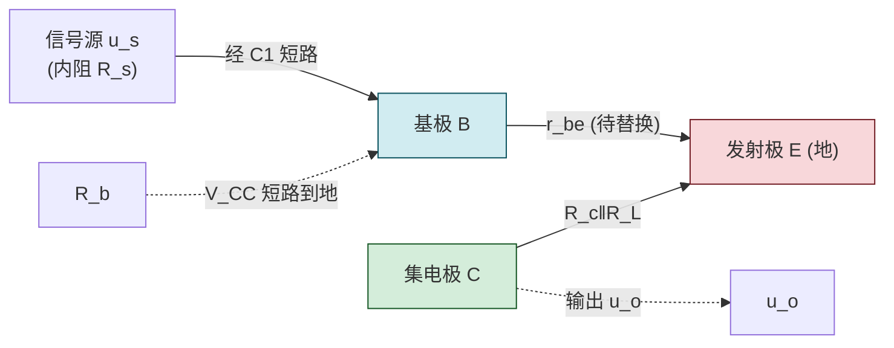
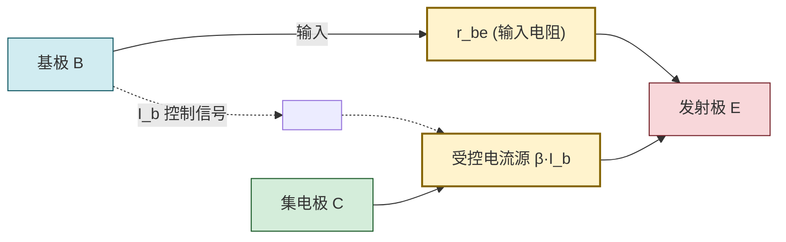

# 5.3 微变等效电路、电压放大倍数计算

> [!info] 本节定位
> 本节是放大电路**动态分析**的核心方法。它要回答的核心问题是：**在静态工作点 Q 已建立的前提下，如何定量计算放大电路对交流小信号的电压放大倍数、输入电阻和输出电阻？** 答案是**微变等效电路法（小信号模型法）**：将非线性的三极管在 Q 点附近线性化，用由电阻和受控源组成的线性电路替换，再用线性电路理论求解。
>
> 本节是本章的重点。其前提是 [[5.2 共射放大电路静态分析、Q 点计算|5.2]] 已求出 Q 点（$I_{CQ}$ 用于计算 $r_{be}$），其方法直接推广到 [[5.4 共集、共基放大电路特点|5.4]] 三种组态与 [[5.5 分压式静态工作点稳定电路|5.5]] 分压式电路的动态分析。受控源 $\beta I_b$ 的来源是 [[5.1 BJT 三极管结构、放大原理、三种工作区|5.1]] 的放大区关系 $I_C=\beta I_B$。

## 一、交流通路

> [!definition] 交流通路
> 交流通路是放大电路在**仅考虑交流信号**时所对应的电路。画交流通路的原则：
> 1. **耦合电容 $C_1,C_2$ 与旁路电容 $C_e$ 短路**：电容容量足够大时，对交流信号容抗 $X_C=1/(\omega C)\approx0$；
> 2. **直流电压源短路到地**：直流电压源内阻为零，对交流信号等效为短路（$V_{CC}$ 端变为交流地）；
> 3. 三极管暂保留，后续用微变等效电路替换。

> [!warning] 直流源"短路到地"的物理含义
> 直流电压源 $V_{CC}$ 内阻为零，交流电流流过时不产生交流压降，故对交流信号而言 $V_{CC}$ 端与地端等电位——即 $V_{CC}$ 端在交流通路中**接地**。这与直流通路中"保留 $V_{CC}$"截然不同，切勿混淆。这一处理本质是叠加原理：交流分量在理想电压源两端压降为零。

### 共射电路交流通路示例

> [!note] 固定偏置共射电路交流通路
> - $C_1,C_2$ 短路：信号源 $u_s$ 直接接基极 B，负载 $R_L$ 直接接集电极 C；
> - $V_{CC}$ 短路到地：$R_b$ 上端由 $V_{CC}$ 变为接地，故 $R_b$ 一端接 B、一端接地；$R_c$ 上端由 $V_{CC}$ 变为接地，故 $R_c$ 一端接 C、一端接地；
> - 发射极 E 已接地（公共端）。
> 结果：$R_b$ 并联在 B-E 间（输入端），$R_c$ 与 $R_L$ 并联在 C-E 间（输出端）。

## 二、三极管的微变等效电路（小信号模型）

> [!theorem] 三极管微变等效电路
> 在 Q 点附近的小信号范围内，三极管可等效为如下线性二端口网络：
> - **输入回路（B-E 间）**：等效为一个**动态输入电阻 $r_{be}$**，反映发射结在 Q 点附近的微分电阻；
> - **输出回路（C-E 间）**：等效为一个**受控电流源 $\beta I_b$**（电流控制电流源，CCCS），方向从 C 流向 E，大小由基极交流电流 $I_b$ 控制。
>
> 这一模型称为**h 参数微变等效电路**（简化型，仅保留 $h_{ie}=r_{be}$ 与 $h_{fe}=\beta$，忽略 $h_{re}$ 与 $1/h_{oe}$）。

### 2.1 动态输入电阻 $r_{be}$

> [!theorem] $r_{be}$ 计算公式
> 低频小功率管的动态输入电阻：
> $$\boxed{\,r_{be}=r_{bb'}+(1+\beta)\frac{U_T}{I_{EQ}}\,}\quad(\Omega)$$
> 其中：
> - $r_{bb'}$ 为基区体电阻，低频小功率管约 $200\sim300\,\Omega$（常取 $200\,\Omega$）；
> - $\beta$ 为三极管交流电流放大系数；
> - $U_T=kT/q$ 为热电压，常温 $T=300\,\text{K}$ 时 $U_T\approx26\,\text{mV}=0.026\,\text{V}$；
> - $I_{EQ}$ 为静态发射极电流（A），放大区近似 $I_{EQ}\approx I_{CQ}$。
>
> 公式也常写作 $r_{be}=r_{bb'}+(1+\beta)\dfrac{26\,\text{mV}}{I_{EQ}(\text{mA})}\,(\Omega)$。

> [!proof] $r_{be}$ 公式的物理来源
> 输入电压 $u_{be}$ 加在 B-E 间，需克服两部分压降：
> 1. 基区体电阻 $r_{bb'}$ 上的压降 $i_b r_{bb'}$；
> 2. 发射结微分电阻上的压降。发射结电流 $i_e\approx(1+\beta)i_b$，发射结微分电阻 $r_e=U_T/I_{EQ}$（由 PN 结正向特性微分得到，类似 [[4.2 二极管伏安特性、参数|4.2]] 二极管动态电阻），其上压降 $i_e r_e=(1+\beta)i_b\cdot U_T/I_{EQ}$。
> 故 $u_{be}=i_b\left[r_{bb'}+(1+\beta)\dfrac{U_T}{I_{EQ}}\right]$，即 $r_{be}=u_{be}/i_b$ 得公式。

> [!note] $r_{be}$ 的典型量级
> 设 $\beta=50$，$r_{bb'}=200\,\Omega$，$I_{EQ}=2\,\text{mA}$：
> $$r_{be}=200+(1+50)\times\frac{26}{2}=200+51\times13=200+663=863\,\Omega\approx0.86\,\text{k}\Omega$$
> 典型共射电路 $r_{be}$ 约 $0.5\sim3\,\text{k}\Omega$，远小于 $R_b$（数十至数百 $\text{k}\Omega$）。

### 2.2 受控电流源 $\beta I_b$

> [!note] 受控源的来源与方向
> 放大区 $I_C=\beta I_B$ 对**变化量**同样成立：$\Delta I_C=\beta\Delta I_B$，即交流分量 $i_c=\beta i_b$。在微变等效电路中以受控电流源 $\beta I_b$（从 C 流向 E）表示。注意：
> 1. 它是**受控源**，大小受 $I_b$ 控制，不可独立设置；
> 2. 方向由 C 流向 E（与 $I_C$ 实际方向一致），NPN 与 PNP 在等效电路中方向相同（已统一为电流流向）；
> 3. $I_b$ 是输入回路电流，必须先求出 $I_b=u_i/r_{be}$（纯 $r_{be}$ 输入时）。

## 三、共射放大电路的动态指标计算

将交流通路中的三极管用微变等效电路替换，得到完整的微变等效电路，即可计算三大动态指标。

### 3.1 电压放大倍数 $A_u$

> [!theorem] 共射电路电压放大倍数
> $$\boxed{\,A_u=\frac{u_o}{u_i}=-\frac{\beta R_L'}{r_{be}}\,}$$
> 其中 $R_L'=R_c\parallel R_L$（集电极电阻与负载的并联，称为交流等效负载电阻），负号表示输出与输入**反相**。

> [!proof] 推导
> 由微变等效电路：
> - 输入回路：$u_i=I_b\,r_{be}$，故 $I_b=u_i/r_{be}$；
> - 输出回路：受控源 $\beta I_b$ 从 C 流向 E，流过 $R_L'=R_c\parallel R_L$（从 C 到地），输出电压 $u_o$ 取自 C 对地，方向规定为 C 正地负，则 $u_o=-(\beta I_b)R_L'$（受控源电流从 C 流出使 C 电位降低，故为负）。
> 故
> $$A_u=\frac{u_o}{u_i}=\frac{-\beta I_b R_L'}{I_b r_{be}}=-\frac{\beta R_L'}{r_{be}}$$

> [!warning] 负号的物理意义与方向约定
> 负号源于：共射电路中 $i_c$ 增大时 $u_{CE}=V_{CC}-i_C R_c$ 减小，即输出交流分量 $u_o=u_{ce}$ 与输入 $u_i=u_{be}$ 变化方向相反。这是共射电路**反相放大**的标志，不能漏写负号。
> 若题目规定 $u_o$ 方向为地正 C 负，则无负号，但工程惯例规定输出对地电压（C 正地负），故通常带负号。

### 3.2 输入电阻 $R_i$

> [!definition] 放大电路输入电阻
> 输入电阻是从放大电路输入端看进去的等效电阻：
> $$R_i=\frac{u_i}{i_i}\quad(\Omega)$$
> 它反映放大电路对信号源的负载效应：$R_i$ 越大，从信号源吸取的电流越小，信号源内阻压降越小，输入电压越接近信号源电动势。

> [!theorem] 共射电路输入电阻
> $$\boxed{\,R_i=R_b\parallel r_{be}\approx r_{be}\,}\quad(\Omega)$$
> 由于 $R_b\gg r_{be}$（$R_b$ 通常数十至数百 $\text{k}\Omega$，$r_{be}$ 约 $\text{k}\Omega$ 量级），并联结果主要由 $r_{be}$ 决定，故 $R_i\approx r_{be}$。

> [!note] 注意 $R_i$ 与 $r_{be}$ 的区别
> $r_{be}$ 是**三极管本身的输入电阻**（B-E 间）；$R_i$ 是**放大电路的输入电阻**（含偏置电阻 $R_b$）。二者关系 $R_i=R_b\parallel r_{be}$。计算 $R_i$ 时务必把 $R_b$ 并联进去（除非 $R_b\gg r_{be}$ 才能近似忽略）。

### 3.3 输出电阻 $R_o$

> [!definition] 放大电路输出电阻
> 输出电阻是从放大电路输出端看进去的等效电阻（信号源短路、负载开路时）：
> $$R_o=\left.\frac{u_o}{i_o}\right|_{u_s=0,\,R_L=\infty}\quad(\Omega)$$
> 它反映放大电路带负载能力：$R_o$ 越小，接入负载后输出电压下降越少，带负载能力越强。

> [!theorem] 共射电路输出电阻
> $$\boxed{\,R_o\approx R_c\,}\quad(\Omega)$$
> 求法：令 $u_s=0$（输入短路，则 $I_b=0$，受控源 $\beta I_b=0$ 相当于开路），从输出端看进去只有 $R_c$（受控源开路后，C-E 间断开）。

> [!proof] 输出电阻计算步骤
> 1. 令 $u_s=0$（信号源短路，保留内阻 $R_s$）；
> 2. 负载 $R_L$ 开路（$R_L=\infty$）；
> 3. 此时 $I_b=0$（因 $u_i=0$），受控源 $\beta I_b=0$，相当于开路；
> 4. 从输出端 C-E 看进去，仅剩 $R_c$ 接到交流地（$V_{CC}$ 端），故 $R_o=R_c$。
> 严格来说，还应考虑三极管输出电阻 $r_{ce}=1/h_{oe}$（有限值，约 $10\sim100\,\text{k}\Omega$），与 $R_c$ 并联，但通常 $r_{ce}\gg R_c$，故 $R_o\approx R_c$。

## 四、动态分析完整流程

> [!summary] 共射放大电路分析三步法
> 1. **静态分析**（[[5.2 共射放大电路静态分析、Q 点计算|5.2]]）：画直流通路 → 求 $I_{BQ},I_{CQ},U_{CEQ}$ → 验证放大区；
> 2. **求 $r_{be}$**：用 $I_{EQ}\approx I_{CQ}$ 代入 $r_{be}=r_{bb'}+(1+\beta)U_T/I_{EQ}$；
> 3. **动态分析**：画交流通路 → 替换为微变等效电路 → 求 $A_u,R_i,R_o$。

## 五、典型例题

### 例题 1：共射电路完整动态分析

> [!example] 题目
> 共射固定偏置电路：$V_{CC}=12\,\text{V}$，$R_b=300\,\text{k}\Omega$，$R_c=3\,\text{k}\Omega$，$R_L=3\,\text{k}\Omega$，硅 NPN 管 $\beta=50$，$r_{bb'}=200\,\Omega$，$U_{BEQ}=0.7\,\text{V}$。求 $A_u,R_i,R_o$。

**解**：

**第 1 步：静态分析**（[[5.2 共射放大电路静态分析、Q 点计算|5.2]] 例题 1 已得）
$$I_{BQ}=37.7\,\mu\text{A},\quad I_{CQ}=1.885\,\text{mA},\quad U_{CEQ}=6.35\,\text{V}$$
$I_{EQ}\approx I_{CQ}=1.885\,\text{mA}$。

**第 2 步：求 $r_{be}$**
$$r_{be}=r_{bb'}+(1+\beta)\frac{U_T}{I_{EQ}}=200+(1+50)\times\frac{26}{1.885}=200+51\times13.79\approx200+703=903\,\Omega\approx0.903\,\text{k}\Omega$$

**第 3 步：动态分析**
$$R_L'=R_c\parallel R_L=3\parallel3=\frac{3\times3}{3+3}=1.5\,\text{k}\Omega$$
$$A_u=-\frac{\beta R_L'}{r_{be}}=-\frac{50\times1.5}{0.903}\approx-83.1$$
$$R_i=R_b\parallel r_{be}\approx r_{be}=0.903\,\text{k}\Omega\quad(R_b=300\,\text{k}\Omega\gg r_{be})$$
$$R_o\approx R_c=3\,\text{k}\Omega$$

结果：$A_u\approx-83$（反相放大 83 倍），$R_i\approx903\,\Omega$，$R_o\approx3\,\text{k}\Omega$。

**单位检验**：$r_{be}=\Omega+(\text{无量纲})\times\text{mV/mA}=\Omega+\Omega=\Omega$；$A_u=\text{无量纲}\times\Omega/\Omega$ 无量纲，正确。

### 例题 2：负载对放大倍数的影响

> [!example] 题目
> 上题电路中，若负载开路（$R_L=\infty$），重新求 $A_u$，并与带载（$R_L=3\,\text{k}\Omega$）比较。

**解**：负载开路时 $R_L'=R_c\parallel R_L=R_c\parallel\infty=R_c=3\,\text{k}\Omega$。
$$A_u=-\frac{\beta R_c}{r_{be}}=-\frac{50\times3}{0.903}\approx-166$$

带载时 $A_u\approx-83$，开路时 $A_u\approx-166$，可见接入负载使电压放大倍数**下降到约一半**（因 $R_L=R_c$，并联后 $R_L'=R_c/2$）。这正说明输出电阻 $R_o=R_c=3\,\text{k}\Omega$ 不算小，带载能力有限。

> [!note] 源电压放大倍数
> 若考虑信号源内阻 $R_s$，则源电压放大倍数 $A_{us}=\dfrac{u_o}{u_s}=\dfrac{u_i}{u_s}\cdot\dfrac{u_o}{u_i}=\dfrac{R_i}{R_s+R_i}A_u$。$R_i$ 越小、$R_s$ 越大，$A_{us}$ 衰减越多。

### 例题 3：旁路电容 $C_e$ 的作用

> [!example] 题目
> 某共射电路发射极接入电阻 $R_e=200\,\Omega$，并联旁路电容 $C_e$。设 $r_{be}=1\,\text{k}\Omega$，$\beta=50$，$R_c=3\,\text{k}\Omega$，$R_L=\infty$。分别求 (1) $C_e$ 足够大（对交流短路）；(2) $C_e$ 开路（无旁路）时的 $A_u$。

**解**：

(1) $C_e$ 短路时，$R_e$ 被旁路，对交流无效，相当于 [[5.5 分压式静态工作点稳定电路|5.5]] 标准电路：
$$A_u=-\frac{\beta R_c}{r_{be}}=-\frac{50\times3}{1}=-150$$

(2) $C_e$ 开路时，$R_e$ 参与交流通路，发射极不再直接接地。输入回路 $u_i=I_b r_{be}+(1+\beta)I_b R_e$，输出 $u_o=-\beta I_b R_c$，故
$$A_u=\frac{u_o}{u_i}=-\frac{\beta R_c}{r_{be}+(1+\beta)R_e}=-\frac{50\times3}{1+(51)\times0.2}=-\frac{150}{1+10.2}=-\frac{150}{11.2}\approx-13.4$$

可见无旁路电容时 $|A_u|$ 由 150 降至 13.4，**放大倍数大幅下降**，但同时输入电阻增大、失真减小、稳定性提高。这正是 [[5.5 分压式静态工作点稳定电路|5.5]] 中 $R_e$ 的双重作用：直流负反馈稳定 Q 点，但若不并 $C_e$ 会牺牲交流增益。

**单位检验**：$r_{be}+(1+\beta)R_e=\Omega+\Omega=\Omega$，$A_u$ 无量纲，正确。

## 六、易错点

> [!warning] 易错点
> 1. **交流通路画错 $V_{CC}$ 处理**：$V_{CC}$ 在交流通路中**短路到地**（不是开路！），$R_b,R_c$ 上端均变为接地。这是与直流通路最大的区别。
> 2. **$r_{be}$ 公式记错**：正确为 $r_{be}=r_{bb'}+(1+\beta)U_T/I_{EQ}$，注意是 $(1+\beta)$ 不是 $\beta$，是 $I_{EQ}$ 不是 $I_{BQ}$。若用 $I_{CQ}$ 近似 $I_{EQ}$ 亦可。
> 3. **$A_u$ 漏负号**：共射电路输出与输入反相，$A_u$ 必带负号。漏写会被判错。
> 4. **$R_L'$ 计算遗漏并联**：$R_L'=R_c\parallel R_L$，不是 $R_c$。负载开路才是 $R_L'=R_c$。
> 5. **混淆 $R_i$ 与 $r_{be}$**：$R_i=R_b\parallel r_{be}$，含偏置电阻；$r_{be}$ 只是三极管输入电阻。
> 6. **求 $R_o$ 时忘记令 $u_s=0$**：求输出电阻必须令信号源短路（使 $I_b=0$、受控源开路），否则受控源仍作用，结果错误。注意负载 $R_L$ 也要开路（不计入 $R_o$）。
> 7. **微变等效电路适用范围**：仅适用于**低频小信号**且 Q 点在放大区。大信号或高频需用其他模型（如图解法、混合 $\pi$ 模型）。
> 8. **受控源方向**：$\beta I_b$ 方向从 C 流向 E，与 $I_C$ 实际方向一致。方向错会导致 $u_o$ 符号错。

## 七、与其他小节的联系

- 微变等效电路的前提是 Q 点已知，来自 [[5.2 共射放大电路静态分析、Q 点计算|5.2]]；
- 受控源 $\beta I_b$ 对应 [[5.1 BJT 三极管结构、放大原理、三种工作区|5.1]] 的放大区关系 $I_C=\beta I_B$；
- 本节方法直接推广到 [[5.4 共集、共基放大电路特点|5.4]] 三种组态的动态分析；
- [[5.5 分压式静态工作点稳定电路|5.5]] 分压式电路的动态分析同样用微变等效电路，需注意 $R_e$ 与 $C_e$ 的处理；
- 本章 MOC：[[MOC - 第5章]]。

## 章节导航

- 上一级：[[MOC - 第5章]]
- 上一节：[[5.2 共射放大电路静态分析、Q 点计算]]
- 下一节：[[5.4 共集、共基放大电路特点]]
- 习题：[[MOC - 第5章习题]]
