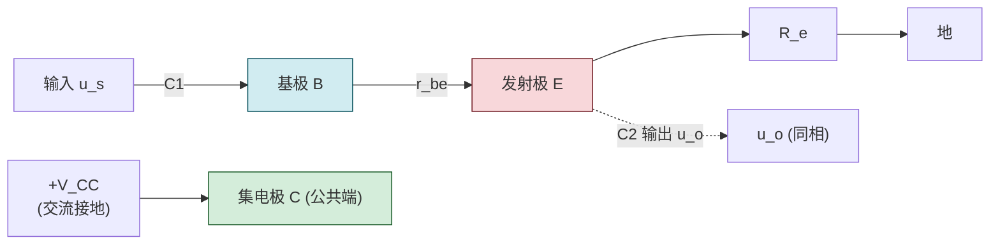
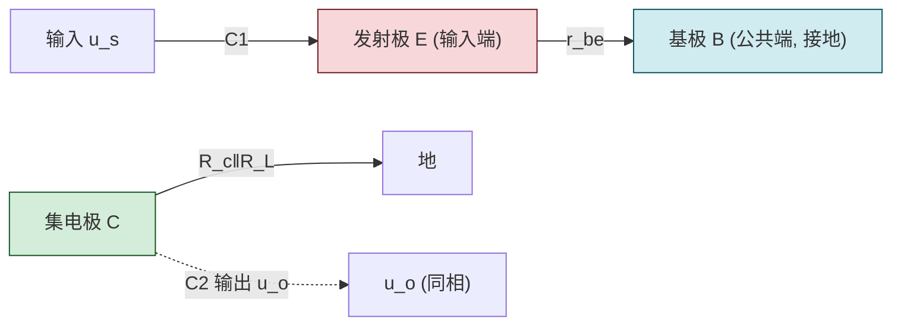

# 5.4 共集、共基放大电路特点

> [!info] 本节定位
> 本节是 BJT 三种基本放大组态的**横向对比与选型依据**。它要回答的核心问题是：**除了 [[5.2 共射放大电路静态分析、Q 点计算|5.2]]/[[5.3 微变等效电路、电压放大倍数计算|5.3]] 已分析的共射电路外，把输入输出端口改接到 BJT 的另外两个电极，会得到性能有何差异的放大电路？各适用于什么场合？**
>
> 本节在共射电路的静态/动态分析方法（[[5.2 共射放大电路静态分析、Q 点计算|5.2]]、[[5.3 微变等效电路、电压放大倍数计算|5.3]]）基础上，分析**共集电极电路（CC，射极输出器）**与**共基极电路（CB）**的特点，并给出三种组态的对比表。三种组态的器件物理基础仍是 [[5.1 BJT 三极管结构、放大原理、三种工作区|5.1]] 的 BJT 放大区特性，差异仅在于公共端与信号接入方式不同。

## 一、共集电极放大电路（射极输出器）

> [!definition] 共集电极放大电路（Common-Collector, CC）
> 共集电极电路以**集电极为输入回路与输出回路的公共端**（交流接地），基极为信号输入端，**发射极为信号输出端**。因输出从发射极取出，又称**射极输出器（Emitter Follower）**。

### 1.1 电路结构

> [!note] CC 电路拓扑（NPN）
> - $V_{CC}$ 经 $R_b$ 接基极 B（提供偏置）；
> - 集电极 C 直接接 $V_{CC}$（交流接地，因 $V_{CC}$ 短路到地）；
> - 发射极 E 经 $R_e$ 接地，输出 $u_o$ 取自发射极（$R_e$ 上电压）；
> - 输入 $u_i$ 经 $C_1$ 接基极。
> 交流通路中集电极接地，故称共集。

### 1.2 动态性能指标

> [!theorem] 共集电路三大动态指标
> 1. **电压放大倍数**：
> $$\boxed{\,A_u=\frac{u_o}{u_i}=\frac{(1+\beta)R_L'}{r_{be}+(1+\beta)R_L'}\approx1\,}$$
> 其中 $R_L'=R_e\parallel R_L$。$A_u$ 为正且略小于 1（同相，无电压放大）。
> 2. **输入电阻**：
> $$\boxed{\,R_i=R_b\parallel\left[r_{be}+(1+\beta)R_L'\right]\,}$$
> 因 $(1+\beta)R_L'$ 通常很大，$R_i$ 可达数十至数百 $\text{k}\Omega$，**远大于共射电路**。
> 3. **输出电阻**：
> $$\boxed{\,R_o\approx R_e\parallel\frac{r_{be}+R_s'}{1+\beta}\approx\frac{r_{be}+R_s'}{1+\beta}\,}$$
> 其中 $R_s'=R_s\parallel R_b$。除以 $(1+\beta)$ 使 $R_o$ 很小（通常几十至几百 $\Omega$），**远小于共射电路**。

> [!proof] $A_u$ 推导
> 由微变等效电路：输入回路 $u_i=I_b r_{be}+(1+\beta)I_b R_L'$（基极电流流过 $r_{be}$，发射极电流 $(1+\beta)I_b$ 流过 $R_L'$）；输出 $u_o=(1+\beta)I_b R_L'$（发射极电流在 $R_L'$ 上压降）。故
> $$A_u=\frac{u_o}{u_i}=\frac{(1+\beta)I_b R_L'}{I_b r_{be}+(1+\beta)I_b R_L'}=\frac{(1+\beta)R_L'}{r_{be}+(1+\beta)R_L'}$$
> 由于 $(1+\beta)R_L'\gg r_{be}$，分子分母接近相等，$A_u\approx1$ 但略小于 1。

> [!note] 输出电阻小的来源
> 求输出电阻时令 $u_s=0$，从输出端（发射极）看进去，发射结回路电阻 $r_{be}+R_s'$（信号源内阻与基区电阻之和）被 $(1+\beta)$ 折算到发射极侧——这是因为基极电流是发射极电流的 $1/(1+\beta)$，电阻折算遵循"电流小的回路电阻折算到电流大的回路要除以电流比平方"的变压器类似原理（这里是一次方关系）。结果 $R_o$ 很小，使射极输出器带负载能力强。

### 1.3 特点与应用

> [!summary] 共集电路特点
> 1. **电压放大倍数 $A_u\approx1$**（略小于 1，同相）：无电压放大，但仍有电流放大（$A_i\approx1+\beta$）；
> 2. **输入电阻大**：减轻信号源负载，适合作多级放大电路的**输入级**；
> 3. **输出电阻小**：带负载能力强，适合作多级放大电路的**输出级**；
> 4. **同相跟随**：输出电压跟随输入电压变化，又称**电压跟随器**。

> [!example] 共集电路的典型应用
> - **输入级**：测量放大器、仪器输入级，要求高输入阻抗以减小对被测电路的影响；
> - **输出级**：功率放大器输出级，要求低输出阻抗以驱动低阻负载；
> - **缓冲级（隔离级）**：在两级共射放大电路之间插入射极输出器，利用其 $R_i$ 大、$R_o$ 小的特性，避免后级低输入电阻对前级增益的衰减，实现级间阻抗变换。

## 二、共基极放大电路

> [!definition] 共基极放大电路（Common-Base, CB）
> 共基极电路以**基极为输入回路与输出回路的公共端**（交流接地），**发射极为信号输入端**，集电极为信号输出端。

### 2.1 电路结构

> [!note] CB 电路拓扑（NPN）
> - 基极 B 经大电容 $C_b$ 交流接地（直流偏置仍由 $R_{b1},R_{b2}$ 分压提供，见 [[5.5 分压式静态工作点稳定电路|5.5]]）；
> - 发射极 E 经 $R_e$ 接地，输入 $u_i$ 经 $C_1$ 接发射极；
> - 集电极 C 经 $R_c$ 接 $V_{CC}$，输出 $u_o$ 经 $C_2$ 取自集电极。
> 交流通路中基极接地，故称共基。

### 2.2 动态性能指标

> [!theorem] 共基电路三大动态指标
> 1. **电压放大倍数**：
> $$\boxed{\,A_u=\frac{u_o}{u_i}=\frac{\beta R_L'}{r_{be}}\,}$$
> 大小与共射电路相同（仅差一个负号），即**同相放大**，电压增益大。
> 2. **电流放大倍数**：$A_i\approx1$（略小于 1），因 $I_c\approx I_e$；
> 3. **输入电阻**：
> $$\boxed{\,R_i=R_e\parallel\frac{r_{be}}{1+\beta}\approx\frac{r_{be}}{1+\beta}\,}$$
> 因 $r_{be}$ 被 $(1+\beta)$ 折算到发射极侧，$R_i$ 很小（通常几十 $\Omega$）。
> 4. **输出电阻**：$R_o\approx R_c$（与共射相同）。

> [!proof] $A_u$ 与共射大小相同的物理原因
> 共基电路输入电流是 $I_e$，输出电流是 $I_c=\alpha I_e\approx I_e$（$\alpha=\beta/(1+\beta)\approx1$）。输入电压 $u_i=I_e\cdot r_{be}/(1+\beta)$（因 $I_b=I_e/(1+\beta)$，$u_i=I_b r_{be}$），输出 $u_o=\beta I_b R_L'=\alpha I_e R_L'$。故
> $$A_u=\frac{\alpha I_e R_L'}{I_e r_{be}/(1+\beta)}=\frac{\alpha(1+\beta)R_L'}{r_{be}}=\frac{\beta R_L'}{r_{be}}$$
> 与共射的 $-\beta R_L'/r_{be}$ 仅差符号——共基输出取自集电极，$i_c$ 增大时 $u_{CE}$ 减小，但输入 $u_i$ 是发射极对地电压，$i_e$ 增大时 $u_i$ 减小（发射极电位降低），二者同方向变化，故**同相**。

### 2.3 特点与应用

> [!summary] 共基电路特点
> 1. **电压放大倍数大**（与共射相当，同相）；
> 2. **电流放大倍数 $A_i\approx1$**（无电流放大）；
> 3. **输入电阻小**（几十 $\Omega$）；
> 4. **高频特性好**：因基极交流接地，密勒电容效应小，截止频率高，频带宽；
> 5. **输出电阻与共射相当**（$R_o\approx R_c$）。

> [!example] 共基电路的典型应用
> - **高频放大电路**：射频前端、调谐放大器，利用其宽频带特性；
> - **宽频带放大电路**：视频放大、示波器垂直通道；
> - **电流接续器**：与共射电路组合构成共射-共基（Cascode）组态，兼顾增益与带宽。

## 三、三种组态对比

> [!summary] BJT 三种基本组态对比表

| 特性 | 共射（CE） | 共集（CC） | 共基（CB） |
| ---- | ---------- | ---------- | ---------- |
| 输入端 | 基极 B | 基极 B | 发射极 E |
| 输出端 | 集电极 C | 发射极 E | 集电极 C |
| 公共端 | 发射极 E | 集电极 C | 基极 B |
| 电压放大倍数 $A_u$ | 大（几十~几百） | $\approx1$（略小于 1） | 大（与共射相当） |
| 电流放大倍数 $A_i$ | 大（$\approx\beta$） | 大（$\approx1+\beta$） | $\approx1$（略小于 1） |
| 功率放大 | 大 | 中 | 中 |
| 相位关系 | **反相** | 同相 | 同相 |
| 输入电阻 $R_i$ | 中（约 $\text{k}\Omega$） | 大（数十~数百 $\text{k}\Omega$） | 小（几十 $\Omega$） |
| 输出电阻 $R_o$ | 中（$\approx R_c$） | 小（几十~几百 $\Omega$） | 中（$\approx R_c$） |
| 高频特性 | 一般 | 较好 | **好**（频带宽） |
| 典型应用 | 一般放大、功率放大 | 输入级、输出级、缓冲级 | 高频、宽频带放大 |

> [!note] 选型要领
> - 需要大的电压/功率增益 → **共射**（最常用）；
> - 需要高输入阻抗、低输出阻抗、缓冲隔离 → **共集**（射极输出器）；
> - 需要宽频带、高频放大 → **共基**；
> - 多级放大电路中常组合使用：如共射（增益）+ 共集（隔离输出），或共射-共基（Cascode，高增益宽频带）。

## 四、典型例题

### 例题 1：射极输出器动态分析

> [!example] 题目
> 共集电路：$V_{CC}=12\,\text{V}$，$R_b=200\,\text{k}\Omega$，$R_e=2\,\text{k}\Omega$，$R_L=2\,\text{k}\Omega$，硅 NPN 管 $\beta=60$，$r_{bb'}=200\,\Omega$，$U_{BEQ}=0.7\,\text{V}$，信号源内阻 $R_s=1\,\text{k}\Omega$。求 $A_u,R_i,R_o$。

**解**：

**静态分析**：
$$I_{BQ}=\frac{V_{CC}-U_{BEQ}}{R_b+(1+\beta)R_e}=\frac{12-0.7}{200+61\times2}=\frac{11.3}{322}\,\text{mA}\approx35.1\,\mu\text{A}$$
$$I_{EQ}\approx(1+\beta)I_{BQ}=61\times35.1\,\mu\text{A}\approx2.14\,\text{mA}$$

> [!note] 共集电路静态计算的特殊性
> 注意分母含 $(1+\beta)R_e$ 项——因 $R_e$ 在发射极回路，流过 $(1+\beta)I_B$ 的电流，从基极看相当于电阻被放大 $(1+\beta)$ 倍（密勒定理类似思想）。

**求 $r_{be}$**：
$$r_{be}=200+(1+60)\times\frac{26}{2.14}=200+61\times12.15\approx200+741=941\,\Omega\approx0.941\,\text{k}\Omega$$

**动态分析**：
$$R_L'=R_e\parallel R_L=2\parallel2=1\,\text{k}\Omega$$
$$A_u=\frac{(1+\beta)R_L'}{r_{be}+(1+\beta)R_L'}=\frac{61\times1}{0.941+61\times1}=\frac{61}{61.941}\approx0.985\approx1$$
$$R_i=R_b\parallel\left[r_{be}+(1+\beta)R_L'\right]=200\parallel(0.941+61)=200\parallel61.9\approx\frac{200\times61.9}{200+61.9}\approx47.3\,\text{k}\Omega$$
$$R_o\approx R_e\parallel\frac{r_{be}+R_s'}{1+\beta},\quad R_s'=R_s\parallel R_b\approx R_s=1\,\text{k}\Omega$$
$$R_o\approx2\parallel\frac{0.941+1}{61}=2\parallel\frac{1.941}{61}\approx2\parallel0.0318\approx0.0318\,\text{k}\Omega=31.8\,\Omega$$

结果：$A_u\approx0.985$（同相跟随），$R_i\approx47.3\,\text{k}\Omega$（大），$R_o\approx31.8\,\Omega$（小）。体现了射极输出器三大特征。

**单位检验**：$R_i,R_o$ 单位 $\Omega$ 或 $\text{k}\Omega$，$A_u$ 无量纲，正确。

### 例题 2：共基电路动态分析

> [!example] 题目
> 共基电路：$r_{be}=1\,\text{k}\Omega$，$\beta=50$，$R_c=3\,\text{k}\Omega$，$R_e=1\,\text{k}\Omega$，$R_L=3\,\text{k}\Omega$。求 $A_u,R_i,R_o$。

**解**：
$$R_L'=R_c\parallel R_L=3\parallel3=1.5\,\text{k}\Omega$$
$$A_u=\frac{\beta R_L'}{r_{be}}=\frac{50\times1.5}{1}=75\quad(\text{同相，无负号})$$
$$R_i=R_e\parallel\frac{r_{be}}{1+\beta}=1\parallel\frac{1}{51}\approx1\parallel0.0196\approx0.0196\,\text{k}\Omega=19.6\,\Omega$$
$$R_o\approx R_c=3\,\text{k}\Omega$$

结果：$A_u=75$（同相大增益），$R_i\approx19.6\,\Omega$（极小），$R_o\approx3\,\text{k}\Omega$。体现了共基"高增益、低输入阻抗"特征。

**单位检验**：$\text{k}\Omega\parallel\text{k}\Omega=\text{k}\Omega$，$A_u$ 无量纲，正确。

### 例题 3：组态识别

> [!example] 题目
> 判断以下三个放大电路的组态：(a) 输入接基极，输出取自发射极；(b) 输入接发射极，输出取自集电极；(c) 输入接基极，输出取自集电极。

**解**：
- (a) 输入 B、输出 E → 公共端为 C → **共集（CC）**；
- (b) 输入 E、输出 C → 公共端为 B → **共基（CB）**；
- (c) 输入 B、输出 C → 公共端为 E → **共射（CE）**。

> [!note] 组态识别口诀
> "**输入输出之外的那个电极就是公共端**"。已知输入端、输出端，剩下未被使用的电极即为交流公共端（接地端），由此命名组态。

## 五、易错点

> [!warning] 易错点
> 1. **组态判错**：组态由**交流公共端**决定，不是直流。判别方法：找输入端和输出端，剩余电极即公共端。注意直流偏置电路可能让某电极直流接地而交流不接地（如基极经偏置电阻接 $V_{CC}$，但交流经 $C_b$ 接地）。
> 2. **共集 $A_u$ 漏写"近似 1"**：$A_u=\dfrac{(1+\beta)R_L'}{r_{be}+(1+\beta)R_L'}$ 严格小于 1，但工程上常写 $\approx1$。需注意它**不是恒等于 1**，且无负号（同相）。
> 3. **共基 $A_u$ 加负号**：共基输出与输入**同相**，$A_u=+\beta R_L'/r_{be}$，无负号。易与共射混淆。
> 4. **输入电阻折算方向记反**：基极侧电阻折算到发射极侧**除以 $(1+\beta)$**（变小）；发射极侧电阻折算到基极侧**乘以 $(1+\beta)$**（变大）。共集 $R_i$ 大（发射极 $R_e$ 折算到基极变大），共基 $R_i$ 小（基极 $r_{be}$ 折算到发射极变小）。
> 5. **混淆 $A_u$ 与 $A_i$**：共集 $A_u\approx1$ 但 $A_i\approx1+\beta$ 大；共基 $A_u$ 大但 $A_i\approx1$。电压与电流放大不可混为一谈。
> 6. **共基静态分析**：共基电路直流偏置多用分压式（[[5.5 分压式静态工作点稳定电路|5.5]]），基极经大电容 $C_b$ 交流接地。计算 Q 点时按分压式偏置进行，与共射相同。

## 六、与其他小节的联系

- 三种组态的器件基础是 [[5.1 BJT 三极管结构、放大原理、三种工作区|5.1]] 的 BJT 放大区；
- 共射电路的静态/动态分析是 [[5.2 共射放大电路静态分析、Q 点计算|5.2]]、[[5.3 微变等效电路、电压放大倍数计算|5.3]]；
- 共集、共基的静态分析多用分压式偏置，见 [[5.5 分压式静态工作点稳定电路|5.5]]；
- 多级放大电路的级间耦合常利用共集的阻抗变换特性，是 [[MOC - 第7章|第7章 集成运算放大器]] 多级放大的基础；
- 共基的高频特性是 [[MOC - 第8章|第8章 负反馈]] 改善频率特性的器件基础之一；
- 本章 MOC：[[MOC - 第5章]]。

## 章节导航

- 上一级：[[MOC - 第5章]]
- 上一节：[[5.3 微变等效电路、电压放大倍数计算]]
- 下一节：[[5.5 分压式静态工作点稳定电路]]
- 习题：[[MOC - 第5章习题]]
