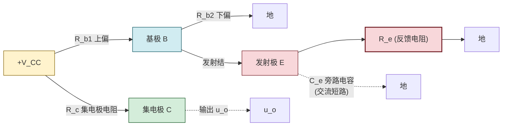

# 5.5 分压式静态工作点稳定电路

> [!info] 本节定位
> 本节是放大电路偏置设计的**工程实用方案**。它要回答的核心问题是：**[[5.2 共射放大电路静态分析、Q 点计算|5.2]] 的固定偏置电路 Q 点会随温度剧烈漂移，如何设计一种偏置电路使 Q 点在温度变化时仍能自动保持稳定？** 答案是**分压式偏置电路（射极偏置电路）**，它利用发射极电阻 $R_e$ 引入**直流电流负反馈**，自动抑制 $I_C$ 的温度漂移。
>
> 本节是本章重点。它综合运用 [[5.1 BJT 三极管结构、放大原理、三种工作区|5.1]] 的 BJT 参数温度特性（$\beta,I_{CBO},U_{BE}$ 随温度变化）、[[5.2 共射放大电路静态分析、Q 点计算|5.2]] 的 Q 点计算方法、[[5.3 微变等效电路、电压放大倍数计算|5.3]] 的微变等效电路法，并自然引出 [[MOC - 第8章|第8章 负反馈放大电路]] 的反馈思想。工程中实际放大电路几乎都采用分压式偏置或其改进形式。

## 一、温度对静态工作点的影响

> [!theorem] 温度对 BJT 参数的影响
> 温度变化时，BJT 的三个参数都会变化，且**三者均导致 $I_C$ 增大**，使 Q 点上移：

| 参数 | 温度升高的变化 | 对 $I_C$ 的影响 | 机理 |
| ---- | -------------- | --------------- | ---- |
| 电流放大系数 $\beta$ | $\beta\uparrow$（约 $+0.5\%\sim1\%/^\circ\text{C}$） | $I_C=\beta I_B\uparrow$ | 基区载流子传输效率提高 |
| 反向饱和电流 $I_{CBO}$ | $I_{CBO}\uparrow$（约每升 $10^\circ\text{C}$ 翻倍） | $I_{CEO}=(1+\beta)I_{CBO}\uparrow$，$I_C\uparrow$ | 少子浓度随温度指数增长 |
| 发射结压降 $U_{BE}$ | $U_{BE}\downarrow$（约 $-2\,\text{mV}/^\circ\text{C}$） | $I_B=(V_{CC}-U_{BE})/R_b\uparrow$，$I_C\uparrow$ | PN 结正向压降随温度降低 |

> [!warning] 三种因素同向叠加
> 温度升高时，$\beta\uparrow$、$I_{CBO}\uparrow$、$U_{BE}\downarrow$ **三者都使 $I_C$ 增大**。对 [[5.2 共射放大电路静态分析、Q 点计算|5.2]] 的固定偏置电路，$I_C$ 增大 → $U_{CE}=V_{CC}-I_C R_c$ 减小 → Q 点沿直流负载线上移，可能从放大区进入**饱和区**，导致输出波形饱和失真，严重时烧管。温度降低则反向漂移，可能进入截止区。因此固定偏置电路温度稳定性差，工程上很少直接使用。

## 二、分压式偏置电路结构

> [!definition] 分压式偏置放大电路
> 分压式偏置电路（又称射极偏置电路）在固定偏置电路基础上改进：
> 1. 基极用**上偏电阻 $R_{b1}$ 与下偏电阻 $R_{b2}$** 分压提供基极电位 $U_B$；
> 2. 发射极串入**发射极电阻 $R_e$**，并通常并联**旁路电容 $C_e$**（对交流短路，避免降低交流增益）。
> 这样构成的电路通过 $R_e$ 引入直流负反馈，稳定 Q 点。

> [!note] 各元件作用
> - $R_{b1},R_{b2}$：分压确定基极直流电位 $U_B$；
> - $R_e$：发射极电阻，引入直流负反馈，稳定 $I_C$；同时有交流负反馈作用（若不并 $C_e$ 会降低增益）；
> - $C_e$：旁路电容，容量大，对交流短路，使 $R_e$ 仅起直流负反馈而不影响交流增益；
> - $R_c$：与固定偏置电路相同，把 $I_C$ 变化转为 $U_{CE}$ 变化。

## 三、稳定 Q 点的原理（负反馈）

> [!theorem] 分压式偏置稳定 Q 点的负反馈过程
> 当温度升高使 $I_C$ 增大时，电路自动产生如下反馈过程：
> $$T\uparrow\Rightarrow I_C\uparrow\Rightarrow I_E\uparrow\Rightarrow U_E=I_E R_e\uparrow$$
> $$\Rightarrow U_{BE}=U_B-U_E\downarrow\Rightarrow I_B\downarrow\Rightarrow I_C\downarrow$$
> 反馈结果**抑制了 $I_C$ 的增大**，使 Q 点基本稳定。这一机制称为**直流电流负反馈**。

> [!proof] 稳定原理的逐步解析
> 1. **$U_B$ 近似固定**：分压式偏置要求流过分压支路的电流 $I_1\gg I_B$（工程取 $I_1\ge(5\sim10)I_B$），此时基极电流 $I_B$ 对分压点的扰动可忽略，$U_B$ 由 $R_{b1},R_{b2}$ 分压近似固定：
> $$U_B\approx V_{CC}\cdot\frac{R_{b2}}{R_{b1}+R_{b2}}$$
> 2. **$U_E$ 跟随 $I_C$ 变化**：$U_E=I_E R_e\approx I_C R_e$（放大区 $I_E\approx I_C$）。当温度使 $I_C\uparrow$，$U_E\uparrow$。
> 3. **$U_{BE}$ 减小使 $I_B$ 减小**：$U_{BE}=U_B-U_E$，$U_B$ 固定而 $U_E$ 增大，故 $U_{BE}\downarrow$。由 BJT 输入特性，$U_{BE}$ 减小使 $I_B$ 显著减小（指数关系）。
> 4. **$I_C$ 被拉回**：$I_C=\beta I_B$，$I_B\downarrow\Rightarrow I_C\downarrow$，部分抵消温度引起的 $I_C$ 增大。
> 5. 净效果：$I_C$ 的变化被压缩到原来的 $1/(1+A_F)$（$A_F$ 为反馈深度），Q 点基本稳定。

### 两个稳定条件

> [!theorem] 分压式偏置的两个工程稳定条件
> 1. **$I_1\gg I_B$**：使 $U_B$ 不受 $I_B$ 波动影响。工程取 $I_1\ge(5\sim10)I_B$（硅管可取较小值，锗管取较大值，因锗管 $I_{CBO}$ 大）；
> 2. **$U_B\gg U_{BE}$**：使 $U_E=U_B-U_{BE}$ 主要由 $U_B$ 决定，$U_{BE}$ 随温度变化对 $U_E$ 影响小。工程取 $U_B\ge(3\sim5)\,\text{V}$（硅管，锗管取 $1\sim3\,\text{V}$）。

> [!warning] 稳定条件不是越大越好
> - $I_1$ 过大 → $R_{b1},R_{b2}$ 过小 → 从 $V_{CC}$ 吸取功率增大，且降低放大电路输入电阻 $R_i=R_{b1}\parallel R_{b2}\parallel r_{be}$；
> - $U_B$ 过大 → $U_E$ 大 → $U_{CEQ}=V_{CC}-I_C R_c-U_E$ 减小 → 动态范围缩小，容易饱和。
> 故工程取值是稳定性、功耗、动态范围、输入电阻的折中。

## 四、Q 点计算

> [!theorem] 分压式偏置电路 Q 点计算步骤
> **第 1 步**：求基极电位（利用分压近似，条件 $I_1\gg I_B$）：
> $$\boxed{\,U_{BQ}\approx V_{CC}\cdot\frac{R_{b2}}{R_{b1}+R_{b2}}\,}\quad(\text{V})$$
>
> **第 2 步**：求发射极电位与发射极电流：
> $$U_{EQ}=U_{BQ}-U_{BEQ}\quad(\text{V})$$
> $$\boxed{\,I_{EQ}=\frac{U_{EQ}}{R_e}=\frac{U_{BQ}-U_{BEQ}}{R_e}\,}\quad(\text{A})$$
>
> **第 3 步**：集电极电流（放大区 $I_C\approx I_E$）：
> $$\boxed{\,I_{CQ}\approx I_{EQ}\,}\quad(\text{A})$$
>
> **第 4 步**：基极电流：
> $$I_{BQ}=\frac{I_{CQ}}{\beta}\quad(\text{A})$$
>
> **第 5 步**：管压降（集电极回路 KVL，注意 $U_{CE}=V_{CC}-I_C R_c-I_E R_e$）：
> $$\boxed{\,U_{CEQ}=V_{CC}-I_{CQ}R_c-U_{EQ}\approx V_{CC}-I_{CQ}(R_c+R_e)\,}\quad(\text{V})$$
> 最后仍需验证 $U_{CEQ}>U_{CES}$ 确认在放大区。

> [!note] 分压式偏置 Q 点计算的特点
> 与 [[5.2 共射放大电路静态分析、Q 点计算|5.2]] 固定偏置电路相比，分压式偏置 Q 点计算有两大优势：
> 1. **$I_C$ 几乎与 $\beta$ 无关**：$I_{CQ}\approx I_{EQ}=(U_{BQ}-U_{BEQ})/R_e$，公式中不含 $\beta$，故更换管子（$\beta$ 离散性大）或温度变化（$\beta$ 漂移）对 $I_C$ 影响小；
> 2. **设计直观**：通过选 $R_{b1},R_{b2}$ 设定 $U_B$，再选 $R_e$ 设定 $I_E$，Q 点设计独立于 $\beta$。
> 这是工程上广泛采用分压式偏置的根本原因。

## 五、动态分析

> [!theorem] 分压式偏置电路动态分析（含 $C_e$ 旁路）
> 当 $C_e$ 足够大对交流短路时，$R_e$ 被旁路，动态分析与 [[5.3 微变等效电路、电压放大倍数计算|5.3]] 共射电路几乎相同，仅输入电阻计算略有差异：
> - 电压放大倍数：$A_u=-\dfrac{\beta R_L'}{r_{be}}$，$R_L'=R_c\parallel R_L$；
> - 输入电阻：$\boxed{R_i=R_{b1}\parallel R_{b2}\parallel r_{be}}$（注意是两个偏置电阻并联后再与 $r_{be}$ 并联，比固定偏置多一个 $R_{b2}$）；
> - 输出电阻：$R_o\approx R_c$。

> [!warning] 无 $C_e$ 时的动态分析（$R_e$ 参与交流）
> 若不接旁路电容 $C_e$（或 $C_e$ 失效），$R_e$ 参与交流通路，引入交流电流负反馈：
> - 电压放大倍数大幅下降：
> $$A_u=-\frac{\beta R_L'}{r_{be}+(1+\beta)R_e}$$
> - 输入电阻增大：
> $$R_i=R_{b1}\parallel R_{b2}\parallel\left[r_{be}+(1+\beta)R_e\right]$$
> - 输出电阻 $R_o\approx R_c$（基本不变）。
> 物理意义：$R_e$ 同时起直流负反馈（稳定 Q 点）与交流负反馈（牺牲增益换取稳定性、带宽、失真改善）作用。关于负反馈的深入分析见 [[MOC - 第8章|第8章 负反馈放大电路]]。

## 六、典型例题

### 例题 1：分压式偏置 Q 点计算

> [!example] 题目
> 分压式偏置电路：$V_{CC}=12\,\text{V}$，$R_{b1}=30\,\text{k}\Omega$，$R_{b2}=10\,\text{k}\Omega$，$R_c=2\,\text{k}\Omega$，$R_e=1\,\text{k}\Omega$，硅 NPN 管 $\beta=50$，$U_{BEQ}=0.7\,\text{V}$。求 Q 点并验证放大区。

**解**：

**第 1 步**：基极电位
$$U_{BQ}\approx V_{CC}\cdot\frac{R_{b2}}{R_{b1}+R_{b2}}=12\times\frac{10}{30+10}=12\times0.25=3\,\text{V}$$

**第 2 步**：发射极电位与电流
$$U_{EQ}=U_{BQ}-U_{BEQ}=3-0.7=2.3\,\text{V}$$
$$I_{EQ}=\frac{U_{EQ}}{R_e}=\frac{2.3}{1\times10^3}=2.3\times10^{-3}\,\text{A}=2.3\,\text{mA}$$

**第 3 步**：集电极电流
$$I_{CQ}\approx I_{EQ}=2.3\,\text{mA}$$

**第 4 步**：基极电流
$$I_{BQ}=\frac{I_{CQ}}{\beta}=\frac{2.3}{50}=0.046\,\text{mA}=46\,\mu\text{A}$$

**第 5 步**：管压降
$$U_{CEQ}=V_{CC}-I_{CQ}R_c-U_{EQ}=12-2.3\times10^{-3}\times2\times10^3-2.3=12-4.6-2.3=5.1\,\text{V}$$
（也可用 $U_{CEQ}\approx V_{CC}-I_{CQ}(R_c+R_e)=12-2.3\times3=12-6.9=5.1\,\text{V}$）

验证：$U_{CEQ}=5.1\,\text{V}>U_{BEQ}=0.7\,\text{V}>U_{CES}=0.3\,\text{V}$，$I_{BQ}=46\,\mu\text{A}>0$，**Q 点在放大区**。

**稳定条件检验**：
- 分压支路电流 $I_1\approx V_{CC}/(R_{b1}+R_{b2})=12/40=0.3\,\text{mA}=300\,\mu\text{A}$，$I_1/I_B=300/46\approx6.5\ge5$，满足 $I_1\gg I_B$；
- $U_B=3\,\text{V}\ge3\,\text{V}$，满足 $U_B\gg U_{BE}$。
两个稳定条件均满足，设计合理。

**单位检验**：电压 V，电流 A（mA），电阻 $\Omega$（$\text{k}\Omega$），自洽。

### 例题 2：动态分析（含 $C_e$ 与无 $C_e$ 对比）

> [!example] 题目
> 上题电路中，$r_{bb'}=200\,\Omega$，$R_L=2\,\text{k}\Omega$。分别求 (1) 有 $C_e$ 旁路；(2) 无 $C_e$ 时的 $A_u,R_i,R_o$。

**解**：

先求 $r_{be}$：
$$r_{be}=r_{bb'}+(1+\beta)\frac{U_T}{I_{EQ}}=200+51\times\frac{26}{2.3}=200+51\times11.3\approx200+576=776\,\Omega\approx0.776\,\text{k}\Omega$$

**(1) 有 $C_e$ 旁路**（$R_e$ 被短路）：
$$R_L'=R_c\parallel R_L=2\parallel2=1\,\text{k}\Omega$$
$$A_u=-\frac{\beta R_L'}{r_{be}}=-\frac{50\times1}{0.776}\approx-64.4$$
$$R_i=R_{b1}\parallel R_{b2}\parallel r_{be}=30\parallel10\parallel0.776$$
先算 $30\parallel10=\dfrac{30\times10}{30+10}=7.5\,\text{k}\Omega$，再 $7.5\parallel0.776=\dfrac{7.5\times0.776}{7.5+0.776}\approx\dfrac{5.82}{8.28}\approx0.703\,\text{k}\Omega=703\,\Omega$。
$$R_o\approx R_c=2\,\text{k}\Omega$$

**(2) 无 $C_e$**（$R_e$ 参与交流）：
$$A_u=-\frac{\beta R_L'}{r_{be}+(1+\beta)R_e}=-\frac{50\times1}{0.776+51\times1}=-\frac{50}{51.776}\approx-0.966$$
$$R_i=R_{b1}\parallel R_{b2}\parallel\left[r_{be}+(1+\beta)R_e\right]=30\parallel10\parallel(0.776+51)=30\parallel10\parallel51.776$$
$30\parallel10=7.5\,\text{k}\Omega$，$7.5\parallel51.776=\dfrac{7.5\times51.776}{7.5+51.776}\approx\dfrac{388.3}{59.3}\approx6.55\,\text{k}\Omega$。
$$R_o\approx R_c=2\,\text{k}\Omega$$

对比：无 $C_e$ 时 $|A_u|$ 从 64.4 降至 0.966（约降到 $1/67$），$R_i$ 从 $703\,\Omega$ 增至 $6.55\,\text{k}\Omega$（约 9 倍）。可见 $R_e$ 引入交流负反馈**牺牲增益换取高输入电阻与稳定性**，与 [[5.3 微变等效电路、电压放大倍数计算|5.3]] 例题 3 的结论一致。

**单位检验**：$r_{be},R_i,R_o$ 单位 $\Omega$ 或 $\text{k}\Omega$，$A_u$ 无量纲，正确。

### 例题 3：温度稳定性对比

> [!example] 题目
> 某固定偏置电路 $\beta=50$，$I_{BQ}=40\,\mu\text{A}$，$I_{CQ}=2\,\text{mA}$。温度升高使 $\beta$ 增大到 60（$I_B$ 由偏置电路决定，近似不变）。求 $I_C$ 变化量。若改用例题 1 的分压式偏置（$U_{BQ}=3\,\text{V}$，$R_e=1\,\text{k}\Omega$），$U_{BEQ}$ 因温度降低 $0.1\,\text{V}$（从 $0.7\,\text{V}$ 降至 $0.6\,\text{V}$），$\beta$ 仍从 50 变为 60，求 $I_C$ 变化量，并对比两种电路的温度稳定性。

**解**：

**固定偏置**：$I_B$ 不变，$I_C=\beta I_B$。
$$I_C'=\beta' I_B=60\times40\,\mu\text{A}=2.4\,\text{mA}$$
变化量 $\Delta I_C=2.4-2.0=0.4\,\text{mA}$，相对变化 $20\%$。

**分压式偏置**：$U_{BQ}=3\,\text{V}$ 固定，$U_{BEQ}$ 从 $0.7\,\text{V}$ 降至 $0.6\,\text{V}$。
$$U_{EQ}'=U_{BQ}-U_{BEQ}'=3-0.6=2.4\,\text{V}$$
$$I_{EQ}'=\frac{U_{EQ}'}{R_e}=\frac{2.4}{1\times10^3}=2.4\,\text{mA},\quad I_{CQ}'\approx I_{EQ}'=2.4\,\text{mA}$$
原 $I_{CQ}=2.3\,\text{mA}$，变化量 $\Delta I_C=2.4-2.3=0.1\,\text{mA}$，相对变化约 $4.3\%$。

> [!note] 对比结论
> 分压式偏置的 $I_C$ 变化（$0.1\,\text{mA}$，$4.3\%$）远小于固定偏置（$0.4\,\text{mA}$，$20\%$）。更重要的是，分压式偏置中 $\beta$ 从 50 变到 60 对 $I_C$ **几乎无影响**（公式不含 $\beta$），只有 $U_{BE}$ 变化带来的小扰动。这正体现了分压式偏置"Q 点与 $\beta$ 无关"的核心优势。

## 七、易错点

> [!warning] 易错点
> 1. **Q 点计算忘记 $U_{EQ}$**：分压式偏置 $U_{CEQ}=V_{CC}-I_C R_c-U_{EQ}$，比固定偏置多一项 $U_{EQ}=I_E R_e$。直接套用固定偏置公式 $U_{CEQ}=V_{CC}-I_C R_c$ 会得到错误结果（偏大）。
> 2. **$U_{BQ}$ 分压公式记反**：$U_B=V_{CC}\cdot R_{b2}/(R_{b1}+R_{b2})$，是**下偏电阻** $R_{b2}$ 在分子（$R_{b2}$ 接地侧）。若记反为 $R_{b1}$ 会得到错误电位。
> 3. **忽略稳定条件检验**：分压近似 $U_B\approx V_{CC}\cdot R_{b2}/(R_{b1}+R_{b2})$ 仅在 $I_1\gg I_B$ 时成立。若 $R_{b1},R_{b2}$ 过大不满足此条件，需用戴维南等效精确计算（见 [[2.4 叠加定理、戴维南定理、诺顿定理|戴维南定理]]）。
> 4. **动态分析忘记 $R_{b2}$**：分压式偏置输入电阻 $R_i=R_{b1}\parallel R_{b2}\parallel r_{be}$，含两个偏置电阻并联，比固定偏置（仅 $R_b\parallel r_{be}$）多一项。
> 5. **$C_e$ 处理错误**：$C_e$ 对交流短路——有 $C_e$ 时 $R_e$ 被旁路（不参与交流）；无 $C_e$ 时 $R_e$ 参与，$A_u$ 分母变为 $r_{be}+(1+\beta)R_e$。两种情况公式不同，需区分。
> 6. **混淆 $R_e$ 的直流与交流作用**：$R_e$ **直流负反馈**稳定 Q 点（始终有效）；**交流负反馈**仅在无 $C_e$ 时起作用。两者机理相同但影响不同。
> 7. **稳定条件取值极端化**：$I_1\gg I_B$ 与 $U_B\gg U_{BE}$ 不是越大越好——$I_1$ 过大降低 $R_i$、增大功耗；$U_B$ 过大减小动态范围。工程取值是折中。

## 八、与其他小节的联系

- 温度对 $\beta,I_{CBO},U_{BE}$ 的影响源于 [[5.1 BJT 三极管结构、放大原理、三种工作区|5.1]] 的 BJT 参数温度特性；
- Q 点必须落在放大区的判据来自 [[5.1 BJT 三极管结构、放大原理、三种工作区|5.1]] 三种工作区；
- Q 点计算方法建立在 [[5.2 共射放大电路静态分析、Q 点计算|5.2]] 直流通路分析基础上；
- 动态分析沿用 [[5.3 微变等效电路、电压放大倍数计算|5.3]] 的微变等效电路法；
- $R_e$ 的负反馈思想将在 [[MOC - 第8章|第8章 负反馈放大电路]] 系统化；
- 分压式偏置是 [[5.4 共集、共基放大电路特点|5.4]] 共集、共基电路实际偏置的常用形式；
- 戴维南等效精确计算见 [[2.4 叠加定理、戴维南定理、诺顿定理|2.4 戴维南定理]]；
- 本章 MOC：[[MOC - 第5章]]。

## 章节导航

- 上一级：[[MOC - 第5章]]
- 上一节：[[5.4 共集、共基放大电路特点]]
- 关联：[[MOC - 第8章|第8章 负反馈放大电路]]（$R_e$ 负反馈的推广）
- 习题：[[MOC - 第5章习题]]
