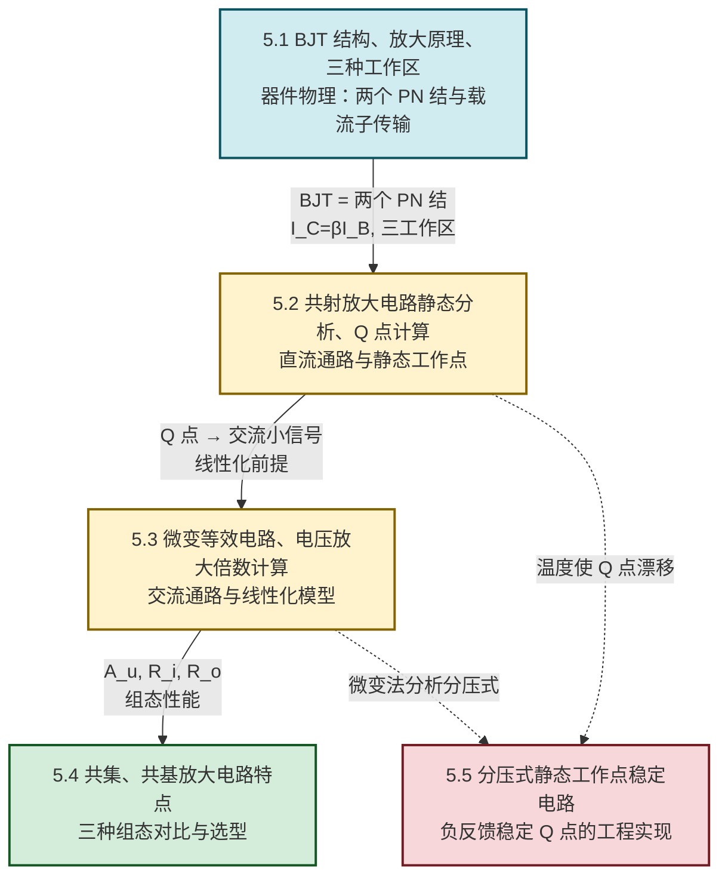

# MOC - 第5章 双极型三极管及其放大电路

> [!info] 本章定位
> 双极型三极管（Bipolar Junction Transistor, BJT）及其放大电路是模拟电子技术的**核心器件与电路起点**。本章要回答的核心问题是：**由两个 PN 结构成的三端器件，如何把微弱的输入信号放大为幅度显著增大的输出信号，并保持线性关系？**
>
> 本章在 [[MOC - 第4章|第4章 半导体二极管与稳压管]]（PN 结物理、单向导电性）基础上展开：BJT 由两个背靠背的 PN 结（发射结与集电结）构成，其放大作用来源于基区对载流子的"传输—复合"控制。本章建立的"静态工作点（Q 点）+ 微变等效电路"分析方法，是后续 [[MOC - 第6章|第6章 场效应管与 FET 放大电路]]（同属放大电路但器件不同）、[[MOC - 第7章|第7章 集成运算放大器基础]]（多级放大集成化）、[[MOC - 第8章|第8章 负反馈放大电路]]（改善放大电路性能）的共同方法论基础。
>
> 讨论范围限定于**常温（约 $300\,\text{K}$）、低频小信号**下的硅 NPN/PNP 三极管与基本放大电路组态；高频效应（结电容、密勒效应）、大信号开关特性、功率 BJT 的热设计不在本章基本范围。公式中各物理量均采用 SI 单位：电压单位为伏特（V），电流单位为安培（A），电阻单位为欧姆（$\Omega$），功率单位为瓦特（W）。

## 学习路线图

## 知识点导航

| 小节 | 标题 | 核心内容 | 关键物理量（SI 单位） |
| ---- | ---- | -------- | -------------------- |
| [[5.1 BJT 三极管结构、放大原理、三种工作区\|5.1]] | BJT 结构、放大原理、三种工作区 | NPN/PNP 结构（发射区—基区—集电区、发射结/集电结）、电流关系 $I_E=I_B+I_C$、电流放大系数 $\beta=\Delta I_C/\Delta I_B$、放大原理（发射区发射—基区复合—集电区收集）、三种工作区（截止/放大/饱和）、主要参数（$\beta$、$I_{CBO}$、$I_{CEO}$、$P_{CM}$、$I_{CM}$、$BU_{CEO}$） | 电流 $I_B,I_C,I_E$（A）、$\beta$ 无量纲、$P_{CM}$（W）、$BU_{CEO}$（V） |
| [[5.2 共射放大电路静态分析、Q 点计算\|5.2]] | 共射放大电路静态分析、Q 点计算 | 放大电路组成（三极管+偏置+耦合电容+负载）、静态与动态、直流通路画法（电容开路）、Q 点计算 $I_{BQ}=(V_{CC}-U_{BEQ})/R_b$、Q 点位置与失真（饱和/截止失真） | $I_{BQ},I_{CQ}$（A）、$U_{CEQ}$（V）、$V_{CC}$（V） |
| [[5.3 微变等效电路、电压放大倍数计算\|5.3]] | 微变等效电路、电压放大倍数计算 | 交流通路画法（电容短路、直流源短路接地）、微变等效电路（输入 $r_{be}$、输出受控源 $\beta I_b$）、$r_{be}=r_{bb'}+(1+\beta)\cdot 26\,\text{mV}/I_{EQ}$、$A_u=-\beta R_L'/r_{be}$、$R_i$、$R_o$ | $r_{be}$（$\Omega$）、$A_u$ 无量纲、$R_i,R_o$（$\Omega$） |
| [[5.4 共集、共基放大电路特点\|5.4]] | 共集、共基放大电路特点 | 共集（射极输出器：$A_u\approx1$、$R_i$ 大、$R_o$ 小，作输入/输出/缓冲级）、共基（$A_i\approx1$、$A_u$ 大、$R_i$ 小、高频好）、三种组态对比表 | $A_u,A_i$ 无量纲、$R_i,R_o$（$\Omega$） |
| [[5.5 分压式静态工作点稳定电路\|5.5]] | 分压式静态工作点稳定电路 | 温度对 Q 点影响（$\beta\uparrow$、$I_{CBO}\uparrow$、$U_{BE}\downarrow$ 均使 $I_C\uparrow$）、分压式偏置结构（$R_{b1},R_{b2},R_e$）、负反馈稳定原理、Q 点计算 $U_{BQ}\approx V_{CC}\cdot R_{b2}/(R_{b1}+R_{b2})$、动态分析 | $U_{BQ},U_{EQ}$（V）、$I_{CQ}$（A）、$R_e$（$\Omega$） |

## 核心考点

> [!summary] 本章核心考点（7 点）
> 1. **BJT 的结构与电流关系**：BJT 由发射区（E，掺杂浓度高）、基区（B，很薄且掺杂浓度低）、集电区（C，面积大）三个区构成，含发射结（BE 结）与集电结（BC 结）两个 PN 结。三个电极电流满足 $I_E=I_B+I_C$（KCL）；在放大区 $I_C=\beta I_B$，$\bar\beta\approx\beta$。NPN 与 PNP 结构对偶，电压极性与电流方向相反。详见 [[5.1 BJT 三极管结构、放大原理、三种工作区|5.1]]。
> 2. **电流放大系数的物理本质**：$\beta=\Delta I_C/\Delta I_B$（交流电流放大系数），其物理基础是基区"薄且轻掺杂"使发射区注入的多数载流子仅有少量在基区复合，绝大部分扩散到集电结被收集。基区复合电流形成 $I_B$，被收集电流形成 $I_C$，故小 $I_B$ 控制大 $I_C$。$\beta$ 通常为几十至一百多，受温度和 $I_C$ 影响。
> 3. **三种工作区的判定与偏置条件**：截止区（两结反偏，$I_B=0$，$I_C\approx0$，相当于开路开关）、放大区（发射结正偏、集电结反偏，$I_C=\beta I_B$，受控电流源特性）、饱和区（两结正偏，$U_{CE}=U_{CES}\approx0.3\,\text{V}$，$I_C<I_{CM}$ 不再受 $\beta I_B$ 控制，相当于闭合开关）。判定依据是两结偏置极性，工程中常由 $U_{CE}$ 与 $U_{BE}$ 比较：$U_{CE}>U_{BE}$ 放大、$U_{CE}<U_{BE}$ 饱和。
> 4. **共射放大电路的静态分析**：直流通路（耦合电容开路、旁路电容开路）下求 Q 点。固定偏置电路：$I_{BQ}=(V_{CC}-U_{BEQ})/R_b$，$I_{CQ}=\beta I_{BQ}$，$U_{CEQ}=V_{CC}-I_{CQ}R_c$。硅管 $U_{BEQ}\approx0.7\,\text{V}$、锗管 $\approx0.3\,\text{V}$。Q 点必须落在放大区（$U_{CEQ}>U_{CES}$ 且 $I_{BQ}>0$）。详见 [[5.2 共射放大电路静态分析、Q 点计算|5.2]]。
> 5. **微变等效电路法与电压放大倍数**：交流通路（电容短路、直流电压源短路接地）后，三极管用线性化模型替换：输入端为动态输入电阻 $r_{be}=r_{bb'}+(1+\beta)\dfrac{U_T}{I_{EQ}}$（$U_T\approx26\,\text{mV}$），输出端为受控电流源 $\beta I_b$。共射电路 $A_u=\dfrac{u_o}{u_i}=-\dfrac{\beta R_L'}{r_{be}}$（$R_L'=R_c\parallel R_L$），负号表示反相。输入电阻 $R_i=R_b\parallel r_{be}$，输出电阻 $R_o\approx R_c$。详见 [[5.3 微变等效电路、电压放大倍数计算|5.3]]。
> 6. **三种组态的对比与选型**：共射（CE）电压、电流放大均大，反相，应用最广；共集（CC，射极输出器）$A_u\approx1$ 同相、$R_i$ 大、$R_o$ 小，作输入级、输出级、缓冲级；共基（CB）$A_i\approx1$、$A_u$ 大同相、$R_i$ 小、频带宽，作高频/宽频带电路。选型依据是增益、输入/输出阻抗、频率响应三方面需求。详见 [[5.4 共集、共基放大电路特点|5.4]]。
> 7. **分压式偏置的 Q 点稳定原理**：温度升高使 $\beta\uparrow$、$I_{CBO}\uparrow$、$U_{BE}\downarrow$，三者均导致 $I_C\uparrow$。分压式偏置利用基极电位 $U_B$ 由 $R_{b1},R_{b2}$ 分压近似固定，发射极电阻 $R_e$ 引入直流负反馈：$I_C\uparrow\to U_E\uparrow\to U_{BE}\downarrow\to I_B\downarrow\to I_C\downarrow$，抑制 Q 点漂移。稳定条件：$I_1\gg I_B$（取 $I_1\ge(5\sim10)I_B$）且 $U_B\gg U_{BE}$（取 $U_B\ge(3\sim5)\,\text{V}$）。详见 [[5.5 分压式静态工作点稳定电路|5.5]]。

## 自测题

> [!question]- 自测 1：BJT 工作区判定
> 测得某 NPN 三极管三个电极对地电位：$U_B=0.7\,\text{V}$、$U_C=6\,\text{V}$、$U_E=0\,\text{V}$。判断其工作区，并说明理由。
>
> > [!check]- 答案
> > 发射结电压 $U_{BE}=U_B-U_E=0.7-0=0.7\,\text{V}>0$，正偏；集电结电压 $U_{BC}=U_B-U_C=0.7-6=-5.3\,\text{V}<0$，反偏。发射结正偏、集电结反偏→**放大区**。
> > 也可用 $U_{CE}=U_C-U_E=6\,\text{V}>U_{BE}=0.7\,\text{V}$ 判定放大区。

> [!question]- 自测 2：固定偏置电路 Q 点
> 共射固定偏置电路，$V_{CC}=12\,\text{V}$，$R_b=300\,\text{k}\Omega$，$R_c=3\,\text{k}\Omega$，硅管 $\beta=50$，$U_{BEQ}=0.7\,\text{V}$。求 Q 点并判断是否在放大区。
>
> > [!check]- 答案
> > $I_{BQ}=\dfrac{V_{CC}-U_{BEQ}}{R_b}=\dfrac{12-0.7}{300\times10^3}=\dfrac{11.3}{3\times10^5}\approx3.77\times10^{-5}\,\text{A}=37.7\,\mu\text{A}$
> > $I_{CQ}=\beta I_{BQ}=50\times37.7\,\mu\text{A}\approx1.88\,\text{mA}$
> > $U_{CEQ}=V_{CC}-I_{CQ}R_c=12-1.88\times10^{-3}\times3\times10^3=12-5.65=6.35\,\text{V}$
> > $U_{CEQ}=6.35\,\text{V}>U_{BEQ}=0.7\,\text{V}$，且 $I_{BQ}>0$，故 Q 点在**放大区**。

> [!question]- 自测 3：电压放大倍数
> 上题电路中 $r_{bb'}=200\,\Omega$，负载 $R_L=3\,\text{k}\Omega$。求 $r_{be}$、$A_u$、$R_i$、$R_o$（设 $R_b$ 很大可忽略其并联影响）。
>
> > [!check]- 答案
> > $I_{EQ}\approx I_{CQ}=1.88\,\text{mA}$
> > $r_{be}=r_{bb'}+(1+\beta)\dfrac{26\,\text{mV}}{I_{EQ}}=200+(51)\times\dfrac{26}{1.88}\approx200+705=905\,\Omega\approx0.905\,\text{k}\Omega$
> > $R_L'=R_c\parallel R_L=3\parallel3=1.5\,\text{k}\Omega$
> > $A_u=-\dfrac{\beta R_L'}{r_{be}}=-\dfrac{50\times1.5}{0.905}\approx-82.9$（负号表反相）
> > $R_i=r_{be}\approx905\,\Omega$（忽略 $R_b$），$R_o\approx R_c=3\,\text{k}\Omega$。

> [!question]- 自测 4：分压式偏置 Q 点稳定原理
> 简述温度升高时分压式偏置电路稳定 Q 点的过程，并指出两个"稳定条件"的工程取值。
>
> > [!check]- 答案
> > 温度升高→$\beta\uparrow$、$I_{CBO}\uparrow$、$U_{BE}\downarrow$→$I_C\uparrow$。分压式电路中 $U_B$ 由 $R_{b1},R_{b2}$ 分压近似固定，$I_C\uparrow\to I_E\uparrow\to U_E=I_E R_e\uparrow\to U_{BE}=U_B-U_E\downarrow\to I_B\downarrow\to I_C\downarrow$，构成直流电流负反馈，抑制 $I_C$ 增大，稳定 Q 点。
> > 两个稳定条件：
> > 1. $I_1\gg I_B$（流过分压支路的电流远大于基极电流），工程取 $I_1\ge(5\sim10)I_B$；
> > 2. $U_B\gg U_{BE}$（基极电位远大于发射结压降），工程取 $U_B\ge(3\sim5)\,\text{V}$（硅管）。
> > 但 $I_1$、$U_B$ 也不宜过大，否则 $R_{b1},R_{b2}$ 过小降低输入电阻、$R_e$ 过大减小动态范围。

## 章节导航

> [!nav] 导航
> 上级：[[MOC - 电路与模拟电子技术|课程总览]]
> 先修：[[MOC - 第4章|第4章 半导体二极管与稳压管]]（PN 结、单向导电性）
> 下一章：[[MOC - 第6章|第6章 场效应管与 FET 放大电路]]（电压控制型器件）
> 关联：[[MOC - 第7章|第7章 集成运算放大器基础]]（多级放大集成化）、[[MOC - 第8章|第8章 负反馈放大电路]]（改善放大性能）
> 配套习题：[[MOC - 第5章习题|第5章 习题]]
