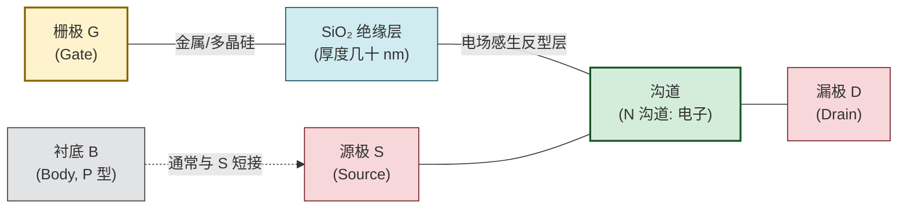
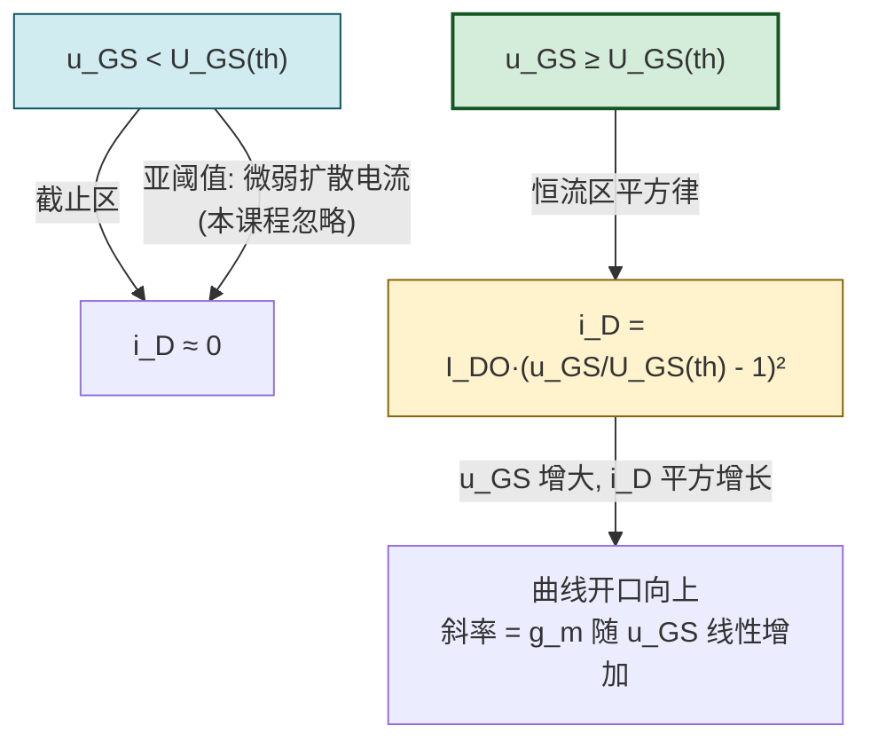
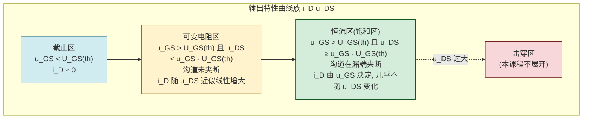

# 6.1 MOS 管结构、转移特性、输出特性

> [!info] 本节定位
> 本节是 FET 章节的**器件物理起点**，要回答的核心问题是：**MOS 管的栅极为什么能"不取电流"地控制漏极电流？两条特性曲线（转移特性与输出特性）描述了怎样的关系？放大电路为何必须工作在恒流区？** 本节建立的"阈值电压—平方律—三工作区"模型是 [[6.3 场效应管偏置电路|6.3]] 偏置计算的依据，导出的跨导 $g_m$ 是 [[6.4 FET 共源放大电路分析|6.4]] 微变等效的核心参数。
>
> 本节区分**理想平方律模型**与**实际器件特性**（含沟道长度调制、亚阈值导通、温度漂移），强调不要把恒流区公式无条件推广到可变电阻区或截止区。

## 一、MOS 管的结构

> [!definition] MOS 场效应管
> **MOS 场效应管（Metal-Oxide-Semiconductor Field Effect Transistor, MOSFET）**是以金属—氧化物—半导体三层结构命名的压控半导体器件。它通过栅极电压在半导体表面感生反型层（导电沟道），由电场控制沟道中载流子的浓度与漂移，从而控制漏极电流。按沟道载流子类型分为 **N 沟道（NMOS）** 与 **P 沟道（PMOS）** 两类。

> [!definition] MOS 管的三个电极
> - **栅极 G（Gate）**：通过 SiO₂ 绝缘层与半导体衬底隔离，输入信号加于此。因绝缘层电阻率极高（$\sim10^{15}\,\Omega$），栅极直流电流 $i_G\approx0$，这是 FET 输入阻抗极高的根源。
> - **源极 S（Source）**：沟道载流子的"发源端"。N 沟道器件中源极接低电位、提供电子；P 沟道接高电位、提供空穴。
> - **漏极 D（Drain）**：沟道载流子的"收集端"，与源极相对。N 沟道中漏极接高电位，载流子由 S 沿沟道漂移至 D。
> - **衬底 B（Body/Substrate）**：半导体本体，多数情况下与源极 S 短接，避免衬底偏置效应。本课程分析中默认 B 与 S 短接。

> [!note] NMOS 与 PMOS 结构对照
> | 项 | N 沟道 MOS 管（NMOS） | P 沟道 MOS 管（PMOS） |
> | -- | ---------------------- | ---------------------- |
> | 衬底 | P 型硅 | N 型硅 |
> | 源/漏区掺杂 | N⁺ 重掺杂（含大量电子） | P⁺ 重掺杂（含大量空穴） |
> | 多数载流子 | 电子 | 空穴 |
> | 漏极电位（导通时） | 高于源极 | 低于源极 |
> | 导电沟道类型 | 反型后为 N 型 | 反型后为 P 型 |

## 二、工作原理与阈值电压

> [!theorem] 栅压控制沟道导电能力
> 以 N 沟道增强型 MOS 管为例（衬底 P 型，源/漏 N⁺），漏源间接正电压 $u_{DS}>0$：
> 1. **$u_{GS}=0$**：栅极下无电场，P 型衬底表面无电子积累，S 与 D 之间是两个背靠背的 PN 结（N⁺-P-N⁺），无论 $u_{DS}$ 极性如何，总有一个 PN 结反偏，$i_D\approx0$，**无沟道、不导通**。
> 2. **$0<u_{GS}<U_{GS(th)}$**：栅极正电压在氧化层中产生由栅指向衬底的电场，吸引衬底少子电子至表面，同时排斥多子空穴。但电子浓度仍不足以形成导电层，$i_D$ 仍近似为零，处于**截止区**（含亚阈值区，本课程忽略）。
> 3. **$u_{GS}\ge U_{GS(th)}$**：表面电子浓度超过空穴浓度，半导体类型由 P "反型"为 N，形成连通源漏的 **N 型反型层（导电沟道）**。$u_{GS}$ 越大，沟道反型层越厚、载流子越多，沟道电阻越小，$i_D$ 越大。

> [!definition] 阈值电压
> **阈值电压 $U_{GS(th)}$（threshold voltage）**是使半导体表面刚好形成强反型层、产生导电沟道所需的栅源电压。N 沟道增强型 $U_{GS(th)}>0$，典型值 $1\sim3\,\text{V}$；P 沟道增强型 $U_{GS(th)}<0$。
>
> $U_{GS(th)}$ 与以下因素相关：
> - **氧化层厚度**：越厚，相同 $u_{GS}$ 下电场越弱，$U_{GS(th)}$ 越大；
> - **衬底掺杂浓度**：掺杂越浓，反型所需电场越强，$U_{GS(th)}$ 越大；
> - **氧化层界面电荷**：界面正电荷会降低 NMOS 的 $U_{GS(th)}$；
> - **温度**：温度升高时本征载流子浓度上升、费米能级移动，$U_{GS(th)}$ 减小（负温度系数，约 $-2\sim-6\,\text{mV}/^\circ\text{C}$）。

> [!warning] 不要把"截止"等同于"完全开路"
> $u_{GS}<U_{GS(th)}$ 时存在微弱的**亚阈值电流**（扩散电流），约 $\mu\text{A}$ 以下量级，随 $u_{GS}$ 指数变化。本课程在工程估算中视为零，但在低功耗、低泄漏电路设计中不可忽略。截止区的"截止"是工程近似而非物理绝对。

## 三、转移特性曲线

> [!definition] 转移特性
> **转移特性（transfer characteristic）**是漏源电压 $u_{DS}$ 恒定时，漏极电流 $i_D$ 与栅源电压 $u_{GS}$ 的关系曲线：
> $$i_D=f(u_{GS})\big|_{u_{DS}=\text{const}}$$
> 它直接反映栅压对漏流的"压控"能力，曲线斜率即跨导 $g_m$。

> [!theorem] 恒流区转移特性方程（增强型 MOS 管）
> 在恒流区内，增强型 N 沟道 MOS 管的转移特性近似服从**平方律**：
> $$\boxed{\,i_D=I_{DO}\left(\dfrac{u_{GS}}{U_{GS(th)}}-1\right)^2,\quad u_{GS}>U_{GS(th)}\,}\quad(\text{A})$$
> 其中：
> - $I_{DO}$ 为 $u_{GS}=2U_{GS(th)}$ 时的漏极电流（A），由器件工艺决定；
> - $U_{GS(th)}$ 为阈值电压（V）；
> - 适用条件：恒流区，即 $u_{DS}\ge u_{GS}-U_{GS(th)}$。

> [!proof] 平方律的物理来源
> 沟道反型层电荷面密度 $Q_n\propto(u_{GS}-U_{GS(th)})$（强反型近似），漏极电流 $i_D$ 正比于沟道电荷与漂移速度之积。在低纵向电场（速度未饱和）下，可推得 $i_D\propto(u_{GS}-U_{GS(th)})^2$，即平方律。该推导忽略了迁移率退化、速度饱和、沟道长度调制等二阶效应，仅对长沟道、低电场器件有效。

> [!theorem] 跨导的定义与计算
> **跨导 $g_m$（transconductance）**定义为漏源电压 $u_{DS}$ 恒定时，漏极电流微变量与栅源电压微变量之比：
> $$g_m=\dfrac{\partial i_D}{\partial u_{GS}}\bigg|_{u_{DS}=\text{const}}\quad(\text{S})$$
> 对增强型 MOS 管恒流区：
> $$g_m=\dfrac{2I_{DO}}{U_{GS(th)}}\left(\dfrac{u_{GS}}{U_{GS(th)}}-1\right)=\dfrac{2}{U_{GS(th)}}\sqrt{I_{DO}\cdot i_D}$$
> $g_m$ 与工作点电流 $i_D$ 的平方根成正比，是 [[6.4 FET 共源放大电路分析|6.4]] 微变等效的核心参数。

## 四、输出特性曲线

> [!definition] 输出特性
> **输出特性（output characteristic）**是栅源电压 $u_{GS}$ 取不同定值时，漏极电流 $i_D$ 与漏源电压 $u_{DS}$ 的关系曲线族：
> $$i_D=f(u_{DS})\big|_{u_{GS}=\text{const}}$$
> 输出特性划分为**截止区、可变电阻区、恒流区**三个工作区，外加击穿区（不在本课程范围）。

> [!theorem] 三个工作区的判定条件与电流方程
> 设 $U_{GS(th)}$ 为阈值电压，预夹断电压 $u_{DS(\text{预})}=u_{GS}-U_{GS(th)}$：
>
> | 工作区 | 判定条件（N 沟道增强型） | $i_D$ 近似方程 | 特征 |
> | ------ | ------------------------ | -------------- | ---- |
> | 截止区 | $u_{GS}<U_{GS(th)}$ | $i_D\approx0$ | 无沟道，D-S 相当于开路 |
> | 可变电阻区 | $u_{GS}>U_{GS(th)}$ 且 $u_{DS}<u_{GS}-U_{GS(th)}$ | $i_D=I_{DO}\left[2\left(\dfrac{u_{GS}}{U_{GS(th)}}-1\right)\dfrac{u_{DS}}{U_{GS(th)}}-\left(\dfrac{u_{DS}}{U_{GS(th)}}\right)^2\right]$（工程上简化为 $i_D\approx K[2(u_{GS}-U_{GS(th)})u_{DS}-u_{DS}^2]$） | 沟道未夹断，D-S 间为受控电阻 |
> | 恒流区（饱和区） | $u_{GS}>U_{GS(th)}$ 且 $u_{DS}\ge u_{GS}-U_{GS(th)}$ | $i_D=I_{DO}\left(\dfrac{u_{GS}}{U_{GS(th)}}-1\right)^2$ | 沟道漏端夹断，$i_D$ 几乎与 $u_{DS}$ 无关 |

> [!proof] 沟道夹断与恒流的物理机制
> 漏极接正电压 $u_{DS}$ 时，沿沟道由源到漏电位逐渐升高，栅—衬底间有效电压 $u_{GS}-u(x)$ 逐渐减小（$u(x)$ 为沟道中 $x$ 处电位）。在漏端 $u(x)=u_{DS}$，有效电压最小为 $u_{GS}-u_{DS}$。当 $u_{DS}$ 增大到 $u_{GS}-U_{GS(th)}$ 时，漏端有效电压恰好为 $U_{GS(th)}$，沟道在漏端"夹断"。继续增大 $u_{DS}$，夹断点向源端移动，多余电压降落在夹断区的高阻耗尽层上，沟道电场几乎不变，故 $i_D$ 趋于饱和——这就是恒流区的物理本质。

> [!warning] 三个工作区的常见混淆
> 1. **"恒流区"与"饱和区"**：FET 中二者是同义词（$i_D$ 饱和），但 BJT 的"饱和区"指 $u_{CE}$ 很小、两结都正偏的低电压大电流区，含义完全不同，不要跨器件混用术语。
> 2. **预夹断电压与阈值电压**：阈值电压 $U_{GS(th)}$ 是栅源电压（沟道形成条件），预夹断电压 $u_{GS}-U_{GS(th)}$ 是漏源电压（沟道夹断条件），二者量纲相同但物理意义不同。
> 3. **可变电阻区不是"截止"**：可变电阻区沟道已存在，$i_D$ 不为零，只是受 $u_{DS}$ 影响大；常用于模拟开关与压控电阻。
> 4. **恒流区曲线并非严格水平**：实际器件因沟道长度调制效应，$i_D$ 随 $u_{DS}$ 略有上升，对应输出电阻 $r_{ds}$ 为有限值；本课程小信号分析中常忽略。

## 五、典型例题

### 例题 1：工作区判定

> [!example] 题目
> N 沟道增强型 MOS 管 $U_{GS(th)}=2\,\text{V}$，分别判断下列三种情况的工作区：
> (a) $u_{GS}=1\,\text{V}$，$u_{DS}=5\,\text{V}$；
> (b) $u_{GS}=4\,\text{V}$，$u_{DS}=1\,\text{V}$；
> (c) $u_{GS}=4\,\text{V}$，$u_{DS}=5\,\text{V}$。

**解**：预夹断电压 $u_{DS(\text{预})}=u_{GS}-U_{GS(th)}$。
- (a) $u_{GS}=1\,\text{V}<U_{GS(th)}=2\,\text{V}$，**截止区**，$i_D\approx0$。
- (b) $u_{GS}=4\,\text{V}>2\,\text{V}$，预夹断电压 $u_{DS(\text{预})}=4-2=2\,\text{V}$；$u_{DS}=1\,\text{V}<2\,\text{V}$，沟道未夹断，**可变电阻区**。
- (c) $u_{GS}=4\,\text{V}>2\,\text{V}$，预夹断电压 $2\,\text{V}$；$u_{DS}=5\,\text{V}>2\,\text{V}$，沟道夹断，**恒流区**（饱和区）。

> [!note] 工程意义
> 放大电路要求 FET 工作于恒流区，故设计偏置时必须保证 $u_{DSQ}>u_{GSQ}-U_{GS(th)}$，且对信号摆幅留有裕量（避免进入可变电阻区产生非线性失真）。

### 例题 2：恒流区电流与跨导计算

> [!example] 题目
> N 沟道增强型 MOS 管 $U_{GS(th)}=2\,\text{V}$，$I_{DO}=8\,\text{mA}$。已知工作点 $U_{GSQ}=3\,\text{V}$，工作于恒流区。求 $I_{DQ}$ 与工作点跨导 $g_m$。

**解**：
$$I_{DQ}=I_{DO}\left(\dfrac{U_{GSQ}}{U_{GS(th)}}-1\right)^2=8\,\text{mA}\times\left(\dfrac{3}{2}-1\right)^2=8\times0.25=2\,\text{mA}$$
$$g_m=\dfrac{2I_{DO}}{U_{GS(th)}}\left(\dfrac{U_{GSQ}}{U_{GS(th)}}-1\right)=\dfrac{2\times8\,\text{mA}}{2\,\text{V}}\times0.5=\dfrac{16}{2}\times0.5\,\text{mS}=4\,\text{mS}$$

**单位检验**：$\text{mA}/\text{V}=\text{mS}$，正确。该 $g_m$ 将用于 [[6.4 FET 共源放大电路分析|6.4]] 计算 $A_u=-g_m R_L'$。

### 例题 3：由特性曲线估算 $U_{GS(th)}$ 与 $I_{DO}$

> [!example] 题目
> 某增强型 NMOS 在恒流区测得：$u_{GS}=3\,\text{V}$ 时 $i_D=1\,\text{mA}$；$u_{GS}=4\,\text{V}$ 时 $i_D=4\,\text{mA}$。估算 $U_{GS(th)}$ 与 $I_{DO}$。

**解**：设 $U_{GS(th)}=U_t$，由平方律
$$\dfrac{i_{D1}}{i_{D2}}=\dfrac{(3/U_t-1)^2}{(4/U_t-1)^2}=\dfrac{1}{4}$$
取平方根（$u_{GS}>U_t$ 故括号内为正）：
$$\dfrac{3/U_t-1}{4/U_t-1}=\dfrac{1}{2}\Rightarrow 2(3-U_t)=4-U_t\Rightarrow 6-2U_t=4-U_t\Rightarrow U_t=2\,\text{V}$$
$$I_{DO}=\dfrac{i_{D2}}{(4/2-1)^2}=\dfrac{4\,\text{mA}}{1}=4\,\text{mA}$$

**单位检验**：$U_{GS(th)}$ 单位 V；$I_{DO}$ 单位 A（mA），自洽。

## 六、易错点

> [!warning] 易错点
> 1. **阈值电压正负号**：N 沟道增强型 $U_{GS(th)}>0$，P 沟道增强型 $U_{GS(th)}<0$；耗尽型用夹断电压 $U_{GS(off)}$，符号与增强型相反（详见 [[6.2 增强型、耗尽型 MOS 管区别|6.2]]）。
> 2. **转移特性与输出特性混淆**：转移特性是 $i_D$-$u_{GS}$（恒 $u_{DS}$），输出特性是 $i_D$-$u_{DS}$（恒 $u_{GS}$）曲线族；前者反映"压控"能力，后者反映工作区。
> 3. **平方律适用范围**：$i_D=I_{DO}(u_{GS}/U_{GS(th)}-1)^2$ 仅在**恒流区**成立；用于截止区会得虚值（负值），用于可变电阻区会高估 $i_D$。
> 4. **预夹断条件判定方向**：恒流区要求 $u_{DS}\ge u_{GS}-U_{GS(th)}$，不是 $u_{DS}>U_{GS(th)}$。常见错误是用 $U_{GS(th)}$ 代替 $u_{GS}-U_{GS(th)}$ 判定。
> 5. **$g_m$ 与 $i_D$ 的关系**：$g_m\propto\sqrt{i_D}$，故增大 $I_{DQ}$ 可提升增益，但功耗也增大；BJT 的 $g_m=I_C/U_T\propto I_C$ 是线性关系，二者增长规律不同。
> 6. **把"恒流区"理解为电流绝对恒定**：恒流区只是 $i_D$ 对 $u_{DS}$ 不敏感，仍由 $u_{GS}$ 决定；$r_{ds}$ 有限，大信号下 $i_D$ 仍随 $u_{DS}$ 缓慢上升。

## 七、与其他小节的联系

- 本节的平方律转移特性是 [[6.2 增强型、耗尽型 MOS 管区别|6.2]] 区分四种 MOS 管类型、推导耗尽型电流方程的基础；
- 本节的恒流区条件与跨导 $g_m$ 是 [[6.3 场效应管偏置电路|6.3]] 设计偏置、计算 Q 点的依据；
- 本节导出的 $g_m$ 直接用于 [[6.4 FET 共源放大电路分析|6.4]] 微变等效电路与电压放大倍数计算；
- 本节的器件结构与 [[MOC - 第5章|第5章]] BJT 形成对照：BJT 由两个 PN 结构成、电流控制，FET 由 MOS 结构构成、电压控制；
- 本章 MOC：[[MOC - 第6章]]。

## 章节导航

- 上一级：[[MOC - 第6章]]
- 先修：[[MOC - 第5章]]（BJT 工作区与放大电路方法论）
- 下一节：[[6.2 增强型、耗尽型 MOS 管区别]]
- 习题：[[MOC - 第6章习题]]
