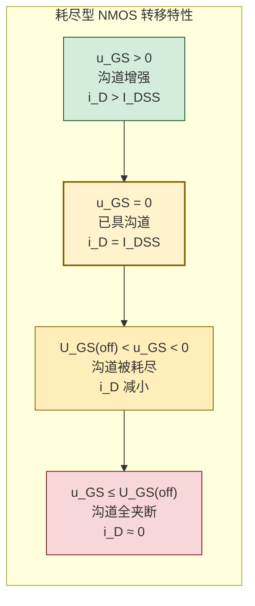
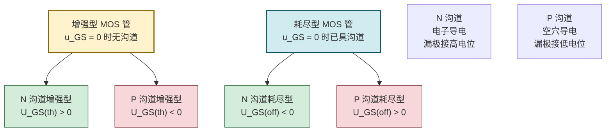

# 6.2 增强型、耗尽型 MOS 管区别

> [!info] 本节定位
> 本节在 [[6.1 MOS 管结构、转移特性、输出特性|6.1]] 单一 NMOS 增强型基础上扩展为**四类 MOS 管的全景对比**，要回答的核心问题是：**制造时已"预制"沟道与"现做"沟道有何差别？N 沟道与 P 沟道为何电源极性相反？除了 MOS 管还有哪些 FET？** 理清这四类器件的电压极性与电流方向，是 [[6.3 场效应管偏置电路|6.3]] 选型偏置、[[6.4 FET 共源放大电路分析|6.4]] 分析电路的先决条件。
>
> 本节强调**不同类型 MOS 管的电压极性与方程形式不可互相套用**，使用前必须确认器件类型。

## 一、增强型 MOS 管

> [!definition] 增强型 MOS 管
> **增强型 MOS 管（enhancement-mode MOSFET, E-MOSFET）**是指在 $u_{GS}=0$ 时**无导电沟道**、必须依靠栅极电压感生反型层才能导通的 MOS 管。其特点是"栅压增强才导通"，是数字集成电路（CMOS）的主流器件。

> [!theorem] 增强型 MOS 管的偏置要求
> - **N 沟道增强型**：$U_{GS(th)}>0$，需 $u_{GS}>U_{GS(th)}>0$ 才形成 N 型沟道；漏极接正电位，$i_D$ 由 D 流向 S（电子由 S 流向 D）。
> - **P 沟道增强型**：$U_{GS(th)}<0$，需 $u_{GS}<U_{GS(th)}<0$ 才形成 P 型沟道；漏极接负电位（相对源极），$i_D$ 由 S 流向 D（空穴由 S 流向 D，电流方向与空穴运动方向相同）。

> [!theorem] 增强型恒流区电流方程（重温）
> 增强型 MOS 管恒流区电流方程（[[6.1 MOS 管结构、转移特性、输出特性|6.1]]）：
> $$i_D=I_{DO}\left(\dfrac{u_{GS}}{U_{GS(th)}}-1\right)^2,\quad |u_{GS}|>|U_{GS(th)}|$$
> N 沟道取 $u_{GS}>U_{GS(th)}>0$；P 沟道取 $u_{GS}<U_{GS(th)}<0$，$i_D$ 方向规定为由 D 流出（与 NMOS 相反）。

## 二、耗尽型 MOS 管

> [!definition] 耗尽型 MOS 管
> **耗尽型 MOS 管（depletion-mode MOSFET, D-MOSFET）**是指在制造时通过工艺**预先在栅极氧化层下形成导电沟道**（如离子注入），使得 $u_{GS}=0$ 时已存在沟道、漏极电流 $i_D=I_{DSS}\ne0$ 的 MOS 管。栅极加反向电压可"耗尽"沟道载流子使 $i_D$ 减小；加同向电压则增强沟道使 $i_D$ 增大。

> [!definition] 夹断电压与饱和漏极电流
> - **夹断电压 $U_{GS(off)}$（pinch-off voltage）**：使耗尽型 MOS 管沟道完全耗尽、漏极电流减小到零所需的栅源电压。N 沟道耗尽型 $U_{GS(off)}<0$；P 沟道 $U_{GS(off)}>0$。
> - **饱和漏极电流 $I_{DSS}$（drain current at zero gate voltage）**：$u_{GS}=0$ 且工作于恒流区时的漏极电流，是耗尽型 MOS 管的特征参数。

> [!theorem] 耗尽型恒流区电流方程
> 耗尽型 MOS 管恒流区电流方程（与 JFET 同形式）：
> $$\boxed{\,i_D=I_{DSS}\left(1-\dfrac{u_{GS}}{U_{GS(off)}}\right)^2,\quad U_{GS(off)}<u_{GS}<0\,}\quad(\text{N 沟道})$$
> P 沟道则 $0<u_{GS}<U_{GS(off)}$，电流方向相反。
>
> 工作点跨导：
> $$g_m=\dfrac{\partial i_D}{\partial u_{GS}}=-\dfrac{2I_{DSS}}{U_{GS(off)}}\left(1-\dfrac{u_{GS}}{U_{GS(off)}}\right)=\dfrac{2}{|U_{GS(off)}|}\sqrt{I_{DSS}\cdot i_D}$$

> [!proof] 耗尽型方程与增强型方程的统一
> 令 $U_{GS(off)}=-U_{GS(th)}'$（耗尽型夹断电压的负值即"等效阈值电压"）、$I_{DSS}=I_{DO}'$（因 $u_{GS}=0$ 时 $1-0/U_{GS(off)}=1$，故 $i_D=I_{DSS}$），则耗尽型方程化为 $i_D=I_{DO}'(1+u_{GS}/U_{GS(th)}')^2=I_{DO}'(u_{GS}/U_{GS(th)}'-(-1))^2$，与增强型 $i_D=I_{DO}(u_{GS}/U_{GS(th)}-1)^2$ 形式一致。说明二者物理本质相同，仅沟道"预制与否"导致零栅压时是否导通不同。

> [!warning] 耗尽型方程的适用区间
> 1. $u_{GS}$ 必须在 $U_{GS(off)}$ 与零之间（N 沟道），超出此范围（如 $u_{GS}>0$）沟道进一步增强，方程仍近似成立但 $I_{DSS}$ 不再是上界；
> 2. $u_{GS}<U_{GS(off)}$ 时沟道完全夹断，$i_D\approx0$，方程给出虚值，不能代入；
> 3. 恒流区条件仍要求 $u_{DS}\ge u_{GS}-U_{GS(off)}$（耗尽型预夹断电压用 $U_{GS(off)}$ 替代 $-U_{GS(th)}$）。

## 三、N 沟道与 P 沟道的区别

> [!theorem] 电源极性相反原则
> N 沟道与 P 沟道 MOS 管在结构、载流子、电压极性、电流方向上完全对称相反：
>
> | 对比项 | N 沟道 MOS 管 | P 沟道 MOS 管 |
> | ------ | ------------- | ------------- |
> | 衬底类型 | P 型 | N 型 |
> | 沟道载流子 | 电子 | 空穴 |
> | 漏极电源 $U_{DD}$ 极性 | 正（相对源极） | 负（相对源极） |
> | $i_D$ 规定方向 | 流入漏极 | 流出漏极 |
> | 增强型 $U_{GS(th)}$ | 正 | 负 |
> | 增强型导通条件 | $u_{GS}>U_{GS(th)}>0$ | $u_{GS}<U_{GS(th)}<0$ |
> | 耗尽型 $U_{GS(off)}$ | 负 | 正 |
> | 耗尽型截止条件 | $u_{GS}<U_{GS(off)}<0$ | $u_{GS}>U_{GS(off)}>0$ |

> [!note] 电路分析中的极性判别捷径
> - 看衬底箭头：NMOS 衬底箭头指向沟道（P→N），PMOS 箭头反向；
> - 看隔离二极管：NMOS 漏极接高电位，PMOS 漏极接低电位；
> - N 沟道管 $u_{GS}$、$u_{DS}$ 与 $i_D$ 同向（同号）；P 沟道管三者异号。这是检查偏置电路正确性的快速判据。

## 四、四种 MOS 管类型对比

> [!summary] 四种 MOS 管完整对比表
> | 类型 | 衬底 | 沟道载流子 | $U_{GS(th)}$ / $U_{GS(off)}$ | $u_{GS}=0$ 时 | 转移特性曲线位置 | 典型应用 |
> | ---- | ---- | --------- | --------------------------- | ------------- | --------------- | -------- |
> | N 沟道增强型 | P 型 | 电子 | $U_{GS(th)}>0$ | 截止，$i_D=0$ | 第一象限 | CMOS 数字电路主流 |
> | P 沟道增强型 | N 型 | 空穴 | $U_{GS(th)}<0$ | 截止，$i_D=0$ | 第三象限 | CMOS 互补管 |
> | N 沟道耗尽型 | P 型 | 电子 | $U_{GS(off)}<0$ | 导通，$i_D=I_{DSS}$ | 第一、四象限 | 高频、低噪声放大 |
> | P 沟道耗尽型 | N 型 | 空穴 | $U_{GS(off)}>0$ | 导通，$i_D=I_{DSS}$ | 第二、三象限 | 模拟开关、电流源 |

> [!warning] 类型识别的关键符号
> - **增强型**：转移特性曲线不过原点（$u_{GS}=0$ 时 $i_D=0$）；
> - **耗尽型**：转移特性曲线过原点且 $i_D=I_{DSS}$；
> - **N 沟道**：$u_{GS}$ 增大 $i_D$ 增大（曲线开口向 $u_{GS}$ 正方向）；
> - **P 沟道**：$u_{GS}$ 减小（更负）$i_D$ 增大（曲线开口向 $u_{GS}$ 负方向）。
>
> 电路符号中衬底箭头方向也区分 N/P 沟道：箭头指向沟道为 NMOS，背离为 PMOS；增强型符号沟道为虚线，耗尽型为实线。

## 五、JFET 结型场效应管简介

> [!definition] 结型场效应管
> **结型场效应管（Junction FET, JFET）**是另一种压控器件，利用反偏 PN 结的耗尽层宽度来调控导电沟道的截面积，从而控制漏极电流。结构上以 N 沟道 JFET 为例：在一块 N 型半导体两端做源极 S 和漏极 D，两侧各做一个 P⁺ 区作为栅极 G，形成两个 PN 结。工作时 PN 结反偏，反偏电压越高，耗尽层越宽、沟道越窄，$i_D$ 越小。

> [!theorem] JFET 的特性与方程
> JFET 与耗尽型 MOS 管的电流方程同形式：
> $$i_D=I_{DSS}\left(1-\dfrac{u_{GS}}{U_{GS(off)}}\right)^2$$
> - JFET 只能工作在**耗尽模式**（栅源 PN 结反偏），$u_{GS}$ 极性使 PN 结反偏，不能正偏（否则栅极取电流、失去高阻输入特性）；
> - N 沟道 JFET：$U_{GS(off)}<0$，$u_{GS}\le0$；
> - P 沟道 JFET：$U_{GS(off)}>0$，$u_{GS}\ge0$。

> [!note] JFET 与 MOS 管对比
> | 项 | JFET | MOS 管 |
> | -- | ---- | ----- |
> | 栅极隔离 | 反偏 PN 结 | SiO₂ 绝缘层 |
> | 输入阻抗 | 高（$\sim10^8\,\Omega$） | 极高（$\sim10^{15}\,\Omega$） |
> | 工作模式 | 仅耗尽型 | 增强型 + 耗尽型 |
> | 栅极电压极性 | 必须使 PN 结反偏 | 可正可负（视类型） |
> | 集成工艺 | 不利于大规模集成 | CMOS 主流 |
> | 噪声 | 极低（用于低噪声前放） | 较低 |
>
> 本课程以 MOS 管为核心，JFET 仅作了解，偏置与放大分析方法与 MOS 管相同。

## 六、典型例题

### 例题 1：识别 MOS 管类型

> [!example] 题目
> 测得某 MOS 管在 $u_{GS}=0$ 时 $i_D=8\,\text{mA}$（恒流区）；$u_{GS}=-2\,\text{V}$ 时 $i_D=2\,\text{mA}$；$u_{GS}=-4\,\text{V}$ 时 $i_D\approx0$。判断该 MOS 管的类型，并求 $I_{DSS}$、$U_{GS(off)}$。

**解**：
- $u_{GS}=0$ 时 $i_D=I_{DSS}=8\,\text{mA}\ne0$，属**耗尽型**；
- $u_{GS}$ 越负 $i_D$ 越小，沟道随负栅压耗尽，属 **N 沟道**（$U_{GS(off)}<0$）；
- $u_{GS}=-4\,\text{V}$ 时 $i_D\approx0$，故 $U_{GS(off)}\approx-4\,\text{V}$。

校核 $u_{GS}=-2\,\text{V}$：
$$i_D=I_{DSS}\left(1-\dfrac{u_{GS}}{U_{GS(off)}}\right)^2=8\,\text{mA}\times\left(1-\dfrac{-2}{-4}\right)^2=8\times0.25=2\,\text{mA}$$
与测量值一致，故 **N 沟道耗尽型 MOS 管**，$I_{DSS}=8\,\text{mA}$，$U_{GS(off)}=-4\,\text{V}$。

**单位检验**：电流 mA，电压 V，自洽。

### 例题 2：P 沟道增强型 MOS 管工作点估算

> [!example] 题目
> P 沟道增强型 MOS 管 $U_{GS(th)}=-2\,\text{V}$，$I_{DO}=4\,\text{mA}$（$u_{GS}=2U_{GS(th)}=-4\,\text{V}$ 时 $i_D=4\,\text{mA}$）。工作点 $U_{GSQ}=-3\,\text{V}$（恒流区）。求 $I_{DQ}$ 与 $g_m$。

**解**：
$$I_{DQ}=I_{DO}\left(\dfrac{U_{GSQ}}{U_{GS(th)}}-1\right)^2=4\,\text{mA}\times\left(\dfrac{-3}{-2}-1\right)^2=4\times0.25=1\,\text{mA}$$
（方向：流出漏极）
$$g_m=\dfrac{2I_{DO}}{|U_{GS(th)}|}\left(\dfrac{|U_{GSQ}|}{|U_{GS(th)}|}-1\right)=\dfrac{2\times4}{2}\times0.5=2\,\text{mS}$$

> [!note] P 沟道分析的简化
> 实际计算中常取绝对值后按 N 沟道公式处理，最后按电流方向（流出漏极）标注结果。但写 KVL、KCL 时必须保留实际极性，避免符号错误。

### 例题 3：耗尽型与增强型混用电路分析

> [!example] 题目
> 电路中两只 MOS 管特性如下：
> - $T_1$：N 沟道增强型，$U_{GS(th)}=2\,\text{V}$，$I_{DO}=4\,\text{mA}$；
> - $T_2$：N 沟道耗尽型，$I_{DSS}=8\,\text{mA}$，$U_{GS(off)}=-4\,\text{V}$。
>
> 若二者均工作在恒流区且 $I_{DQ}=2\,\text{mA}$，求各自的 $U_{GSQ}$。

**解**：
- $T_1$（增强型）：
$$I_{DQ}=I_{DO}\left(\dfrac{U_{GSQ}}{U_{GS(th)}}-1\right)^2\Rightarrow 2=4\left(\dfrac{U_{GSQ}}{2}-1\right)^2$$
$$\left(\dfrac{U_{GSQ}}{2}-1\right)^2=0.5\Rightarrow \dfrac{U_{GSQ}}{2}-1=\sqrt{0.5}\approx0.707\Rightarrow U_{GSQ}\approx2(1+0.707)\approx3.41\,\text{V}$$
- $T_2$（耗尽型）：
$$2=8\left(1-\dfrac{U_{GSQ}}{-4}\right)^2\Rightarrow\left(1+\dfrac{U_{GSQ}}{4}\right)^2=0.25\Rightarrow 1+\dfrac{U_{GSQ}}{4}=\pm0.5$$
取正根（沟道未夹断）：$U_{GSQ}=4(0.5-1)=-2\,\text{V}$。

**单位检验**：电压 V，自洽。结论：在相同 $I_{DQ}$ 下，增强型需正栅压、耗尽型需负栅压，正体现了二者的本质差别。

## 七、易错点

> [!warning] 易错点
> 1. **增强型与耗尽型符号混淆**：增强型用 $U_{GS(th)}$（阈值电压），耗尽型用 $U_{GS(off)}$（夹断电压），二者量纲相同但物理意义与方程形式不同，不可互换。
> 2. **$I_{DO}$ 与 $I_{DSS}$ 混淆**：$I_{DO}$ 是增强型 $u_{GS}=2U_{GS(th)}$ 时的电流；$I_{DSS}$ 是耗尽型 $u_{GS}=0$ 时的电流。代入方程前必须确认器件类型与对应参数。
> 3. **P 沟道电压方向**：P 沟道 $u_{GS}$、$u_{DS}$、$i_D$ 全部与 N 沟道反号；列 KVL 时若按 N 沟道习惯，需统一加负号或全部取绝对值。
> 4. **耗尽型 $u_{GS}>0$ 误判**：N 沟道耗尽型允许 $u_{GS}>0$（沟道进一步增强），不会正偏 PN 结（绝缘栅无 PN 结）；这与 JFET 不同，JFET 不可正偏。
> 5. **电路符号识别错误**：增强型沟道为虚线、耗尽型为实线；衬底箭头指向沟道为 NMOS、背离为 PMOS。做题时务必先看符号定类型。
> 6. **JFET 当作 MOS 管**：JFET 栅极是反偏 PN 结，输入阻抗比 MOS 管低数个量级，且只工作于耗尽模式，不能套用增强型方程。

## 八、与其他小节的联系

- 本节建立在 [[6.1 MOS 管结构、转移特性、输出特性|6.1]] 单一器件模型基础上，扩展为四类 MOS 管全景；
- 本节的类型与极性判别是 [[6.3 场效应管偏置电路|6.3]] 选偏置电路（自给偏压仅适用耗尽型）的依据；
- 本节导出的耗尽型电流方程用于 [[6.4 FET 共源放大电路分析|6.4]] 中 $g_m$ 计算与 Q 点分析；
- 本节 JFET 简介为后续低噪声放大、模拟集成电路学习留接口；
- 本章 MOC：[[MOC - 第6章]]。

## 章节导航

- 上一级：[[MOC - 第6章]]
- 上一节：[[6.1 MOS 管结构、转移特性、输出特性]]
- 下一节：[[6.3 场效应管偏置电路]]
- 习题：[[MOC - 第6章习题]]
