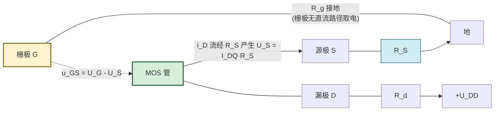
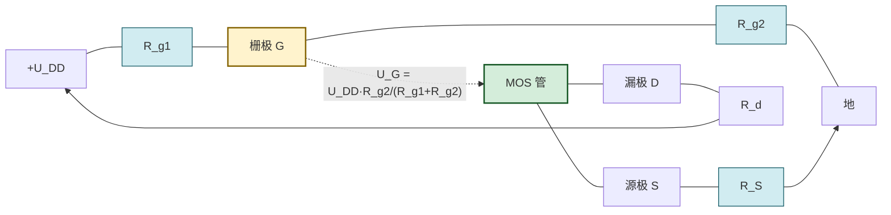

# 6.3 场效应管偏置电路

> [!info] 本节定位
> 本节要回答的核心问题是：**场效应管工作时如何用外电路建立稳定的静态工作点 Q（$U_{GSQ}$、$I_{DQ}$、$U_{DSQ}$），使其落在恒流区内并对温度与器件参数离散不敏感？** 偏置电路是把 [[6.1 MOS 管结构、转移特性、输出特性|6.1]] 转移特性方程落到工程电路的桥梁，Q 点确定后才能计算跨导 $g_m$、进而分析 [[6.4 FET 共源放大电路分析|6.4]] 的动态指标。
>
> 本节强调 FET 偏置**只关心栅极电压、不需栅极电流**这一与 BJT 截然不同的特性，以及自给偏压与分压式偏置的适用范围差异。

## 一、场效应管偏置的特点

> [!theorem] FET 偏置与 BJT 偏置的根本区别
> | 项 | BJT | FET |
> | -- | --- | --- |
> | 控制方式 | 电流控制（$i_B$ 控制 $i_C$） | 电压控制（$u_{GS}$ 控制 $i_D$） |
> | 偏置对象 | 基极电流 $I_{BQ}$ | 栅源电压 $U_{GSQ}$ |
> | 栅/基极电流 | $I_B=I_C/\beta$，不可忽略 | $i_G\approx0$，偏置网络几乎不取电流 |
> | 偏置网络设计 | 需提供稳定 $I_B$，并补偿 $\beta$ 与 $U_{BE}$ 温漂 | 只需提供稳定 $U_{GS}$，并补偿 $U_{GS(th)}$、$I_{DSS}$ 温漂 |
> | Q 点稳定机制 | 分压式偏置 + 发射极 $R_E$ 负反馈 | 分压式偏置 + 源极 $R_S$ 负反馈 |

> [!note] FET 偏置的两条原则
> 1. **栅极不取电流**：栅极偏置电阻可以取得很大（MΩ 级）以保持高输入阻抗，不影响栅极电位；
> 2. **栅源电压 $U_{GSQ}$ 必须使器件工作在恒流区**：增强型 $U_{GSQ}>U_{GS(th)}$ 且 $U_{DSQ}>U_{GSQ}-U_{GS(th)}$；耗尽型 $U_{GSQ}>U_{GS(off)}$ 且 $U_{DSQ}>U_{GSQ}-U_{GS(off)}$。

> [!warning] FET 参数离散性比 BJT 更严重
> 同型号 MOS 管的 $U_{GS(th)}$、$I_{DO}$、$I_{DSS}$ 在不同批次间可能相差数倍，因此偏置电路**必须依赖负反馈（$R_S$）**而非依赖器件参数定值。这与 [[MOC - 第5章|第5章]] 分压式偏置稳定 BJT Q 点的思路一致，但 FET 对此更为依赖。

## 二、自给偏压电路

> [!definition] 自给偏压电路
> **自给偏压电路（self-bias circuit）**是利用源极电阻 $R_S$ 上漏极电流产生的压降，自动为栅源间提供所需偏压的电路。其典型结构（N 沟道耗尽型 MOS 管或 JFET）：

> [!theorem] 自给偏压的工作原理
> 栅极经 $R_g$ 接地，因 $i_G\approx0$，$R_g$ 上无压降，栅极直流电位 $U_G=0$。
> 漏极电流 $I_{DQ}$ 流过 $R_S$ 产生源极电位 $U_S=I_{DQ}R_S$（相对地）。
> 故栅源偏压：
> $$\boxed{\,U_{GSQ}=U_G-U_S=0-I_{DQ}R_S=-I_{DQ}R_S\,}\quad(\text{V})$$
> 该式与耗尽型 MOS 管转移特性方程联立即可解出 Q 点：
> $$\begin{cases} U_{GSQ}=-I_{DQ}R_S \\ I_{DQ}=I_{DSS}\left(1-\dfrac{U_{GSQ}}{U_{GS(off)}}\right)^2 \end{cases}$$

> [!warning] 自给偏压只适用于耗尽型
> 自给偏压产生的 $U_{GSQ}=-I_{DQ}R_S\le0$ 为负值。
> - **N 沟道耗尽型 MOS 管 / JFET**：需要负栅压（$U_{GS(off)}<U_{GSQ}\le0$）减小沟道，匹配，可用；
> - **N 沟道增强型 MOS 管**：需要 $U_{GSQ}>U_{GS(th)}>0$ 的正栅压，自给偏压给出负值使其始终截止，**不可用**。
>
> 增强型 MOS 管必须用分压式偏置提供正栅压。

> [!theorem] 自给偏压的 Q 点稳定机制
> 温度升高使 $I_{DSS}$ 增大或 $|U_{GS(off)}|$ 减小，导致 $I_{DQ}$ 上升 → $U_S=I_{DQ}R_S$ 增大 → $U_{GSQ}=-I_{DQ}R_S$ 更负 → 沟道进一步耗尽、$I_{DQ}$ 减小，部分抵消原始上升。$R_S$ 起直流负反馈作用，$R_S$ 越大稳定效果越好，但 $R_S$ 过大会牺牲 $U_{DSQ}$ 动态范围。

## 三、分压式偏置电路

> [!definition] 分压式偏置电路
> **分压式偏置电路（voltage-divider bias）**用栅极分压电阻 $R_{g1}$、$R_{g2}$ 从漏极电源 $U_{DD}$ 分得固定栅极电位，结合源极电阻 $R_S$ 提供栅源偏压。该电路**适用于所有类型 MOS 管**（增强型、耗尽型、N/P 沟道均可），是工程实际的主流偏置方式。

> [!theorem] 分压式偏置 Q 点方程
> 因栅极输入阻抗远大于 $R_{g1}\parallel R_{g2}$，栅极电位由分压决定：
> $$U_G=U_{DD}\cdot\dfrac{R_{g2}}{R_{g1}+R_{g2}}\quad(\text{V})$$
> 源极电位 $U_S=I_{DQ}R_S$，故：
> $$\boxed{\,U_{GSQ}=U_G-U_S=U_{DD}\cdot\dfrac{R_{g2}}{R_{g1}+R_{g2}}-I_{DQ}R_S\,}\quad(\text{V})$$
> 与转移特性方程联立求解 Q 点：
> - 增强型：$\begin{cases} U_{GSQ}=U_G-I_{DQ}R_S \\ I_{DQ}=I_{DO}\left(\dfrac{U_{GSQ}}{U_{GS(th)}}-1\right)^2 \end{cases}$
> - 耗尽型：$\begin{cases} U_{GSQ}=U_G-I_{DQ}R_S \\ I_{DQ}=I_{DSS}\left(1-\dfrac{U_{GSQ}}{U_{GS(off)}}\right)^2 \end{cases}$
>
> 求出 $I_{DQ}$、$U_{GSQ}$ 后，由漏极回路求 $U_{DSQ}$：
> $$U_{DSQ}=U_{DD}-I_{DQ}(R_d+R_S)\quad(\text{V})$$

> [!note] 工程估算的简化
> 当 $R_S$ 较大、负反馈足够强时，$U_{GSQ}\ll U_G$，可近似取 $I_{DQ}\approx U_G/R_S$，再代入转移特性反算 $U_{GSQ}$。该简化适合快速估算与设计初值，但精确分析仍需联立求解。

> [!theorem] 分压式偏置对器件参数离散的抑制
> 设计上若满足 $U_G\gg|U_{GSQ}|$（即 $I_{DQ}R_S\gg|U_{GSQ}|$），则 $I_{DQ}\approx U_G/R_S$ 几乎与器件参数（$U_{GS(th)}$、$I_{DO}$、$I_{DSS}$）无关，Q 点稳定性最好。这与 BJT 分压式偏置"基极电位稳定即 $I_C$ 稳定"的思路一致，是分压式偏置成为主流的根本原因。

> [!note] 增大输入电阻的改进：$R_g$ 串联
> $R_{g1}$、$R_{g2}$ 取值受分压精度与功耗约束，通常为数十至数百 kΩ。为保持 FET 高输入阻抗优点，常在分压点与栅极间串入大电阻 $R_g$（MΩ 级）：
> $$R_i=R_g+\dfrac{R_{g1}R_{g2}}{R_{g1}+R_{g2}}\approx R_g$$
> 该技巧是 [[6.4 FET 共源放大电路分析|6.4]] 输入电阻 $R_i\approx R_g$ 的来源。

## 四、Q 点计算方法

> [!theorem] Q 点的图解法与估算法
> **图解法**：
> 1. 在转移特性 $i_D$-$u_{GS}$ 曲线上作**偏置线**（负载线）：
>    - 自给偏压：$u_{GS}=-i_D R_S$（过原点、斜率 $-1/R_S$）；
>    - 分压式偏置：$u_{GS}=U_G-i_D R_S$（在 $u_{GS}$ 轴截距 $U_G$、斜率 $-1/R_S$）；
> 2. 偏置线与转移特性曲线的交点即 Q 点（$U_{GSQ}$，$I_{DQ}$）；
> 3. 在输出特性 $i_D$-$u_{DS}$ 上作直流负载线 $u_{DS}=U_{DD}-i_D(R_d+R_S)$，与对应 $u_{GS}=U_{GSQ}$ 曲线的交点给出 $U_{DSQ}$。
>
> **估算法**：将转移特性方程与偏置线方程联立，解一元二次方程求 $I_{DQ}$，再回代求 $U_{GSQ}$ 与 $U_{DSQ}$。

> [!proof] 分压式偏置估算（增强型）的代数步骤
> 联立 $U_{GSQ}=U_G-I_{DQ}R_S$ 与 $I_{DQ}=I_{DO}\left(\dfrac{U_{GSQ}}{U_{GS(th)}}-1\right)^2$，令 $x=U_{GSQ}$，则 $I_{DQ}=(U_G-x)/R_S$：
> $$\dfrac{U_G-x}{R_S}=I_{DO}\left(\dfrac{x}{U_{GS(th)}}-1\right)^2$$
> 该式是关于 $x$ 的一元二次方程，求解后取物理意义根（$x>U_{GS(th)}$ 且 $I_{DQ}>0$）。

## 五、典型例题

### 例题 1：自给偏压 Q 点计算

> [!example] 题目
> N 沟道耗尽型 MOS 管自给偏压电路，$I_{DSS}=8\,\text{mA}$，$U_{GS(off)}=-4\,\text{V}$，$R_S=2\,\text{k}\Omega$，$R_d=4\,\text{k}\Omega$，$U_{DD}=20\,\text{V}$。求静态工作点 $U_{GSQ}$、$I_{DQ}$、$U_{DSQ}$。

**解**：自给偏压方程 $U_{GSQ}=-I_{DQ}R_S=-2I_{DQ}$（$I_{DQ}$ 单位 mA、$U_{GSQ}$ 单位 V），代入转移特性：
$$I_{DQ}=8\left(1-\dfrac{U_{GSQ}}{-4}\right)^2=8\left(1+\dfrac{U_{GSQ}}{4}\right)^2$$
将 $U_{GSQ}=-2I_{DQ}$ 代入：
$$I_{DQ}=8\left(1-\dfrac{2I_{DQ}}{4}\right)^2=8(1-0.5I_{DQ})^2$$
展开：
$$I_{DQ}=8(1-I_{DQ}+0.25I_{DQ}^2)=8-8I_{DQ}+2I_{DQ}^2$$
整理：
$$2I_{DQ}^2-9I_{DQ}+8=0\Rightarrow I_{DQ}=\dfrac{9\pm\sqrt{81-64}}{4}=\dfrac{9\pm\sqrt{17}}{4}$$
取较小根（保证 $U_{GSQ}$ 在 $U_{GS(off)}$ 与 0 之间）：$I_{DQ}=\dfrac{9-4.123}{4}\approx1.22\,\text{mA}$。
回代：$U_{GSQ}=-2\times1.22=-2.44\,\text{V}$（在 $(-4,0)$ 内，有效）。
$$U_{DSQ}=U_{DD}-I_{DQ}(R_d+R_S)=20-1.22\times(4+2)=20-7.32=12.68\,\text{V}$$

**校验恒流区**：预夹断电压 $U_{GSQ}-U_{GS(off)}=-2.44-(-4)=1.56\,\text{V}$，$U_{DSQ}=12.68\,\text{V}\gg1.56\,\text{V}$，工作于恒流区，符合放大要求。

**单位检验**：$I_{DQ}$（mA）、$U_{GSQ}$、$U_{DSQ}$（V）自洽。

### 例题 2：分压式偏置 Q 点计算（增强型）

> [!example] 题目
> N 沟道增强型 MOS 管分压式偏置电路，$U_{GS(th)}=2\,\text{V}$，$I_{DO}=4\,\text{mA}$，$U_{DD}=16\,\text{V}$，$R_{g1}=200\,\text{k}\Omega$，$R_{g2}=100\,\text{k}\Omega$，$R_d=4\,\text{k}\Omega$，$R_S=2\,\text{k}\Omega$。求 $U_{GSQ}$、$I_{DQ}$、$U_{DSQ}$。

**解**：栅极电位
$$U_G=U_{DD}\cdot\dfrac{R_{g2}}{R_{g1}+R_{g2}}=16\times\dfrac{100}{200+100}=16\times\dfrac{1}{3}\approx5.33\,\text{V}$$
偏置线 $U_{GSQ}=U_G-I_{DQ}R_S=5.33-2I_{DQ}$（$I_{DQ}$ 单位 mA、$U_{GSQ}$ 单位 V），与转移特性联立：
$$I_{DQ}=4\left(\dfrac{U_{GSQ}}{2}-1\right)^2$$
设 $x=U_{GSQ}$，$I_{DQ}=(5.33-x)/2$，代入：
$$\dfrac{5.33-x}{2}=4\left(\dfrac{x}{2}-1\right)^2=4\cdot\dfrac{(x-2)^2}{4}=(x-2)^2$$
$$5.33-x=2(x-2)^2=2(x^2-4x+4)=2x^2-8x+8$$
$$2x^2-7x+2.67=0\Rightarrow x=\dfrac{7\pm\sqrt{49-21.36}}{4}=\dfrac{7\pm5.26}{4}$$
取根使 $x>U_{GS(th)}=2\,\text{V}$ 且 $I_{DQ}>0$：$x=\dfrac{7-5.26}{4}\approx0.44$（$<2$，舍去）或 $x=\dfrac{7+5.26}{4}\approx3.065\,\text{V}$，取后者。
$$I_{DQ}=\dfrac{5.33-3.065}{2}\approx1.13\,\text{mA}$$
$$U_{DSQ}=U_{DD}-I_{DQ}(R_d+R_S)=16-1.13\times(4+2)=16-6.78=9.22\,\text{V}$$

**校验恒流区**：预夹断 $U_{GSQ}-U_{GS(th)}=3.065-2=1.065\,\text{V}$，$U_{DSQ}=9.22\,\text{V}\gg1.065\,\text{V}$，恒流区。

**单位检验**：V、mA 自洽。

### 例题 3：参数离散下 Q 点稳定性比较

> [!example] 题目
> 上例中增强型 MOS 管，若 $U_{GS(th)}$ 因工艺离散变为 $2.5\,\text{V}$，$I_{DO}=5\,\text{mA}$，电路参数不变。求新 Q 点，并讨论稳定性。

**解**：$U_G=5.33\,\text{V}$，$U_{GSQ}=5.33-2I_{DQ}$，新方程：
$$I_{DQ}=5\left(\dfrac{U_{GSQ}}{2.5}-1\right)^2$$
代入 $U_{GSQ}=5.33-2I_{DQ}$：
$$\dfrac{5.33-2I_{DQ}}{2.5}-1=\dfrac{5.33-2I_{DQ}-2.5}{2.5}=\dfrac{2.83-2I_{DQ}}{2.5}$$
$$I_{DQ}=5\left(\dfrac{2.83-2I_{DQ}}{2.5}\right)^2=5\cdot\dfrac{(2.83-2I_{DQ})^2}{6.25}=0.8(2.83-2I_{DQ})^2$$
展开（数值求解）：
$$I_{DQ}=0.8(8.0089-11.32I_{DQ}+4I_{DQ}^2)=6.407-9.056I_{DQ}+3.2I_{DQ}^2$$
$$3.2I_{DQ}^2-10.056I_{DQ}+6.407=0\Rightarrow I_{DQ}=\dfrac{10.056\pm\sqrt{101.12-81.99}}{6.4}=\dfrac{10.056\pm4.372}{6.4}$$
取较小根：$I_{DQ}=\dfrac{5.684}{6.4}\approx0.888\,\text{mA}$，$U_{GSQ}=5.33-2\times0.888\approx3.55\,\text{V}$，$U_{DSQ}=16-0.888\times6\approx10.67\,\text{V}$。

> [!note] 稳定性讨论
> 尽管 $U_{GS(th)}$ 由 $2\,\text{V}$ 变为 $2.5\,\text{V}$（变化 $25\%$），$I_{DQ}$ 由 $1.13\,\text{mA}$ 变为 $0.89\,\text{mA}$（变化约 $21\%$），仍能维持在同一数量级且工作于恒流区。这正是分压式偏置 + $R_S$ 负反馈对参数离散的抑制作用。若用固定偏压（无 $R_S$），$I_{DQ}$ 变化将远超此值，可能脱离恒流区。

## 六、易错点

> [!warning] 易错点
> 1. **自给偏压误用于增强型**：自给偏压只能给负栅压，增强型需正栅压，初学者易直接套用导致 $I_{DQ}=0$。
> 2. **方程解的取舍**：联立后的一元二次方程有两个根，必须舍去使 $I_{DQ}<0$、$U_{GSQ}$ 超出 $(U_{GS(off)},0)$ 或 $(U_{GS(th)},\infty)$ 的非物理根。
> 3. **$U_{DSQ}$ 漏算 $R_S$ 压降**：漏极回路 KVL 应写 $U_{DD}=I_{DQ}R_d+U_{DSQ}+I_{DQ}R_S$，即 $U_{DSQ}=U_{DD}-I_{DQ}(R_d+R_S)$，常被误写成只减 $I_{DQ}R_d$。
> 4. **恒流区条件漏检**：求出 Q 点后必须检验 $U_{DSQ}>U_{GSQ}-U_{GS(th)}$（或 $U_{GSQ}-U_{GS(off)}$），否则 Q 点位于可变电阻区，放大电路无法正常工作。
> 5. **$U_G$ 计算分压比颠倒**：分压公式 $U_G=U_{DD}\cdot R_{g2}/(R_{g1}+R_{g2})$，$R_{g2}$ 接地一侧。若把 $R_{g1}$、$R_{g2}$ 写反会得到错误截距。
> 6. **交流分析时忽略 $R_S$ 旁路电容**：偏置电路中 $R_S$ 提供直流负反馈稳定 Q 点，但交流分析时若 $R_S$ 未被大电容旁路，会引入交流负反馈、显著降低增益（详见 [[6.4 FET 共源放大电路分析|6.4]]）。

## 七、与其他小节的联系

- 本节建立在 [[6.1 MOS 管结构、转移特性、输出特性|6.1]] 转移特性方程与 [[6.2 增强型、耗尽型 MOS 管区别|6.2]] 类型判别基础上；
- 本节确定的 Q 点决定跨导 $g_m$，是 [[6.4 FET 共源放大电路分析|6.4]] 微变等效的输入；
- 本节的自给偏压、分压式偏置与 [[MOC - 第5章|第5章]] BJT 固定偏置、分压式偏置形成方法论对照，但 FET 因栅极不取电流而设计更灵活；
- 本节强调的 $R_S$ 负反馈稳定 Q 点，是 [[MOC - 第8章|第8章]] 负反馈概念的器件级体现；
- 本章 MOC：[[MOC - 第6章]]。

## 章节导航

- 上一级：[[MOC - 第6章]]
- 上一节：[[6.2 增强型、耗尽型 MOS 管区别]]
- 下一节：[[6.4 FET 共源放大电路分析]]
- 习题：[[MOC - 第6章习题]]
